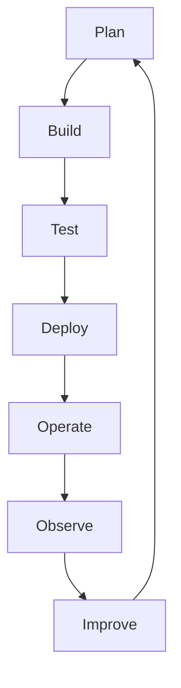
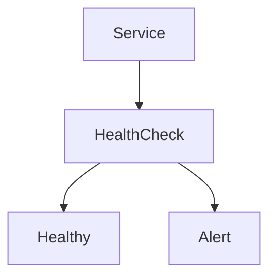
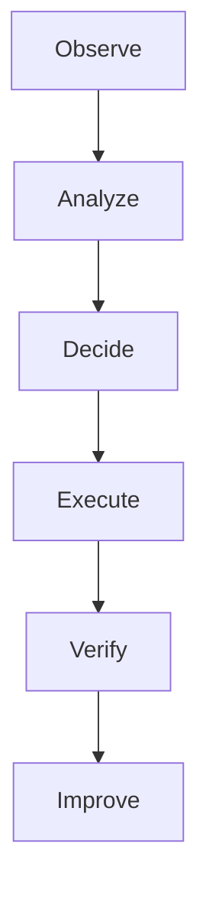

# 35 - DevOps Use Cases

---

# The Big Engineering Problem

Imagine a startup.

Day 1:

```text
1 Developer

↓

1 Server

↓

1 Application
```

Life is easy.

Then growth happens.

```text
5 Developers

↓

20 Developers

↓

100 Developers

↓

500 Developers
```

Suddenly new problems appear.

```text
Deployments Become Slow

↓

Servers Become Inconsistent

↓

Incidents Increase

↓

Manual Work Increases

↓

Teams Become Bottlenecks

↓

Reliability Decreases
```

The problem is no longer software.

The problem is coordination.

This is why DevOps exists.

---

# Why Does DevOps Exist?

Because software development does not end when code is written.

Software has a lifecycle.

```text
Idea

↓

Code

↓

Build

↓

Test

↓

Deploy

↓

Operate

↓

Monitor

↓

Improve
```

DevOps exists to connect all these stages.

---

# What Is DevOps?

Simple definition:

```text
DevOps = Fast And Reliable Delivery Of Software
```

Traditional definition:

```text
A set of practices that combines software development and IT operations.
```

For engineers:

```text
Humans

↓

Processes

↓

Automation

↓

Feedback Loops

↓

Reliable Systems
```

---

# Mental Model: The Restaurant

Imagine a restaurant.

Customers order food.

```text
Customers

↓

Chef

↓

Kitchen

↓

Delivery

↓

Feedback
```

If communication is slow:

```text
Customers Wait

↓

Mistakes Increase

↓

Quality Drops
```

Software companies are exactly the same.

---

# First Principles Thinking

Every company repeatedly performs:

```text
Build

↓

Ship

↓

Operate

↓

Learn

↓

Improve
```

DevOps optimizes this loop.

---

# The Biggest Misconception

DevOps is NOT:

```text
Docker

↓

Kubernetes

↓

AWS
```

Those are tools.

DevOps is:

```text
Collaboration

↓

Automation

↓

Feedback

↓

Reliability
```

---

# The Universal DevOps Loop



This loop powers modern companies.

---

# DevOps Is A Feedback Loop

This is the most important idea.

Bad organizations:

```text
Code

↓

Months

↓

Deploy
```

Good organizations:

```text
Code

↓

Minutes

↓

Deploy

↓

Feedback
```

Fast feedback wins.

---

# Where Bash Fits

Bash is everywhere.

```text
CI/CD

↓

Docker

↓

Kubernetes

↓

Cloud

↓

Servers

↓

Monitoring
```

Bash is the glue.

---

# The Evolution Ladder

```text
Commands

↓

Scripts

↓

Automation

↓

DevOps

↓

Platform Engineering

↓

SRE

↓

Autonomous Systems
```

---

# Core DevOps Principles

There are five principles.

```text
Automation

↓

Feedback

↓

Reliability

↓

Collaboration

↓

Continuous Improvement
```

---

# DevOps Use Case 1: CI/CD Pipelines ⭐⭐⭐⭐⭐

Problem:

```text
Manual Deployments
```

Solution:

```text
Code Push

↓

Build

↓

Test

↓

Deploy
```

---

# Architecture


---

# Bash Example

```bash
#!/bin/bash

npm install

npm run test

npm run build

docker build -t app .

docker push app
```

---

# DevOps Use Case 2: Server Provisioning ⭐⭐⭐⭐⭐

Problem:

```text
100 Servers

↓

Manual Configuration
```

Impossible.

Automation:

```text
Provision

↓

Configure

↓

Validate
```

---

# Visual

```text
Server

↓

Install Packages

↓

Create Users

↓

Configure Services

↓

Deploy Application
```

---

# DevOps Use Case 3: Log Rotation ⭐⭐⭐⭐⭐

Problem:

```text
Logs Grow Forever
```

Solution:

```text
Logs

↓

Archive

↓

Compress

↓

Delete
```

---

# DevOps Use Case 4: Database Backups ⭐⭐⭐⭐⭐

Workflow:

```text
Database

↓

Backup

↓

Compress

↓

Upload

↓

Verify
```

Bash automates this.

---

# DevOps Use Case 5: Health Checks ⭐⭐⭐⭐⭐

Modern systems constantly ask:

```text
Is Everything Healthy?
```

Example:

```bash
curl localhost:3000
```

---

# Health Check Flow



---

# DevOps Use Case 6: Incident Response ⭐⭐⭐⭐⭐

Workflow:

```text
Failure

↓

Detect

↓

Alert

↓

Investigate

↓

Recover
```

---

# DevOps Use Case 7: Self Healing Systems ⭐⭐⭐⭐⭐

Example:

```text
Service Crash

↓

Detect

↓

Restart

↓

Verify
```

This is automation engineering.

---

# DevOps Use Case 8: Security Automation ⭐⭐⭐⭐⭐

Examples:

```text
Rotate Secrets

↓

Update Packages

↓

Audit Permissions

↓

Scan Vulnerabilities
```

---

# DevOps Use Case 9: Cloud Cost Optimization ⭐⭐⭐⭐⭐

Cloud resources cost money.

Automation:

```text
Unused VM

↓

Shutdown

↓

Save Cost
```

---

# DevOps Use Case 10: Infrastructure Auditing ⭐⭐⭐⭐⭐

Workflow:

```text
Servers

↓

Collect Data

↓

Analyze

↓

Generate Reports
```

---

# The Golden DevOps Workflow



---

# The Three Layers Of DevOps

## Layer 1: Development

```text
Code

↓

Build

↓

Test
```

---

## Layer 2: Delivery

```text
Package

↓

Deploy

↓

Release
```

---

## Layer 3: Operations

```text
Observe

↓

Recover

↓

Improve
```

---

# Linux Internals Connection

Every deployment eventually becomes:

```text
Shell

↓

fork()

↓

execve()

↓

Kernel

↓

Resources

↓

Services
```

Everything eventually touches Linux.

---

# Docker Connection

Docker automates packaging.

```text
Code

↓

Image

↓

Container
```

---

# Kubernetes Connection

Kubernetes automates operations.

```text
Desired State

↓

Controllers

↓

Recovery
```

---

# Cloud Connection

Cloud automates infrastructure.

```text
Compute

↓

Storage

↓

Networking

↓

Policies
```

---

# Platform Engineering Connection

Platform teams automate developer experience.

```text
Golden Paths

↓

Reusable Platforms

↓

Self Service
```

---

# SRE Connection

SRE automates reliability.

```text
Observe

↓

Detect

↓

Recover

↓

Improve
```

---

# Distributed Systems Connection

Distributed systems automate coordination.

```text
Nodes

↓

Services

↓

Policies

↓

Recovery
```

---

# Modern World Evolution

The world is moving here.

```text
DevOps

↓

Platform Engineering

↓

AI Operations

↓

Autonomous Infrastructure
```

---

# Anti Patterns 🚫

Never build systems that are:

```text
Manual

Slow

Hidden

Fragile

Unobservable

Unrecoverable
```

---

# DevOps Engineering Checklist

```text
☑ Automation

☑ Logging

☑ Monitoring

☑ Recovery

☑ Security

☑ Documentation

☑ CI/CD

☑ Testing

☑ Observability

☑ Continuous Improvement
```

---

# Engineering Mindset

Do not think:

```text
DevOps = Tools
```

Think:

```text
DevOps = Designing Fast And Reliable Feedback Loops
```

Because organizations compete on speed of learning.

---

# Interview Questions

## Beginner

What is DevOps?

Why does DevOps exist?

Why is Bash important?

---

## Intermediate

What is CI/CD?

What is self healing?

Why are feedback loops important?

---

## Advanced

How does Kubernetes support DevOps?

What is the difference between DevOps and Platform Engineering?

Why is observability important?

---

# Learning Checklist

```text
☑ Understand DevOps philosophy

☑ Understand CI/CD

☑ Understand feedback loops

☑ Understand automation

☑ Understand reliability

☑ Understand platform engineering

☑ Understand autonomous systems
```

---

# Mind Map

```text
DevOps

├── Collaboration

├── Automation

├── CI/CD

├── Observability

├── Reliability

├── Cloud

├── Kubernetes

├── Platform Engineering

├── SRE

└── Autonomous Systems
```

---

# Golden Rules

### Rule 1

Humans do not scale.

---

### Rule 2

Fast feedback wins.

---

### Rule 3

Automate repetitive work.

---

### Rule 4

Measure everything.

---

### Rule 5

Reliability is mandatory.

---

### Rule 6

Observability is essential.

---

### Rule 7

DevOps is a systems thinking discipline.

---

# First Principles Recap

```text
Software Is Built

↓

Software Is Shipped

↓

Software Is Operated

↓

Systems Are Observed

↓

Failures Are Fixed

↓

Feedback Is Collected

↓

Systems Improve
```

# Key Takeaway

```text
Commands

↓

Scripts

↓

Automation

↓

DevOps

↓

Platform Engineering

↓

SRE

↓

Autonomous Systems ⭐⭐⭐⭐⭐
```

**Junior engineers build software.**

**Senior engineers build systems that continuously deliver software.**
