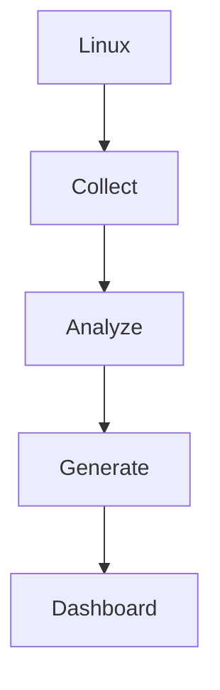
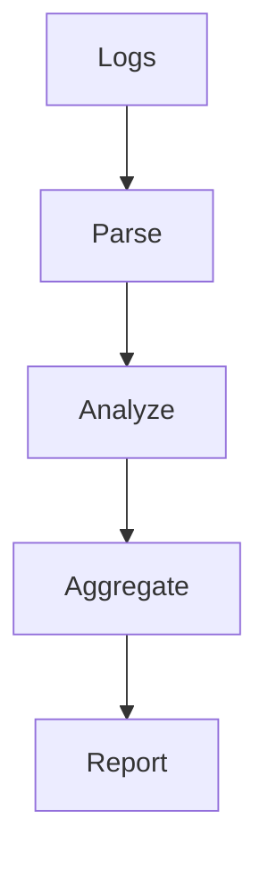
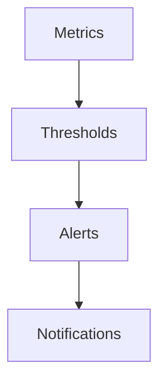
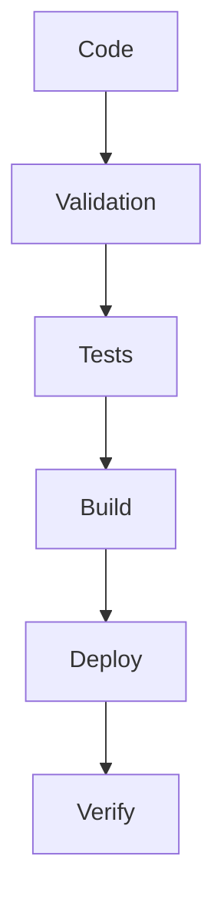
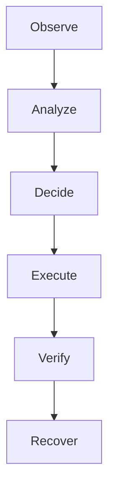

# 36 - Scripting Projects

---

# Why This File Is Extremely Important

This is NOT a project file.

This is your engineering transformation roadmap.

Many people make a mistake.

They think:

```text
Learn Bash

↓

Build 2 Projects

↓

Done
```

No.

Projects are where knowledge becomes capability.

This file exists to convert:

```text
Knowledge

↓

Skills

↓

Systems Thinking

↓

Engineering Capability
```

---

# The Big Engineering Problem

Companies don't hire people because they know commands.

Companies hire people because they can solve operational problems.

Real companies have problems like:

```text
Servers Crash

↓

Logs Grow Forever

↓

Disks Become Full

↓

Deployments Fail

↓

Security Risks Increase

↓

Services Become Slow

↓

Infrastructure Scales
```

Projects teach you how to solve these problems.

---

# The Engineering Evolution Roadmap

```text
Commands

↓

Scripts

↓

Automation

↓

Infrastructure

↓

Platform Engineering

↓

Systems Thinking
```

This file is about climbing this ladder.

---

# Project Levels

There are 7 levels.

```text
Level 1

Linux Operator

↓

Level 2

System Administrator

↓

Level 3

Automation Engineer

↓

Level 4

DevOps Engineer

↓

Level 5

Platform Engineer

↓

Level 6

Infrastructure Engineer

↓

Level 7

Systems Thinker
```

---

# Project Learning Philosophy

Every project must teach:

```text
Problem

↓

Architecture

↓

Automation

↓

Reliability

↓

Security

↓

Observability

↓

Scaling
```

Never build toy projects.

---

# Project Structure Template

Every project should have:

```text
project/

├── README.md

├── architecture.md

├── requirements.md

├── scripts/

├── logs/

├── config/

├── docs/

├── tests/

└── troubleshooting.md
```

---

# PROJECT 1 ⭐⭐⭐⭐⭐

# Smart System Information Dashboard

---

# Problem

Linux systems have information everywhere.

```text
CPU

Memory

Disk

Network

Processes
```

Humans manually check them.

Automation should do this.

---

# Goal

Build a dashboard generator.

---

# Features

```text
CPU Usage

Memory Usage

Disk Usage

Top Processes

System Uptime

Load Average

Open Ports

Logged In Users
```

---

# Architecture



---

# Concepts Learned

```text
ps

top

free

df

du

uptime

ss

awk

grep
```

---

# PROJECT 2 ⭐⭐⭐⭐⭐

# Intelligent Log Analyzer

---

# Problem

Logs become enormous.

```text
Millions Of Lines
```

Humans cannot inspect manually.

---

# Goal

Build a log analytics engine.

---

# Features

```text
Count Errors

Count Warnings

Find Top IPs

Find Failed Requests

Generate Reports
```

---

# Architecture



---

# Concepts Learned

```text
grep

awk

sort

uniq

tr

cut

wc
```

---

# PROJECT 3 ⭐⭐⭐⭐⭐

# Automated Backup System

---

# Problem

Humans forget backups.

---

# Goal

Build an autonomous backup system.

---

# Features

```text
Backup Directories

Compress Files

Encrypt Backups

Rotate Old Backups

Verify Integrity

Generate Reports
```

---

# Architecture

```text
Directories

↓

Archive

↓

Compress

↓

Encrypt

↓

Store

↓

Verify
```

---

# Concepts Learned

```text
tar

gzip

cron

sha256sum

find
```

---

# PROJECT 4 ⭐⭐⭐⭐⭐

# Server Health Monitor

---

# Problem

Servers fail silently.

---

# Goal

Continuously monitor systems.

---

# Features

```text
CPU Alerts

Memory Alerts

Disk Alerts

Service Alerts

Temperature Alerts

Process Alerts
```

---

# Architecture



---

# PROJECT 5 ⭐⭐⭐⭐⭐

# Linux Security Auditor

---

# Problem

Servers become insecure over time.

---

# Goal

Build a security scanner.

---

# Features

```text
Weak Permissions

Open Ports

Sudo Users

Password Policies

World Writable Files

Outdated Packages
```

---

# Architecture

```text
Scan

↓

Detect

↓

Score

↓

Report
```

---

# PROJECT 6 ⭐⭐⭐⭐⭐

# Docker Environment Manager

---

# Problem

Containers grow rapidly.

---

# Goal

Automate Docker management.

---

# Features

```text
Cleanup Containers

Cleanup Images

Cleanup Volumes

Monitor Usage

Generate Reports
```

---

# Architecture

```text
Docker Engine

↓

Collect

↓

Analyze

↓

Act
```

---

# PROJECT 7 ⭐⭐⭐⭐⭐

# Kubernetes Health Auditor

---

# Problem

Clusters become complex.

---

# Goal

Monitor Kubernetes health.

---

# Features

```text
Pod Failures

Node Health

Resource Usage

Events

Restart Counts

Generate Reports
```

---

# PROJECT 8 ⭐⭐⭐⭐⭐

# Deployment Pipeline System

---

# Goal

Build your own CI/CD.

---

# Workflow

```text
Code

↓

Validate

↓

Test

↓

Build

↓

Deploy

↓

Verify
```

---

# Architecture



---

# PROJECT 9 ⭐⭐⭐⭐⭐

# Self Healing Service Manager

---

# Problem

Services crash.

---

# Goal

Automatically recover them.

---

# Features

```text
Health Checks

Restart Logic

Failure Tracking

Alerts

Recovery Reports
```

---

# PROJECT 10 ⭐⭐⭐⭐⭐

# Infrastructure Auditor

---

# Goal

Audit entire servers.

---

# Features

```text
CPU

Memory

Disk

Users

Services

Security

Logs
```

---

# PROJECT 11 ⭐⭐⭐⭐⭐

# Observability Dashboard Generator

---

# Goal

Generate reports automatically.

---

# Features

```text
Metrics

Logs

Events

Charts

Summaries
```

---

# PROJECT 12 ⭐⭐⭐⭐⭐

# Platform Bootstrapper

---

# Goal

Bootstrap new servers.

---

# Features

```text
Create Users

Install Packages

Configure Firewall

Install Docker

Configure SSH

Configure Monitoring
```

---

# PROJECT 13 ⭐⭐⭐⭐⭐

# Multi Server Orchestrator

---

# Goal

Control multiple Linux machines.

---

# Features

```text
SSH Automation

Command Execution

Health Reports

Deployment Automation
```

---

# PROJECT 14 ⭐⭐⭐⭐⭐

# Incident Response Toolkit

---

# Goal

Automate incident response.

---

# Workflow

```text
Failure

↓

Collect Logs

↓

Collect Metrics

↓

Analyze

↓

Generate Report
```

---

# PROJECT 15 ⭐⭐⭐⭐⭐

# Autonomous Infrastructure Manager (CAPSTONE)

---

# Goal

Build a mini Kubernetes mindset system.

---

# Features

```text
Observe Systems

↓

Analyze State

↓

Detect Problems

↓

Take Actions

↓

Recover Services

↓

Generate Reports
```

---

# Capstone Architecture



---

# Technology Progression

Project 1

```text
Linux Commands
```

Project 5

```text
Linux + Security
```

Project 10

```text
Linux + Infrastructure
```

Project 15

```text
Linux + Platform Engineering
```

---

# The Complete Capability Ladder

```text
Commands

↓

Scripts

↓

Automation

↓

Infrastructure

↓

DevOps

↓

Platform Engineering

↓

Systems Thinking
```

---

# Modern World Connections

Every project eventually connects to:

```text
Docker

↓

Kubernetes

↓

AWS

↓

Cloud

↓

Terraform

↓

Observability

↓

Platform Engineering

↓

Distributed Systems
```

---

# Project Difficulty Matrix

| Project | Difficulty | Engineer Level |
|---------|------------|---------------|
| System Dashboard | ⭐ | Beginner |
| Log Analyzer | ⭐⭐ | Junior |
| Backup System | ⭐⭐ | Junior |
| Health Monitor | ⭐⭐⭐ | Intermediate |
| Security Auditor | ⭐⭐⭐ | Intermediate |
| Docker Manager | ⭐⭐⭐ | Intermediate |
| Kubernetes Auditor | ⭐⭐⭐⭐ | Advanced |
| CI/CD System | ⭐⭐⭐⭐ | Advanced |
| Self Healing System | ⭐⭐⭐⭐ | Advanced |
| Infrastructure Auditor | ⭐⭐⭐⭐ | Advanced |
| Platform Bootstrapper | ⭐⭐⭐⭐⭐ | Senior |
| Multi Server Orchestrator | ⭐⭐⭐⭐⭐ | Senior |
| Autonomous Infrastructure Manager | ⭐⭐⭐⭐⭐ | Systems Thinker |

---

# Engineering Mindset

Do not think:

```text
Projects = Portfolio
```

Think:

```text
Projects = Capability Builders
```

Because projects teach engineers how systems behave.

---

# Mind Map

```text
Scripting Projects

├── Linux Operator

├── System Administrator

├── Automation Engineer

├── DevOps Engineer

├── Platform Engineer

├── Infrastructure Engineer

├── Systems Thinker

├── Security

├── Observability

└── Distributed Systems
```

---

# Golden Rules

### Rule 1

Projects should solve real problems.

---

### Rule 2

Projects should automate human work.

---

### Rule 3

Projects should be observable.

---

### Rule 4

Projects should be recoverable.

---

### Rule 5

Projects should be secure.

---

### Rule 6

Projects should scale.

---

### Rule 7

Projects build capabilities, not portfolios.

---

# First Principles Recap

```text
Knowledge

↓

Practice

↓

Automation

↓

Infrastructure

↓

Reliability

↓

Systems Thinking

↓

Engineering Capability
```

# Key Takeaway

```text
Learn Commands

↓

Build Scripts

↓

Build Automation

↓

Build Infrastructure

↓

Build Platforms

↓

Build Systems

↓

Become An Engineer ⭐⭐⭐⭐⭐
```

**People don't become engineers by reading documentation.**

**People become engineers by repeatedly building systems.**
