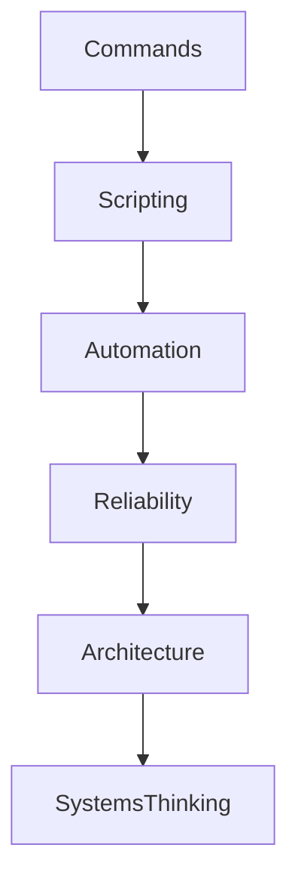

# 37 - Bash Scripting Engineering Interview Handbook

---

# Why This File Exists

This is NOT an interview cramming file.

Do not memorize these questions.

Interviews are reality simulators.

Interviewers are not testing:

```text
Memory
```

They are testing:

```text
Thinking

↓

Problem Solving

↓

Systems Understanding

↓

Engineering Maturity
```

This file exists to train your engineering brain.

---

# The Interview Evolution Ladder

```text
Commands

↓

Scripts

↓

Automation

↓

Reliability

↓

Infrastructure

↓

Platform Engineering

↓

Systems Thinking
```

As you grow, interview difficulty changes.

---

# The Five Skills Interviewers Actually Test

Every Linux interview eventually tests these.

```text
Knowledge

↓

Debugging

↓

Automation

↓

Reliability

↓

Systems Thinking
```

---

# The Interview Pyramid



---

# SECTION 1 ⭐⭐⭐⭐⭐

# Beginner Linux User (0-6 Months)

---

# Question 1

What is Bash?

---

# Interviewer Is Testing

```text
Can You Explain Linux Fundamentals Simply?
```

---

# Strong Thinking Direction

```text
User

↓

Shell

↓

Kernel

↓

Hardware
```

Bash is the bridge.

---

# Question 2

Difference between Bash and Linux?

---

# Strong Thinking

```text
Linux

↓

Operating System

Bash

↓

Command Interpreter
```

---

# Question 3

Difference between terminal, shell and Bash?

---

# Mental Model

```text
Terminal

↓

Shell

↓

Bash

↓

Kernel
```

---

# Question 4

What is a Bash script?

---

# Strong Thinking

```text
Commands

↓

File

↓

Automation
```

---

# Question 5

What is a shebang?

```bash
#!/usr/bin/env bash
```

---

# Question 6

How do you make a script executable?

---

# Question 7

Difference between:

```bash
bash script.sh

./script.sh
```

---

# SECTION 2 ⭐⭐⭐⭐⭐

# Variables And Execution

---

# Question 8

Difference between:

```bash
$@

$*

$#

$?

$$
```

---

# Interviewer Is Testing

```text
Process Awareness
```

---

# Question 9

What is an exit code?

---

# Strong Thinking

```text
Command

↓

Result

↓

Status
```

---

# Question 10

Why is:

```bash
"$variable"
```

important?

---

# Strong Thinking

```text
Word Splitting

↓

Unexpected Behavior

↓

Bugs
```

---

# Question 11

Difference between:

```bash
""

''

No Quotes
```

---

# Question 12

Difference between:

```bash
$( )

` `
```

---

# SECTION 3 ⭐⭐⭐⭐⭐

# Pipelines And Data Engineering

---

# Question 13

What is a pipe?

---

# Mental Model

```text
Program

↓

Data Stream

↓

Program
```

---

# Question 14

Difference between:

```bash
>

>>

<
```

---

# Question 15

Difference between:

```bash
2>

2>&1
```

---

# Question 16

Explain this.

```bash
grep ERROR app.log

| sort

| uniq
```

---

# Interviewer Is Testing

```text
Data Flow Thinking
```

---

# Question 17

Difference between:

```bash
grep

sed

awk
```

---

# Strong Thinking

```text
grep

↓

Search

sed

↓

Transform

awk

↓

Analyze
```

---

# SECTION 4 ⭐⭐⭐⭐⭐

# Automation Engineering

---

# Question 18

What is xargs?

---

# Strong Thinking

```text
Data

↓

Actions

↓

Automation
```

---

# Question 19

Difference between:

```bash
find -exec

xargs
```

---

# Question 20

When would you use cron?

---

# Question 21

How would you automate backups?

---

# Strong Thinking

```text
Discover

↓

Archive

↓

Compress

↓

Store

↓

Verify
```

---

# Question 22

How would you automate deployments?

---

# SECTION 5 ⭐⭐⭐⭐⭐

# Error Handling

---

# Question 23

What is:

```bash
set -e
```

---

# Question 24

What is:

```bash
set -u
```

---

# Question 25

What is:

```bash
set -o pipefail
```

---

# Question 26

Why is this common?

```bash
set -euo pipefail
```

---

# Interviewer Is Testing

```text
Failure Awareness
```

---

# Question 27

What is trap?

---

# Strong Thinking

```text
Lifecycle Management
```

---

# SECTION 6 ⭐⭐⭐⭐⭐

# Debugging Engineering

---

# Question 28

How would you debug a failing script?

---

# Strong Thinking

```text
Observe

↓

Reproduce

↓

Isolate

↓

Verify

↓

Fix
```

---

# Question 29

What does:

```bash
set -x
```

do?

---

# Question 30

What does:

```bash
bash -n
```

do?

---

# Question 31

How would you find root causes?

---

# Interviewer Is Testing

```text
Reality Modeling
```

---

# SECTION 7 ⭐⭐⭐⭐⭐

# Performance Engineering

---

# Question 32

How do you optimize Bash scripts?

---

# Strong Thinking

```text
Measure

↓

Find Bottleneck

↓

Optimize
```

---

# Question 33

Why is xargs faster than loops sometimes?

---

# Question 34

Why avoid useless cat?

---

# Question 35

Why are streams efficient?

---

# SECTION 8 ⭐⭐⭐⭐⭐

# Security Engineering

---

# Question 36

What is least privilege?

---

# Question 37

Why should variables always be quoted?

---

# Question 38

Why avoid:

```bash
eval
```

---

# Question 39

Why is:

```bash
curl URL | bash
```

dangerous?

---

# Question 40

How would you securely manage secrets?

---

# Strong Thinking

```text
Environment Variables

↓

Secret Managers

↓

Vault Systems
```

---

# SECTION 9 ⭐⭐⭐⭐⭐

# Production Scenarios

---

# Scenario 1

A disk becomes full.

What do you do?

---

# Strong Thinking

```text
Observe

↓

df

↓

du

↓

Logs

↓

Cleanup

↓

Verify
```

---

# Scenario 2

CPU usage is 100%.

What do you do?

---

# Strong Thinking

```text
top

↓

ps

↓

Find Process

↓

Investigate
```

---

# Scenario 3

Service crashes every 5 minutes.

What do you do?

---

# Strong Thinking

```text
Logs

↓

Metrics

↓

Dependencies

↓

Resources
```

---

# Scenario 4

Application deployment fails.

What do you do?

---

# Strong Thinking

```text
Reproduce

↓

Logs

↓

Configuration

↓

Dependencies

↓

Verify
```

---

# Scenario 5

A server suddenly becomes slow.

What do you do?

---

# Strong Thinking

```text
CPU

↓

Memory

↓

Disk

↓

Network
```

---

# SECTION 10 ⭐⭐⭐⭐⭐

# DevOps Questions

---

# Question 41

What is CI/CD?

---

# Question 42

What is idempotency?

---

# Question 43

What is observability?

---

# Question 44

Difference between monitoring and observability?

---

# Question 45

What is infrastructure as code?

---

# Question 46

What is a feedback loop?

---

# Question 47

What is self healing infrastructure?

---

# SECTION 11 ⭐⭐⭐⭐⭐

# Platform Engineering Questions

---

# Question 48

What is Platform Engineering?

---

# Question 49

Difference between DevOps and Platform Engineering?

---

# Question 50

What are golden paths?

---

# SECTION 12 ⭐⭐⭐⭐⭐

# Systems Thinking Questions

These are the questions that separate senior engineers.

---

# Question 51

Why do systems fail?

---

# Strong Thinking

```text
Complexity

↓

Scale

↓

Dependencies

↓

Humans
```

---

# Question 52

What is a bottleneck?

---

# Question 53

Why is observability important?

---

# Question 54

What is a feedback loop?

---

# Question 55

What is the difference between automation and orchestration?

---

# Strong Thinking

```text
Automation

↓

Single Task

Orchestration

↓

Multiple Systems Coordination
```

---

# Question 56

Why do distributed systems become hard?

---

# Strong Thinking

```text
State

↓

Latency

↓

Failures

↓

Coordination
```

---

# The Interview Capability Ladder

```text
Know Commands

↓

Write Scripts

↓

Automate Tasks

↓

Debug Systems

↓

Build Reliability

↓

Scale Systems

↓

Think In Systems
```

---

# The Universal Engineering Framework

Every interview problem can be solved using:

```text
Observe

↓

Analyze

↓

Hypothesize

↓

Verify

↓

Fix

↓

Improve
```

Memorize this framework.

Not the answers.

---

# Interview Anti Patterns 🚫

Never do these.

```text
Memorize Answers

Guess

Jump To Fixes

Panic

Skip Root Cause Analysis

Ignore Tradeoffs
```

---

# How Senior Engineers Answer Questions

Bad:

```text
Tool

↓

Tool

↓

Tool
```

Good:

```text
Problem

↓

Root Cause

↓

Tradeoffs

↓

Solution

↓

Verification
```

---

# Engineering Mindset

Do not think:

```text
Interviews = Questions
```

Think:

```text
Interviews = Simulated Production Problems
```

---

# Mind Map

```text
Engineering Interviews

├── Linux Fundamentals

├── Scripting

├── Automation

├── Reliability

├── Security

├── Observability

├── DevOps

├── Platform Engineering

└── Systems Thinking
```

---

# Golden Rules

### Rule 1

Understand systems, don't memorize commands.

---

### Rule 2

Everything is data flow.

---

### Rule 3

Everything eventually fails.

---

### Rule 4

Always think in feedback loops.

---

### Rule 5

Always think in tradeoffs.

---

### Rule 6

Always think in systems.

---

### Rule 7

Senior engineers build mental models.

---

# First Principles Recap

```text
Knowledge

↓

Practice

↓

Automation

↓

Reliability

↓

Infrastructure

↓

Systems Thinking

↓

Engineering Maturity
```

# Key Takeaway

```text
Linux User

↓

Linux Operator

↓

Automation Engineer

↓

DevOps Engineer

↓

Platform Engineer

↓

Infrastructure Engineer

↓

Systems Thinker ⭐⭐⭐⭐⭐
```

**Great interviews are not memory tests.**

**Great interviews are engineering thinking tests.**
