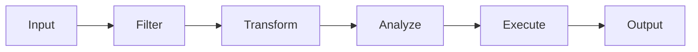

# 38 - Bash Scripting Engineering Cheatsheet

---

# Why This File Exists

This is NOT a command memorization file.

Do not memorize commands.

This file exists to answer:

```text
I have a problem.

↓

Which tool should I use?

↓

How should I think?
```

This file is designed for:

```text
Learning

↓

Building

↓

Debugging

↓

Production Engineering
```

---

# The Bash Engineering Ladder

```text
Commands

↓

Data Flow

↓

Automation

↓

Reliability

↓

Infrastructure

↓

DevOps

↓

Platform Engineering

↓

Systems Thinking
```

---

# Universal Bash Mental Model

Everything in Bash is:

```text
Input

↓

Process

↓

Output
```

or

```text
Data

↓

Transform

↓

Actions
```

---

# The Data Flow Architecture



---

# The Golden Engineering Pipeline

```text
Observe

↓

Collect

↓

Filter

↓

Transform

↓

Analyze

↓

Act

↓

Verify
```

Remember this forever.

---

# SECTION 1 ⭐⭐⭐⭐⭐

# Shell Basics Cheatsheet

| Problem | Tool |
|---------|------|
| Current shell | `echo $SHELL` |
| Current user | `whoami` |
| Current directory | `pwd` |
| Current process | `$$` |
| Process status | `$?` |
| Current hostname | `hostname` |
| Environment variables | `env` |

---

# Shell Execution Flow

```text
User

↓

Shell

↓

Kernel

↓

Hardware
```

---

# SECTION 2 ⭐⭐⭐⭐⭐

# Variables Cheatsheet

## Create Variable

```bash
name="vipul"
```

## Access Variable

```bash
echo "$name"
```

## Readonly Variable

```bash
readonly PORT=3000
```

## Default Values

```bash
${VAR:-default}
```

## Assign If Empty

```bash
${VAR:=default}
```

## Error If Missing

```bash
${VAR:?required}
```

---

# SECTION 3 ⭐⭐⭐⭐⭐

# Quoting Cheatsheet

## Double Quotes

```bash
"$name"
```

Expands variables.

---

## Single Quotes

```bash
'$name'
```

Literal text.

---

## No Quotes

Dangerous.

Causes:

```text
Word Splitting

↓

Globbing
```

---

# Golden Rule

Always do:

```bash
"$variable"
```

---

# SECTION 4 ⭐⭐⭐⭐⭐

# Expansion Cheatsheet

## Variable Expansion

```bash
$name

${name}
```

---

## Command Expansion

```bash
$(pwd)
```

---

## Arithmetic Expansion

```bash
$((5+3))
```

---

## Brace Expansion

```bash
file{1..5}.txt
```

---

## Tilde Expansion

```bash
~
```

---

# Expansion Order

```text
Brace

↓

Tilde

↓

Variable

↓

Command

↓

Arithmetic

↓

Word Splitting

↓

Globbing
```

---

# SECTION 5 ⭐⭐⭐⭐⭐

# Operators Cheatsheet

## Arithmetic

```bash
+

-

*

/

%

**
```

---

## Comparison

```bash
==

!=

>

<

>=

<=
```

---

## String

```bash
-z

-n

=
```

---

## File Operators

```bash
-f

-d

-r

-w

-x

-e
```

---

# SECTION 6 ⭐⭐⭐⭐⭐

# Conditions Cheatsheet

## if

```bash
if condition

then

fi
```

---

## if else

```bash
if

then

else

fi
```

---

## Multiple Conditions

```bash
&&

||

!
```

---

# SECTION 7 ⭐⭐⭐⭐⭐

# Loops Cheatsheet

## for

```bash
for i in {1..5}

do

done
```

---

## while

```bash
while condition

do

done
```

---

## until

```bash
until condition

do

done
```

---

# Loop Control

```bash
break

continue
```

---

# SECTION 8 ⭐⭐⭐⭐⭐

# Functions Cheatsheet

## Create Function

```bash
hello() {

echo hi

}
```

---

## Parameters

```bash
$1

$2
```

---

## Return Status

```bash
return 0
```

---

# SECTION 9 ⭐⭐⭐⭐⭐

# Arrays Cheatsheet

## Create

```bash
arr=(a b c)
```

---

## Access

```bash
${arr[0]}
```

---

## All Elements

```bash
${arr[@]}
```

---

## Length

```bash
${#arr[@]}
```

---

# SECTION 10 ⭐⭐⭐⭐⭐

# Redirection Cheatsheet

## Overwrite

```bash
>
```

---

## Append

```bash
>>
```

---

## Input

```bash
<
```

---

## stderr

```bash
2>
```

---

## stdout + stderr

```bash
&>
```

or

```bash
2>&1
```

---

# Visual

```text
stdin

↓

Program

↓

stdout

↓

stderr
```

---

# SECTION 11 ⭐⭐⭐⭐⭐

# Pipeline Cheatsheet

## Pipe

```bash
|
```

---

# Data Flow

```text
Program

↓

Data

↓

Program
```

---

# Example

```bash
cat app.log

| grep ERROR

| sort

| uniq
```

---

# SECTION 12 ⭐⭐⭐⭐⭐

# Command Substitution Cheatsheet

```bash
$(pwd)

$(date)

$(hostname)
```

Avoid:

```bash
`pwd`
```

---

# SECTION 13 ⭐⭐⭐⭐⭐

# grep Cheatsheet

## Search

```bash
grep error app.log
```

---

## Ignore Case

```bash
grep -i error
```

---

## Recursive

```bash
grep -r error .
```

---

## Count

```bash
grep -c error
```

---

# grep Mental Model

```text
Search Engine
```

---

# SECTION 14 ⭐⭐⭐⭐⭐

# sed Cheatsheet

## Replace

```bash
sed 's/old/new/'
```

---

## Global Replace

```bash
sed 's/old/new/g'
```

---

## Delete Line

```bash
sed '3d'
```

---

# sed Mental Model

```text
Transformation Engine
```

---

# SECTION 15 ⭐⭐⭐⭐⭐

# awk Cheatsheet

## Print Column

```bash
awk '{print $1}'
```

---

## Separator

```bash
awk -F:
```

---

## Sum

```bash
awk '{sum+=$1} END {print sum}'
```

---

# awk Mental Model

```text
Analytics Engine
```

---

# SECTION 16 ⭐⭐⭐⭐⭐

# Data Manipulation Cheatsheet

## cut

```bash
cut -d: -f1
```

---

## sort

```bash
sort

sort -r

sort -n
```

---

## uniq

```bash
uniq

uniq -c
```

---

## tr

```bash
tr a-z A-Z
```

---

## paste

```bash
paste a.txt b.txt
```

---

## join

```bash
join file1 file2
```

---

# SECTION 17 ⭐⭐⭐⭐⭐

# xargs Cheatsheet

## Convert Data To Commands

```bash
find . -name "*.log"

| xargs rm
```

---

## Parallel Processing

```bash
xargs -P4
```

---

# Mental Model

```text
Data

↓

Actions
```

---

# SECTION 18 ⭐⭐⭐⭐⭐

# find Cheatsheet

## Find Name

```bash
find . -name "*.log"
```

---

## Find Type

```bash
find . -type f
```

---

## Find Size

```bash
find . -size +100M
```

---

## Find Old Files

```bash
find . -mtime +30
```

---

# SECTION 19 ⭐⭐⭐⭐⭐

# find + exec Cheatsheet

## Delete

```bash
find . -name "*.log"

-exec rm {} +
```

---

## Change Permissions

```bash
find .

-type f

-exec chmod 644 {} +
```

---

# Mental Model

```text
Discover

↓

Policies

↓

Actions
```

---

# SECTION 20 ⭐⭐⭐⭐⭐

# Error Handling Cheatsheet

## Safe Defaults

```bash
set -euo pipefail
```

---

## Cleanup

```bash
trap cleanup EXIT
```

---

## Error Trap

```bash
trap 'echo failed' ERR
```

---

# Mental Model

```text
Failure

↓

Recovery
```

---

# SECTION 21 ⭐⭐⭐⭐⭐

# Debugging Cheatsheet

## Syntax Check

```bash
bash -n script.sh
```

---

## Trace

```bash
set -x
```

---

## Stop Trace

```bash
set +x
```

---

# Debugging Workflow

```text
Observe

↓

Reproduce

↓

Isolate

↓

Verify

↓

Fix
```

---

# SECTION 22 ⭐⭐⭐⭐⭐

# Performance Cheatsheet

Always optimize:

```text
CPU

Memory

Disk

Network
```

---

# Golden Workflow

```text
Measure

↓

Find Bottleneck

↓

Optimize
```

---

# SECTION 23 ⭐⭐⭐⭐⭐

# Security Cheatsheet

Always:

```text
Quote Variables

↓

Validate Inputs

↓

Least Privilege

↓

Protect Secrets
```

Avoid:

```bash
eval

curl | bash

sudo everything
```

---

# SECTION 24 ⭐⭐⭐⭐⭐

# Production Bash Template

```bash
#!/usr/bin/env bash

set -euo pipefail

IFS=$'\n\t'

cleanup() {

echo cleanup

}

trap cleanup EXIT

main() {

echo "work"

}

main "$@"
```

---

# The Universal Tool Map

```text
grep

↓

Search

sed

↓

Transform

awk

↓

Analyze

cut

↓

Extract

sort

↓

Organize

uniq

↓

Deduplicate

tr

↓

Normalize

paste

↓

Compose

join

↓

Relate

xargs

↓

Automate

find

↓

Discover

find + exec

↓

Act
```

---

# The Engineering Evolution Map

```text
Commands

↓

Scripts

↓

Automation

↓

Infrastructure

↓

DevOps

↓

Platform Engineering

↓

Systems Thinking
```

---

# The Universal Engineering Framework

Whenever you're stuck.

Use this.

```text
Observe

↓

Collect

↓

Analyze

↓

Act

↓

Verify

↓

Improve
```

---

# Mind Map

```text
Bash Engineering

├── Shell

├── Variables

├── Expansions

├── Data Flow

├── Automation

├── Reliability

├── Performance

├── Security

├── DevOps

└── Systems Thinking
```

---

# Golden Rules

### Rule 1

Everything is data flow.

---

### Rule 2

Everything eventually becomes automation.

---

### Rule 3

Everything eventually fails.

---

### Rule 4

Observability is mandatory.

---

### Rule 5

Security is trust management.

---

### Rule 6

Performance is bottleneck management.

---

### Rule 7

Senior engineers build mental models.

---

# First Principles Recap

```text
Commands

↓

Scripts

↓

Automation

↓

Infrastructure

↓

Platforms

↓

Systems Thinking ⭐⭐⭐⭐⭐
```

# Key Takeaway

**Do not memorize Bash.**

**Learn how systems move data, make decisions, and automate work.**
