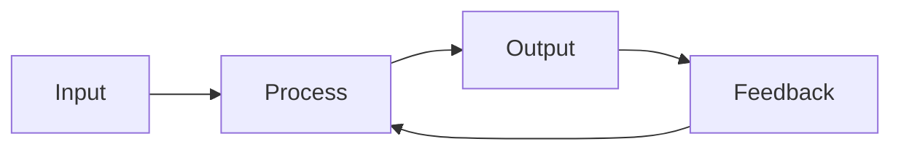
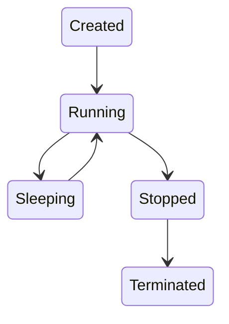
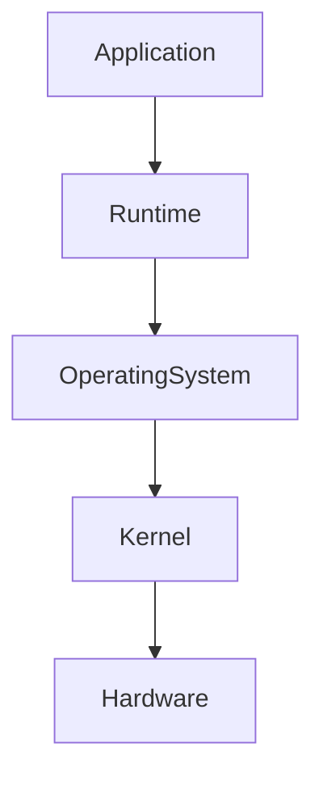
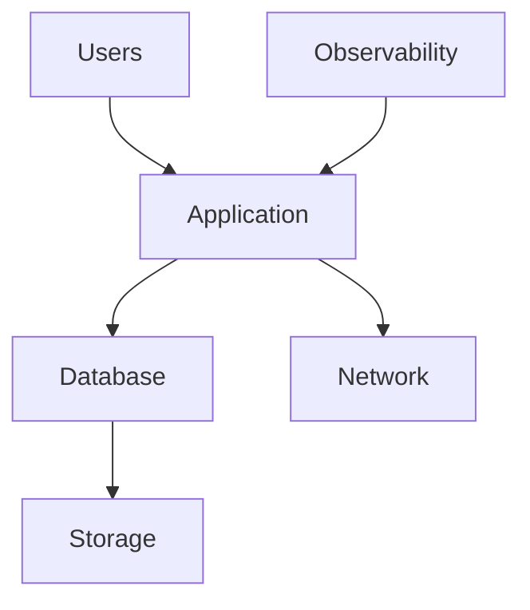

# 39 - Engineering Mental Models

---

# Why This File Exists

This may be the most important file in this entire Bash module.

People often learn Linux incorrectly.

They learn:

```text
Command

↓

Command

↓

Command
```

Years later:

```text
Still Struggling
```

Why?

Because engineering is not command memorization.

Engineering is building accurate mental models.

This file exists to build those models.

---

# What Is A Mental Model?

A mental model is:

```text
A Simplified Representation Of Reality
```

It helps you answer:

```text
What is happening?

↓

Why is it happening?

↓

What will happen next?
```

Senior engineers are not people with more knowledge.

Senior engineers are people with better mental models.

---

# The Universal Engineering Formula

Everything in engineering eventually becomes:

```text
Input

↓

Process

↓

Output

↓

Feedback
```

Remember this forever.

---

# Mental Model 1 ⭐⭐⭐⭐⭐

# Everything Is A Flow

This is the most important model.

Nothing exists in isolation.

Everything flows.

```text
Data

↓

Systems

↓

Resources

↓

Information

↓

Events
```

---

# Examples

Linux:

```text
stdin

↓

Program

↓

stdout
```

Networking:

```text
Source

↓

Router

↓

Destination
```

Databases:

```text
Query

↓

Engine

↓

Results
```

Kubernetes:

```text
Desired State

↓

Controllers

↓

Actual State
```

---

# Visual



---

# Mental Model 2 ⭐⭐⭐⭐⭐

# Everything Is A Pipeline

Engineers love pipelines.

Because systems are pipelines.

Examples:

Software:

```text
Code

↓

Build

↓

Test

↓

Deploy
```

Linux:

```text
File

↓

grep

↓

awk

↓

sort
```

Humans:

```text
Learn

↓

Practice

↓

Build

↓

Improve
```

---

# Mental Model 3 ⭐⭐⭐⭐⭐

# Everything Is A State Machine

Every system is always changing states.

Example:

A process.

```text
Created

↓

Running

↓

Sleeping

↓

Stopped

↓

Terminated
```

Container:

```text
Created

↓

Running

↓

Healthy

↓

Restarting

↓

Stopped
```

---

# Visual



---

# Mental Model 4 ⭐⭐⭐⭐⭐

# Everything Is A Feedback Loop

Nothing is static.

Everything constantly adjusts itself.

Examples:

Thermostat:

```text
Temperature

↓

Compare

↓

Adjust
```

Kubernetes:

```text
Desired State

↓

Observe

↓

Fix
```

CI/CD:

```text
Code

↓

Deploy

↓

Feedback

↓

Improve
```

---

# Universal Loop

```text
Observe

↓

Analyze

↓

Decide

↓

Act

↓

Verify
```

This loop appears everywhere.

---

# Mental Model 5 ⭐⭐⭐⭐⭐

# Everything Eventually Fails

This is one of the biggest engineering truths.

Beginners think:

```text
How do I make this work?
```

Engineers think:

```text
How will this fail?
```

Failure is guaranteed.

Examples:

```text
Disks Fail

↓

Networks Fail

↓

Humans Fail

↓

Services Fail

↓

Containers Fail
```

---

# Reliability Model

```text
Failure

↓

Detection

↓

Recovery

↓

Improvement
```

---

# Mental Model 6 ⭐⭐⭐⭐⭐

# Everything Has Bottlenecks

Every system has a slowest component.

Example:

```text
Fast

↓

Fast

↓

Slow

↓

Fast

↓

Fast
```

Entire system:

```text
Slow
```

---

# Bottleneck Diagram

```text
CPU

↓

Memory

↓

Disk

↓

Network
```

One of them eventually becomes slow.

---

# Mental Model 7 ⭐⭐⭐⭐⭐

# Everything Is Resource Management

Computers only manage resources.

There are four resources.

```text
CPU

Memory

Disk

Network
```

Everything maps here.

Examples:

Docker:

```text
Containers

↓

Resources
```

Kubernetes:

```text
Pods

↓

Resources
```

Cloud:

```text
VMs

↓

Resources
```

---

# Mental Model 8 ⭐⭐⭐⭐⭐

# Everything Is Tradeoffs

This is extremely important.

There are no perfect systems.

Every decision sacrifices something.

Examples:

Performance.

```text
Fast

↓

More Memory
```

Security.

```text
More Secure

↓

More Complex
```

Cloud.

```text
More Availability

↓

More Cost
```

---

# Tradeoff Diagram

```text
Speed

↓

Cost

↓

Complexity

↓

Security
```

You balance these forever.

---

# Mental Model 9 ⭐⭐⭐⭐⭐

# Everything Is Layers

Complex systems are built in layers.

Linux:

```text
Applications

↓

Shell

↓

Kernel

↓

Hardware
```

Networking:

```text
Application

↓

Transport

↓

Internet

↓

Physical
```

Cloud:

```text
Application

↓

Containers

↓

VMs

↓

Hardware
```

---

# Layer Architecture



---

# Mental Model 10 ⭐⭐⭐⭐⭐

# Everything Is Dependency Management

Nothing works alone.

Example:

Web App.

```text
Frontend

↓

Backend

↓

Database

↓

Cache

↓

Storage
```

Dependencies create complexity.

---

# Mental Model 11 ⭐⭐⭐⭐⭐

# Everything Is Data Transformation

Computers transform data.

Linux tools prove this.

```text
grep

↓

sed

↓

awk

↓

sort
```

All transform data.

---

# Universal Transformation Pipeline

```text
Raw Data

↓

Clean Data

↓

Useful Data

↓

Actions
```

---

# Mental Model 12 ⭐⭐⭐⭐⭐

# Everything Is An Event System

Modern systems are event driven.

Examples:

Git Push

↓

CI/CD

Pod Crash

↓

Restart

CPU Spike

↓

Scale Servers

---

# Event Architecture

```text
Event

↓

Decision

↓

Action
```

---

# Mental Model 13 ⭐⭐⭐⭐⭐

# Everything Is Automation

As systems grow:

```text
Humans

↓

Scripts

↓

Automation

↓

Platforms
```

Automation is inevitable.

---

# Mental Model 14 ⭐⭐⭐⭐⭐

# Everything Is Observability

You cannot fix invisible systems.

Every system must answer:

```text
What Happened?

↓

When?

↓

Why?

↓

How Often?
```

---

# The Three Pillars

```text
Logs

↓

Metrics

↓

Traces
```

---

# Mental Model 15 ⭐⭐⭐⭐⭐

# Everything Is Trust Boundaries

Security is trust management.

Example:

```text
Internet

↓

Firewall

↓

Application

↓

Database
```

Every transition is a trust boundary.

---

# Mental Model 16 ⭐⭐⭐⭐⭐

# Everything Eventually Becomes Platforms

Growth always follows this.

```text
Commands

↓

Scripts

↓

Automation

↓

Infrastructure

↓

Platforms
```

---

# Mental Model 17 ⭐⭐⭐⭐⭐

# Everything Is Systems Thinking

Systems thinking is understanding relationships.

Not components.

Bad thinking:

```text
Server
```

Good thinking:

```text
Users

↓

Application

↓

Database

↓

Network

↓

Storage
```

Relationships matter.

---

# The Systems Thinking Graph



---

# The Universal Engineer Framework

When facing ANY problem.

Use this.

```text
Observe

↓

Collect

↓

Analyze

↓

Hypothesize

↓

Verify

↓

Act

↓

Improve
```

This solves almost everything.

---

# The Great Engineering Evolution

```text
Memorization

↓

Understanding

↓

Automation

↓

Reliability

↓

Infrastructure

↓

Platforms

↓

Systems Thinking
```

---

# Modern World Connections

All of these mental models appear in:

```text
Linux

↓

Docker

↓

Kubernetes

↓

Cloud

↓

DevOps

↓

Platform Engineering

↓

SRE

↓

Distributed Systems

↓

AI Systems
```

---

# The 10 Year Engineering Ladder

Year 1

```text
Commands
```

Year 2

```text
Automation
```

Year 3

```text
Infrastructure
```

Year 5

```text
Platforms
```

Year 10

```text
Systems Thinking
```

---

# Engineering Mindset

Do not think:

```text
I am learning Bash.
```

Think:

```text
I am learning how systems think.
```

Because Bash is just the training ground.

---

# Mind Map

```text
Engineering Mental Models

├── Flows

├── Pipelines

├── State Machines

├── Feedback Loops

├── Failure Thinking

├── Bottlenecks

├── Resource Management

├── Tradeoffs

├── Layers

├── Dependencies

├── Data Transformation

├── Events

├── Automation

├── Observability

├── Trust Boundaries

└── Systems Thinking
```

---

# Golden Rules

### Rule 1

Everything is a flow.

---

### Rule 2

Everything eventually fails.

---

### Rule 3

Everything has bottlenecks.

---

### Rule 4

Everything is a tradeoff.

---

### Rule 5

Everything is a feedback loop.

---

### Rule 6

Everything eventually becomes automation.

---

### Rule 7

Senior engineers build accurate mental models.

---

# First Principles Recap

```text
Commands

↓

Tools

↓

Automation

↓

Infrastructure

↓

Platforms

↓

Systems

↓

Mental Models ⭐⭐⭐⭐⭐
```

# Key Takeaway

**Junior engineers learn tools.**

**Senior engineers learn patterns.**

**Staff engineers learn systems.**

**Great engineers learn mental models.**
