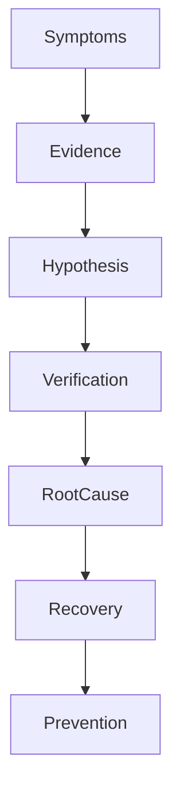
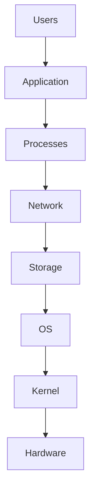
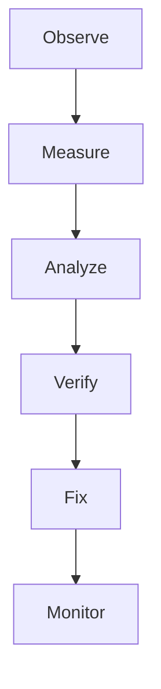
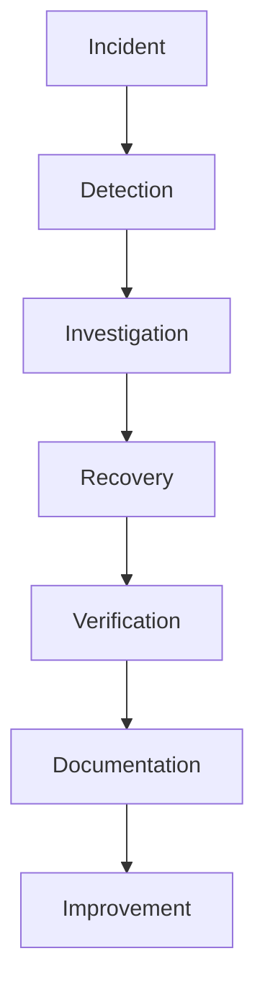

# 40 - Production Troubleshooting Playbook

---

# Why This File Exists

This is NOT a troubleshooting file.

This is a production engineering handbook.

Companies do not hire engineers because they know Linux commands.

Companies hire engineers because they can answer one question:

```text
The system is broken.

↓

What do we do now?
```

This file teaches that skill.

---

# The Biggest Engineering Truth

Every system eventually fails.

Always.

```text
Servers Fail

↓

Disks Fail

↓

Networks Fail

↓

Containers Fail

↓

Humans Fail

↓

Cloud Services Fail

↓

Dependencies Fail
```

Failure is normal.

Failure is expected.

Failure is inevitable.

The only question is:

```text
Can you recover?
```

---

# What Is Troubleshooting?

Simple definition:

```text
Troubleshooting = Systematic Reality Discovery
```

Traditional definition:

```text
Finding and fixing problems.
```

For engineers:

```text
Symptoms

↓

Evidence

↓

Hypothesis

↓

Verification

↓

Root Cause

↓

Recovery

↓

Prevention
```

---

# Mental Model: Doctor Diagnosing A Patient

Doctors never do this.

```text
Patient Has Fever

↓

Give Random Medicine
```

Doctors do:

```text
Observe

↓

Collect Data

↓

Build Hypothesis

↓

Verify

↓

Treat
```

Engineers do exactly the same thing.

---

# The Universal Troubleshooting Framework

This framework solves almost everything.

```text
Observe

↓

Collect

↓

Analyze

↓

Hypothesize

↓

Verify

↓

Fix

↓

Prevent
```

Never skip steps.

---

# The Production Mindset Shift

Beginners ask:

```text
How Do I Fix This?
```

Engineers ask:

```text
What Is Actually Happening?
```

Staff engineers ask:

```text
What Changed?
```

---

# Golden Rule #1

Always ask:

```text
What Changed?
```

Most incidents come from changes.

Examples:

```text
Deployment

↓

Configuration

↓

Infrastructure

↓

Database

↓

Network

↓

Human Action
```

---

# The Troubleshooting Pyramid



---

# The Universal Incident Flow

```text
Problem

↓

Symptoms

↓

Evidence

↓

Root Cause

↓

Recovery

↓

Lessons Learned
```

---

# The Five Universal Questions

Always ask these.

```text
What Happened?

↓

When Did It Start?

↓

Who Is Impacted?

↓

What Changed?

↓

How Severe Is It?
```

---

# The Production Severity Model

## P0

```text
Entire Business Down
```

Examples:

```text
Website Down

Payments Down

Authentication Down
```

---

## P1

```text
Major Feature Broken
```

---

## P2

```text
Degraded Performance
```

---

## P3

```text
Minor Issues
```

---

# The 80% Rule

80% of incidents come from these areas.

```text
CPU

Memory

Disk

Network

Permissions

Configuration

Dependencies

Deployments
```

Start here first.

---

# The Universal Systems Stack

Every incident eventually maps here.

```text
Users

↓

Application

↓

Processes

↓

Network

↓

Storage

↓

Operating System

↓

Kernel

↓

Hardware
```

---

# Troubleshooting Layer Diagram



---

# MASTER PLAYBOOK 1 ⭐⭐⭐⭐⭐

# High CPU Usage

---

# Symptoms

```text
System Slow

↓

Fans Loud

↓

Applications Lag
```

---

# Investigation

Check CPU.

```bash
top
```

or

```bash
htop
```

---

# Find Processes

```bash
ps aux --sort=-%cpu
```

---

# Investigate Process

```bash
ps -fp PID
```

---

# Questions To Ask

```text
Infinite Loop?

Traffic Spike?

Bad Deployment?

Memory Leak?
```

---

# Recovery

```text
Throttle

↓

Restart

↓

Rollback

↓

Scale
```

---

# MASTER PLAYBOOK 2 ⭐⭐⭐⭐⭐

# Memory Exhaustion

---

# Symptoms

```text
OOM Kills

↓

Applications Crash

↓

System Slow
```

---

# Investigate

```bash
free -h
```

---

# Check Processes

```bash
ps aux --sort=-%mem
```

---

# Check OOM

```bash
dmesg

| grep oom
```

---

# Questions

```text
Memory Leak?

Large Dataset?

Bad Cache?

Too Many Processes?
```

---

# MASTER PLAYBOOK 3 ⭐⭐⭐⭐⭐

# Disk Full

---

# Symptoms

```text
Applications Fail

↓

Logs Stop

↓

Databases Crash
```

---

# Investigation

```bash
df -h
```

---

# Find Consumers

```bash
du -sh /*
```

---

# Find Large Files

```bash
find /

-size +500M
```

---

# Check Logs

```bash
du -sh /var/log/*
```

---

# Recovery

```text
Rotate Logs

↓

Delete Old Data

↓

Compress Files
```

---

# MASTER PLAYBOOK 4 ⭐⭐⭐⭐⭐

# Inode Exhaustion

---

# Symptoms

```text
Disk Has Space

↓

Cannot Create Files
```

---

# Investigate

```bash
df -i
```

---

# Find Tiny Files

```bash
find / -type f
```

---

# MASTER PLAYBOOK 5 ⭐⭐⭐⭐⭐

# Network Problems

---

# Symptoms

```text
Cannot Reach Services
```

---

# Investigation Ladder

## Check Interface

```bash
ip a
```

---

## Check Routing

```bash
ip route
```

---

## Check DNS

```bash
dig google.com
```

---

## Check Connectivity

```bash
ping
```

---

## Check Open Ports

```bash
ss -tulpn
```

---

# Network Flow Diagram

```text
Client

↓

DNS

↓

Router

↓

Server

↓

Application
```

---

# MASTER PLAYBOOK 6 ⭐⭐⭐⭐⭐

# DNS Problems

---

# Symptoms

```text
Can Ping IP

↓

Cannot Reach Domain
```

---

# Investigate

```bash
dig

nslookup

cat /etc/resolv.conf
```

---

# MASTER PLAYBOOK 7 ⭐⭐⭐⭐⭐

# Service Failure

---

# Symptoms

```text
Application Down
```

---

# Investigation

```bash
systemctl status service
```

---

# Logs

```bash
journalctl -u service
```

---

# Questions

```text
Config Error?

Dependencies Missing?

Permission Problem?
```

---

# MASTER PLAYBOOK 8 ⭐⭐⭐⭐⭐

# Permission Problems

---

# Symptoms

```text
Permission Denied
```

---

# Investigation

```bash
ls -l

id

groups
```

---

# Check Ownership

```bash
stat file
```

---

# MASTER PLAYBOOK 9 ⭐⭐⭐⭐⭐

# Deployment Failures

---

# Questions

```text
What Changed?

↓

New Code?

↓

Config Change?

↓

Infrastructure Change?
```

---

# Investigation Ladder

```text
Code

↓

Environment

↓

Dependencies

↓

Network

↓

Secrets
```

---

# MASTER PLAYBOOK 10 ⭐⭐⭐⭐⭐

# Container Problems

---

# Investigate

```bash
docker ps

docker logs

docker inspect
```

---

# MASTER PLAYBOOK 11 ⭐⭐⭐⭐⭐

# Kubernetes Problems

---

# Investigate

```bash
kubectl get pods

kubectl describe pod

kubectl logs
```

---

# MASTER PLAYBOOK 12 ⭐⭐⭐⭐⭐

# Cloud Problems

Always investigate.

```text
Compute

↓

Storage

↓

Network

↓

IAM
```

---

# The Dependency Tree Model

Every modern system is dependency management.

```text
User

↓

Frontend

↓

Backend

↓

Cache

↓

Database

↓

Storage
```

Failures cascade downward.

---

# The 5 Whys Framework ⭐⭐⭐⭐⭐

Always ask why.

Example:

```text
Website Down

↓

Why?

Database Down

↓

Why?

Disk Full

↓

Why?

Logs Filled Disk

↓

Why?

Rotation Disabled

↓

Root Cause Found
```

---

# The Incident Timeline Model

Always build timelines.

```text
09:00 Deploy

↓

09:05 CPU Spike

↓

09:07 Errors

↓

09:10 Outage
```

Timelines reveal truth.

---

# The Production Debugging Loop



---

# The Four Golden Signals ⭐⭐⭐⭐⭐

Learn these forever.

```text
Latency

↓

Traffic

↓

Errors

↓

Saturation
```

---

# The Three Pillars Of Observability

```text
Logs

↓

Metrics

↓

Traces
```

---

# Linux Internals Thinking

Everything eventually becomes:

```text
Users

↓

Shell

↓

Processes

↓

Kernel

↓

Resources
```

Remember this.

---

# Docker Connection

Docker troubleshooting.

```text
Containers

↓

Images

↓

Volumes

↓

Networks
```

---

# Kubernetes Connection

Kubernetes troubleshooting.

```text
Pods

↓

Services

↓

Deployments

↓

Nodes
```

---

# Cloud Connection

Cloud troubleshooting.

```text
Compute

↓

Storage

↓

Network

↓

Identity
```

---

# Distributed Systems Connection

Distributed systems troubleshooting.

```text
State

↓

Latency

↓

Failures

↓

Coordination
```

---

# The Incident Response Workflow



---

# Incident Documentation Template

Always write:

```text
What Happened?

↓

Timeline

↓

Impact

↓

Root Cause

↓

Fix

↓

Prevention
```

---

# Universal Troubleshooting Checklist

```text
☑ What happened?

☑ When did it start?

☑ What changed?

☑ Who is affected?

☑ What evidence exists?

☑ Can we reproduce?

☑ What is the root cause?

☑ How do we prevent recurrence?
```

---

# Troubleshooting Anti Patterns 🚫

Never do these.

```text
Guess

Panic

Restart Everything

Delete Logs

Ignore Timelines

Skip Verification

Hide Incidents
```

---

# Engineering Mindset

Do not think:

```text
Troubleshooting = Fixing Problems
```

Think:

```text
Troubleshooting = Discovering Reality
```

Because systems never lie.

Humans misunderstand systems.

---

# Mind Map

```text
Troubleshooting

├── Observation

├── Evidence

├── Hypothesis

├── Verification

├── Root Cause

├── Recovery

├── Prevention

├── Observability

├── DevOps

├── SRE

└── Systems Thinking
```

---

# Golden Rules

### Rule 1

Never panic.

---

### Rule 2

Evidence beats assumptions.

---

### Rule 3

Always ask what changed.

---

### Rule 4

Timelines reveal truth.

---

### Rule 5

Fix root causes, not symptoms.

---

### Rule 6

Every incident is a learning opportunity.

---

### Rule 7

Great engineers discover reality.

---

# First Principles Recap

```text
Systems Grow

↓

Complexity Grows

↓

Failures Appear

↓

Engineers Investigate

↓

Systems Recover

↓

Organizations Learn

↓

Systems Improve ⭐⭐⭐⭐⭐
```

# Key Takeaway

```text
Commands

↓

Automation

↓

Reliability

↓

Observability

↓

Incident Response

↓

Systems Thinking ⭐⭐⭐⭐⭐
```

**Junior engineers ask: How do I fix this?**

**Senior engineers ask: What is happening?**

**Staff engineers ask: Why did this happen?**

**Principal engineers ask: How do we ensure this never happens again?**
