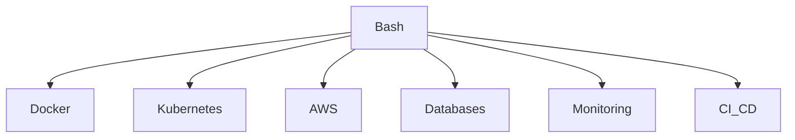

# 11 - Bash Scripting

# Linux Fundamentals Mastery

# Bash Scripting Engineering Handbook

> Bash is not just a scripting language.

It is the glue that connects the entire Linux ecosystem together.

Bash is the automation layer of Linux.

---

# Why Learn Bash?

Many beginners think:

```text
Linux = Commands

Bash = Writing Scripts
```

This is incomplete.

The real picture:

```text
Linux

↓

Commands

↓

Processes

↓

Automation

↓

Infrastructure

↓

Servers

↓

Cloud

↓

DevOps

↓

Distributed Systems
```

Bash sits at the center.

Without Bash:

- System administration becomes difficult
- Automation becomes difficult
- DevOps becomes difficult
- Infrastructure management becomes difficult

---

# The Big Picture

```mermaid
graph TD

User

Bash

Linux Utilities

Kernel

Hardware

User --> Bash

Bash --> Linux Utilities

Linux Utilities --> Kernel

Kernel --> Hardware
```

Bash is the orchestrator.

---

# What Is Bash?

Bash stands for:

```text
Bourne Again Shell
```

Bash is:

```text
Command Interpreter

+

Programming Language

+

Automation Tool

+

Operating System Interface
```

It allows humans to communicate with Linux.

---

# The Problem Bash Solves

Imagine you are a system administrator.

Without Bash:

```text
Login

↓

Check CPU

↓

Check Memory

↓

Check Disk

↓

Check Logs

↓

Restart Service

↓

Backup Files

↓

Notify Team
```

You manually do this every day.

This does not scale.

Bash automates this.

```text
One Script

↓

Execute Everything

↓

Save Hours Everyday
```

---

# Bash Mental Model

Think of Bash as a manager.

Applications are workers.

```text
Manager (Bash)

↓

Assign Work

↓

Coordinate Workers

↓

Collect Results

↓

Display Output
```

Example:

```bash
grep

sort

awk

sed

cut

uniq
```

Bash coordinates all of them.

---

# How Bash Works Internally

```mermaid
flowchart TD

User

Parser

Expander

Executor

Linux Commands

Kernel

Hardware

User --> Parser

Parser --> Expander

Expander --> Executor

Executor --> Linux Commands

Linux Commands --> Kernel

Kernel --> Hardware
```

---

# Internal Workflow

When you type:

```bash
ls -la
```

Linux does NOT directly execute it.

Step 1

```text
Bash receives input
```

↓

Step 2

```text
Parse command
```

↓

Step 3

```text
Expand variables
```

↓

Step 4

```text
Expand aliases
```

↓

Step 5

```text
Locate executable
```

↓

Step 6

```text
Fork process
```

↓

Step 7

```text
Kernel executes
```

↓

Step 8

```text
Output returns
```

---

# Why Engineers Learn Bash

Because Bash exists everywhere.

```text
Linux Servers

Docker Containers

CI/CD Pipelines

Kubernetes Nodes

Cloud Machines

Monitoring Systems

DevOps Workflows
```

Examples:

```text
AWS EC2

↓

Ubuntu Server

↓

Bash

↓

Deploy Application
```

---

# Bash In Modern Engineering

## Backend Engineering

```text
Deploy Services

Rotate Logs

Run Backups

Manage Environments
```

---

## DevOps

```text
CI/CD

↓

Run Tests

↓

Build Images

↓

Deploy Containers
```

---

## Cloud Engineering

```text
Provision Servers

↓

Configure Systems

↓

Automate Infrastructure
```

---

## SRE

```text
Collect Logs

↓

Detect Issues

↓

Auto Recover Systems
```

---

# Bash And Other Technologies



---

# Repository Learning Roadmap

## Level 1

Foundation

```text
Shell Basics

Variables

Quoting

Operators

Conditions

Loops

Functions
```

---

## Level 2

Data Manipulation

```text
Arrays

Input Output

Redirections

Pipelines

Command Substitution
```

---

## Level 3

Linux Text Processing

```text
grep

sed

awk

cut

sort

uniq

tr

xargs
```

---

## Level 4

Production Engineering

```text
Error Handling

Debugging

Performance

Security

Automation
```

---

## Level 5

DevOps Engineering

```text
Infrastructure Automation

Deployments

Health Checks

Backups

CI/CD
```

---

## Level 6

Systems Thinking

```text
Bash

↓

Infrastructure

↓

Containers

↓

Cloud

↓

Distributed Systems
```

---

# Bash Learning Pyramid

```text
Level 0

Commands

↓

Level 1

Scripts

↓

Level 2

Automation

↓

Level 3

Infrastructure

↓

Level 4

Production Engineering

↓

Level 5

Systems Thinking
```

---

# Production Examples

## Example 1

Daily Backup

```text
Every Midnight

↓

Backup Database

↓

Compress Files

↓

Upload To Cloud

↓

Verify Success

↓

Send Notification
```

---

## Example 2

Health Monitoring

```text
Check CPU

↓

Check Memory

↓

Check Disk

↓

Check Services

↓

Restart Failed Service
```

---

## Example 3

Deployment Automation

```text
Git Pull

↓

Install Dependencies

↓

Build Application

↓

Restart Services

↓

Verify Health
```

---

# Common Beginner Mistakes

## Mistake 1

Thinking Bash is just commands.

Wrong:

```text
Command Runner
```

Correct:

```text
Operating System Automation Layer
```

---

## Mistake 2

Ignoring error handling.

Wrong:

```bash
cp file destination
```

Correct:

```bash
set -euo pipefail
```

---

## Mistake 3

Ignoring quoting.

Wrong:

```bash
rm $FILE
```

Correct:

```bash
rm "$FILE"
```

---

# Bash Engineering Mindset

Do not think:

```text
How do I write scripts?
```

Think:

```text
How do I automate systems?
```

Do not think:

```text
How do I run commands?
```

Think:

```text
How do I orchestrate infrastructure?
```

---

# Where Bash Is Used In Real Companies

```text
Google

Amazon

Netflix

Uber

Meta

Cloud Providers

Fintech

SaaS Companies

Startups
```

---

# Learning Outcome

After completing this module you should be able to:

✅ Read any Bash script

✅ Write automation scripts

✅ Debug production issues

✅ Build deployment scripts

✅ Build monitoring scripts

✅ Automate Linux servers

✅ Build CI/CD pipelines

✅ Connect Bash with Docker

✅ Connect Bash with Kubernetes

✅ Think like an infrastructure engineer

---

# Interview Expectations

## Beginner

What is Bash?

What is Shell?

Difference between Bash and Linux?

What is PATH?

---

## Intermediate

What is pipe?

What is redirection?

What is command substitution?

What is process substitution?

---

## Advanced

How does Bash execute commands internally?

How does Bash find executables?

What is fork and exec?

How does Bash manage subshells?

---

## Production Scenario Questions

How would you automate server backups?

How would you monitor 500 servers?

How would you automate deployments?

How would you build a health checker?

---

# Module Goal

By the end of this module:

```text
Commands

↓

Scripts

↓

Automation

↓

Infrastructure

↓

Production Engineering

↓

Systems Thinking
```

This is the real goal of learning Bash.
