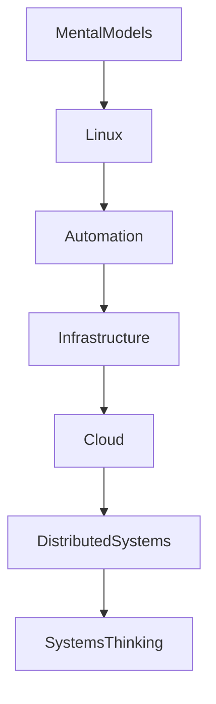

# References & Learning Ecosystem

---

# Why This File Exists

This is NOT a list of links.

This is your long-term engineering growth map.

The purpose of this file is to answer:

```text
I learned Bash.

↓

Now how do I become a world-class engineer?
```

Learning Linux is not about finishing a folder.

Learning Linux is entering an ecosystem.

---

# The Linux Engineering Growth Map

```text
Linux Fundamentals

↓

Bash Scripting

↓

Automation

↓

DevOps

↓

Cloud

↓

Platform Engineering

↓

SRE

↓

Distributed Systems

↓

Systems Thinking
```

This file organizes resources according to this evolution.

---

# Learning Philosophy

Never learn randomly.

Always learn layer by layer.

```text
Mental Models

↓

Linux Fundamentals

↓

Automation

↓

Infrastructure

↓

Cloud

↓

Distributed Systems
```

---

# Learning Pyramid



---

# SECTION 1 ⭐⭐⭐⭐⭐

# Official Documentation (Highest Priority)

Always prefer official documentation.

---

## Bash Documentation

Official GNU Bash Manual

```text
https://www.gnu.org/software/bash/manual/
```

---

## Bash Reference

GNU Bash Reference Manual

```text
https://www.gnu.org/software/bash/manual/bash.html
```

---

## Linux Man Pages

Linux documentation.

```text
https://man7.org/linux/man-pages/
```

---

## GNU Core Utilities

Official utilities documentation.

```text
https://www.gnu.org/software/coreutils/manual/
```

---

## Linux Documentation Project

```text
https://tldp.org/
```

---

# Why Official Docs Matter

Official docs teach:

```text
Correct Behavior

↓

Edge Cases

↓

Standards

↓

Internals
```

---

# SECTION 2 ⭐⭐⭐⭐⭐

# Linux Books

These are foundational books.

---

## Book 1

The Linux Command Line

Author:

```text
William Shotts
```

Why?

```text
Beginner Friendly

↓

Strong Fundamentals
```

---

## Book 2

How Linux Works

Author:

```text
Brian Ward
```

Why?

```text
Linux Internals

↓

Systems Thinking
```

---

## Book 3

UNIX and Linux System Administration Handbook

Authors:

```text
Evi Nemeth

Garth Snyder

Trent Hein

Ben Whaley
```

Why?

```text
Production Systems
```

---

## Book 4

The Practice of System and Network Administration

Authors:

```text
Thomas Limoncelli

Christina Hogan

Strata Chalup
```

Why?

```text
Operations Thinking
```

---

# SECTION 3 ⭐⭐⭐⭐⭐

# Shell Scripting Books

---

## Classic Shell Scripting

Authors:

```text
Arnold Robbins

Nelson Beebe
```

---

## Bash Cookbook

Author:

```text
Carl Albing
```

---

## Learning the Bash Shell

Author:

```text
Cameron Newham
```

---

# SECTION 4 ⭐⭐⭐⭐⭐

# Linux Internals Books

---

## Understanding The Linux Kernel

Authors:

```text
Daniel Bovet

Marco Cesati
```

---

## Linux Kernel Development

Author:

```text
Robert Love
```

---

## Linux System Programming

Author:

```text
Robert Love
```

---

# SECTION 5 ⭐⭐⭐⭐⭐

# Reliability Engineering Books

These books will completely change how you think.

---

## Site Reliability Engineering

Organization:

```text
Google
```

---

## The Site Reliability Workbook

Organization:

```text
Google
```

---

## Seeking SRE

Organization:

```text
Google
```

---

# Why Learn SRE?

Because all systems eventually fail.

You must learn:

```text
Reliability

↓

Observability

↓

Recovery

↓

Automation
```

---

# SECTION 6 ⭐⭐⭐⭐⭐

# DevOps Books

---

## The Phoenix Project

Authors:

```text
Gene Kim

Kevin Behr

George Spafford
```

---

## The Unicorn Project

Author:

```text
Gene Kim
```

---

## The DevOps Handbook

Authors:

```text
Gene Kim

Jez Humble

Patrick Debois

John Willis
```

---

# These Books Teach

```text
Organizations

↓

Automation

↓

Flow

↓

Feedback Loops
```

---

# SECTION 7 ⭐⭐⭐⭐⭐

# Platform Engineering Books

---

## Platform Engineering

Author:

```text
Camille Fournier
```

Read together with:

```text
Team Topologies
```

Authors:

```text
Matthew Skelton

Manuel Pais
```

---

# These Teach

```text
Developer Platforms

↓

Golden Paths

↓

Developer Experience
```

---

# SECTION 8 ⭐⭐⭐⭐⭐

# Distributed Systems Books

---

## Designing Data Intensive Applications (DDIA)

Author:

```text
Martin Kleppmann
```

This is mandatory.

---

## Understanding Distributed Systems

Author:

```text
Roberto Vitillo
```

---

# These Teach

```text
Scale

↓

Coordination

↓

Failures

↓

Consistency
```

---

# SECTION 9 ⭐⭐⭐⭐⭐

# Computer Science Fundamentals

---

## Computer Systems: A Programmer's Perspective (CSAPP)

Authors:

```text
Randal Bryant

David O'Hallaron
```

---

## Operating Systems: Three Easy Pieces (OSTEP)

Authors:

```text
Remzi Arpaci-Dusseau

Andrea Arpaci-Dusseau
```

Free online.

---

# These Teach

```text
CPU

↓

Memory

↓

Processes

↓

Storage
```

---

# SECTION 10 ⭐⭐⭐⭐⭐

# Networking Resources

---

## Computer Networking: A Top Down Approach

Authors:

```text
James Kurose

Keith Ross
```

---

## TCP/IP Illustrated

Author:

```text
Richard Stevens
```

---

# These Teach

```text
Packets

↓

Protocols

↓

Networks

↓

Internet
```

---

# SECTION 11 ⭐⭐⭐⭐⭐

# Docker Resources

Official Docs:

```text
https://docs.docker.com/
```

Books:

```text
Docker Deep Dive

Nigel Poulton
```

---

# SECTION 12 ⭐⭐⭐⭐⭐

# Kubernetes Resources

Official Docs:

```text
https://kubernetes.io/docs/
```

Books:

```text
Kubernetes Up & Running

Kelsey Hightower

Brendan Burns

Joe Beda
```

---

# SECTION 13 ⭐⭐⭐⭐⭐

# Cloud Resources

## AWS

Official:

```text
https://docs.aws.amazon.com/
```

---

## Azure

Official:

```text
https://learn.microsoft.com/azure/
```

---

## GCP

Official:

```text
https://cloud.google.com/docs
```

---

# SECTION 14 ⭐⭐⭐⭐⭐

# Observability Resources

---

## Observability Engineering

Authors:

```text
Charity Majors

Liz Fong-Jones

George Miranda
```

---

## Distributed Systems Observability

Author:

```text
Cindy Sridharan
```

---

# Learn

```text
Logs

↓

Metrics

↓

Traces
```

---

# SECTION 15 ⭐⭐⭐⭐⭐

# Great Engineering Blogs

These are gold mines.

---

## Brendan Gregg

Topics:

```text
Linux

Performance

Observability
```

---

## Julia Evans

Topics:

```text
Linux

Debugging

Systems
```

---

## Cloudflare Blog

Topics:

```text
Internet

Infrastructure

Networking
```

---

## Netflix Tech Blog

Topics:

```text
Scale

Observability

Reliability
```

---

## Uber Engineering

Topics:

```text
Distributed Systems

Infrastructure
```

---

# SECTION 16 ⭐⭐⭐⭐⭐

# Linux Labs Resources

Practice constantly.

Use:

```text
VirtualBox

VMware

WSL2

Docker

Cloud VMs
```

---

# Practice Environment Architecture

```text
Laptop

↓

Linux VM

↓

Docker

↓

Containers

↓

Cloud
```

---

# SECTION 17 ⭐⭐⭐⭐⭐

# Build Projects Continuously

Build:

```text
Backup Systems

↓

Health Monitors

↓

Log Analyzers

↓

CI/CD Pipelines

↓

Infrastructure Auditors

↓

Platform Bootstrap Systems
```

Projects create engineers.

---

# SECTION 18 ⭐⭐⭐⭐⭐

# The Long Term Engineering Roadmap

Year 1

```text
Linux

↓

Bash

↓

Networking

↓

Storage
```

Year 2

```text
Docker

↓

Cloud

↓

Databases
```

Year 3

```text
Kubernetes

↓

Observability

↓

DevOps
```

Year 4

```text
Platform Engineering

↓

SRE

↓

Distributed Systems
```

Year 5+

```text
Systems Thinking
```

---

# The Great Engineering Evolution

```text
Commands

↓

Scripts

↓

Automation

↓

Infrastructure

↓

Platforms

↓

Distributed Systems

↓

Systems Thinking
```

---

# Engineering Mindset

Do not think:

```text
I need more tutorials.
```

Think:

```text
I need better mental models.
```

Because the internet is full of information.

Great engineers build knowledge systems.

---

# Mind Map

```text
Engineering Learning Ecosystem

├── Linux

├── Bash

├── Internals

├── Networking

├── DevOps

├── Docker

├── Kubernetes

├── Cloud

├── SRE

├── Platform Engineering

├── Distributed Systems

└── Systems Thinking
```

---

# Golden Rules

### Rule 1

Prefer official documentation.

---

### Rule 2

Books build depth.

---

### Rule 3

Projects build capability.

---

### Rule 4

Systems thinking beats memorization.

---

### Rule 5

Build labs.

---

### Rule 6

Everything connects.

---

### Rule 7

Never stop building.

---

# First Principles Recap

```text
Learn Fundamentals

↓

Build Projects

↓

Automate Systems

↓

Build Infrastructure

↓

Build Platforms

↓

Understand Systems

↓

Become A Systems Thinker ⭐⭐⭐⭐⭐
```

# Key Takeaway

**Tutorials create consumers.**

**Projects create builders.**

**Mental models create engineers.**
