# Bash Scripting Visual Atlas

---

# Why This File Exists

Humans remember visuals better than text.

This file converts the entire Bash module into visual systems.

Do not memorize commands.

Memorize flows.

---

# 1. Linux Execution Stack

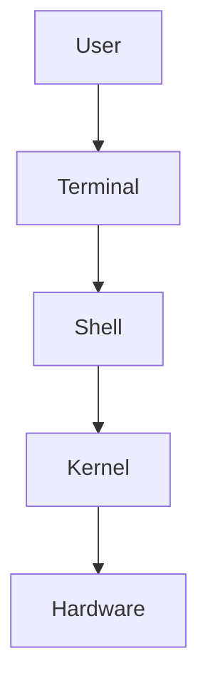

---

# 2. Shell Ecosystem

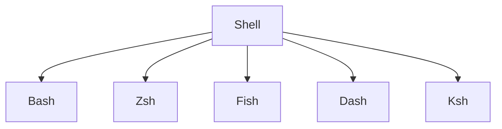

---

# 3. Bash Execution Lifecycle

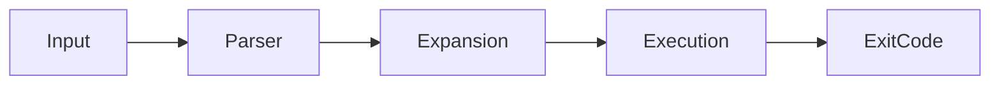

---

# 4. The Universal Bash Formula

```text
Input

↓

Process

↓

Output

↓

Feedback
```

---

# 5. Variable Expansion Flow

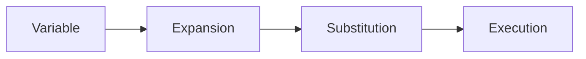

---

# 6. Expansion Order

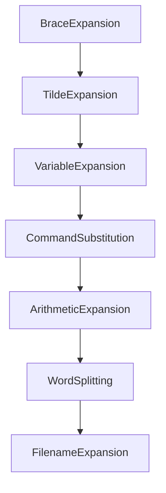

---

# 7. Quoting System

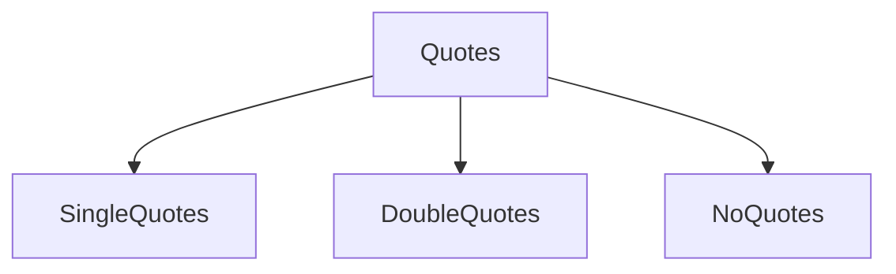

---

# 8. Decision Engine

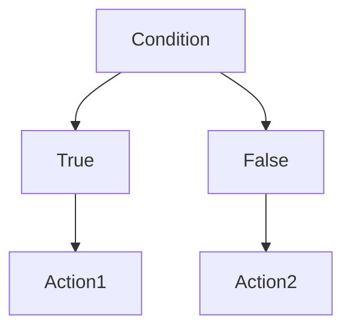

---

# 9. Loop Engine

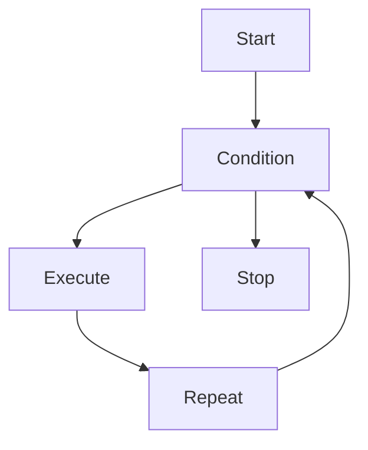

---

# 10. Function Architecture

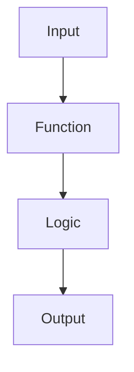

---

# 11. Array Model

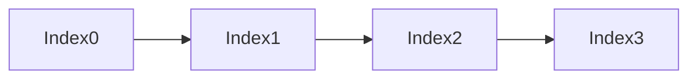

---

# 12. Input Output Architecture

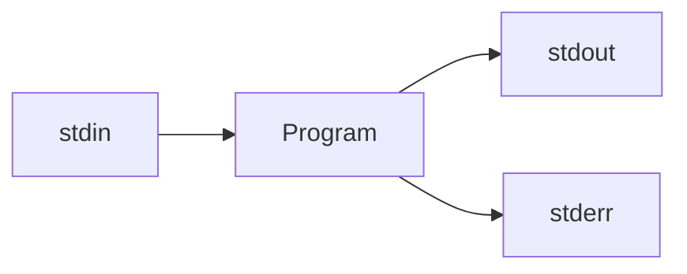

---

# 13. Redirection Architecture

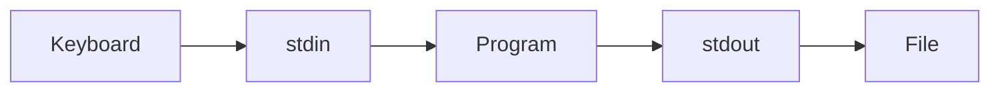

---

# 14. Data Pipeline Architecture

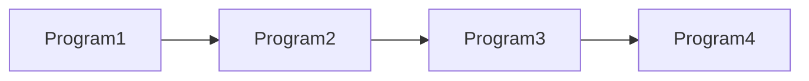

Example:

```text
cat

↓

grep

↓

sort

↓

uniq
```

---

# 15. Command Substitution

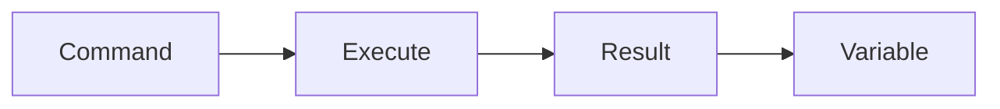

---

# 16. Process Substitution

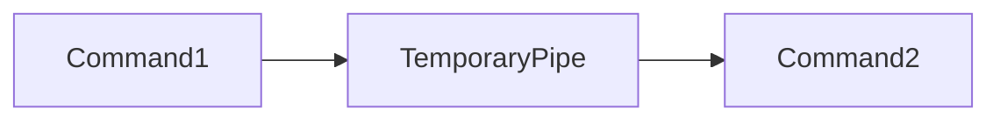

---

# 17. Text Processing Ecosystem

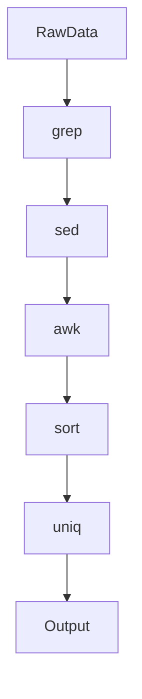

---

# 18. grep Mental Model

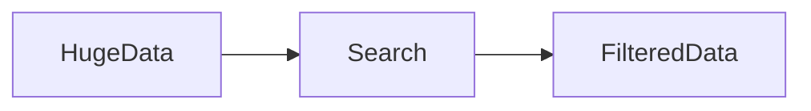

---

# 19. sed Mental Model

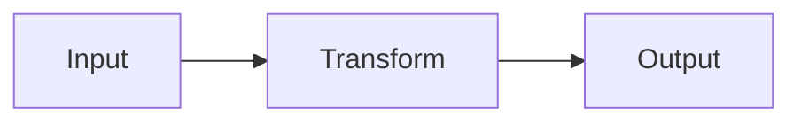

---

# 20. awk Mental Model

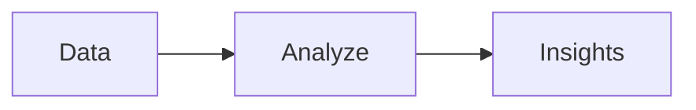

---

# 21. Data Manipulation Family

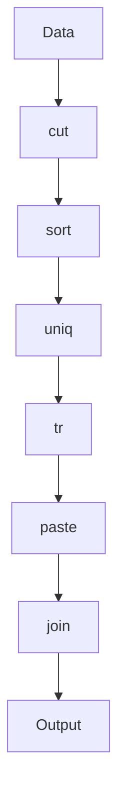

---

# 22. xargs Mental Model

```mermaid
flowchart LR

Data

Commands

Execution

Data --> Commands

Commands --> Execution
```

---

# 23. find + exec Mental Model

```mermaid
flowchart LR

Filesystem

Find

Policies

Action

Filesystem --> Find

Find --> Policies

Policies --> Action
```

---

# 24. Error Handling Architecture

```mermaid
flowchart TD

Execute

Error

Handler

Recovery

Continue

Execute --> Error

Error --> Handler

Handler --> Recovery

Recovery --> Continue
```

---

# 25. Debugging Framework

```mermaid
flowchart TD

Observe

Reproduce

Isolate

Verify

Fix

Observe --> Reproduce

Reproduce --> Isolate

Isolate --> Verify

Verify --> Fix
```

---

# 26. Performance Engineering Model

```mermaid
flowchart TD

Measure

Bottleneck

Optimize

Verify

Measure --> Bottleneck

Bottleneck --> Optimize

Optimize --> Verify
```

---

# 27. Resource Model

```mermaid
flowchart TD

CPU

Memory

Disk

Network
```

Every Linux system eventually maps here.

---

# 28. Security Trust Boundaries

```mermaid
flowchart LR

Internet

Firewall

Application

Database

Internet --> Firewall

Firewall --> Application

Application --> Database
```

---

# 29. Security Lifecycle

```mermaid
flowchart TD

Protect

Detect

Respond

Recover

Improve

Protect --> Detect

Detect --> Respond

Respond --> Recover

Recover --> Improve
```

---

# 30. Production Script Architecture

```mermaid
flowchart TD

Config

Validation

Logging

BusinessLogic

Observability

Recovery

Config --> Validation

Validation --> Logging

Logging --> BusinessLogic

BusinessLogic --> Observability

Observability --> Recovery
```

---

# 31. Automation Engineering Lifecycle

```mermaid
flowchart TD

Observe

Decide

Execute

Verify

Improve

Observe --> Decide

Decide --> Execute

Execute --> Verify

Verify --> Improve

Improve --> Observe
```

---

# 32. DevOps Lifecycle

```mermaid
flowchart TD

Plan

Build

Test

Deploy

Operate

Observe

Improve

Plan --> Build

Build --> Test

Test --> Deploy

Deploy --> Operate

Operate --> Observe

Observe --> Improve

Improve --> Plan
```

---

# 33. CI/CD Architecture

```mermaid
flowchart LR

Developer

Git

CI

Tests

Build

Deploy

Production

Developer --> Git

Git --> CI

CI --> Tests

Tests --> Build

Build --> Deploy

Deploy --> Production
```

---

# 34. Infrastructure Evolution

```mermaid
flowchart TD

Commands

Scripts

Automation

Infrastructure

Platforms

AutonomousSystems

Commands --> Scripts

Scripts --> Automation

Automation --> Infrastructure

Infrastructure --> Platforms

Platforms --> AutonomousSystems
```

---

# 35. Observability Pillars

```mermaid
flowchart TD

Logs

Metrics

Traces

Logs --> Observability

Metrics --> Observability

Traces --> Observability
```

---

# 36. Incident Response Workflow

```mermaid
flowchart TD

Detect

Investigate

Recover

Verify

Document

Improve

Detect --> Investigate

Investigate --> Recover

Recover --> Verify

Verify --> Document

Document --> Improve
```

---

# 37. Systems Thinking Graph

```mermaid
flowchart TD

Users

Application

Database

Storage

Network

Observability

Users --> Application

Application --> Database

Application --> Network

Database --> Storage

Observability --> Application
```

---

# 38. Engineering Evolution Timeline

```mermaid
flowchart TD

LinuxUser

LinuxOperator

AutomationEngineer

DevOpsEngineer

PlatformEngineer

InfrastructureEngineer

SystemsThinker

LinuxUser --> LinuxOperator

LinuxOperator --> AutomationEngineer

AutomationEngineer --> DevOpsEngineer

DevOpsEngineer --> PlatformEngineer

PlatformEngineer --> InfrastructureEngineer

InfrastructureEngineer --> SystemsThinker
```

---

# 39. Universal Troubleshooting Framework

```mermaid
flowchart TD

Observe

Collect

Analyze

Hypothesize

Verify

Fix

Prevent

Observe --> Collect

Collect --> Analyze

Analyze --> Hypothesize

Hypothesize --> Verify

Verify --> Fix

Fix --> Prevent
```

---

# 40. The Ultimate Linux Deep Fundamentals Map ⭐⭐⭐⭐⭐

```mermaid
flowchart TD

Linux

Bash

Automation

DevOps

PlatformEngineering

Cloud

SRE

DistributedSystems

SystemsThinking

Linux --> Bash

Bash --> Automation

Automation --> DevOps

DevOps --> PlatformEngineering

PlatformEngineering --> Cloud

Cloud --> SRE

SRE --> DistributedSystems

DistributedSystems --> SystemsThinking
```

---

# Mind Map

```text
Visual Atlas

├── Linux

├── Shell

├── Bash

├── Data Flow

├── Automation

├── Reliability

├── DevOps

├── Platform Engineering

├── SRE

└── Systems Thinking
```

---

# Golden Rules

### Rule 1

Memorize flows, not commands.

### Rule 2

Everything is input → process → output.

### Rule 3

Everything eventually becomes automation.

### Rule 4

Everything eventually fails.

### Rule 5

Everything eventually becomes systems thinking.

### Rule 6

Diagrams compress complexity.

### Rule 7

Great engineers think visually.
