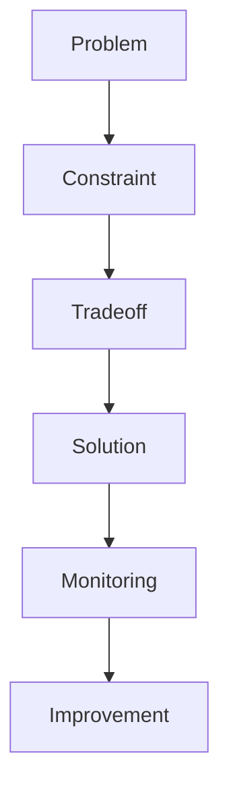
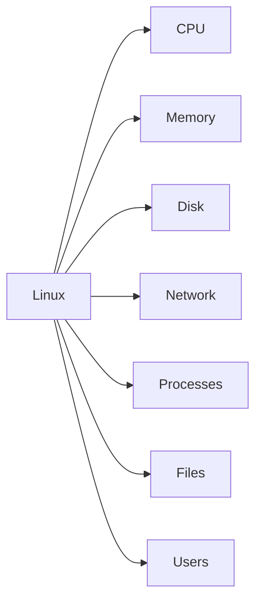
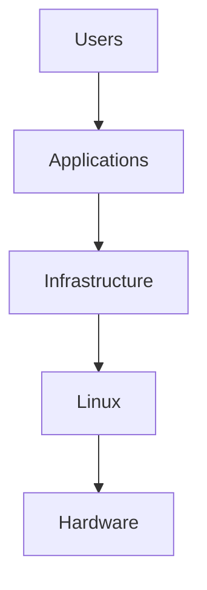
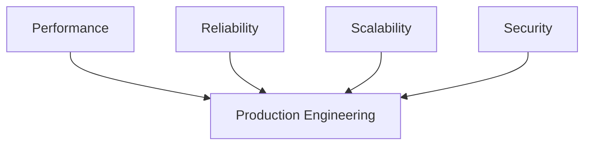
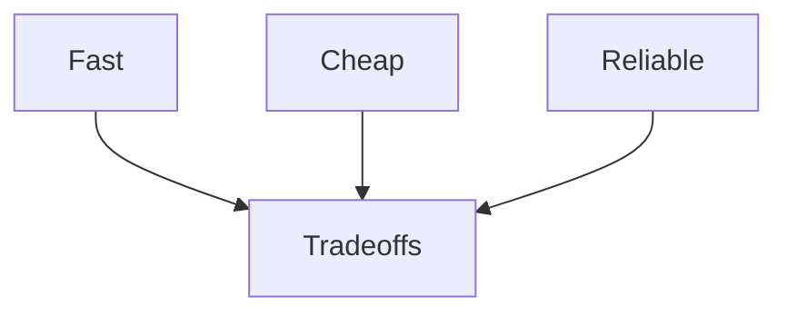
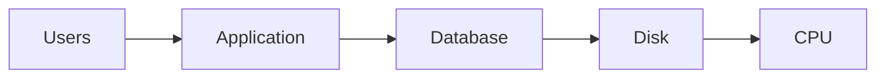
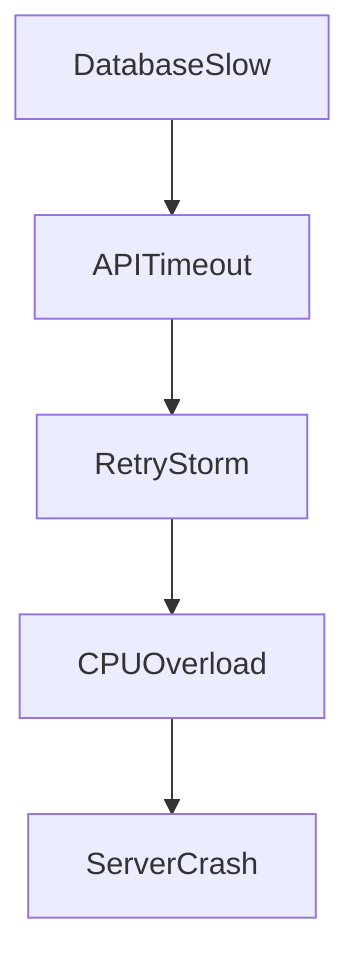
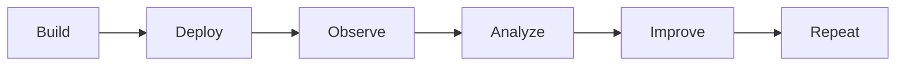
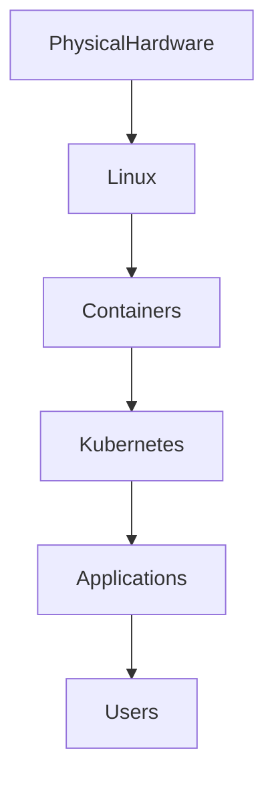

# Engineering Mindset

> Linux is not a skill.
>
> Linux is a way of thinking about systems.

---

# Why this file exists

Most people learn Linux incorrectly.

Their journey looks like this:

```text
Learn ls
Learn cd
Learn grep
Learn chmod
Learn Docker
Learn Kubernetes
```

Then reality happens.

Production systems fail.

Servers crash.

Applications become slow.

Databases overload.

Memory disappears.

Latency spikes.

Customers complain.

Then they realize:

> Engineering is not about knowing commands.

Engineering is about solving problems.

---

# The Biggest Mindset Shift

## Users ask:

```text
How do I run this?
```

## Engineers ask:

```text
Why does this exist?
```

---

## Users ask:

```text
How do I fix this?
```

## Engineers ask:

```text
Why did this break?
```

---

## Users ask:

```text
What command should I use?
```

## Engineers ask:

```text
Which system is responsible?
```

---

## Users ask:

```text
How do I deploy?
```

## Engineers ask:

```text
How will this fail?
```

---

# The Engineer's Brain

Engineers don't see applications.

Engineers see systems.

Example:

User sees:

```text
Instagram
```

Engineer sees:

```text
Frontend

↓

API Gateway

↓

Load Balancer

↓

Application Servers

↓

Redis

↓

Databases

↓

CDN

↓

Storage

↓

Monitoring

↓

Linux
```

Everything eventually reaches Linux.

---

# Mental Model: Linux Is A City

Imagine Linux as an entire city.

```text
Users          = Citizens

Processes      = Buildings

CPU            = Workers

Memory         = Workspaces

Storage        = Warehouses

Network        = Roads

Kernel         = Government

Scheduler      = Traffic Police

System Calls   = Government Offices

File System    = Library System

Containers     = Private Communities

Monitoring     = CCTV Cameras
```

If one thing fails, other things are affected.

This is systems thinking.

---

# The Engineering Pyramid

```text
                    Founder

                        ▲

                System Architect

                        ▲

               Platform Engineer

                        ▲

                  SRE Engineer

                        ▲

                Cloud Engineer

                        ▲

                DevOps Engineer

                        ▲

               Backend Engineer

                        ▲

               Linux Administrator

                        ▲

                   Linux User
```

Every level solves larger problems.

---

# Users Solve Tasks

Example:

```text
Create file

Install package

Start service
```

---

# Engineers Solve Systems

Example:

```text
Reduce latency

Increase reliability

Improve scalability

Decrease downtime

Increase security

Reduce infrastructure costs
```

---

# Engineering Is Problem Solving

Everything in engineering is solving constraints.



The cycle never ends.

---

# The Five Questions Engineers Always Ask

Whenever you see any system, ask:

## 1. What problem does it solve?

Example:

```text
Docker

Problem:

Dependency conflicts
```

---

## 2. Why was it built?

Example:

```text
Kubernetes

Problem:

Managing thousands of containers
```

---

## 3. What resources does it consume?

Example:

```text
CPU

Memory

Disk

Network
```

---

## 4. How can it fail?

Example:

```text
CPU overload

Memory leak

Disk full

Network outage
```

---

## 5. How can we observe it?

Example:

```text
Logs

Metrics

Traces

Alerts
```

---

# The Golden Rule

Everything is resource management.

Linux only manages a few things.



Everything else is abstraction.

---

# The Three Layers Engineers See

Beginners see applications.

Engineers see layers.

```text
Applications

↓

Infrastructure

↓

Hardware
```

---

## Layer 1: Applications

Examples:

```text
Instagram

Netflix

WhatsApp

Amazon
```

---

## Layer 2: Infrastructure

Examples:

```text
Docker

Kubernetes

Nginx

Redis

PostgreSQL

Kafka
```

---

## Layer 3: Hardware

Examples:

```text
CPU

Memory

SSD

Network Card
```

---

# Linux Sits In The Middle



Linux orchestrates everything.

---

# The Four Engineering Pillars

Every engineer eventually works on these.



---

# Performance Thinking

Question:

```text
Can it run faster?
```

Examples:

```text
Reduce latency

Optimize CPU

Reduce network calls

Improve caching
```

---

# Reliability Thinking

Question:

```text
Can it survive failure?
```

Examples:

```text
Server crashes

Database crashes

Power outages

Network failures
```

---

# Scalability Thinking

Question:

```text
Can it grow?
```

Examples:

```text
100 users

↓

1000 users

↓

10000 users

↓

1 million users
```

---

# Security Thinking

Question:

```text
Can attackers abuse this?
```

Examples:

```text
Privilege escalation

Data leaks

Weak authentication

Open ports
```

---

# Engineering Is Tradeoffs

There is no perfect system.

Everything is a compromise.



You cannot maximize everything.

---

# Example Tradeoffs

## More Logging

Benefits:

```text
Better debugging
```

Cost:

```text
More disk usage

More CPU usage

Higher storage costs
```

---

## More Caching

Benefits:

```text
Faster systems
```

Cost:

```text
Cache invalidation complexity

Stale data
```

---

## More Replicas

Benefits:

```text
Higher availability
```

Cost:

```text
Higher infrastructure cost
```

---

# The Bottleneck Principle

Every system has bottlenecks.

The bottleneck changes over time.

Example:

```text
Application

↓

Database

↓

Storage

↓

Network

↓

CPU

↓

Memory
```



The slowest component controls the entire system.

---

# Failure Thinking

Everything fails.

Always assume failure.

Instead of asking:

```text
Will it fail?
```

Ask:

```text
When will it fail?
```

---

# Failure Cascades

Small failures become big failures.



This is called a cascade failure.

---

# Production Thinking

Developers optimize for features.

Engineers optimize for stability.

Developers ask:

```text
Can I build it?
```

Engineers ask:

```text
Can I operate it?
```

---

# The Production Lifecycle



This never ends.

---

# Modern Systems Stack



Linux powers everything.

---

# Data Flow Thinking

Whenever data enters a system:

```text
Request

↓

Network

↓

Kernel

↓

Process

↓

Memory

↓

CPU

↓

Storage

↓

Response
```

Every layer can become a bottleneck.

---

# The Engineer's Daily Questions

Train yourself to always ask:

```text
What problem am I solving?

What resources are consumed?

What can fail?

What is the bottleneck?

How can I observe it?

How can I secure it?

How can I scale it?

How much will it cost?
```

These eight questions create great engineers.

---

# Engineering Principles To Memorize

## Principle 1

Everything is a system.

---

## Principle 2

Everything consumes resources.

---

## Principle 3

Everything eventually fails.

---

## Principle 4

Everything becomes a bottleneck.

---

## Principle 5

Everything requires observability.

---

## Principle 6

Everything is a tradeoff.

---

## Principle 7

Everything eventually scales.

---

# Common Beginner Mistakes

## Mistake 1

Learning commands instead of systems.

---

## Mistake 2

Ignoring Linux internals.

---

## Mistake 3

Ignoring performance.

---

## Mistake 4

Ignoring failure scenarios.

---

## Mistake 5

Ignoring monitoring.

---

## Mistake 6

Ignoring security.

---

# Interview Questions

### Beginner

What is Linux responsible for?

---

### Intermediate

Why is Linux considered a resource manager?

---

### Intermediate

What is a bottleneck?

---

### Advanced

Explain cascading failures.

---

### Advanced

Why is observability important?

---

### Senior Engineer

How would you design a system that survives failures?

---

### Architect

What tradeoffs would you make between reliability, cost, and performance?

---

# Mind Map

```mermaid
mindmap

root((Engineering Mindset))

    Systems Thinking

        Interconnected Components

        Data Flow

        Bottlenecks

    Reliability

        Failures

        Redundancy

        Recovery

    Performance

        CPU

        Memory

        Disk

        Network

    Security

        Authentication

        Authorization

        Isolation

    Scalability

        Horizontal

        Vertical

    Observability

        Logs

        Metrics

        Traces

    Tradeoffs

        Cost

        Performance

        Reliability
```

---

# Cheat Sheet

```text
Engineer ≠ Command User

Engineer = Problem Solver

Always Ask:

1. Why does it exist?

2. What problem does it solve?

3. What resources does it consume?

4. How can it fail?

5. How can we observe it?

6. How can we secure it?

7. How can we scale it?

8. What tradeoffs exist?

Golden Rule:

Everything is a system.

Everything consumes resources.

Everything eventually fails.

Everything becomes a bottleneck.

Everything must be observed.
```

---

# Final Thought

People think Linux is an operating system.

Advanced engineers know:

> Linux is the foundation upon which modern civilization executes computation.

And engineering is the art of making that computation reliable.
