# Systems Thinking

> Great engineers don't build components.
>
> Great engineers build systems.

---

# Why This Exists

Most people learn technology incorrectly.

They learn isolated tools.

```text
Linux

Docker

Nginx

Redis

PostgreSQL

Kafka

Kubernetes
```

Then they try to connect everything later.

This creates shallow understanding.

Because reality does not work like this.

Reality looks like this:

```text
User

↓

Browser

↓

DNS

↓

CDN

↓

Load Balancer

↓

API Gateway

↓

Application

↓

Cache

↓

Database

↓

Storage

↓

Linux

↓

Hardware
```

Everything is connected.

Everything influences everything else.

This is systems thinking.

---

# The Biggest Mindset Shift

Stop seeing individual components.

Start seeing relationships.

Do not ask:

```text
What is Redis?
```

Ask:

```text
Why does Redis exist?

What problem does it solve?

What systems depend on it?

What happens if it fails?

How does it interact with Linux?
```

---

# What Is A System?

A system is:

> A collection of interconnected components working together toward a goal.

Examples:

### Human Body

```text
Brain

Heart

Lungs

Blood

Nervous System
```

All connected.

---

### City

```text
Roads

Electricity

Water

Hospitals

Traffic Systems
```

All connected.

---

### Linux Infrastructure

```text
Users

Applications

Containers

Processes

Storage

Network

Linux Kernel

Hardware
```

All connected.

---

# Mental Model: The Human Body

This is one of the best ways to understand infrastructure.

```text
Brain             = CPU

Memory            = RAM

Skeleton          = Hardware

Blood Vessels     = Network

Organs            = Services

Cells             = Processes

DNA               = Configuration

Immune System     = Security

Eyes              = Monitoring

Doctors           = SRE Engineers

Food              = Data

Energy            = Electricity
```

If one organ fails, the entire body suffers.

Infrastructure works exactly the same way.

---

# Systems Thinking Core Principle

Everything is connected.

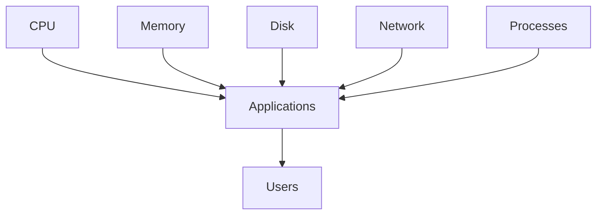

No component operates independently.

---

# The Five Laws Of Systems Thinking

# Law 1

Everything is connected.

---

# Law 2

Every system has constraints.

---

# Law 3

Every system has bottlenecks.

---

# Law 4

Every system eventually fails.

---

# Law 5

Every system is a tradeoff.

---

# How Beginners Think

```text
My website is slow.
```

They optimize code.

---

# How Engineers Think

```text
Why is it slow?

CPU?

Memory?

Disk?

Network?

Database?

External API?

Load Balancer?

Cache?

DNS?
```

This is systems thinking.

---

# Mental Model: The Iceberg

Beginners only see the top.

```text
                 Users
                   ▲

             Applications
                   ▲

             Containers
                   ▲

              Linux
                   ▲

             Hardware
```

Applications are only the visible part.

Most complexity is underneath.

---

# The Seven Layers Of Modern Systems

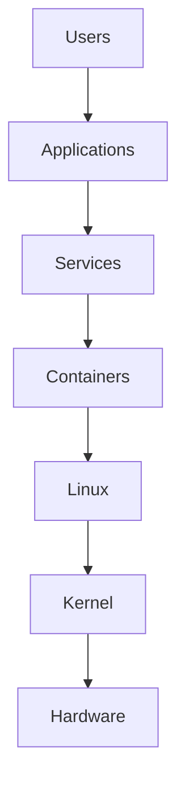

Each layer depends on lower layers.

---

# The Dependency Chain

Nothing exists alone.

Example:

```text
Netflix

↓

Microservices

↓

Containers

↓

Linux

↓

Kernel

↓

CPU

↓

Electricity
```

If electricity fails:

Everything fails.

---

# The Golden Rule

Small failures create large failures.

Example:

```text
Disk slow

↓

Database slow

↓

API slow

↓

Users retry

↓

CPU spikes

↓

Server crashes
```

This is called a cascade failure.

---

# Cascade Failure Diagram

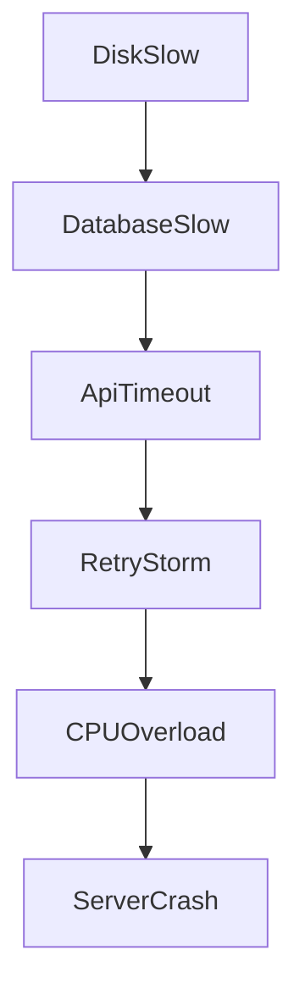

---

# Systems Thinking Formula

Every system can be reduced to:

```text
Input

↓

Processing

↓

Storage

↓

Output

↓

Feedback
```

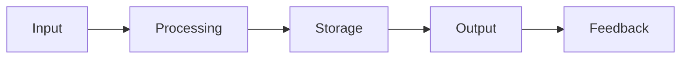

---

# Example: Instagram

# Input

```text
User uploads image
```

# Processing

```text
Compression

Metadata extraction

AI moderation
```

# Storage

```text
Object storage

Databases
```

# Output

```text
Image feed
```

# Feedback

```text
Analytics

Monitoring

Metrics
```

Everything follows this model.

---

# Systems Thinking In Linux

Linux itself is a system.

Linux manages:

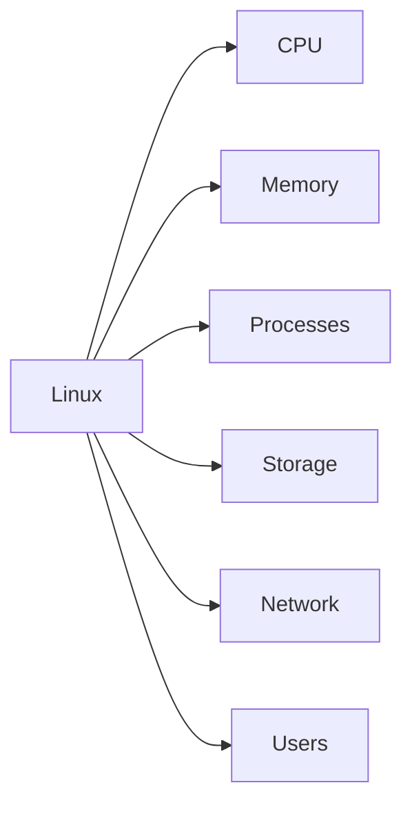

Linux is a giant orchestration system.

---

# Think In Resource Flows

Never think:

```text
Application
```

Think:

```text
Application

↓

Consumes CPU

↓

Consumes Memory

↓

Reads Storage

↓

Uses Network

↓

Produces Output
```

Everything is a flow.

---

# Resource Flow Diagram

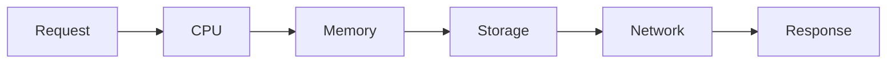

---

# Systems Are Dynamic

Systems are always changing.

```text
Traffic changes

CPU changes

Users change

Data changes

Network changes
```

Static thinking breaks systems.

Dynamic thinking builds systems.

---

# The Three Types Of Thinking

# Component Thinking

```text
I know Docker.
```

Weak.

---

# Tool Thinking

```text
I know Kubernetes.
```

Still weak.

---

# Systems Thinking

```text
I understand how infrastructure works.
```

Strong.

---

# Every Engineer Must Think In Flows

Always ask:

```text
Where does data come from?

Where does it go?

Who consumes it?

Who depends on it?

What happens if it stops?
```

---

# Data Flow Thinking

Every request travels through systems.

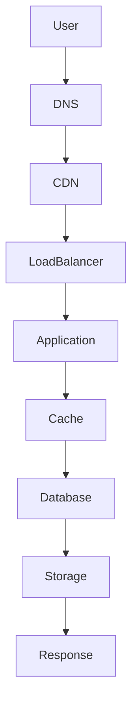

Every arrow is a possible failure point.

---

# The Five Resource Pillars

Every system consumes:

```text
CPU

Memory

Storage

Network

Time
```

Time is the hidden resource.

---

# Resource Interaction Diagram

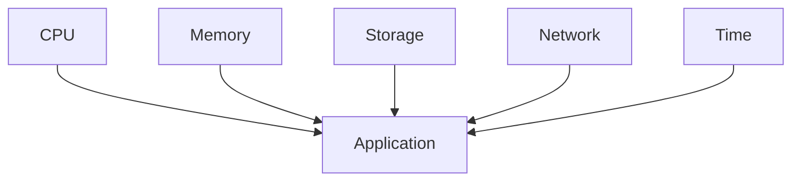

---

# Feedback Loops

Systems constantly react to themselves.

Example:

```text
More users

↓

More requests

↓

More CPU

↓

Higher latency

↓

More retries

↓

Even more CPU
```

Positive feedback loops create disasters.

---

# Feedback Loop Diagram

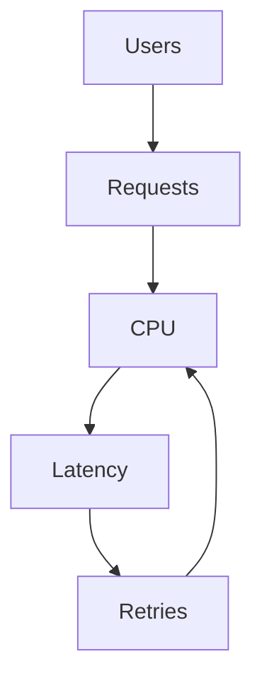

---

# Negative Feedback Loops

Negative feedback stabilizes systems.

Example:

```text
CPU increases

↓

Autoscaler triggers

↓

New servers created

↓

CPU decreases
```

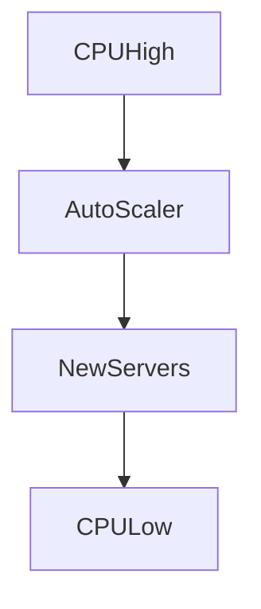

---

# Modern Infrastructure Is A Giant System

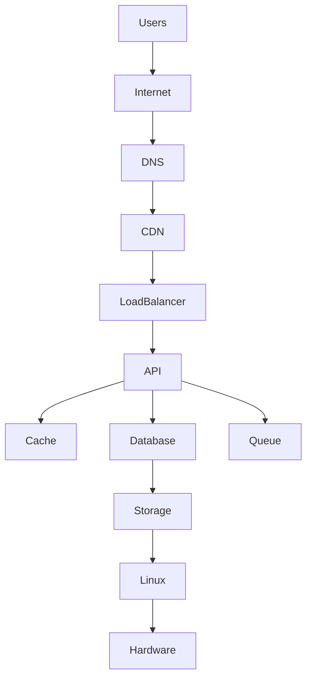

Everything is connected.

---

# Observability Thinking

Always ask:

```text
How do I know this system is healthy?
```

Three pillars:

```text
Logs

Metrics

Traces
```

Without observability:

You are blind.

---

# Security Thinking

Always ask:

```text
What can attackers abuse?
```

Examples:

```text
Open ports

Weak passwords

Misconfigured permissions

Exposed APIs

Exposed secrets
```

---

# Scaling Thinking

Always ask:

```text
What happens when users increase by 100x?
```

Systems that don't scale eventually die.

---

# Cost Thinking

Always ask:

```text
What does this architecture cost?
```

Everything has a price.

```text
CPU costs money

Memory costs money

Storage costs money

Network costs money

Monitoring costs money
```

---

# The Eight Systems Questions

When learning anything, ask these eight questions.

```text
1. Why does it exist?

2. What problem does it solve?

3. What depends on it?

4. What resources does it consume?

5. What are the bottlenecks?

6. How can it fail?

7. How do we observe it?

8. How do we scale it?
```

Memorize these.

---

# Beginner Mistakes

## Mistake 1

Learning tools independently.

---

## Mistake 2

Ignoring dependencies.

---

## Mistake 3

Ignoring bottlenecks.

---

## Mistake 4

Ignoring failure paths.

---

## Mistake 5

Ignoring observability.

---

# Engineering Mindset

Always think:

```text
Components are temporary.

Systems are permanent.
```

Technologies change.

Principles remain.

---

# Interview Questions

### Beginner

What is a system?

---

### Intermediate

What is systems thinking?

---

### Intermediate

What is a bottleneck?

---

### Advanced

Explain cascade failures.

---

### Advanced

Explain feedback loops.

---

### Senior

How would you debug a slow system?

---

### Architect

How do you design resilient infrastructure?

---

# Mind Map

```mermaid
mindmap

root((Systems Thinking))

    Interconnections

        Dependencies

        Relationships

        Data Flow

    Resources

        CPU

        Memory

        Disk

        Network

    Reliability

        Failure

        Recovery

        Redundancy

    Performance

        Bottlenecks

        Optimization

    Observability

        Logs

        Metrics

        Traces

    Security

        Permissions

        Isolation

    Scalability

        Vertical

        Horizontal

    Costs

        Infrastructure

        Operations
```

---

# Cheat Sheet

```text
Systems Thinking = Seeing relationships instead of components

Golden Rules:

Everything is connected.

Everything consumes resources.

Everything has bottlenecks.

Everything eventually fails.

Everything needs observability.

Everything is a tradeoff.

Always Ask:

Why?

What depends on it?

What can fail?

How do I observe it?

How do I scale it?
```

---

# Final Thought

Amateurs learn technologies.

Professionals learn systems.

Architects learn interactions between systems.

Founders learn economics of systems.

**Systems thinking is the bridge between Linux user and infrastructure architect.**
