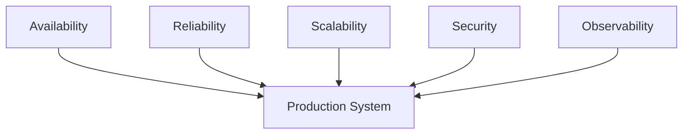
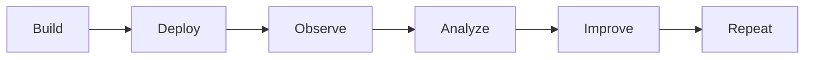
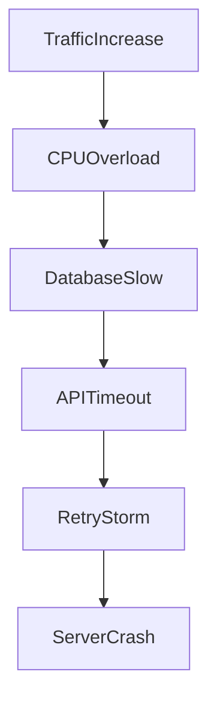
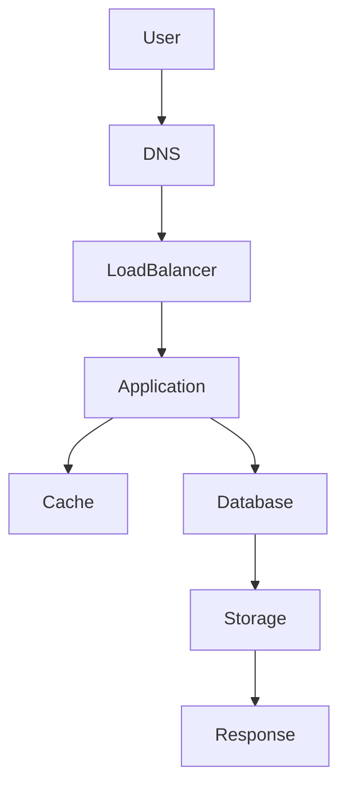
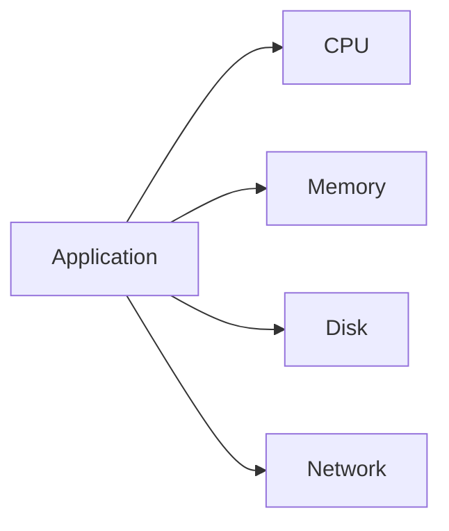
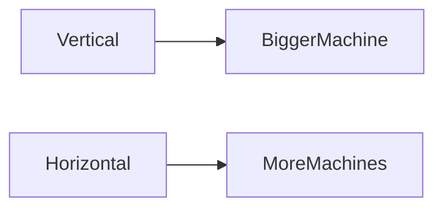
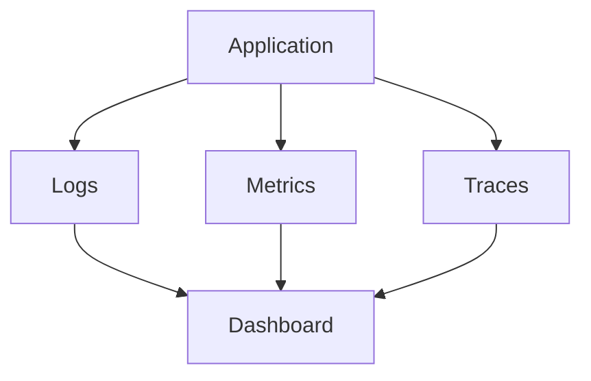

# Production Thinking

> Building software is only 20% of engineering.
>
> Keeping software alive is the other 80%.

---

# Why This File Exists

There are two worlds.

## Development World

```text
Laptop

1 developer

Fake data

No traffic

No attackers

No failures
```

Everything works.

Life is easy.

---

## Production World

```text
Millions of users

Real money

Real customers

Real failures

Real attacks

Real consequences
```

Everything breaks.

Production engineering exists because reality is messy.

---

# The Biggest Mindset Shift

Stop asking:

```text
Can I build this?
```

Start asking:

```text
Can I operate this?
```

---

# Developers Build Features

Example:

```text
Login system

Payment system

Chat system

Notifications
```

---

# Production Engineers Build Survival Systems

Example:

```text
Monitoring

Alerting

Redundancy

Backups

Security

Disaster Recovery

Scalability
```

---

# Mental Model: Building A Hospital

Imagine building a hospital.

A developer mindset says:

```text
Build rooms.

Build equipment.

Build beds.
```

Production thinking says:

```text
What if electricity fails?

What if oxygen fails?

What if too many patients arrive?

What if a fire occurs?

What if one doctor is unavailable?

What if communication fails?
```

Infrastructure works exactly the same way.

---

# The Production Rule

Users don't care if code is beautiful.

Users only care about this:

```text
Does it work?
```

Nothing else matters.

---

# The Production Pyramid

```text
                 Business

                     ▲

                 Customers

                     ▲

               Applications

                     ▲

               Infrastructure

                     ▲

                    Linux

                     ▲

                  Hardware
```

Everything eventually depends on Linux.

---

# Production Is About Guarantees

Production systems try to answer one question:

> Can this continue working under stress?

---

# The Five Pillars Of Production Thinking



These pillars support everything.

---

# Pillar 1: Availability

Question:

```text
Can users access the system?
```

Examples:

```text
Website online

API reachable

Database available
```

---

# Availability Formula

```text
Availability = Uptime / Total Time
```

Example:

```text
30 days total

10 minutes downtime
```

Very high availability.

---

# Uptime Targets

```text
99%

99.9%

99.99%

99.999%
```

---

# The Five Nines

```text
99.999%

5.26 minutes downtime per year
```

Very difficult to achieve.

Very expensive.

---

# Pillar 2: Reliability

Question:

```text
Can it consistently work?
```

Example:

Bad reliability:

```text
Works today

Fails tomorrow

Works again later
```

Good reliability:

```text
Predictable behavior
```

---

# Pillar 3: Scalability

Question:

```text
Can it grow?
```

Example:

```text
100 users

↓

1000 users

↓

10000 users

↓

100000 users

↓

1 million users
```

---

# Pillar 4: Security

Question:

```text
Can attackers exploit it?
```

Attackers never sleep.

---

# Pillar 5: Observability

Question:

```text
Can we understand the system?
```

Without observability:

You are blind.

---

# The Production Lifecycle



This cycle never ends.

---

# Mental Model: Airplane Engineering

Airplanes don't assume success.

They assume failure.

Examples:

```text
Engine failure

Fuel leak

Bad weather

Sensor failure
```

Systems are designed to survive failure.

Production systems work the same way.

---

# The Golden Production Rule

Everything fails.

Never design systems expecting success.

Always design systems expecting failure.

---

# Failure Thinking

Instead of asking:

```text
Will it fail?
```

Ask:

```text
When will it fail?
```

Because eventually:

It will.

---

# Common Production Failures

```text
CPU overload

Memory leaks

Disk full

Database overload

Network failures

DNS failures

Expired certificates

Human errors

Cloud outages
```

---

# Production Failure Diagram



---

# Cascading Failures

Most outages are not one failure.

They're chains of failures.

Example:

```text
Database slows

↓

API slows

↓

Users refresh

↓

Traffic doubles

↓

CPU overload

↓

Servers crash
```

This is a cascade failure.

---

# The Production Engineer Questions

Every day ask:

```text
What can fail?

How can it fail?

What depends on it?

How can we detect it?

How can we recover?

How fast can we recover?
```

---

# Recovery Is More Important Than Prevention

Many beginners think:

```text
Prevent all failures.
```

Impossible.

Professional engineers think:

```text
Recover quickly.
```

This is resilience.

---

# Production Data Flow



Every arrow is a possible failure point.

---

# The Four Golden Metrics

Every production engineer watches:

```text
Latency

Traffic

Errors

Saturation
```

---

# Latency

Question:

```text
How long does it take?
```

---

# Traffic

Question:

```text
How much work exists?
```

---

# Errors

Question:

```text
How often do things fail?
```

---

# Saturation

Question:

```text
How close are resources to their limits?
```

Examples:

```text
CPU 95%

Memory 90%

Disk 98%
```

Danger zones.

---

# Resource Thinking

Every application consumes resources.



Resources are finite.

Demand is infinite.

Engineering is balancing both.

---

# Production Capacity Planning

Never ask:

```text
How much do I need today?
```

Ask:

```text
How much do I need tomorrow?
```

Example:

```text
Current traffic:

1000 users

Expected growth:

10x

Future traffic:

10000 users
```

Plan ahead.

---

# Horizontal vs Vertical Scaling

## Vertical

```text
More CPU

More RAM

Bigger machine
```

---

## Horizontal

```text
More servers
```

---



---

# Production Systems Are Queues

This is a massive engineering realization.

Everything is a queue.

Examples:

```text
CPU Scheduler

Network Packets

Disk Requests

Kafka

RabbitMQ

Databases

Load Balancers
```

Everything waits somewhere.

---

# Queue Thinking

When systems become slow:

Ask:

```text
What queue is growing?
```

---

# Observability Thinking

Three pillars:

```text
Logs

Metrics

Traces
```

---

# Logs

Tell us:

```text
What happened?
```

---

# Metrics

Tell us:

```text
How much happened?
```

---

# Traces

Tell us:

```text
Where did it happen?
```

---

# Observability Diagram



---

# Production Security Thinking

Always ask:

```text
What can attackers abuse?
```

Examples:

```text
Weak passwords

Open ports

Secrets in GitHub

Root access everywhere

Overprivileged services
```

---

# Production Economics

Every decision costs money.

Example:

More servers:

```text
Better availability

Higher cost
```

More logging:

```text
Better debugging

More storage cost
```

More replicas:

```text
Higher uptime

Higher infrastructure cost
```

Everything is economics.

---

# SLO, SLA, and SLI

## SLI

Measurement.

```text
API latency
```

---

## SLO

Goal.

```text
99.9% uptime
```

---

## SLA

Business promise.

```text
Guaranteed uptime contract
```

---

# Production Engineer Mental Model

Always think:

```text
System

↓

Resources

↓

Failures

↓

Monitoring

↓

Recovery
```

---

# Production Anti-Patterns

## Anti-pattern 1

No monitoring.

---

## Anti-pattern 2

No backups.

---

## Anti-pattern 3

No alerts.

---

## Anti-pattern 4

Single server.

---

## Anti-pattern 5

Manual deployments.

---

## Anti-pattern 6

No documentation.

---

## Anti-pattern 7

No disaster recovery.

---

# Real Production Example

Imagine a payment system.

Users:

```text
1 million
```

Architecture:

```text
Users

↓

CDN

↓

Load Balancer

↓

Payment API

↓

Redis

↓

Database

↓

Linux

↓

Hardware
```

Ask:

```text
What if Redis dies?

What if DB dies?

What if traffic spikes?

What if certificates expire?

What if cloud provider fails?

What if deployment fails?
```

That is production thinking.

---

# Engineering Mindset

Your job is not to build systems.

Your job is to keep systems alive.

---

# Interview Questions

### Beginner

What is production?

---

### Intermediate

Difference between development and production?

---

### Intermediate

What are the four golden metrics?

---

### Advanced

What is a cascade failure?

---

### Advanced

Why is observability important?

---

### Senior

How would you design a highly available system?

---

### Architect

How would you design a payment platform that survives failures?

---

# Mind Map

```mermaid
mindmap

root((Production Thinking))

    Availability

    Reliability

    Scalability

    Security

    Observability

    Recovery

    Failures

    Economics

    Monitoring

    Capacity Planning

    Resilience
```

---

# Cheat Sheet

```text
Production Thinking = Building systems that survive reality

Always Ask:

1. What can fail?

2. What depends on it?

3. How do we observe it?

4. How do we recover?

5. How do we scale it?

6. How much does it cost?

7. How quickly can we restore service?

Golden Rule:

Everything fails.

Everything scales.

Everything costs money.

Everything requires monitoring.

Everything requires recovery.
```

---

# Final Thought

Junior engineers build applications.

Mid-level engineers build systems.

Senior engineers build reliability.

Architects build ecosystems.

Founders build infrastructure economics.

**Production Thinking is learning how to keep software alive when reality attacks it.**
