# Infrastructure Thinking

> Applications make money.
>
> Infrastructure keeps applications alive.

---

# Why This File Exists

Most beginners think software is:

```text
User

↓

Application
```

Reality is much larger.

Software exists because thousands of infrastructure components work together.

Without infrastructure:

```text
No Netflix

No YouTube

No Instagram

No WhatsApp

No AWS

No Google

No Banking

No AI Systems
```

Infrastructure is modern civilization's invisible operating system.

---

# The Biggest Mindset Shift

Stop asking:

```text
How do I deploy my application?
```

Start asking:

```text
What infrastructure is required to keep this application alive?
```

---

# What Is Infrastructure?

Infrastructure is:

> Everything that allows applications to reliably serve users.

Infrastructure includes:

```text
Compute

Storage

Network

Operating Systems

Containers

Orchestration

Databases

Caching

Monitoring

Security

Automation

Backups

Disaster Recovery
```

---

# Mental Model: Building A City

This is the best way to understand infrastructure.

Applications are businesses.

Infrastructure is the city itself.

```text
Applications       = Shops

Linux              = Roads

Network            = Highways

Storage            = Warehouses

CPU                = Workers

Memory             = Workspaces

Databases          = Libraries

Load Balancers     = Traffic Police

Containers         = Apartments

Kubernetes         = City Manager

Monitoring         = CCTV

Security           = Police

Cloud              = Landlord
```

If roads stop working:

The city stops.

If Linux stops working:

Everything stops.

---

# The Infrastructure Pyramid

```text
                    Business

                        ▲

                    Products

                        ▲

                 Applications

                        ▲

                  Platforms

                        ▲

                Infrastructure

                        ▲

                     Linux

                        ▲

                    Hardware
```

Everything eventually depends on Linux.

---

# The Seven Layers Of Infrastructure

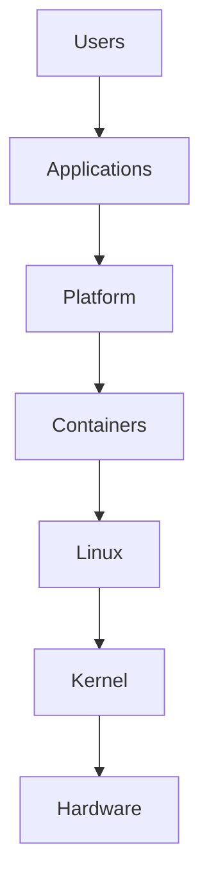

Every layer depends on lower layers.

---

# Layer 1: Hardware

Physical resources.

Examples:

```text
CPU

RAM

SSD

NIC

Power Supply
```

Hardware converts electricity into computation.

---

# Layer 2: Linux

Linux abstracts hardware complexity.

Without Linux:

Applications must directly manage hardware.

Linux manages:

```text
CPU

Memory

Disk

Network

Processes

Security
```

---

# Layer 3: Containers

Containers package applications.

Examples:

```text
Docker

containerd

CRI-O
```

Containers solve dependency conflicts.

---

# Layer 4: Platforms

Platforms orchestrate systems.

Examples:

```text
Kubernetes

OpenShift

Nomad
```

Platforms manage:

```text
Scheduling

Scaling

Networking

Recovery
```

---

# Layer 5: Applications

Business logic lives here.

Examples:

```text
Instagram

Netflix

Spotify

Amazon
```

Applications are only a tiny part of infrastructure.

---

# Infrastructure Is Resource Management

Everything eventually becomes resource management.

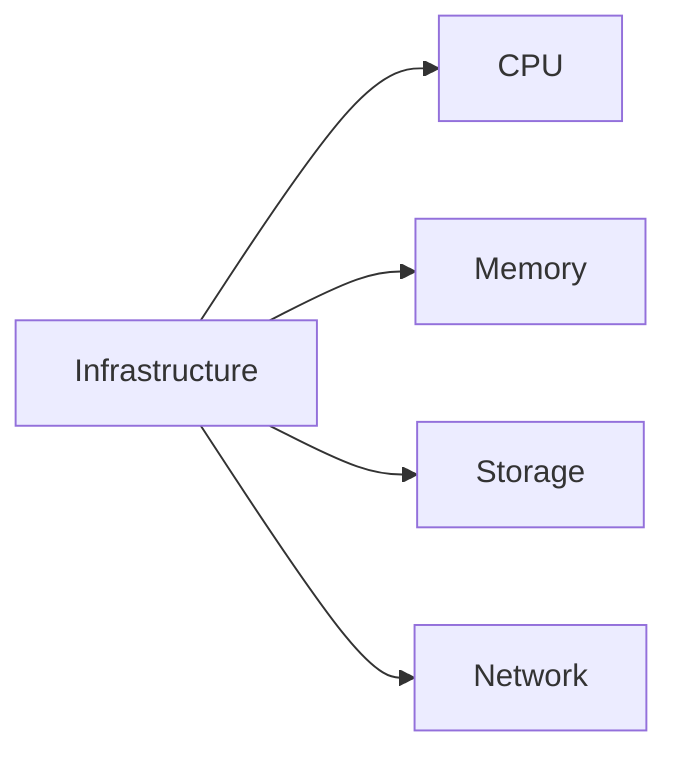

Resources are finite.

Demand is infinite.

Engineering is balancing both.

---

# The Four Infrastructure Pillars

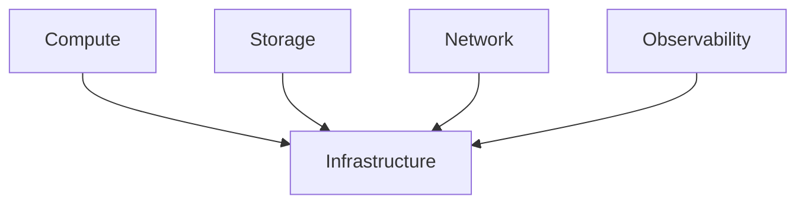

Everything belongs to these four pillars.

---

# Pillar 1: Compute

Compute is where work happens.

Examples:

```text
CPU

Threads

Processes

Containers

Virtual Machines
```

Question:

```text
Where is computation happening?
```

---

# Pillar 2: Storage

Storage remembers things.

Examples:

```text
Files

Databases

Object Storage

Backups
```

Question:

```text
Where does data live?
```

---

# Pillar 3: Network

Network moves information.

Examples:

```text
TCP

UDP

Routers

Switches

Load Balancers
```

Question:

```text
How does data move?
```

---

# Pillar 4: Observability

Observability explains behavior.

Examples:

```text
Logs

Metrics

Traces

Dashboards
```

Question:

```text
How do we understand the system?
```

---

# The Infrastructure Data Flow

Every request follows a journey.

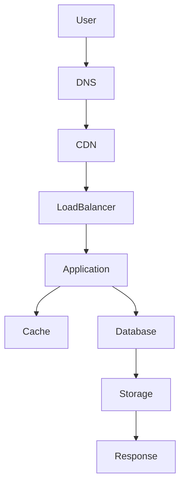

Every arrow can fail.

---

# Infrastructure Is A Dependency Graph

Nothing works independently.

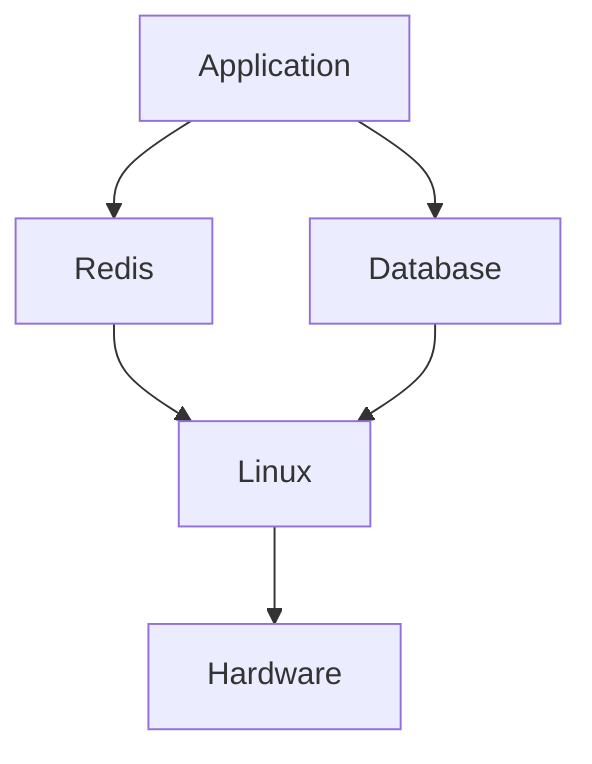

Infrastructure is interconnected.

---

# Infrastructure Thinking Questions

Whenever you build anything, ask:

```text
What infrastructure is required?

What depends on this?

What resources are consumed?

What happens if it fails?

How do we monitor it?

How do we scale it?

How do we secure it?
```

These questions create infrastructure engineers.

---

# Single Server Thinking (Wrong)

Many beginners think this way:

```text
Application

↓

Server
```

This is dangerous.

---

# Infrastructure Thinking (Correct)

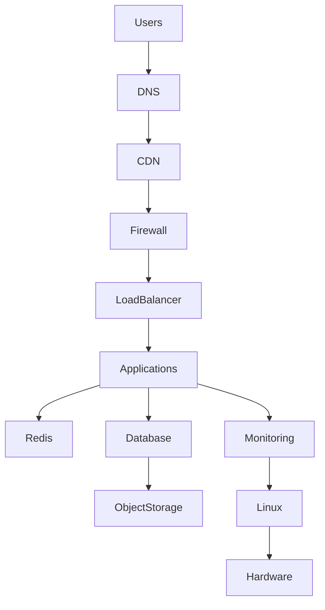

Now you're thinking like infrastructure engineers.

---

# Infrastructure Is Layered Redundancy

Never trust one component.

Bad:

```text
1 server
```

Good:

```text
3 servers

2 databases

Multiple zones

Backups
```

Infrastructure is redundancy.

---

# The Redundancy Rule

Assume failure.

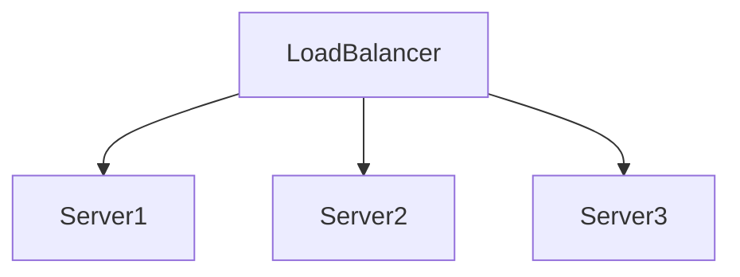

One server fails.

System survives.

---

# Infrastructure Is Automation

Manual work does not scale.

Bad:

```text
SSH

Login

Update manually
```

Good:

```text
CI/CD

Infrastructure as Code

Automation
```

Humans create mistakes.

Automation creates consistency.

---

# Infrastructure As Code (IaC)

Treat infrastructure like software.

Examples:

```text
Terraform

Ansible

Pulumi

CloudFormation
```

Instead of:

```text
Clicking buttons
```

You write code.

---

# Infrastructure Is Economics

Everything costs money.

Examples:

```text
CPU → money

RAM → money

Storage → money

Bandwidth → money

Monitoring → money
```

Infrastructure engineers optimize cost.

---

# Cost Triangle

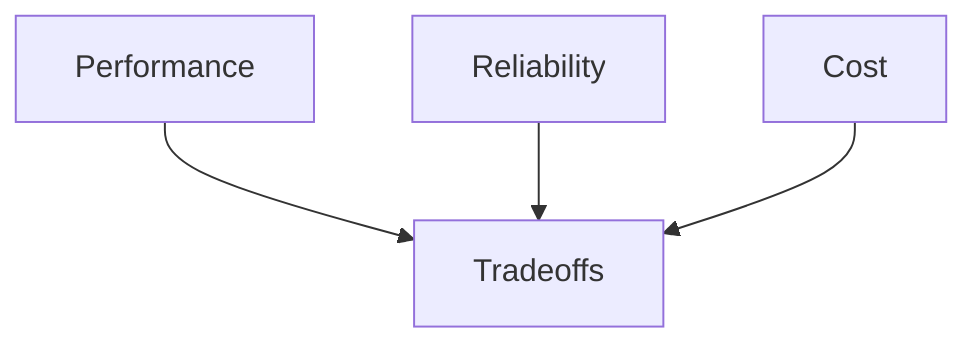

You cannot optimize everything.

---

# Infrastructure Is Capacity Planning

Question:

```text
How much traffic can we handle?
```

Examples:

```text
100 users

1000 users

10000 users

100000 users

1000000 users
```

Infrastructure must anticipate growth.

---

# Vertical Scaling

Increase server size.

```text
2 CPU → 4 CPU

8GB → 32GB RAM
```

Simple.

Limited.

---

# Horizontal Scaling

Add more machines.

```text
1 Server

↓

5 Servers

↓

20 Servers
```

Complex.

Powerful.

---

# Scaling Diagram

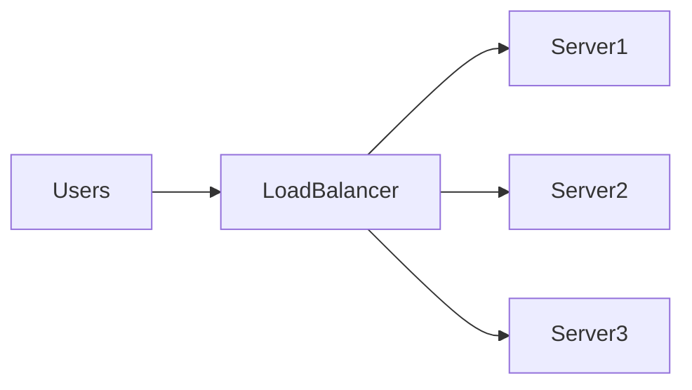

---

# Infrastructure Is Failure Engineering

Eventually these happen:

```text
Disk failures

Memory failures

Power failures

Network failures

DNS failures

Human mistakes

Cloud outages
```

Plan for all of them.

---

# Infrastructure Is Security

Every layer is an attack surface.

```text
Users

↓

DNS

↓

Network

↓

Servers

↓

Applications

↓

Databases
```

Each layer must be protected.

---

# Infrastructure Is Observability

Without observability:

You are blind.

Three pillars:

```text
Logs

Metrics

Traces
```

---

# Observability Diagram

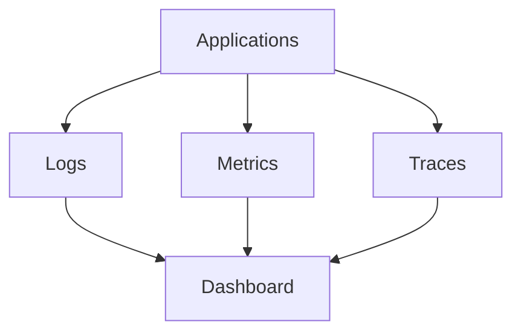

---

# Modern Infrastructure Stack

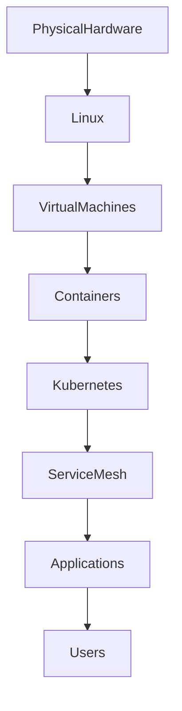

This is modern infrastructure.

---

# Cloud Is Someone Else's Infrastructure

Cloud providers simply rent infrastructure.

Examples:

```text
AWS

Azure

Google Cloud
```

Cloud does not remove complexity.

Cloud moves complexity.

---

# Beginner Mistakes

## Mistake 1

Thinking infrastructure equals servers.

---

## Mistake 2

Ignoring Linux.

---

## Mistake 3

Ignoring observability.

---

## Mistake 4

Ignoring failure scenarios.

---

## Mistake 5

Ignoring costs.

---

## Mistake 6

Doing everything manually.

---

## Mistake 7

No backups.

---

# Engineering Mindset

Infrastructure engineers think:

```text
Users

↓

Applications

↓

Dependencies

↓

Resources

↓

Failures

↓

Recovery

↓

Costs
```

Not:

```text
Application

↓

Done
```

---

# Interview Questions

### Beginner

What is infrastructure?

---

### Intermediate

What are the four infrastructure pillars?

---

### Intermediate

What is Infrastructure as Code?

---

### Advanced

Explain horizontal vs vertical scaling.

---

### Advanced

Explain infrastructure redundancy.

---

### Senior

How would you design infrastructure for one million users?

---

### Architect

How would you build highly available global infrastructure?

---

# Mind Map

```mermaid
mindmap

root((Infrastructure Thinking))

    Compute

        CPU

        Processes

        Containers

    Storage

        Databases

        Files

        Backups

    Network

        Load Balancers

        DNS

        Routers

    Observability

        Logs

        Metrics

        Traces

    Security

        Authentication

        Isolation

    Scaling

        Vertical

        Horizontal

    Automation

        CI/CD

        IaC

    Economics

        Cost Optimization
```

---

# Cheat Sheet

```text
Infrastructure = Everything required to keep software alive

Four Pillars:

Compute

Storage

Network

Observability

Always Ask:

What depends on this?

What resources are consumed?

What can fail?

How do we observe it?

How do we recover?

How do we scale it?

How much does it cost?

Golden Rule:

Infrastructure is not servers.

Infrastructure is a living system.
```

---

# Final Thought

Junior engineers build applications.

DevOps engineers automate infrastructure.

SRE engineers build reliability.

Platform engineers build ecosystems.

Architects build civilizations.

Founders build economics around those civilizations.

**Infrastructure Thinking is learning to see the invisible world that keeps software alive.**
