# Reliability Engineering

> Great engineers don't build systems that never fail.
>
> Great engineers build systems that survive failure.

---

# Why This Exists

Most beginners think engineering looks like this:

```text
Write code

↓

Deploy

↓

Done
```

Reality:

```text
Build

↓

Deploy

↓

Traffic increases

↓

Failures happen

↓

Customers complain

↓

Systems break

↓

Recover

↓

Improve

↓

Repeat forever
```

Production systems are never finished.

They are continuously operated.

That is reliability engineering.

---

# The Biggest Mindset Shift

Stop asking:

```text
How do I prevent failures?
```

Start asking:

```text
How do I survive failures?
```

Because eventually:

Everything fails.

---

# Reliability Is A Promise

Reliability answers one question:

> Can users trust this system?

Users do not care about architecture.

Users care about outcomes.

Users only care about this:

```text
Does it work when I need it?
```

---

# Mental Model: Building A Hospital

Hospitals are reliable systems.

Hospitals assume failures.

Questions hospitals ask:

```text
What if electricity fails?

What if oxygen fails?

What if one doctor is unavailable?

What if communication breaks?

What if too many patients arrive?
```

Software infrastructure should think the same way.

---

# Reliability Is Risk Management

Reliability engineering is managing risk.

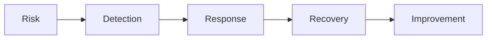

This loop never ends.

---

# The Reliability Formula

Reliability is built from five things.

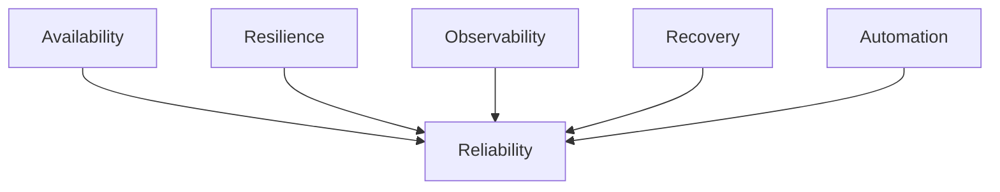

---

# Availability vs Reliability

Many beginners confuse these.

## Availability

Question:

```text
Can users access the system?
```

---

## Reliability

Question:

```text
Can users consistently trust the system?
```

---

Example:

Website works 99% of the time.

But randomly corrupts payments.

High availability.

Poor reliability.

---

# Reliability Is Predictability

Users love predictable systems.

Bad:

```text
Works today

Fails tomorrow

Works later

Fails again
```

Good:

```text
Consistent behavior
```

Predictability builds trust.

---

# The Reliability Pyramid

```text
                  Business Trust

                        ▲

                  User Experience

                        ▲

                 Applications

                        ▲

                 Infrastructure

                        ▲

                      Linux

                        ▲

                    Hardware
```

Everything eventually depends on Linux.

---

# Reliability Starts With Assumptions

Never assume success.

Always assume failure.

Assume:

```text
Servers fail

Disks fail

Memory fails

Networks fail

DNS fails

Cloud providers fail

Humans make mistakes
```

Because they do.

---

# The Golden Reliability Rule

> Failure is normal.

Failure is not an exception.

Failure is expected.

---

# The Three Reliability States

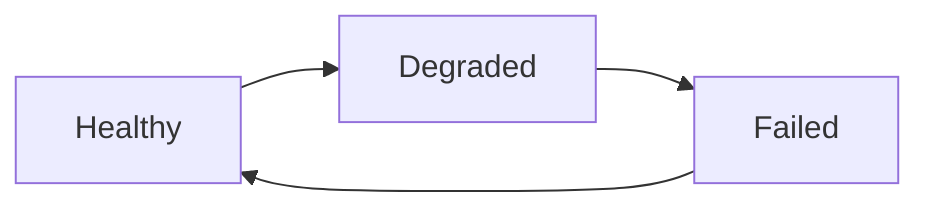

Systems constantly move between states.

---

# Healthy State

Everything works.

Example:

```text
CPU 30%

Memory 50%

Disk 40%

Network stable
```

---

# Degraded State

System still works.

Performance decreases.

Example:

```text
CPU 85%

Database slow

Latency increasing
```

---

# Failed State

Users cannot complete actions.

Example:

```text
API down

Database unavailable

Disk full
```

---

# Reliability Is Layered Defense

Never trust one component.

Bad:

```text
One server

One database

One disk
```

Good:

```text
Multiple servers

Multiple databases

Multiple zones

Backups
```

---

# Layered Defense Diagram

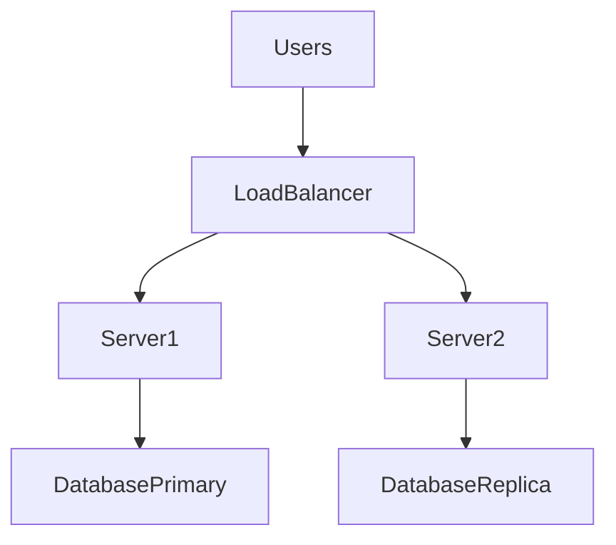

---

# Reliability Engineering Loop

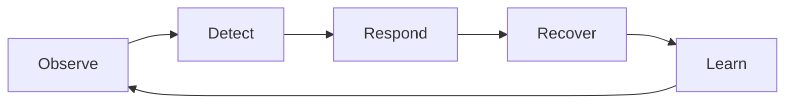

This never ends.

---

# The Four Golden Signals

Every reliability engineer watches these.

```text
Latency

Traffic

Errors

Saturation
```

---

# Latency

Question:

```text
How long does work take?
```

Examples:

```text
100ms

500ms

2s
```

---

# Traffic

Question:

```text
How much work exists?
```

Examples:

```text
100 req/s

1000 req/s

10000 req/s
```

---

# Errors

Question:

```text
How often does work fail?
```

Examples:

```text
500 errors

Timeouts

Connection failures
```

---

# Saturation

Question:

```text
How close are resources to their limits?
```

Examples:

```text
CPU 95%

Memory 90%

Disk 98%
```

Danger zones.

---

# Reliability Is Resource Management

Every system consumes resources.

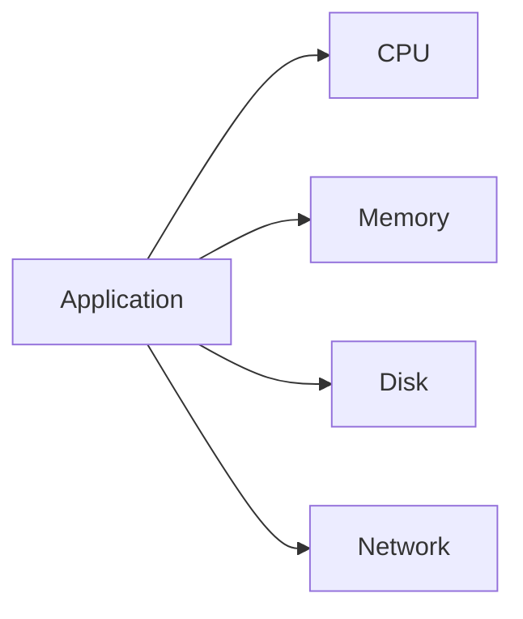

Resources are finite.

Demand is infinite.

---

# Reliability Is Bottleneck Management

Every system has bottlenecks.

Examples:

```text
CPU bottleneck

Memory bottleneck

Database bottleneck

Disk bottleneck

Network bottleneck
```

The slowest component controls everything.

---

# Cascading Failures

Most outages are chains of failures.

Example:

```text
Database slows

↓

API slows

↓

Users retry

↓

Traffic spikes

↓

CPU overload

↓

Servers crash
```

---

# Cascade Failure Diagram

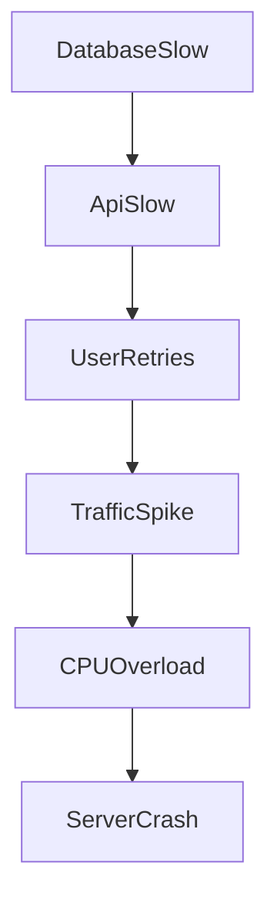

---

# Reliability Is Fast Recovery

Many beginners optimize for prevention.

Professionals optimize for recovery.

Question:

```text
How quickly can we restore service?
```

This matters more.

---

# MTTR

Mean Time To Recovery.

```text
Failure

↓

Detection

↓

Repair

↓

Recovery
```

Smaller is better.

---

# MTTD

Mean Time To Detect.

Question:

```text
How quickly can we detect problems?
```

Smaller is better.

---

# Reliability Is Observability

Without observability:

You are blind.

Three pillars:

```text
Logs

Metrics

Traces
```

---

# Observability Diagram

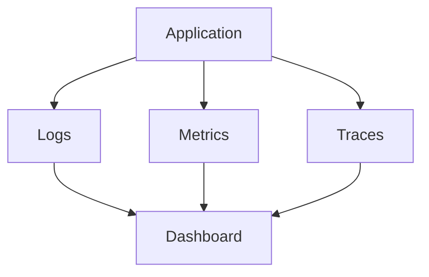

---

# Reliability Is Automation

Humans are unreliable.

Automation is predictable.

Bad:

```text
SSH manually

Restart manually

Deploy manually
```

Good:

```text
CI/CD

Auto healing

Auto scaling

Self recovery
```

Automation reduces human error.

---

# Reliability Is Redundancy

Never trust one thing.

Bad:

```text
1 server
```

Good:

```text
3 servers
```

---

# Redundancy Diagram

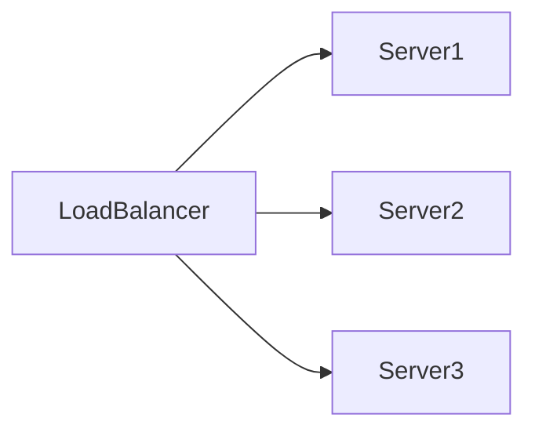

If one dies:

System survives.

---

# Reliability Is Graceful Degradation

Never let entire systems fail.

Disable non-essential features.

Example:

Bad:

```text
Recommendation service fails

↓

Entire website crashes
```

Good:

```text
Recommendation service fails

↓

Recommendations disappear

↓

Website still works
```

---

# Graceful Degradation Diagram

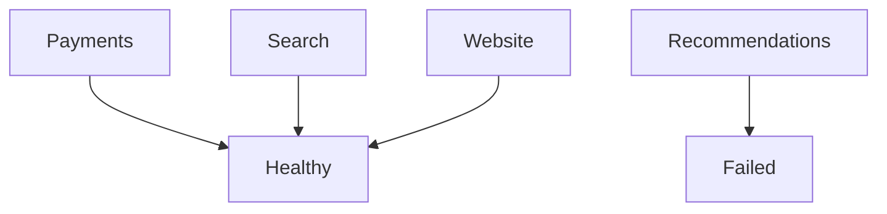

---

# Reliability Is Error Budgets

100% uptime is impossible.

We accept small failures.

Example:

```text
99.9% uptime

Allowed downtime:

43.8 minutes/month
```

That allowance is an error budget.

---

# SLI, SLO, SLA

## SLI

Measurement.

```text
Request latency
```

---

## SLO

Goal.

```text
99.9% uptime
```

---

## SLA

Business promise.

```text
Contract with customers
```

---

# Linux Reliability Thinking

Linux engineers ask:

```text
What happens if CPU is exhausted?

What happens if memory runs out?

What happens if disk fills?

What happens if networking dies?

What happens if processes hang?
```

Linux reliability is resource reliability.

---

# Reliability In Modern Systems

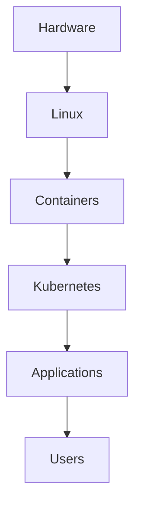

Failures can happen anywhere.

---

# Real Production Example

Imagine:

```text
10 million users

↓

Payment platform
```

Questions:

```text
What if Redis dies?

What if DB dies?

What if traffic spikes?

What if cloud region dies?

What if deployment fails?

What if certificates expire?
```

That is reliability engineering.

---

# Reliability Anti-Patterns

## Anti-pattern 1

Single server.

---

## Anti-pattern 2

No monitoring.

---

## Anti-pattern 3

No backups.

---

## Anti-pattern 4

No alerts.

---

## Anti-pattern 5

No recovery plans.

---

## Anti-pattern 6

No redundancy.

---

## Anti-pattern 7

No documentation.

---

# Engineering Mindset

Always think:

```text
System

↓

Resources

↓

Failures

↓

Detection

↓

Recovery

↓

Learning
```

Never:

```text
System

↓

Done
```

---

# Reliability Questions Engineers Ask Daily

```text
What can fail?

How can it fail?

What depends on it?

How do we detect it?

How do we recover?

How quickly can we recover?

How do we prevent repetition?
```

---

# Interview Questions

### Beginner

What is reliability engineering?

---

### Intermediate

Difference between reliability and availability?

---

### Intermediate

What are the four golden signals?

---

### Advanced

Explain cascading failures.

---

### Advanced

What is graceful degradation?

---

### Senior

How would you design a highly reliable payment system?

---

### Architect

How would you design a system that survives cloud outages?

---

# Mind Map

```mermaid
mindmap

root((Reliability Engineering))

    Availability

    Recovery

    Redundancy

    Observability

    Automation

    Resilience

    Error Budgets

    Failure Detection

    Graceful Degradation

    Capacity Planning
```

---

# Cheat Sheet

```text
Reliability = Ability to consistently deliver value

Always Ask:

What can fail?

How do we detect it?

How do we recover?

How quickly can we recover?

How do we prevent recurrence?

Golden Rules:

Everything fails.

Detect early.

Recover quickly.

Automate everything.

Observe everything.

Build redundancy.

Design for degradation.
```

---

# Final Thought

Junior engineers build features.

DevOps engineers automate deployments.

SRE engineers build reliability.

Platform engineers build ecosystems.

Architects build resilient civilizations.

**Reliability Engineering is the science of making software trustworthy in an untrustworthy world.**
