# Failure Thinking

> Failure is not an exception.
>
> Failure is the default state of reality.

---

# Why This File Exists

Most beginners think engineering looks like this:

```text
Idea

↓

Code

↓

Deploy

↓

Success
```

Reality:

```text
Idea

↓

Code

↓

Deploy

↓

Traffic

↓

Failures

↓

Fix

↓

Failures

↓

Scale

↓

Failures

↓

Improve

↓

Failures

↓

Repeat forever
```

Failure is not an event.

Failure is an environment.

Production engineering is learning how to survive inside that environment.

---

# The Biggest Mindset Shift

Stop asking:

```text
Will this fail?
```

Start asking:

```text
How will this fail?

When will this fail?

How badly will this fail?

How fast can we recover?
```

Because:

> Every system eventually fails.

---

# Failure Is A Law Of Nature

Everything eventually breaks.

Examples:

```text
Humans fail

Cars fail

Hospitals fail

Airplanes fail

Cities fail

Cloud providers fail

Linux servers fail
```

Software is no different.

---

# Mental Model: Building A Spaceship

Imagine building a spaceship.

Would engineers ask:

```text
Will something fail?
```

No.

They ask:

```text
What happens if fuel systems fail?

What happens if communication fails?

What happens if sensors fail?

What happens if computers fail?

What happens if engines fail?
```

Software infrastructure should think exactly the same way.

---

# Failure Thinking Formula

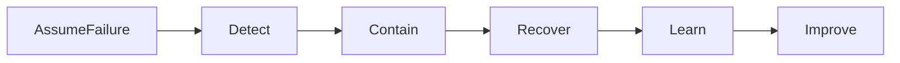

This loop never ends.

---

# Failure Is A Spectrum

Systems don't suddenly die.

They degrade.


Good engineers detect degradation early.

---

# Failure Is Usually Boring

People imagine dramatic failures.

Reality is boring.

Most outages happen because of:

```text
Misconfiguration

Human mistakes

Expired certificates

Disk full

Memory leaks

Slow databases

Bad deployments

DNS failures
```

Small things create giant disasters.

---

# The Golden Failure Rule

> Small failures become large failures.

This is called a cascade failure.

---

# Cascade Failure Example

```text
Database slow

↓

API timeout

↓

Users retry

↓

Traffic doubles

↓

CPU overload

↓

Servers crash

↓

Entire platform unavailable
```

---

# Cascade Failure Diagram

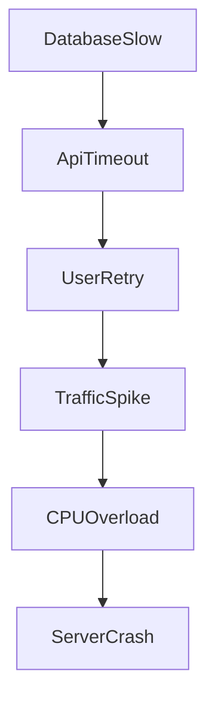

Most outages work like this.

---

# Failure Is Everywhere

Failures exist at every layer.

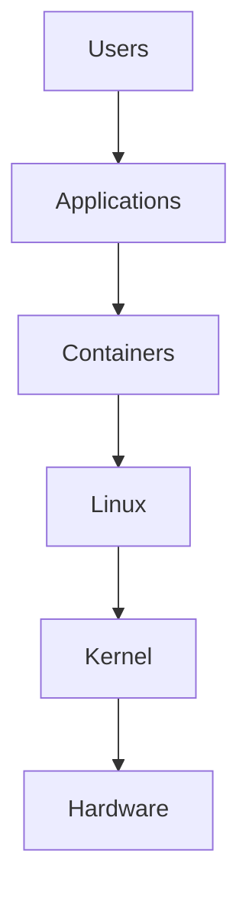

Every layer can fail.

---

# The Failure Pyramid

```text
               Business

                   ▲

               Products

                   ▲

             Applications

                   ▲

             Containers

                   ▲

                Linux

                   ▲

              Hardware
```

Higher layers depend on lower layers.

Lower layers fail first.

---

# The Seven Failure Domains

Production engineers think in failure domains.

```text
Hardware

Operating System

Network

Application

Database

Cloud

Humans
```

---

# Failure Domain 1: Hardware

Hardware eventually dies.

Examples:

```text
CPU failure

RAM corruption

SSD failure

NIC failure

Power failure
```

---

# Failure Domain 2: Linux

Linux itself can fail.

Examples:

```text
Kernel panic

OOM killer

File system corruption

Scheduler problems

Disk exhaustion
```

---

# Failure Domain 3: Network

Network failures are extremely common.

Examples:

```text
Packet loss

High latency

DNS failures

Firewall mistakes

Routing issues
```

---

# Failure Domain 4: Applications

Applications are unreliable.

Examples:

```text
Memory leaks

Infinite loops

Deadlocks

Thread starvation

Resource exhaustion
```

---

# Failure Domain 5: Databases

Databases are common bottlenecks.

Examples:

```text
Slow queries

Lock contention

Connection exhaustion

Disk saturation
```

---

# Failure Domain 6: Cloud Providers

Cloud providers fail too.

Examples:

```text
AWS outages

Azure outages

GCP outages
```

Never assume cloud means perfect.

---

# Failure Domain 7: Humans

Humans are the biggest source of outages.

Examples:

```text
Bad deployments

Deleting databases

Wrong configurations

Wrong DNS records

Removing security groups
```

---

# Human Error Diagram

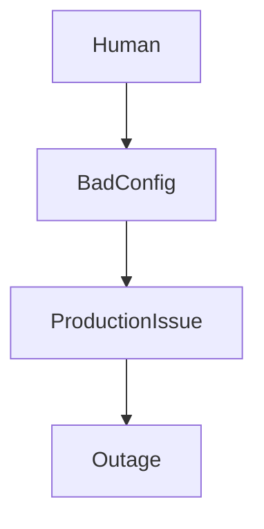

---

# Failure Thinking Starts During Design

Never design:

```text
How does this work?
```

Design:

```text
How does this break?
```

---

# Example: Payment Service

Bad thinking:

```text
User

↓

Payment API

↓

Database
```

Good thinking:

```text
What if Payment API crashes?

What if Database crashes?

What if Redis dies?

What if traffic spikes?

What if certificates expire?
```

---

# The Five Failure Questions

Always ask:

```text
What can fail?

How can it fail?

Who depends on it?

How can we detect it?

How can we recover?
```

Memorize these.

---

# The Blast Radius Concept

Question:

> How much damage can one failure cause?

Bad:

```text
One DB failure

↓

Entire company down
```

Good:

```text
One DB failure

↓

One service affected
```

Small blast radius.

---

# Blast Radius Diagram

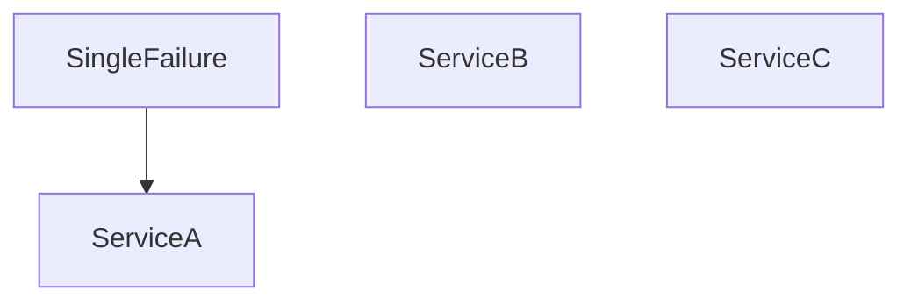

Good systems isolate failures.

---

# Isolation Is Survival

Never allow failures to spread.

Isolation examples:

```text
Containers

Namespaces

Cgroups

Availability Zones

Rate Limiters

Circuit Breakers
```

Isolation is a survival mechanism.

---

# Circuit Breakers

Stop systems from self-destructing.

Without circuit breaker:

```text
Database slow

↓

Infinite retries

↓

CPU overload

↓

Crash
```

With circuit breaker:

```text
Database slow

↓

Reject requests

↓

Protect system
```

---

# Circuit Breaker Diagram

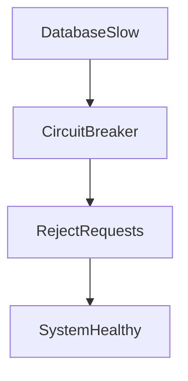

---

# Graceful Degradation

Never fail everything.

Disable optional features.

Bad:

```text
Recommendations fail

↓

Entire website crashes
```

Good:

```text
Recommendations fail

↓

Recommendations disappear

↓

Website works
```

---

# Graceful Degradation Diagram

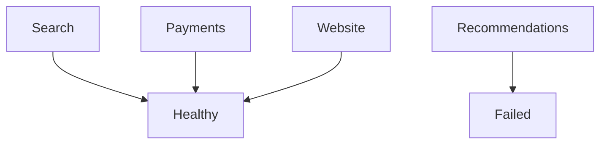

---

# Failure Is Resource Exhaustion

Many outages are resource problems.

Resources:

```text
CPU

Memory

Disk

Network

File Descriptors

Connections

Threads
```

Everything is finite.

---

# Resource Exhaustion Diagram

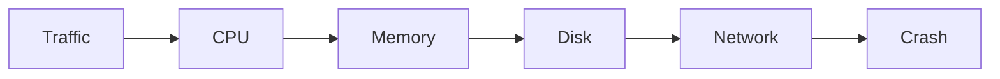

---

# Failure Is Queue Growth

This is an advanced realization.

Everything is a queue.

Examples:

```text
CPU Scheduler

Disk Queue

Database Connections

Kafka

RabbitMQ

Nginx Workers
```

Outages often start here.

---

# Queue Failure Diagram

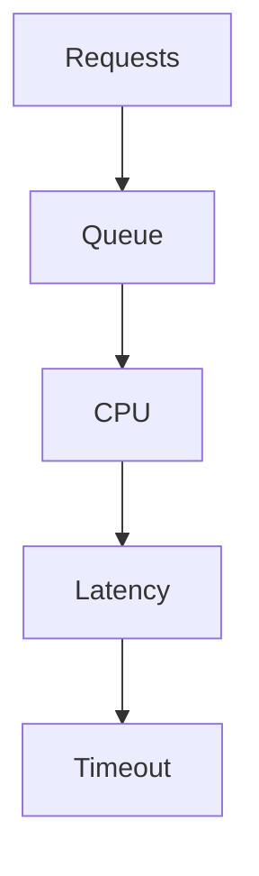

---

# Failure Is Feedback Loops

Feedback loops amplify disasters.

Example:

```text
Users retry

↓

Traffic doubles

↓

Latency increases

↓

More retries

↓

More traffic
```

---

# Retry Storm Diagram

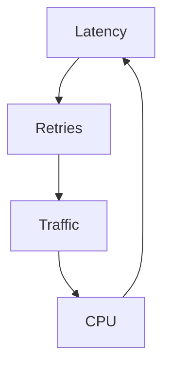

---

# Observability Saves Systems

Without observability:

You are blind.

Three pillars:

```text
Logs

Metrics

Traces
```

---

# Observability Diagram

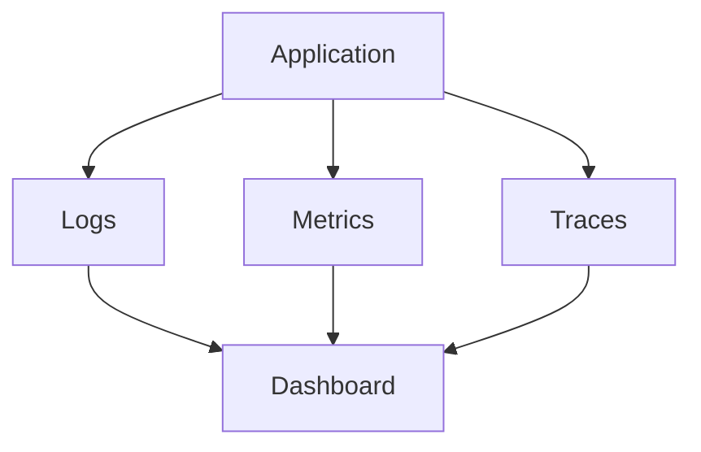

---

# Failure Recovery Hierarchy

Priority order:

```text
1. Detect

2. Contain

3. Recover

4. Analyze

5. Improve
```

Do not reverse this.

---

# Postmortem Thinking

After every failure ask:

```text
What happened?

Why did it happen?

What detected it?

What slowed recovery?

How do we prevent repetition?
```

Never blame humans.

Fix systems.

---

# Root Cause Analysis

Bad:

```text
Engineer mistake
```

Good:

```text
Why was the mistake possible?
```

Five Whys example:

```text
Server crashed

↓

Disk full

↓

Logs grew infinitely

↓

No rotation

↓

No monitoring
```

Real root cause:

No monitoring.

---

# Linux Failure Thinking

Linux engineers ask:

```text
What happens if CPU reaches 100%?

What happens if memory reaches 100%?

What happens if disk becomes full?

What happens if network disappears?

What happens if processes hang?
```

Linux engineering is failure engineering.

---

# Chaos Engineering

Chaos engineering intentionally creates failures.

Purpose:

```text
Find weaknesses before customers do.
```

Examples:

```text
Kill servers

Kill containers

Add latency

Disconnect networks

Simulate outages
```

---

# Chaos Engineering Diagram

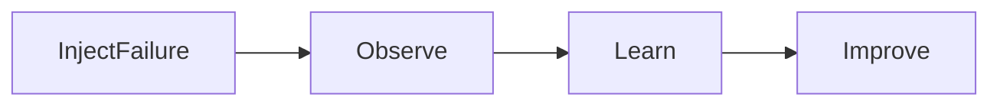

---

# Common Beginner Mistakes

## Mistake 1

Assuming systems won't fail.

---

## Mistake 2

Ignoring dependencies.

---

## Mistake 3

No monitoring.

---

## Mistake 4

No backups.

---

## Mistake 5

No redundancy.

---

## Mistake 6

No recovery plans.

---

## Mistake 7

Single points of failure.

---

# Engineering Mindset

Elite engineers think:

```text
Failure

↓

Detection

↓

Isolation

↓

Recovery

↓

Learning
```

Not:

```text
Failure

↓

Panic
```

---

# Interview Questions

### Beginner

What is failure thinking?

---

### Intermediate

What is a cascade failure?

---

### Intermediate

What is blast radius?

---

### Advanced

Explain graceful degradation.

---

### Advanced

Explain retry storms.

---

### Senior

How would you design a system that survives failures?

---

### Architect

How would you minimize blast radius across global infrastructure?

---

# Mind Map

```mermaid
mindmap

root((Failure Thinking))

    Failure Domains

        Hardware

        Linux

        Network

        Applications

        Databases

        Cloud

        Humans

    Reliability

        Detection

        Recovery

        Isolation

    Observability

        Logs

        Metrics

        Traces

    Resilience

        Redundancy

        Graceful Degradation

    Chaos Engineering

        Fault Injection

        Learning

    Postmortems

        Root Cause Analysis
```

---

# Cheat Sheet

```text
Failure Thinking = Designing systems that survive reality

Golden Rules:

Everything fails.

Everything degrades.

Everything has dependencies.

Everything eventually bottlenecks.

Everything needs observability.

Everything needs recovery.

Always Ask:

What can fail?

How can it fail?

Who depends on it?

How do we detect it?

How do we recover?

How do we prevent recurrence?
```

---

# Final Thought

Junior engineers build features.

Senior engineers build systems.

SRE engineers build reliability.

Architects build resilience.

Elite engineers study failure.

Because:

> Success teaches you what worked once.

> Failure teaches you how reality actually works.
