# Process Tree Internals

> Linux is not a file system with commands.
>
> Linux is a giant machine whose primary job is to create, manage, schedule, isolate, and destroy processes.

---

# Why This Exists

Most beginners think Linux runs applications.

This is not entirely true.

Linux runs processes.

Everything is a process.

Examples:

```text
Chrome

VSCode

Nginx

Docker

Redis

PostgreSQL

Kubernetes

SSH

Systemd
```

Everything eventually becomes a process.

If Linux cannot manage processes, Linux cannot exist.

---

# The Biggest Mindset Shift

Stop thinking:

```text
Application
```

Think:

```text
Processes

↓

Resources

↓

Scheduling

↓

Execution
```

Applications are collections of processes.

---

# Mental Model: Linux Is A City

Imagine Linux as an entire city.

```text
Kernel = Government

Processes = Citizens

CPU = Workers

Memory = Buildings

Network = Roads

Storage = Warehouses

Scheduler = Traffic Police
```

Linux is constantly coordinating millions of activities.

---

# What Is A Process?

A process is:

> A running instance of a program with its own resources and execution context.

Program:

```text
Stored instructions
```

Process:

```text
Executing instructions
```

Example:

```text
nginx (binary)

↓

Execute nginx

↓

nginx process
```

---

# Program vs Process

```text
Program

Static

Passive

Stored on disk

↓

Process

Dynamic

Active

Stored in memory
```

---

# The Linux Process Tree

Every process belongs to a tree.

There are no independent processes.

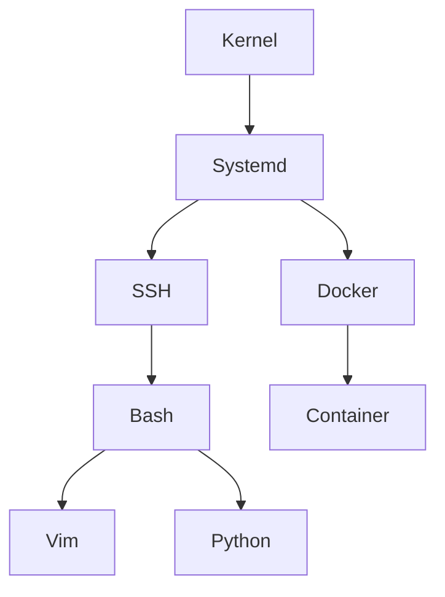

Every process has ancestors.

---

# PID 1: The Most Important Process

After booting:

```text
BIOS

↓

Bootloader

↓

Kernel

↓

PID 1
```

PID 1 is special.

Modern Linux:

```text
systemd
```

Older systems:

```text
init
```

PID 1 is the parent of the entire system.

---

# Boot Process Diagram

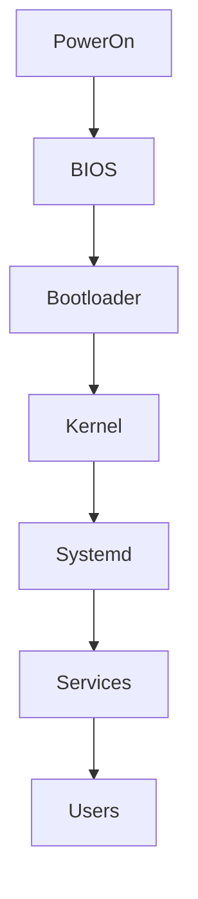

---

# Every Process Has Metadata

The Linux kernel stores information in:

```c
task_struct
```

This is one of Linux's most important structures.

It contains:

```text
PID

PPID

UID

GID

Memory Info

CPU Info

Scheduling Info

State

File Descriptors

Namespaces

Cgroups

Signals
```

Everything Linux knows about a process lives here.

---

# Simplified task_struct

```text
task_struct

├── PID

├── Parent PID

├── State

├── Priority

├── Memory Mapping

├── Open Files

├── Credentials

├── Scheduling Info

├── Namespace Info

├── Cgroup Info
```

---

# How A Process Is Created

Linux primarily uses:

```c
fork()

exec()
```

This is fundamental.

---

# Step 1: fork()

Creates a child process.

```text
Parent

↓

Copy process
```

---

# Step 2: exec()

Replace child memory with another program.

---

# Process Creation Diagram

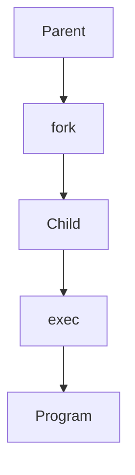

---

# Example

Shell executes:

```bash
python app.py
```

Sequence:

```text
bash

↓

fork()

↓

child process

↓

exec()

↓

python interpreter

↓

app.py
```

---

# Parent Child Relationships

Every process has:

```text
PID

PPID
```

PID:

```text
Process ID
```

PPID:

```text
Parent Process ID
```

Example:

```text
systemd (1)

↓

sshd (890)

↓

bash (1400)

↓

python (1800)
```

---

# Process Tree Example

```text
systemd (1)

├── sshd (100)

│

├── bash (200)

│

├── python (300)

│

└── vim (400)

│

└── docker (500)

│

└── container process (600)
```

---

# Process States

Processes constantly change state.

States:

```text
R = Running

S = Sleeping

D = Uninterruptible Sleep

T = Stopped

Z = Zombie
```

---

# State Transition Diagram

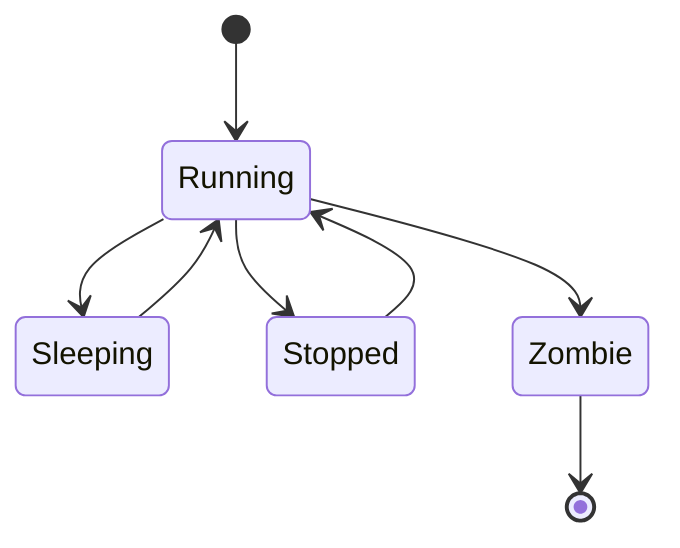

---

# Running State

```text
Currently executing
```

or

```text
Waiting for CPU
```

---

# Sleeping State

Waiting for something.

Examples:

```text
Disk I/O

Network

User Input
```

Most processes are sleeping.

---

# Zombie Processes

A zombie is:

> A finished process whose parent hasn't collected its exit status.

Example:

```text
Child exits

↓

Parent ignores it

↓

Zombie remains
```

---

# Zombie Diagram

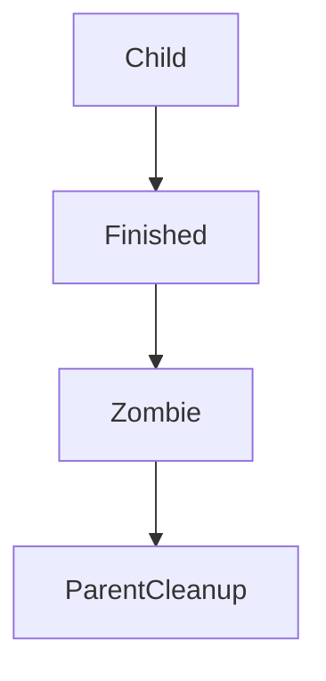

---

# Orphan Processes

If parent dies:

```text
Parent

↓

Dies

↓

Child survives

↓

systemd adopts child
```

---

# Orphan Diagram

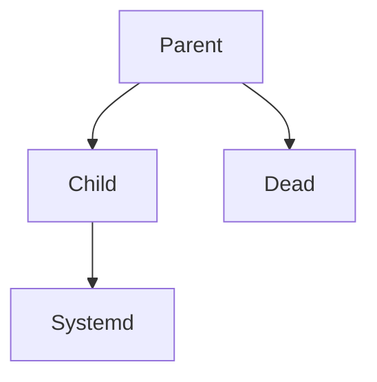

PID 1 adopts orphans.

---

# Process Scheduling

CPU is limited.

Thousands of processes compete.

The scheduler decides:

```text
Who runs?

When?

How long?
```

---

# Scheduler Diagram

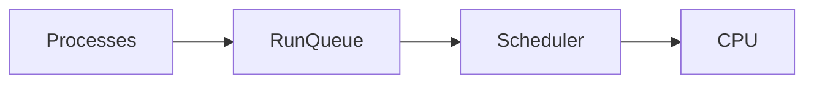

---

# Linux Scheduler Goal

Optimize:

```text
Fairness

Responsiveness

Throughput
```

These often conflict.

Tradeoffs exist.

---

# CPU Time Slice

Processes don't own CPUs.

They borrow CPUs.

```text
Process A

↓

5ms

↓

Process B

↓

5ms

↓

Process C
```

Rapid switching creates concurrency.

---

# Context Switching

CPU switches between processes.

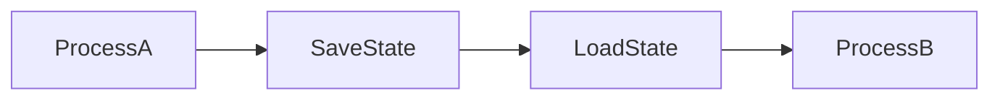

Context switching is expensive.

---

# What Is Saved?

Linux saves:

```text
Registers

Program Counter

Stack Pointer

Memory Info
```

Then restores another process.

---

# Process Memory Layout

Each process has memory.

```text
High Address

+---------------+

Stack

+---------------+

Heap

+---------------+

Data

+---------------+

Text

+---------------+

Low Address
```

---

# Text Segment

Contains code.

---

# Data Segment

Contains initialized variables.

---

# Heap

Dynamic memory.

```c
malloc()
```

---

# Stack

Function calls.

Local variables.

---

# Process Isolation

Processes cannot directly access each other.

Kernel enforces isolation.

Each process gets:

```text
Memory space

PID

Resources

Security boundaries
```

---

# Isolation Diagram

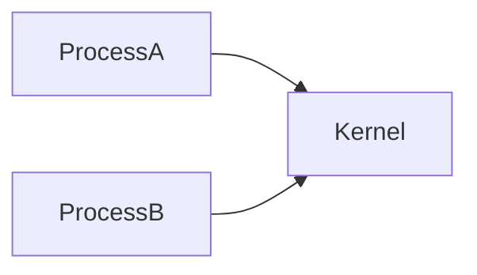

Processes communicate through the kernel.

---

# Process Communication (IPC)

Processes communicate using:

```text
Pipes

Sockets

Shared Memory

Signals

Message Queues
```

---

# IPC Diagram

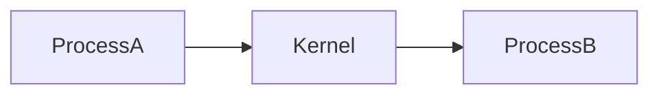

---

# Linux And Containers

Containers are not VMs.

Containers are processes.

Docker container:

```bash
docker run nginx
```

Creates:

```text
Linux process

+

Namespaces

+

Cgroups
```

That's it.

---

# Docker Internals

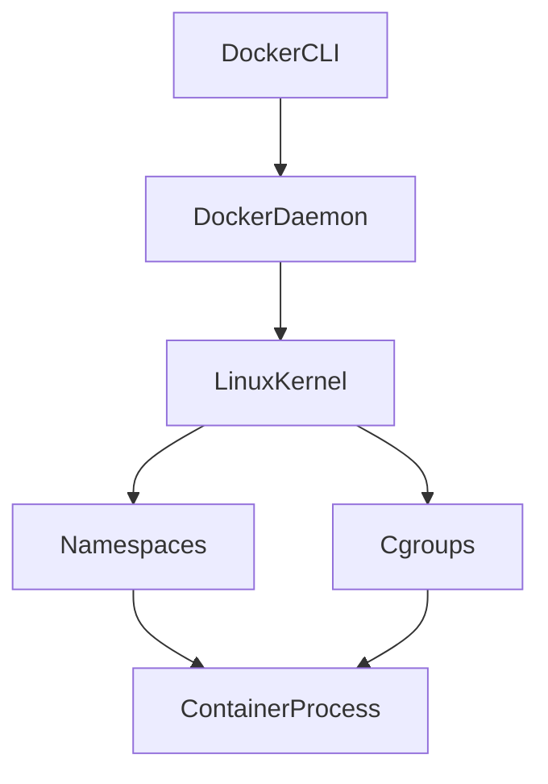

Containers are isolated processes.

---

# Kubernetes Connection

Kubernetes orchestrates processes.

```text
Pod

↓

Container

↓

Process

↓

Linux
```

Eventually:

Everything becomes Linux processes.

---

# Production Debugging Flow

System slow?

Think like this:

```text
Users complain

↓

Find slow service

↓

Find process

↓

Find resource bottleneck

↓

Fix issue
```

---

# Production Investigation Flow

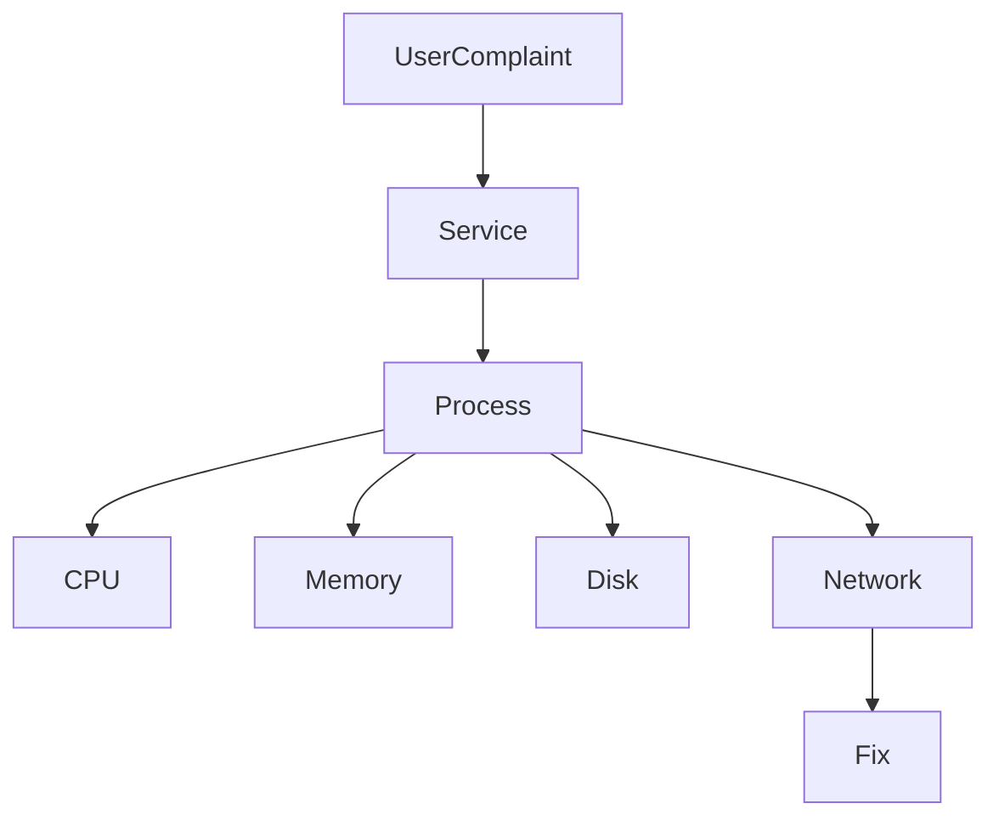

---

# Production Problems

## CPU Exhaustion

Symptoms:

```bash
top
htop
```

Observe:

```text
100% CPU
```

---

## Memory Leaks

Symptoms:

```text
Growing RAM usage
```

---

## Zombie Processes

Symptoms:

```text
Accumulating zombies
```

---

## File Descriptor Exhaustion

Symptoms:

```text
Too many open files
```

---

## Fork Bombs

Extremely dangerous.

Example:

```bash
:(){ :|:& };:
```

Creates infinite processes.

Do not execute.

---

# Process Bottlenecks

```text
CPU

Memory

Disk

Network

File Descriptors

Locks
```

Every system eventually bottlenecks.

---

# Observability Commands

```bash
ps aux

pstree

top

htop

pidstat

pgrep

lsof

strace
```

---

# Security Implications

Processes run with permissions.

Every process has:

```text
UID

GID

Capabilities
```

Never run everything as root.

---

# Engineering Mindset

Don't think:

```text
Application
```

Think:

```text
Application

↓

Processes

↓

Threads

↓

CPU

↓

Memory

↓

Linux
```

---

# Common Beginner Mistakes

## Mistake 1

Thinking applications are independent.

---

## Mistake 2

Ignoring PID 1.

---

## Mistake 3

Ignoring process states.

---

## Mistake 4

Ignoring zombies.

---

## Mistake 5

Ignoring resource usage.

---

## Mistake 6

Ignoring context switching.

---

# Interview Questions

### Beginner

What is a process?

---

### Intermediate

Difference between program and process?

---

### Intermediate

What are fork() and exec()?

---

### Advanced

Explain zombie and orphan processes.

---

### Advanced

Explain task_struct.

---

### Senior

How does Linux create containers?

---

### Architect

Explain how every modern cloud system eventually becomes Linux processes.

---

# Mind Map

```mermaid
mindmap

root((Process Tree Internals))

Processes

Program vs Process

PID

PPID

Fork

Exec

Task Struct

Scheduler

Context Switching

Memory Layout

States

Zombie

Orphan

Containers

Namespaces

Cgroups

Kubernetes

Production Debugging
```

---

# Cheat Sheet

```text
Program = Static Code

Process = Running Program

Linux = Process Manager

Important:

PID 1 = systemd

fork() = Create child

exec() = Replace program

task_struct = Process metadata

Everything eventually becomes processes.

Containers = Isolated processes.

Kubernetes = Process orchestrator.
```

---

# Golden Rules

```text
Everything is a process.

Every process consumes resources.

Every process has a lifecycle.

Every process can fail.

Every process is scheduled.

Every container is a process.

Every cloud eventually becomes Linux.
```

---

# Final Thought

Linux is not running applications.

Linux is continuously answering one question:

> Out of millions of competing processes, who gets to execute next?

That single question powers the entire modern world.

