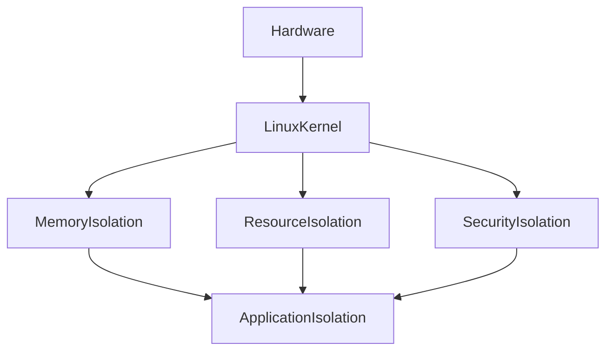
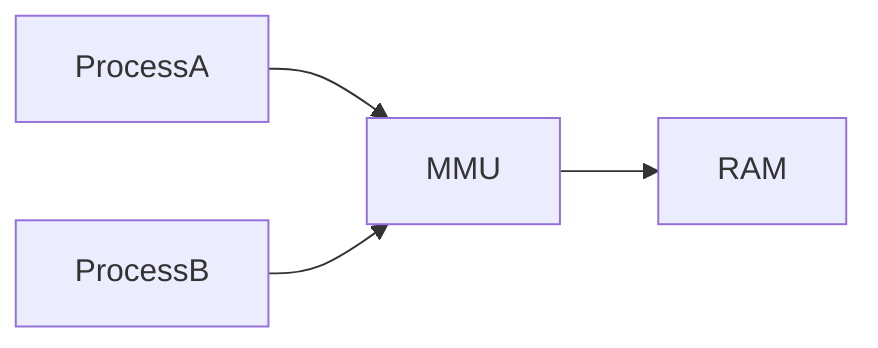
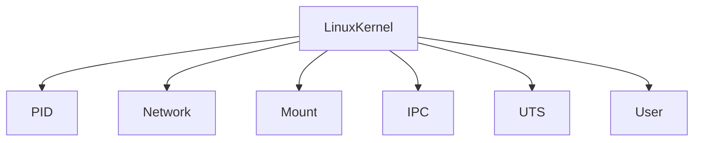
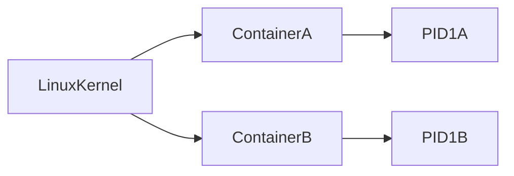
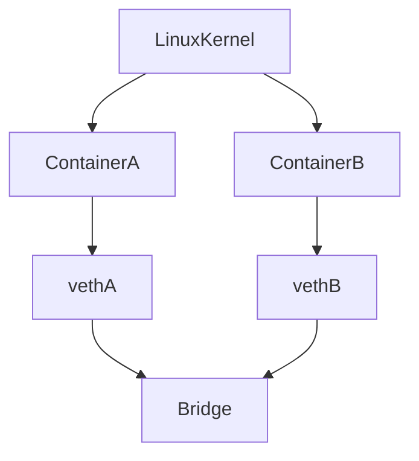
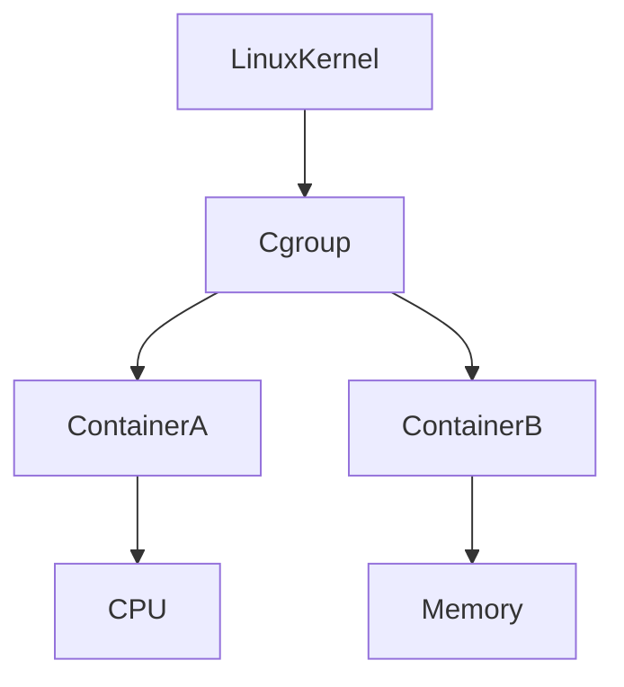
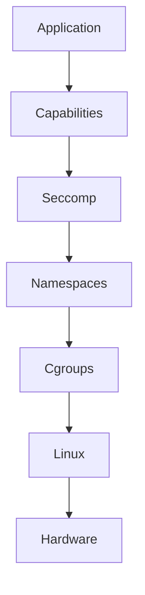
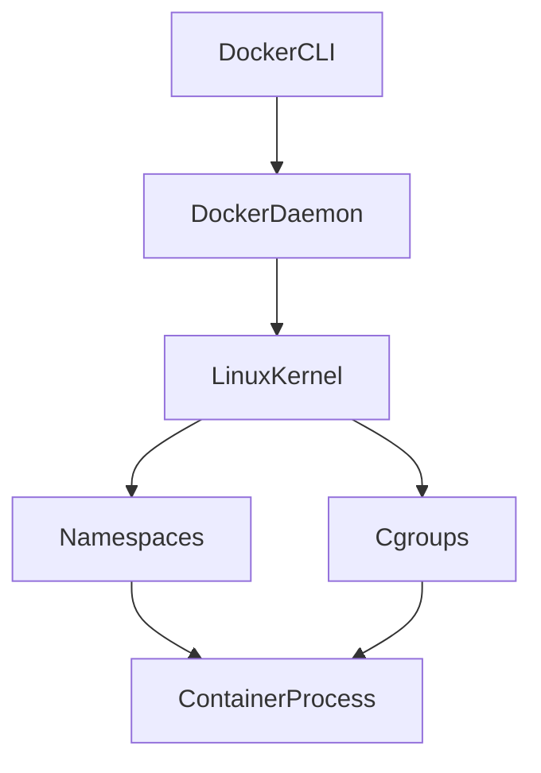
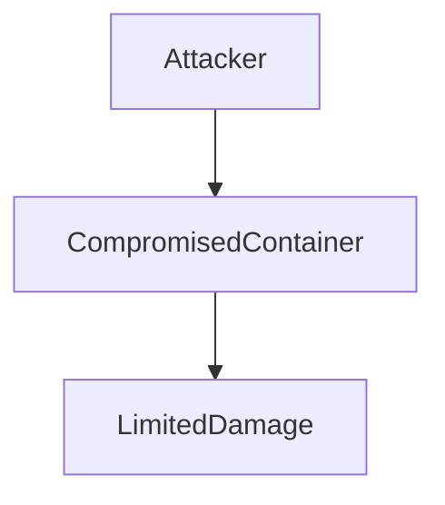

# Process Isolation

> Modern infrastructure exists because Linux learned how to safely separate processes from each other.

---

# Why This Exists

Imagine there was no isolation.

You open Chrome.

Your banking application runs.

Docker runs.

PostgreSQL runs.

Redis runs.

Nginx runs.

Without isolation:

```text
Everything could access everything.
```

Chaos.

One bad process could destroy the entire system.

Process isolation exists to answer one question:

> How can thousands or millions of processes safely coexist on one machine?

---

# The Biggest Mindset Shift

Stop thinking:

```text
Processes run independently.
```

Think:

```text
Processes compete for shared resources.

Processes must be isolated.

Processes must be controlled.

Processes must be secured.
```

Linux exists to enforce those rules.

---

# Mental Model: Linux Is A Massive Apartment Building

Imagine Linux as a skyscraper.

```text
Linux Kernel = Building Management

Processes = Apartments

CPU = Electricity

Memory = Rooms

Storage = Storage Lockers

Network = Hallways

Scheduler = Elevator Controller

Namespaces = Apartment Walls

Cgroups = Utility Meters

Security Policies = Security Guards
```

Everybody lives in one building.

Nobody should enter someone else's apartment.

---

# What Is Process Isolation?

Process isolation means:

> Preventing processes from interfering with each other.

Each process gets boundaries.

Boundaries include:

```text
Memory

CPU access

File systems

Users

Network visibility

Devices

Permissions

Resources
```

---

# Why Isolation Is Necessary

Without isolation:

```text
One process reads another process memory

One process kills another process

One process consumes all RAM

One process uses all CPU

One process fills the disk

One process opens infinite files
```

Entire system collapses.

---

# The Isolation Pyramid

```text
               Applications

                     ▲

                Containers

                     ▲

                 Processes

                     ▲

                   Linux

                     ▲

                  Hardware
```

Linux sits between applications and hardware.

Linux enforces isolation.

---

# Linux Isolation Layers



Multiple isolation layers work together.

---

# The Five Major Isolation Systems

Linux uses:

```text
Memory Isolation

User Isolation

Namespace Isolation

Cgroup Isolation

Security Isolation
```

Together they create safe environments.

---

# Isolation Layer 1: Memory Isolation

This is the oldest isolation mechanism.

Every process gets:

```text
Virtual Memory Space
```

Example:

```text
Process A → 0x0000

Process B → 0x0000
```

Looks identical.

Actually different.

---

# Virtual Memory Diagram

```text
Process A

0x0000

↓

Virtual Space

↓

Physical RAM

--------------------------------

Process B

0x0000

↓

Virtual Space

↓

Physical RAM
```

Processes cannot directly access each other.

---

# Memory Isolation Diagram



MMU:

```text
Memory Management Unit
```

This hardware helps Linux enforce isolation.

---

# Isolation Layer 2: User Isolation

Every process has identity.

Examples:

```text
UID

GID

Capabilities
```

Example:

```text
nginx

↓

www-data

↓

Limited access
```

Not:

```text
root
```

---

# Why Root Is Dangerous

Root can access everything.

```text
Files

Processes

Network

Kernel interfaces
```

Production systems avoid excessive root usage.

---

# Isolation Layer 3: Namespace Isolation

Namespaces are revolutionary.

Namespaces answer:

> What should a process be allowed to see?

Namespaces create illusions.

---

# Namespace Mental Model

Imagine VR headsets.

Everybody sees a different world.

Reality:

```text
One machine
```

Perception:

```text
Different machines
```

Containers work exactly this way.

---

# Linux Namespace Types

```text
PID Namespace

Mount Namespace

Network Namespace

User Namespace

UTS Namespace

IPC Namespace

Cgroup Namespace

Time Namespace
```

---

# Namespace Diagram



---

# PID Namespace

Controls visible processes.

Without namespace:

```bash
ps aux
```

See everything.

With namespace:

```text
Container A

PID 1

PID 2

PID 3
```

Container B:

```text
PID 1

PID 2
```

Different worlds.

---

# PID Namespace Diagram



Both can have PID 1.

---

# Network Namespace

Creates separate networks.

Each container gets:

```text
IP address

Interfaces

Routing tables

Ports
```

---

# Network Namespace Diagram



---

# Mount Namespace

Controls visible file systems.

Container A sees:

```text
/app

/etc

/usr
```

Container B sees:

```text
/database

/config

/data
```

Different worlds.

---

# UTS Namespace

Controls:

```text
Hostname

Domain name
```

Containers can believe they are independent machines.

---

# IPC Namespace

Controls communication resources.

Examples:

```text
Shared memory

Message queues

Semaphores
```

---

# User Namespace

Maps users.

Container root:

```text
UID 0
```

Host reality:

```text
UID 1000
```

Huge security improvement.

---

# Isolation Layer 4: Cgroups

Namespaces control visibility.

Cgroups control resources.

Question:

> How much can a process consume?

---

# Cgroup Controls

```text
CPU

Memory

Disk I/O

Network

Processes
```

---

# Cgroup Diagram



---

# Example

Without limits:

```text
Container A

100% CPU

Consumes all RAM
```

Everything crashes.

With cgroups:

```text
Container A

2 CPUs

2GB RAM
```

Controlled.

---

# Isolation Layer 5: Security Isolation

Linux security systems:

```text
Capabilities

SELinux

AppArmor

Seccomp
```

These restrict dangerous actions.

---

# Linux Capabilities

Instead of giving full root:

Give tiny permissions.

Examples:

```text
CAP_NET_ADMIN

CAP_SYS_ADMIN

CAP_SYS_TIME
```

Principle:

> Minimum privilege.

---

# Seccomp

Filters system calls.

Question:

> Which kernel functions may this process execute?

Example:

Allow:

```text
read()

write()

open()
```

Block:

```text
mount()

reboot()
```

---

# Seccomp Diagram


Security filter.

---

# Isolation Is A Stack



Modern infrastructure works like this.

---

# Containers Are Just Isolated Processes

This is one of the most important realizations.

Docker does NOT create virtual machines.

Docker creates:

```text
Processes

+

Namespaces

+

Cgroups
```

That's all.

---

# Docker Internals



---

# Kubernetes Is A Process Orchestrator

Kubernetes manages:

```text
Pods

↓

Containers

↓

Processes

↓

Linux
```

Everything eventually becomes Linux processes.

---

# Production Isolation Example

Imagine:

```text
Nginx

Redis

PostgreSQL

NodeJS

Prometheus
```

All running on one machine.

Isolation prevents:

```text
Redis from consuming all RAM

NodeJS from killing PostgreSQL

Nginx from seeing secrets

Applications from interfering
```

---

# Production Failure Scenario

Without isolation:

```text
Memory leak

↓

RAM exhausted

↓

OOM

↓

Everything dies
```

With isolation:

```text
Memory leak

↓

Container dies

↓

Everything else survives
```

Huge difference.

---

# Isolation And Cloud Computing

Cloud computing exists because of isolation.

Providers run:

```text
Millions of customers

On shared hardware
```

Isolation makes this possible.

Examples:

```text
AWS

Azure

GCP
```

Without isolation:

Cloud computing cannot exist.

---

# Isolation And Security

Every process is an attack surface.

Isolation reduces damage.

Question:

> If this process is hacked, how much damage can it cause?

This is called:

```text
Blast Radius
```

Smaller blast radius is better.

---

# Blast Radius Diagram



---

# Observability Of Isolation

Tools:

```bash
ps

pstree

top

htop

nsenter

unshare

lsns

systemd-cgls

cat /proc
```

Observe everything.

---

# Troubleshooting Checklist

Question:

> Why is this process failing?

Check:

```text
PID

Namespace

Memory

CPU

Permissions

Open files

Security policies

Logs
```

---

# Common Beginner Mistakes

## Mistake 1

Thinking containers are VMs.

---

## Mistake 2

Running everything as root.

---

## Mistake 3

No resource limits.

---

## Mistake 4

Ignoring namespaces.

---

## Mistake 5

Ignoring cgroups.

---

## Mistake 6

Ignoring blast radius.

---

# Engineering Mindset

Do not think:

```text
Application
```

Think:

```text
Application

↓

Process

↓

Isolation

↓

Resources

↓

Linux

↓

Hardware
```

---

# Interview Questions

### Beginner

Why is process isolation necessary?

---

### Intermediate

How does Linux isolate memory?

---

### Intermediate

Difference between namespaces and cgroups?

---

### Advanced

How do containers work internally?

---

### Advanced

Explain PID namespaces.

---

### Senior

How does Kubernetes use Linux isolation?

---

### Architect

How does Linux isolation make cloud computing possible?

---

# Mind Map

```mermaid
mindmap

root((Process Isolation))

Memory Isolation

Namespaces

Cgroups

Security

Containers

Docker

Kubernetes

Cloud

Blast Radius

Observability

Production Systems
```

---

# Cheat Sheet

```text
Process Isolation = Prevent processes from interfering

Five Isolation Systems:

1. Memory Isolation

2. User Isolation

3. Namespaces

4. Cgroups

5. Security Policies

Containers = Processes + Namespaces + Cgroups

Golden Rule:

Isolation creates security.

Isolation creates stability.

Isolation creates cloud computing.
```

---

# Golden Rules

```text
Everything is a process.

Every process must be isolated.

Every process consumes resources.

Every process is an attack surface.

Every container is a process.

Cloud computing exists because of isolation.
```

---

# Final Thought

Modern civilization depends on one giant illusion.

Millions of applications believe:

> I have my own machine.

Reality:

> They are isolated Linux processes sharing the same hardware.

That illusion powers Docker, Kubernetes, AWS, and modern cloud computing.
