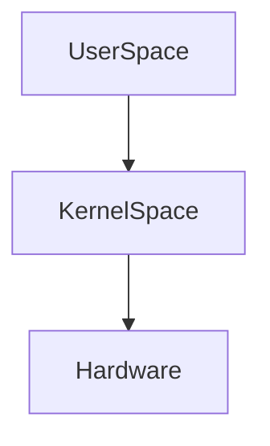
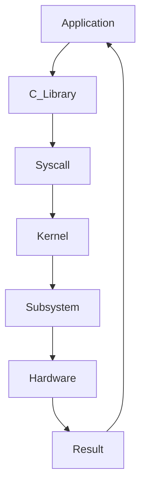
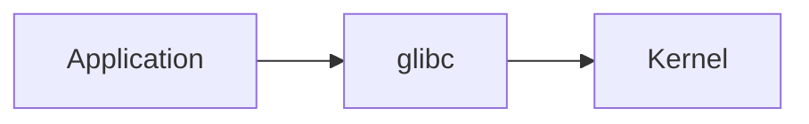
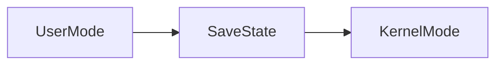
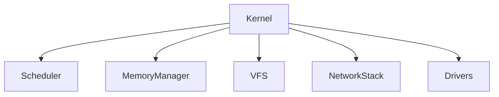
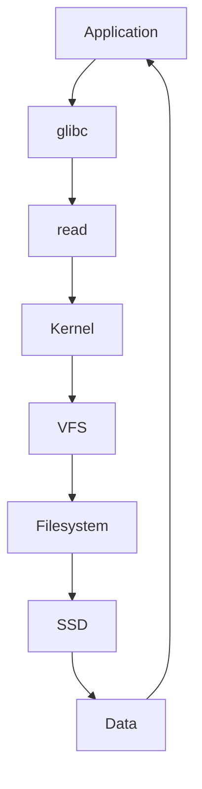
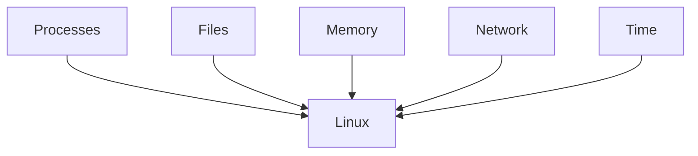
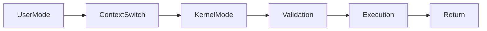

# System Call Lifecycle

> Modern civilization is a giant collection of applications asking Linux for permission to do work.

---

# Why This Exists

Applications cannot directly access hardware.

Imagine if they could.

Your browser could:

```text
Read all memory

Delete all files

Reboot the machine

Access every process

Control hardware
```

Chaos.

Linux exists to control access.

Applications must ask Linux for permission.

That permission mechanism is called a:

> System Call (syscall)

---

# The Biggest Mindset Shift

Stop thinking:

```text
Application

↓

Hardware
```

Think:

```text
Application

↓

System Call

↓

Kernel

↓

Hardware
```

Linux is a giant gatekeeper.

---

# Mental Model: Linux Is A Government

Imagine a country.

```text
Applications = Citizens

Kernel = Government

System Calls = Government Offices

CPU = Workers

Memory = Buildings

Storage = Warehouses

Network = Roads
```

Citizens cannot directly control the country.

They must submit requests.

System calls are those requests.

---

# What Is A System Call?

A system call is:

> A controlled interface that allows user programs to request services from the Linux kernel.

Examples:

```text
Open a file

Read a file

Write data

Create a process

Allocate memory

Open network connections

Terminate a process
```

All require syscalls.

---

# User Space vs Kernel Space

This is fundamental.

Linux has two worlds.



---

# User Space

Applications run here.

Examples:

```text
Chrome

Python

NodeJS

Nginx

Docker

PostgreSQL
```

Restricted.

---

# Kernel Space

Linux runs here.

Examples:

```text
Scheduler

Memory Manager

File System

Network Stack

Drivers
```

Privileged.

---

# Why Separate Them?

Security.

Without separation:

One bad application destroys everything.

Linux says:

```text
No direct access.
```

Ask permission.

---

# The Golden Rule

> User space cannot touch hardware.

Everything goes through Linux.

---

# The Syscall Journey

Imagine:

```c
printf("Hello");
```

What actually happens?

Much more than people realize.

---

# Syscall Lifecycle Diagram



This happens billions of times every day.

---

# Example: Reading A File

Application code:

```c
FILE *f = fopen("data.txt","r");
```

Looks simple.

Internally:

```text
Application

↓

glibc

↓

open()

↓

Kernel

↓

VFS

↓

Filesystem

↓

Disk

↓

Data

↓

Application
```

Huge journey.

---

# Step 1: Application Executes

Example:

```c
read(fd, buffer, size);
```

Application cannot read disk.

It asks Linux.

---

# Step 2: C Library Wrapper

Most applications don't directly call kernel.

They call:

```text
glibc
```

Examples:

```c
printf()

fopen()

malloc()
```

glibc eventually invokes syscalls.

---

# glibc Diagram



glibc is a translator.

---

# Step 3: CPU Mode Switch

CPU changes privilege level.

User Mode:

```text
Ring 3
```

Kernel Mode:

```text
Ring 0
```

---

# CPU Privilege Diagram

```text
Ring 0 → Kernel

Ring 1 → Drivers (rare)

Ring 2 → Rarely used

Ring 3 → Applications
```

Applications live in Ring 3.

Kernel lives in Ring 0.

---

# Step 4: CPU Executes syscall Instruction

Modern CPUs use:

```assembly
syscall
```

Older systems:

```assembly
int 0x80
```

This triggers Linux.

---

# Context Switch Happens

CPU saves state.

Stores:

```text
Registers

Program Counter

Stack Pointer

Flags
```

Then enters kernel.

---

# Context Switch Diagram



This has overhead.

---

# Step 5: Kernel Looks Up Syscall

Linux has a syscall table.

Example:

```text
0 → read

1 → write

2 → open

3 → close
```

Kernel says:

```text
Which function was requested?
```

---

# Syscall Table Diagram

```text
Syscall Number

↓

Kernel Table

↓

Kernel Function
```

---

# Example

```text
read()

↓

__x64_sys_read()

↓

VFS

↓

Filesystem

↓

Disk
```

---

# Step 6: Kernel Executes Subsystem

Linux is modular.

Subsystem examples:

```text
Scheduler

VFS

Memory Manager

TCP/IP Stack

Drivers
```

Different syscalls trigger different subsystems.

---

# Linux Subsystem Diagram



---

# Step 7: Hardware Executes

Eventually hardware works.

Examples:

```text
SSD reads blocks

NIC sends packets

CPU executes instructions
```

---

# Step 8: Return To User Space

Kernel returns:

```text
Success

Error

Data
```

CPU switches back.

---

# End-To-End File Read



---

# Most Important Syscalls

## Process Management

```c
fork()

execve()

clone()

wait()

exit()
```

---

## File Operations

```c
open()

read()

write()

close()
```

---

## Memory Operations

```c
mmap()

brk()

munmap()
```

---

## Network Operations

```c
socket()

bind()

connect()

accept()

send()

recv()
```

---

## Time Operations

```c
sleep()

nanosleep()

clock_gettime()
```

---

# The Five Linux Superhighways

Everything eventually belongs here.



---

# Syscalls Are Expensive

Applications are fast.

Kernel transitions are expensive.

Why?

Because Linux must:

```text
Validate inputs

Check permissions

Switch modes

Protect memory

Protect hardware
```

This costs CPU cycles.

---

# Syscall Overhead Diagram



---

# Why Databases Optimize Syscalls

Databases execute millions.

Examples:

```text
PostgreSQL

MySQL

Redis
```

They reduce syscall overhead aggressively.

---

# Why NodeJS Is Fast

NodeJS uses:

```text
Event Loop

epoll
```

To avoid excessive syscalls.

---

# Why Nginx Is Fast

Nginx avoids:

```text
One thread per request
```

Instead:

```text
One event loop

Many connections
```

Fewer syscalls.

---

# Docker Connection

Docker eventually becomes syscalls.

```text
docker run nginx

↓

dockerd

↓

containerd

↓

runc

↓

clone()

↓

Namespaces

↓

Cgroups
```

Everything becomes Linux requests.

---

# Kubernetes Connection

Kubernetes:

```text
kubectl

↓

API Server

↓

Container Runtime

↓

Linux Syscalls
```

Eventually:

Everything becomes syscalls.

---

# Syscalls And Performance

High syscall count:

```text
More CPU overhead

More latency

More context switching
```

---

# Production Bottlenecks

Excessive syscalls can cause:

```text
High CPU

High latency

Poor throughput

Slow applications
```

---

# Observing Syscalls

Tools:

```bash
strace

ltrace

perf

bpftrace

sysdig
```

---

# strace Example

```bash
strace ls
```

Output:

```text
open()

read()

close()

write()
```

Now you see Linux conversations.

---

# eBPF Connection

Modern observability uses:

```text
eBPF
```

eBPF observes kernel activity without modifying applications.

Huge modern topic.

---

# Security Implications

Linux validates every syscall.

Checks:

```text
Permissions

Capabilities

Namespaces

SELinux

AppArmor

Seccomp
```

Security is enforced here.

---

# Seccomp Connection

Containers filter syscalls.

Example:

Allow:

```text
read()

write()

open()
```

Block:

```text
mount()

reboot()
```

Security through syscall filtering.

---

# Production Example: Browser Request

Open:

```text
www.google.com
```

Thousands of syscalls happen.

Examples:

```text
socket()

connect()

send()

recv()

mmap()

read()

write()

close()
```

Millions happen every second worldwide.

---

# Troubleshooting Workflow

Application slow?

Think:

```text
Application

↓

Syscalls

↓

Kernel

↓

Resources

↓

Hardware
```

Observe where delays occur.

---

# Common Beginner Mistakes

## Mistake 1

Thinking applications access hardware directly.

---

## Mistake 2

Ignoring user space vs kernel space.

---

## Mistake 3

Ignoring syscall overhead.

---

## Mistake 4

Ignoring context switching costs.

---

## Mistake 5

Ignoring observability.

---

# Engineering Mindset

Do not think:

```text
Applications do work.
```

Think:

```text
Applications ask Linux to do work.
```

Linux performs the work.

---

# Interview Questions

### Beginner

What is a system call?

---

### Intermediate

Difference between user space and kernel space?

---

### Intermediate

Why are syscalls expensive?

---

### Advanced

Explain syscall lifecycle.

---

### Advanced

Explain context switching.

---

### Senior

Why are databases optimized around syscall efficiency?

---

### Architect

Explain how Docker and Kubernetes eventually become Linux syscalls.

---

# Mind Map

```mermaid
mindmap

root((Syscall Lifecycle))

User Space

Kernel Space

glibc

Context Switch

CPU Modes

Syscall Table

Kernel Subsystems

File Systems

Networking

Containers

Docker

Kubernetes

eBPF

Security
```

---

# Cheat Sheet

```text
Application ≠ Hardware

Application

↓

glibc

↓

syscall

↓

Kernel

↓

Hardware

Golden Rules:

Everything eventually becomes a syscall.

Every syscall has overhead.

Linux is a gatekeeper.

Containers are syscall orchestration.

Cloud computing eventually becomes syscalls.
```

---

# Golden Rules

```text
Applications cannot access hardware.

Linux controls everything.

Every action becomes a syscall.

Every syscall enters the kernel.

Every syscall consumes CPU.

Everything eventually becomes Linux.
```

---

# Final Thought

Every website...

Every database...

Every AI model...

Every Docker container...

Every Kubernetes pod...

Every cloud provider...

Eventually becomes:

> A process asking Linux for permission to do work.

That conversation powers modern civilization.

