# Linux Namespaces

> Docker did not invent containers.
>
> Kubernetes did not invent isolation.
>
> Linux Namespaces made modern cloud computing possible.

---

# Why This Exists

Imagine one Linux machine.

Running:

```text
Nginx

PostgreSQL

Redis

NodeJS

Python

Docker

Kubernetes

Prometheus
```

Imagine adding 10 teams.

Each team wants:

```text
Own hostname

Own processes

Own files

Own network

Own users
```

But there is only one machine.

How do we solve this?

Linux creates an illusion.

That illusion is:

> Namespaces

---

# The Biggest Mindset Shift

Stop thinking:

```text
1 machine

↓

1 operating system

↓

1 environment
```

Think:

```text
1 machine

↓

1 kernel

↓

Thousands of isolated worlds
```

This is namespaces.

---

# Mental Model: Linux Is A Giant Office Building

Imagine one office building.

Different companies rent offices.

```text
Building = Linux Machine

Kernel = Building Management

Companies = Containers

Employees = Processes

Rooms = Namespaces

Security Guards = Kernel
```

Everyone shares one building.

Everyone believes:

```text
I have my own office.
```

Reality:

```text
Shared building.
```

Linux creates the illusion.

---

# What Is A Namespace?

A namespace is:

> A Linux kernel feature that isolates resources for a group of processes.

Processes inside a namespace see a different reality.

Examples:

Instead of seeing:

```text
Entire machine
```

They see:

```text
Their own machine
```

---

# The Namespace Formula

```text
Processes

+

Namespaces

=

Isolated Environment
```

Containers are built on this equation.

---

# The Golden Rule

> Namespaces control visibility.

They answer:

> What should this process be allowed to see?

---

# Without Namespaces

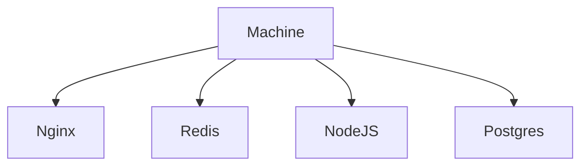

Everybody sees everything.

Dangerous.

---

# With Namespaces

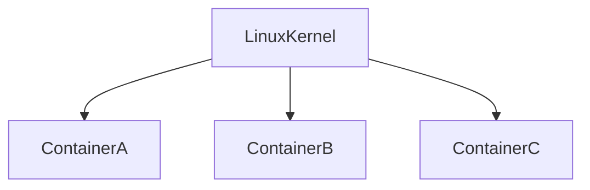

Each process sees a different world.

---

# Linux Namespace Types

Linux has multiple namespaces.

```text
PID Namespace

Mount Namespace

Network Namespace

IPC Namespace

UTS Namespace

User Namespace

Cgroup Namespace

Time Namespace
```

Each solves a different problem.

---

# Namespace Architecture

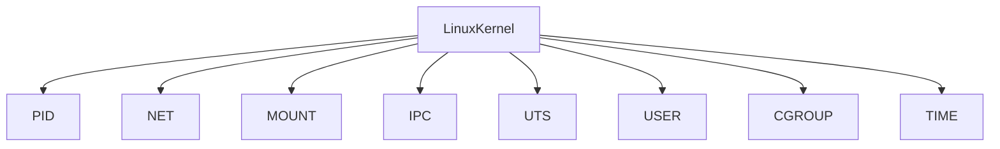

---

# The Namespace Stack

```text
Application

↓

Container Runtime

↓

Namespaces

↓

Linux Kernel

↓

Hardware
```

Everything eventually reaches Linux.

---

# PID Namespace

Problem:

Processes can see every process.

Without PID namespace:

```bash
ps aux
```

You see:

```text
Entire machine
```

With PID namespace:

```text
Container A

PID 1

PID 2

PID 3
```

Container B:

```text
PID 1

PID 2
```

Different realities.

---

# PID Namespace Diagram

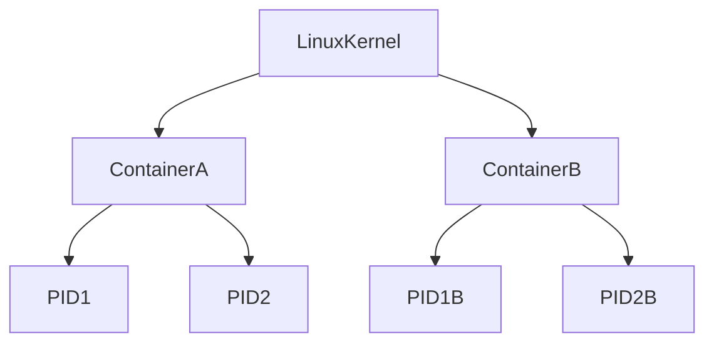

Notice:

Both can have PID 1.

---

# Why PID 1 Is Important

Inside containers:

```text
PID 1

↓

Container Init Process
```

This process is responsible for:

```text
Signal handling

Child cleanup

Zombie cleanup
```

This causes many production issues.

---

# Production Problem: Zombie Containers

Bad:

```dockerfile
CMD python app.py
```

Sometimes:

```text
Zombie processes accumulate
```

Good:

Use init systems.

Examples:

```text
tini

dumb-init
```

---

# UTS Namespace

UTS controls:

```text
Hostname

Domain Name
```

Without UTS:

Every container sees:

```text
host-server
```

With UTS:

Container A:

```text
backend-service
```

Container B:

```text
redis-service
```

Independent identities.

---

# UTS Diagram

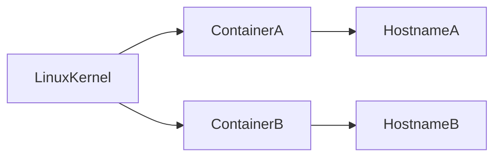

---

# Mount Namespace

Mount namespace controls:

> What files can processes see?

Without mount namespace:

```text
Entire host filesystem
```

Dangerous.

With mount namespace:

Container A:

```text
/var/www

/etc

/app
```

Container B:

```text
/database

/config

/data
```

Different realities.

---

# Mount Namespace Diagram

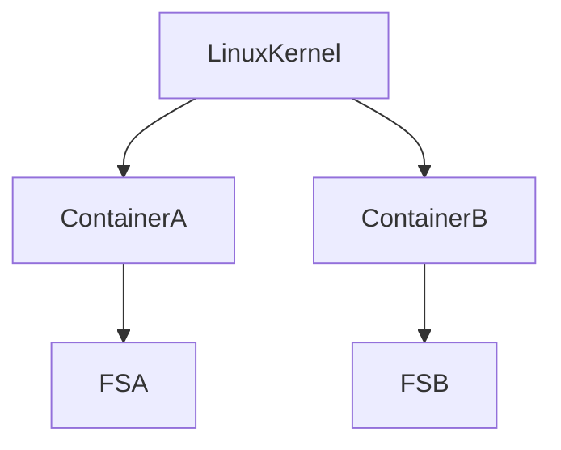

---

# Network Namespace

This changed cloud computing forever.

Question:

> How can one machine have thousands of networks?

Answer:

Namespaces.

Each namespace gets:

```text
Network interfaces

IP addresses

Routing tables

ARP tables

Firewall rules

Ports
```

---

# Network Namespace Diagram

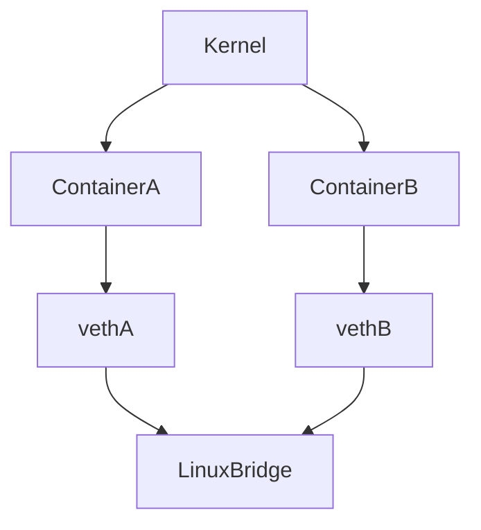

This powers Docker networking.

---

# Virtual Ethernet (veth)

veth devices are virtual cables.

Think:

```text
Container ↔ Host
```

Like Ethernet cables.

One side:

```text
Container
```

Other side:

```text
Host
```

---

# IPC Namespace

IPC:

```text
Inter Process Communication
```

Controls:

```text
Shared Memory

Semaphores

Message Queues
```

Without isolation:

Processes interfere.

With IPC namespaces:

Safe communication.

---

# User Namespace

One of Linux's greatest security features.

Question:

> Can container root be different from host root?

Yes.

Container:

```text
UID 0
```

Reality:

```text
UID 100000
```

Huge security improvement.

---

# User Namespace Diagram


Root becomes an illusion.

---

# Cgroup Namespace

Controls visibility of:

```text
CPU limits

Memory limits

Resource groups
```

Processes only see their limits.

---

# Time Namespace

Introduced recently.

Processes can have:

```text
Different clocks
```

Useful for:

```text
Testing

Distributed systems

Simulation
```

---

# How Containers Are Created

When Docker executes:

```bash
docker run nginx
```

Many things happen.

---

# Container Creation Lifecycle

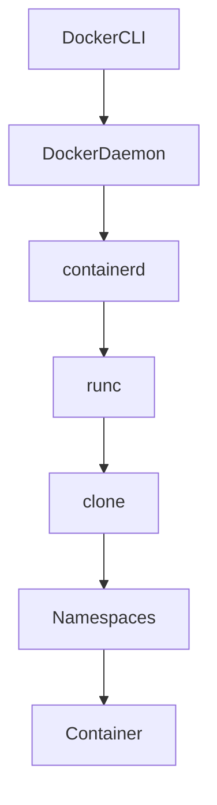

Linux is doing the work.

---

# clone() Is The Secret

Containers use:

```c
clone()
```

instead of:

```c
fork()
```

Because clone can create namespaces.

Example:

```c
clone(
CLONE_NEWPID |
CLONE_NEWNET |
CLONE_NEWNS
)
```

This creates isolated worlds.

---

# Namespaces And Kubernetes

Kubernetes does not isolate processes.

Linux does.

Kubernetes orchestrates Linux.

Hierarchy:

```text
Pod

↓

Container

↓

Namespaces

↓

Linux
```

Everything eventually becomes Linux.

---

# Namespaces And Cloud Computing

AWS runs:

```text
Millions of customers

On shared hardware
```

Possible because of isolation.

Without namespaces:

Cloud computing cannot exist.

---

# Security Implications

Without namespaces:

Attack surface:

```text
Entire machine
```

With namespaces:

Attack surface:

```text
Container boundary
```

Smaller blast radius.

---

# Blast Radius Diagram

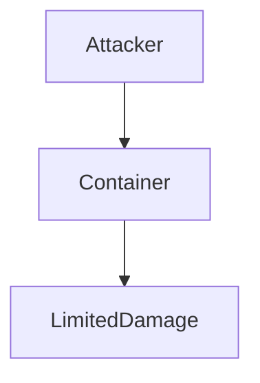

Isolation reduces damage.

---

# Performance Implications

Namespaces are lightweight.

Unlike VMs.

Namespaces:

```text
Share kernel

Low memory usage

Fast startup
```

VMs:

```text
Separate kernel

Higher memory usage

Slower startup
```

---

# VM vs Container

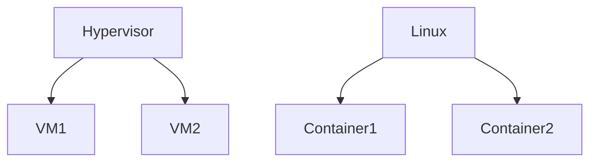

Containers are much lighter.

---

# Namespace Performance Comparison

```text
VM Boot

30s - 2min

Container Start

100ms - 2s
```

Huge difference.

---

# Namespace Observability Tools

View namespaces:

```bash
lsns
```

Process namespace info:

```bash
ps aux
```

Enter namespaces:

```bash
nsenter
```

Create namespaces:

```bash
unshare
```

Observe namespace IDs:

```bash
ls -l /proc/PID/ns
```

---

# Example

```bash
ls -l /proc/self/ns
```

Output:

```text
mnt

net

pid

ipc

uts

user

cgroup

time
```

Current namespace links.

---

# Data Flow Of A Container

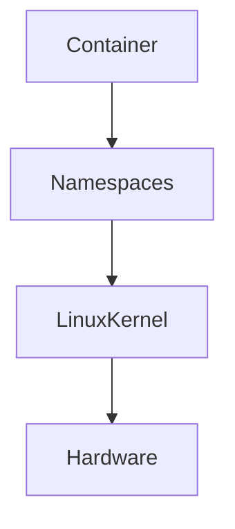

Namespaces are the illusion layer.

---

# Production Troubleshooting Flow

Container behaving strangely?

Check:

```text
PID namespace

Network namespace

Mount namespace

User namespace

Cgroups

Logs
```

Always debug layers.

---

# Common Beginner Mistakes

## Mistake 1

Thinking Docker created containers.

Wrong.

Linux did.

---

## Mistake 2

Thinking containers are VMs.

Wrong.

Containers are isolated processes.

---

## Mistake 3

Ignoring PID 1.

---

## Mistake 4

Running privileged containers.

Dangerous.

---

## Mistake 5

Ignoring user namespaces.

---

## Mistake 6

Ignoring network isolation.

---

# Engineering Mindset

Do not think:

```text
Docker creates magic.
```

Think:

```text
Docker orchestrates Linux features.
```

Linux does the work.

---

# Interview Questions

### Beginner

What is a namespace?

---

### Intermediate

What problem do namespaces solve?

---

### Intermediate

Name all Linux namespaces.

---

### Advanced

How do containers use namespaces?

---

### Advanced

Difference between namespaces and cgroups?

---

### Senior

How does Kubernetes depend on namespaces?

---

### Architect

Explain how Linux namespaces made cloud computing possible.

---

# Mind Map

```mermaid
mindmap

root((Linux Namespaces))

PID

Network

Mount

IPC

UTS

User

Cgroup

Time

Containers

Docker

Kubernetes

Cloud

Security

Isolation
```

---

# Cheat Sheet

```text
Namespace = Controls visibility

PID = Processes

NET = Networking

MOUNT = Filesystems

IPC = Interprocess communication

UTS = Hostnames

USER = User identities

CGROUP = Resource visibility

TIME = Clocks

Containers = Processes + Namespaces + Cgroups
```

---

# Golden Rules

```text
Namespaces create illusions.

Namespaces control visibility.

Namespaces enable containers.

Containers enable cloud computing.

Cloud computing enables modern civilization.

Everything eventually becomes Linux.
```

---

# Final Thought

The entire cloud industry is built on one giant lie.

Millions of applications believe:

> I have my own machine.

Reality:

> They are isolated Linux processes living inside Linux namespaces.

That illusion powers Docker, Kubernetes, AWS, Azure, and modern civilization.

---
