# Linux Control Groups (cgroups)

> Namespaces answer:
>
> **"What can a process see?"**
>
> cgroups answer:
>
> **"How much can a process consume?"**

---

# Why This Exists

Imagine a server with:

```text
64 CPU cores

128GB RAM

2TB SSD
```

Running:

```text
Nginx

Redis

PostgreSQL

NodeJS

Python

Prometheus
```

Everything works.

Then someone deploys a buggy application.

The application does:

```text
Infinite loop

Consumes all CPU

Consumes all memory

Creates thousands of threads
```

What happens?

Without protection:

```text
Entire machine crashes.
```

This is why cgroups exist.

---

# The Biggest Mindset Shift

Stop thinking:

```text
Linux runs applications.
```

Think:

```text
Linux allocates resources.

Applications compete for resources.

Linux must enforce fairness.
```

This is cgroups.

---

# Mental Model: Linux Is A Smart Electricity Company

Imagine a city.

```text
Linux Kernel = Electricity Company

Processes = Houses

CPU = Electricity

Memory = Water

Disk I/O = Road Usage

Network = Internet Bandwidth

Cgroups = Smart Meters
```

Without smart meters:

```text
One house

↓

Consumes everything

↓

City collapses
```

With smart meters:

```text
Every house

↓

Gets limits
```

Balanced city.

---

# What Are cgroups?

cgroups means:

> **Control Groups**

A Linux kernel feature that:

> Organizes processes into groups and controls how many resources they can consume.

---

# The Golden Rule

> cgroups control resources.

Namespaces:

```text
Visibility
```

cgroups:

```text
Consumption
```

---

# Without cgroups

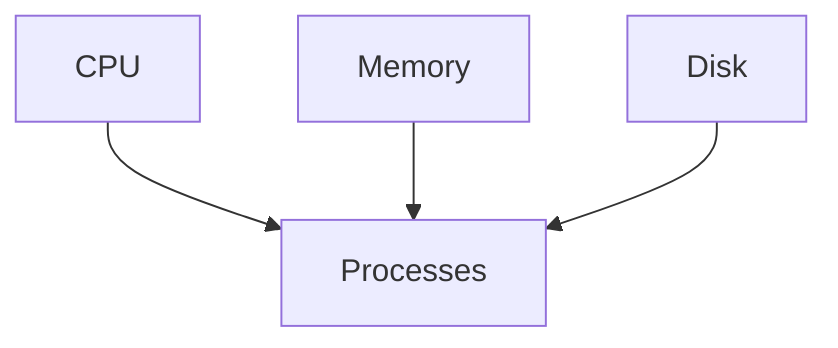

Everyone fights.

Chaos.

---

# With cgroups

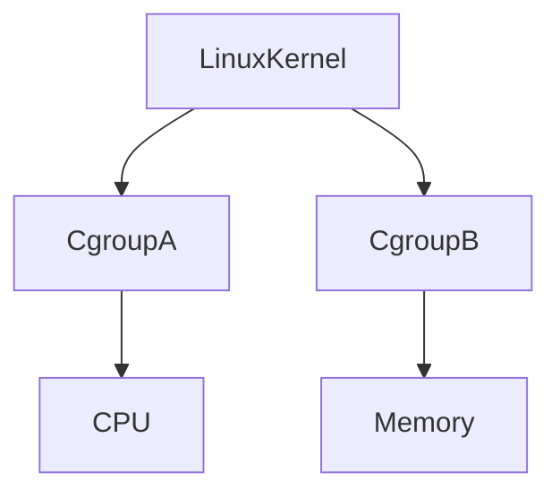

Resources are controlled.

---

# What Resources Can cgroups Control?

Modern cgroups control:

```text
CPU

Memory

Disk I/O

Processes

Network Priority

Huge Pages

Devices

Swap

NUMA
```

---

# The cgroup Philosophy

Linux asks:

> Which processes belong together?

Then:

> What rules apply to them?

Example:

```text
Nginx workers

↓

Group

↓

2 CPU

↓

2GB RAM
```

Simple.

---

# cgroup Architecture

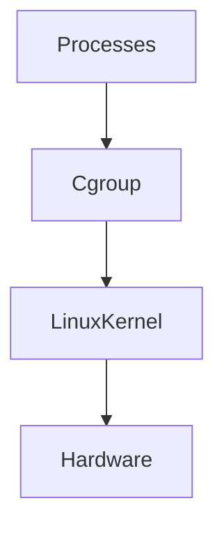

cgroups sit between processes and resources.

---

# Why cgroups Were Created

Before cgroups:

Large servers had problems.

Examples:

```text
Shared hosting

Databases

Virtualization

Cloud computing
```

One application could destroy everything.

Google engineers created cgroups.

Eventually Linux adopted them.

Fun fact:

> Kubernetes would not exist without cgroups.

---

# cgroup v1 vs cgroup v2

Linux has two generations.

---

# cgroup v1

Many separate controllers.

Example:

```text
cpu

memory

blkio

devices

pids
```

Independent.

Complex.

---

# cgroup v2

Unified hierarchy.

Modern systems use this.

Better.

Cleaner.

Recommended.

---

# Hierarchy Diagram

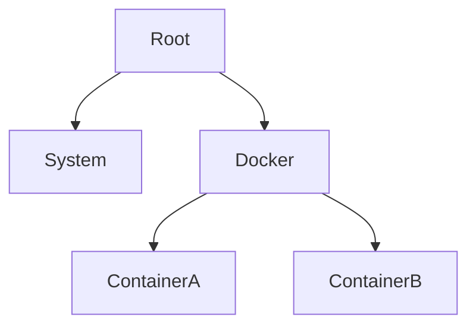

Everything belongs somewhere.

---

# Every Process Belongs To A cgroup

This is extremely important.

Nothing is outside.

Example:

```text
systemd

↓

docker

↓

container

↓

nginx process
```

Everything has a group.

---

# CPU Controller

Question:

> How much CPU can this process use?

Without limits:

```text
100%

100%

100%

100%
```

Machine dies.

With limits:

```text
Container A = 2 CPUs

Container B = 1 CPU

Container C = 4 CPUs
```

Controlled.

---

# CPU Scheduling Diagram

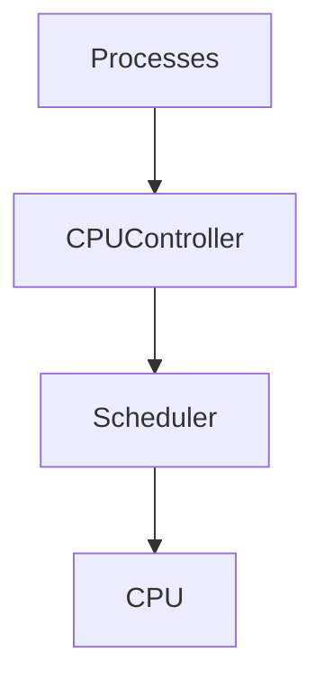

---

# CPU Concepts

Important terms:

## Shares

Relative priority.

Example:

```text
A = 1024

B = 512
```

A gets twice the CPU.

---

## Quotas

Hard limits.

Example:

```text
100ms period

50ms quota
```

50% CPU.

---

# Memory Controller

Question:

> How much RAM can this process use?

Without limits:

```text
Memory leak

↓

128GB consumed

↓

Everything crashes
```

With limits:

```text
2GB maximum
```

Safe.

---

# Memory States

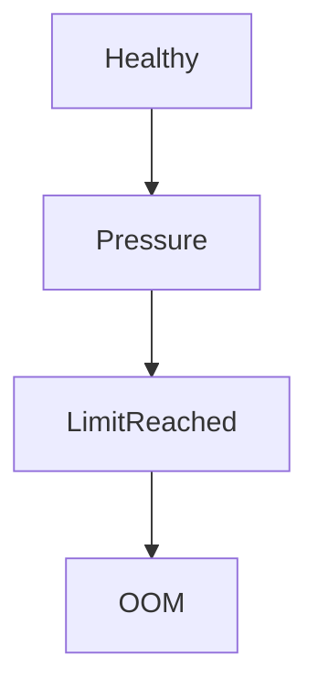

---

# What Happens At Memory Limits?

Linux tries:

```text
Reclaim memory

↓

Drop caches

↓

Swap

↓

OOM Killer
```

If still bad:

```text
Kill process
```

---

# OOM Killer Connection

OOM:

```text
Out Of Memory
```

Question:

> Who should die?

Linux calculates scores.

Kills one process.

Protects the system.

---

# OOM Diagram

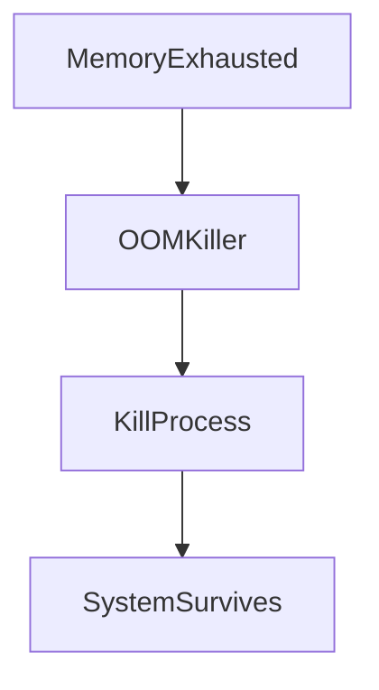

---

# Disk I/O Controller

Question:

> How much disk access can a process consume?

Example:

Bad:

```text
Database backup

↓

Consumes entire SSD

↓

Everything slows
```

Good:

```text
50MB/s limit
```

Balanced.

---

# Disk I/O Diagram


---

# PID Controller

Question:

> How many processes can this application create?

Protection against:

```text
Fork bombs
```

Example:

```text
Max 500 processes
```

Safe.

---

# Fork Bomb Example

Dangerous:

```bash
:(){ :|:& };:
```

Never execute.

Without cgroups:

```text
Machine dies.
```

With PID limits:

Protected.

---

# Device Controller

Controls hardware access.

Examples:

Allow:

```text
GPU

USB

Storage
```

Block:

```text
Sensitive devices
```

Huge security benefit.

---

# cgroups + Docker

Docker uses cgroups extensively.

Example:

```bash
docker run \
--cpus=2 \
--memory=2g nginx
```

Docker creates cgroups.

Linux enforces limits.

---

# Docker Internal Flow

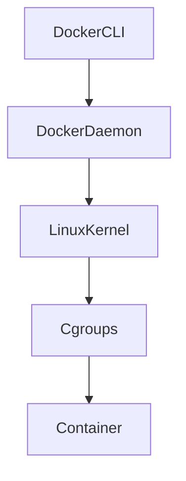

Docker is not doing magic.

Linux is.

---

# cgroups + Kubernetes

Kubernetes also uses cgroups.

Example:

```yaml
resources:

 requests:

   cpu: "500m"

   memory: "512Mi"

 limits:

   cpu: "1"

   memory: "1Gi"
```

These become:

```text
Linux cgroups
```

---

# Kubernetes Resource Flow

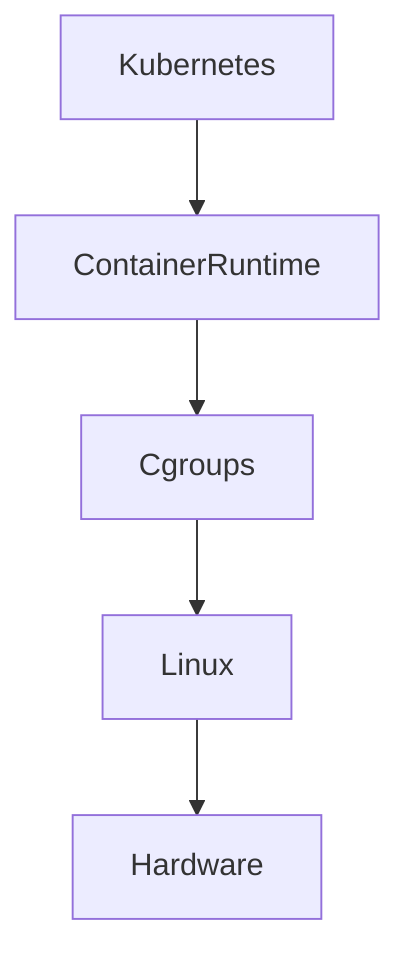

Everything eventually reaches Linux.

---

# Requests vs Limits

This is extremely important.

Requests:

```text
Minimum needed
```

Limits:

```text
Maximum allowed
```

Example:

```text
Request:

1 CPU

Limit:

2 CPU
```

---

# Why Kubernetes Pods Crash

Very common.

Example:

```text
Java application

↓

Memory leak

↓

Exceeds limit

↓

OOM Kill

↓

Pod restart
```

Root cause:

```text
Linux cgroups
```

---

# systemd And cgroups

systemd organizes processes using cgroups.

View hierarchy:

```bash
systemd-cgls
```

Example:

```text
system.slice

user.slice

docker.slice
```

Everything is grouped.

---

# systemd Diagram

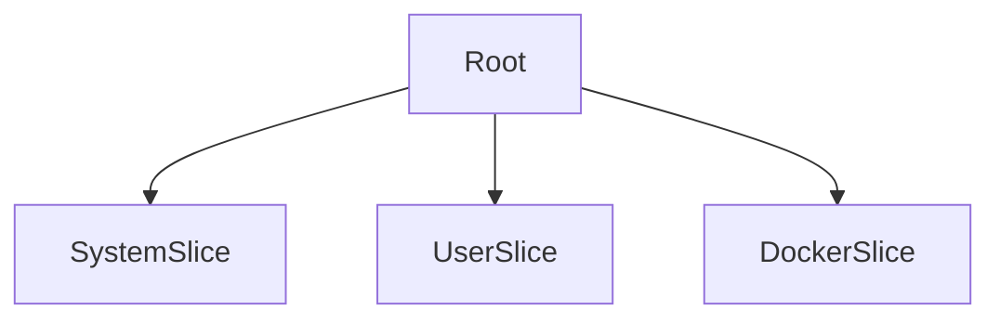

---

# Production Example

Imagine:

```text
16 CPU

64GB RAM
```

Services:

```text
Nginx

Redis

PostgreSQL

NodeJS
```

Allocate:

```text
Nginx

2 CPU

2GB RAM

-----------------

Redis

4 CPU

8GB RAM

-----------------

PostgreSQL

6 CPU

16GB RAM

-----------------

NodeJS

4 CPU

8GB RAM
```

Everything remains stable.

---

# Resource Allocation Diagram

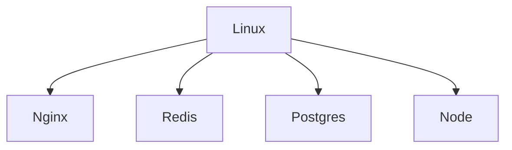

---

# cgroups And Cloud Computing

Cloud providers rely heavily on cgroups.

Examples:

```text
AWS ECS

AWS EKS

Google GKE

Azure AKS
```

Millions of containers.

Millions of cgroups.

---

# Performance Implications

Benefits:

```text
Predictability

Fairness

Isolation

Stability
```

Tradeoffs:

```text
Scheduling overhead

Complexity

Monitoring requirements
```

---

# Observability Tools

View cgroups:

```bash
systemd-cgls
```

View version:

```bash
mount | grep cgroup
```

Inspect:

```bash
cat /proc/self/cgroup
```

Show hierarchy:

```bash
systemd-cgtop
```

View stats:

```bash
cat /sys/fs/cgroup/*
```

---

# Production Troubleshooting Flow

Application slow?

Think:

```text
Application

↓

Container

↓

Cgroup

↓

Linux

↓

Hardware
```

Check:

```text
CPU throttling

Memory pressure

Disk limits

PID limits
```

---

# CPU Throttling

Very common Kubernetes issue.

Symptoms:

```text
High latency

Slow API

Normal CPU usage

Low throughput
```

Cause:

```text
CPU quota exceeded
```

---

# Memory Pressure

Symptoms:

```text
Pod restarts

OOM kills

Slow applications
```

Cause:

```text
Memory limits too low
```

---

# Common Beginner Mistakes

## Mistake 1

Thinking Docker manages resources.

Linux does.

---

## Mistake 2

No memory limits.

Dangerous.

---

## Mistake 3

No CPU limits.

Dangerous.

---

## Mistake 4

Ignoring OOM killer.

---

## Mistake 5

Ignoring CPU throttling.

---

## Mistake 6

Confusing namespaces and cgroups.

Remember:

```text
Namespaces = Visibility

Cgroups = Resource Control
```

---

# Engineering Mindset

Do not think:

```text
Applications run freely.
```

Think:

```text
Applications compete.

Linux arbitrates.

Resources are finite.
```

---

# Interview Questions

### Beginner

What are cgroups?

---

### Intermediate

Difference between namespaces and cgroups?

---

### Intermediate

What resources can cgroups control?

---

### Advanced

Explain cgroup v1 vs v2.

---

### Advanced

How does Docker use cgroups?

---

### Senior

How does Kubernetes resource allocation work internally?

---

### Architect

Explain how Linux cgroups made cloud computing possible.

---

# Mind Map

```mermaid
mindmap

root((cgroups))

CPU

Memory

Disk I/O

PIDs

Devices

Namespaces

Docker

Kubernetes

Cloud

OOM Killer

systemd

Performance

Resource Management
```

---

# Cheat Sheet

```text
cgroups = Resource Controller

Namespaces = What you can see

cgroups = What you can consume

Controls:

CPU

Memory

Disk I/O

PIDs

Devices

Golden Rule:

Everything competes for resources.

Linux enforces fairness.

Containers depend on cgroups.

Cloud computing depends on cgroups.
```

---

# Golden Rules

```text
Resources are finite.

Demand is infinite.

Everything competes.

Everything must be controlled.

Everything eventually becomes Linux.

Linux powers modern civilization.
```

---

# Final Thought

Docker did not solve resource management.

Kubernetes did not solve resource management.

Cloud providers did not solve resource management.

Linux solved it long ago.

Every cloud platform is fundamentally one giant Linux machine answering one question:

> Who gets how much of the machine?

That answer is **cgroups**.
