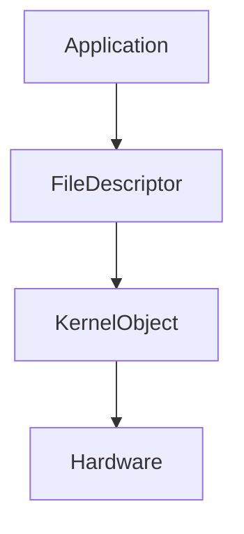
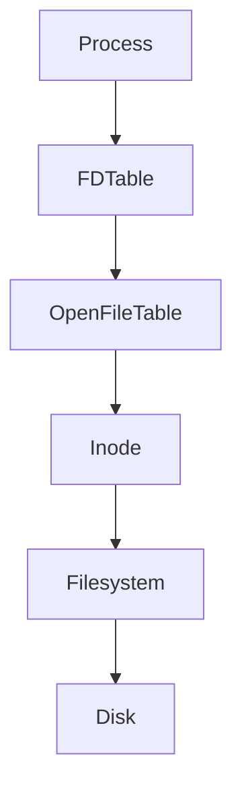
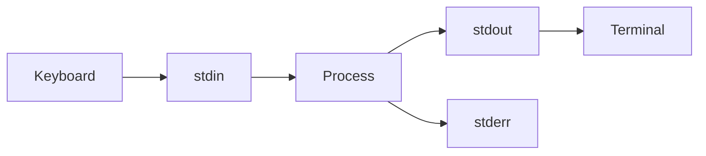
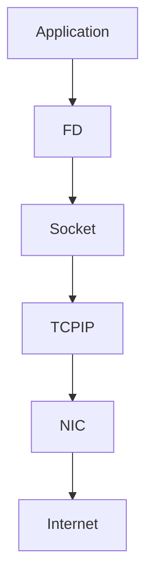
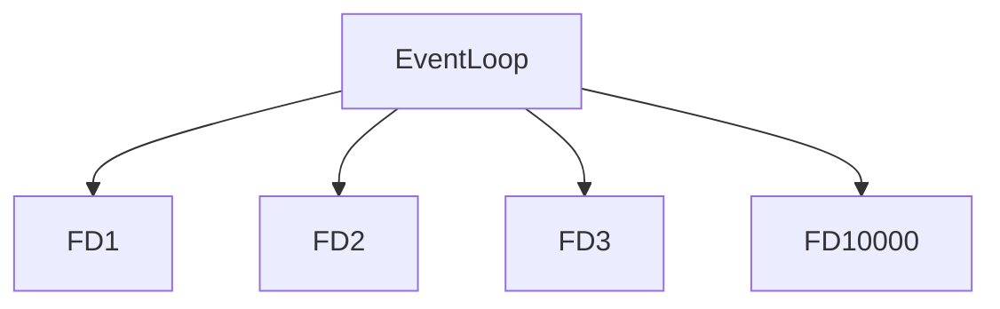
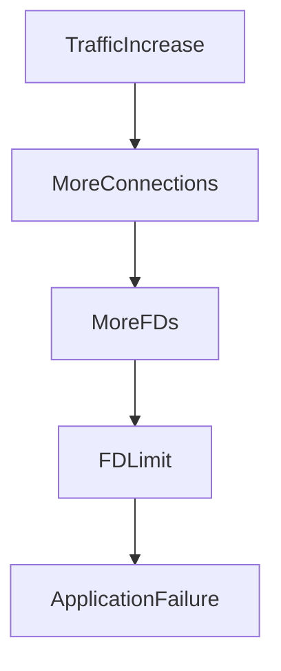
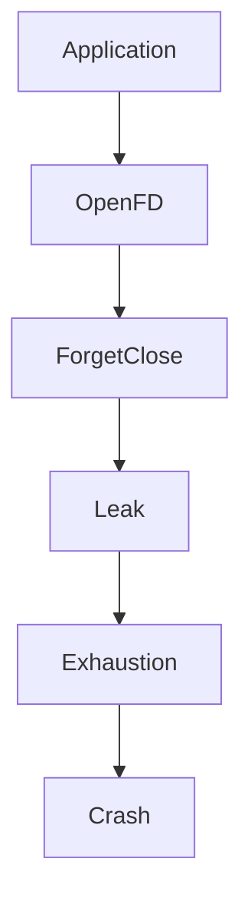

# File Descriptors Deep Dive

> Linux does not communicate with files.
>
> Linux communicates with file descriptors.

---

# Why This Exists

Imagine this code:

```python
f = open("data.txt")

db.connect()

socket.connect()

print("Hello")
```

These look like completely different operations.

Reality:

Linux converts all of them into:

```text
File Descriptors
```

This is one of Linux's greatest abstractions.

---

# The Biggest Mindset Shift

Stop thinking:

```text
Files

Sockets

Pipes

Databases

Devices
```

Think:

```text
Everything becomes a file descriptor.
```

---

# Mental Model: Linux Is A Giant Hotel

Imagine a hotel.

```text
Linux Kernel = Hotel Management

Processes = Guests

Resources = Rooms

File Descriptors = Room Keys
```

Guests never directly access resources.

They receive keys.

The key is:

```text
File Descriptor
```

---

# What Is A File Descriptor?

A file descriptor (FD) is:

> A small integer that uniquely identifies an open resource for a process.

Examples:

```text
File

Socket

Pipe

Terminal

Device

Event Queue
```

All become file descriptors.

---

# The Golden Rule

> File descriptors are references to open kernel objects.

---

# Example

```c
int fd = open("data.txt", O_RDONLY);
```

Output:

```text
fd = 3
```

Linux says:

```text
Here is your handle.

Use 3 from now on.
```

---

# Why Numbers?

Numbers are efficient.

Instead of:

```text
Open data.txt

Find location

Validate permissions

Find inode

Again

Again

Again
```

Linux does:

```text
Lookup fd 3
```

Fast.

---

# Everything Is A File Descriptor

Examples:

```text
Regular File

Socket

Pipe

Database Connection

Terminal

Network Connection

epoll Instance

eventfd

timerfd
```

---

# File Descriptor Architecture



---

# File Descriptor Is NOT The File

This is extremely important.

Many beginners think:

```text
fd = file
```

Wrong.

Reality:

```text
fd

↓

Pointer

↓

Kernel Structure

↓

Actual Resource
```

---

# Linux Data Structures

Internally:

```text
Process

↓

File Descriptor Table

↓

Open File Table

↓

Inode

↓

Storage
```

---

# Deep Architecture Diagram



This is extremely important.

---

# Three Layers Of Linux Abstraction

Layer 1:

```text
File Descriptor Table
```

Layer 2:

```text
Open File Table
```

Layer 3:

```text
Inode
```

---

# Layer 1: File Descriptor Table

Each process has its own FD table.

Example:

```text
Process A

FD 0

FD 1

FD 2

FD 3

FD 4
```

Different process:

```text
Process B

FD 0

FD 1

FD 2

FD 3
```

Independent worlds.

---

# FD Table Diagram

```text
Process

FD Table

0

1

2

3

4
```

These point elsewhere.

---

# Layer 2: Open File Table

Kernel shared structure.

Contains:

```text
Current offset

Flags

Reference count

Access mode
```

---

# Layer 3: Inode

Inode stores metadata.

Contains:

```text
Permissions

Ownership

Size

Timestamps

Disk block locations
```

Not filename.

---

# End-To-End Visualization


---

# The First Three File Descriptors

Linux automatically creates:

```text
0

1

2
```

---

# FD 0

Standard Input

```text
stdin
```

Keyboard.

---

# FD 1

Standard Output

```text
stdout
```

Terminal output.

---

# FD 2

Standard Error

```text
stderr
```

Errors.

---

# Standard Streams Diagram



---

# Example

```bash
echo hello
```

Actually:

```text
stdout(fd=1)

↓

Terminal
```

---

# Redirection Is FD Manipulation

Example:

```bash
ls > output.txt
```

Linux does:

```text
stdout(fd=1)

↓

output.txt
```

---

# Redirection Diagram


---

# Error Redirection

```bash
command 2> error.log
```

Means:

```text
stderr(fd=2)

↓

error.log
```

---

# Merge Streams

```bash
command > output.log 2>&1
```

Means:

```text
stderr

↓

stdout
```

Both together.

---

# Pipe Internals

Example:

```bash
cat file.txt | grep linux
```

Linux creates:

```text
Pipe

↓

Two file descriptors
```

---

# Pipe Diagram


Pipe itself is a kernel object.

---

# Socket Internals

Sockets are also file descriptors.

Example:

```python
socket.connect()
```

Linux:

```text
Socket

↓

FD 5
```

Now the application uses:

```text
FD 5
```

---

# Network Architecture



Networking is file descriptors.

---

# Why Nginx Is Fast

Nginx thinks differently.

Instead of:

```text
1 thread

↓

1 connection
```

Nginx:

```text
1 event loop

↓

10000 file descriptors
```

Huge difference.

---

# Nginx Architecture



This powers the internet.

---

# Databases Are File Descriptor Machines

PostgreSQL:

```text
Clients

↓

Sockets

↓

Tables

↓

WAL

↓

Disk
```

Thousands of FDs.

---

# PostgreSQL Example

One database server may have:

```text
500 client sockets

100 table files

20 WAL files

10 replication sockets
```

All FDs.

---

# Docker Uses File Descriptors

Container startup:

```text
Container

↓

Namespaces

↓

Cgroups

↓

Sockets

↓

Pipes

↓

FDs
```

Everything becomes file descriptors.

---

# Kubernetes Uses File Descriptors

Examples:

```text
API Server

etcd

kubelet

containerd
```

Thousands of file descriptors.

---

# Why File Descriptor Limits Exist

Imagine:

```text
1 million sockets
```

Memory usage explodes.

Linux limits them.

---

# Check Limits

```bash
ulimit -n
```

Example:

```text
1024
```

Default.

Too small for production.

---

# Production Problem: Too Many Open Files

Very common.

Error:

```text
Too many open files
```

Means:

```text
FD limit reached.
```

---

# Failure Diagram



---

# Real Production Example

Server:

```text
10000 users
```

Each user:

```text
1 socket
```

Requires:

```text
10000 FDs
```

Default:

```text
1024
```

System crashes.

---

# Increase Limits

Temporary:

```bash
ulimit -n 65535
```

Permanent:

```text
/ etc/security/limits.conf
```

Example:

```text
* soft nofile 65535

* hard nofile 65535
```

---

# How To Observe File Descriptors

Show process FDs:

```bash
ls /proc/PID/fd
```

Example:

```bash
ls /proc/1234/fd
```

---

# List Open Files

```bash
lsof
```

Extremely important command.

---

# Example

```bash
lsof -p 1234
```

See all open resources.

---

# Count FDs

```bash
lsof | wc -l
```

---

# Monitor Growth

```bash
watch 'ls /proc/PID/fd | wc -l'
```

Very useful.

---

# FD Lifecycle


Simple lifecycle.

---

# File Descriptor Leaks

Very common production issue.

Problem:

```text
Open

Open

Open

Open

Never close
```

Eventually:

```text
FD exhaustion
```

---

# Leak Diagram



---

# Common Leak Sources

```text
Database connections

Sockets

Log files

Pipes

Temporary files
```

---

# Why Microservices Need FD Awareness

Every service uses:

```text
HTTP

Databases

Caches

Queues

Logs

Metrics
```

Everything consumes FDs.

---

# FD Consumption Example

One service:

```text
5000 users

↓

5000 sockets

↓

20 DB connections

↓

10 Redis connections

↓

50 log files
```

Thousands of descriptors.

---

# Performance Implications

Too many FDs:

```text
Higher memory

More kernel bookkeeping

More event polling work
```

But modern Linux handles huge numbers efficiently.

---

# epoll Revolution

Old systems:

```text
Loop through every FD
```

Complexity:

```text
O(n)
```

epoll:

```text
Only active FDs
```

Complexity:

```text
O(1)
```

Huge improvement.

This enabled modern internet scale.

---

# Security Implications

Open FDs are attack surfaces.

Questions:

```text
Who owns it?

Who can read it?

Who can write it?

Can it leak secrets?
```

Always verify permissions.

---

# Troubleshooting Checklist

Application failing?

Check:

```text
FD count

FD limits

Socket growth

Connection leaks

Database connections

Open files
```

---

# Common Beginner Mistakes

## Mistake 1

Thinking FD means file.

Wrong.

It means open resource.

---

## Mistake 2

Ignoring FD limits.

---

## Mistake 3

Forgetting to close resources.

---

## Mistake 4

Ignoring socket growth.

---

## Mistake 5

Ignoring database connections.

---

## Mistake 6

Ignoring observability.

---

# Engineering Mindset

Do not think:

```text
My application is slow.
```

Think:

```text
What resources are open?

What file descriptors exist?

Are they leaking?

Are limits exhausted?
```

Always think at the Linux level.

---

# Interview Questions

### Beginner

What is a file descriptor?

---

### Intermediate

What are FD 0, 1 and 2?

---

### Intermediate

What is the difference between FD and inode?

---

### Advanced

Explain the file descriptor architecture.

---

### Advanced

Why does Nginx handle 10000 connections?

---

### Senior

How does Linux represent network connections internally?

---

### Architect

Explain why modern internet infrastructure is fundamentally file descriptor management.

---

# Mind Map

```mermaid
mindmap

root((File Descriptors))

FD Table

Open File Table

Inodes

stdin

stdout

stderr

Sockets

Pipes

Databases

Nginx

Docker

Kubernetes

epoll

Observability

Performance

Production Systems
```

---

# Cheat Sheet

```text
FD = Integer Handle To Open Resource

Everything Is A File Descriptor

0 = stdin

1 = stdout

2 = stderr

Tools:

lsof

ulimit

/proc/PID/fd

Golden Rules:

FD != File

FD = Handle

Everything eventually becomes file descriptors.

Every socket is an FD.

Every database connection is an FD.

Every modern system manages FDs.
```

---

# Final Thought

The modern internet is not millions of websites talking to each other.

It is billions of file descriptors continuously opening, communicating, transferring data, and closing.

Nginx...

PostgreSQL...

Redis...

Docker...

Kubernetes...

Cloud providers...

Everything eventually becomes:

> Linux managing billions of tiny integers called file descriptors.
