# ProcFS Internals

> Linux is one of the few operating systems that allows you to directly look inside its brain while it is running.

---

# Why This Exists

Imagine driving a car.

But you cannot see:

```text
Engine temperature

Fuel level

Speed

Oil pressure

Battery status
```

Debugging becomes impossible.

Linux solved this problem.

Linux says:

> I will expose my internal state as files.

That system is called:

```text
procfs
```

Process File System.

---

# The Biggest Mindset Shift

Stop thinking:

```text
/proc

↓

Folder
```

Think:

```text
/ proc

↓

Live kernel interface
```

Nothing inside `/proc` is a normal file.

Linux generates everything dynamically.

---

# Mental Model: Linux Is A Hospital

Imagine Linux as a hospital.

```text
Linux Kernel = Human Body

Processes = Organs

Memory = Blood

CPU = Brain Activity

Network = Blood Vessels

ProcFS = MRI Scanner
```

ProcFS lets engineers inspect the body without stopping it.

---

# What Is ProcFS?

ProcFS is:

> A virtual filesystem that exposes Linux kernel and process information to userspace.

Virtual means:

```text
Not stored on disk
```

Generated in real time.

---

# The Golden Rule

> ProcFS is Linux exposing internal kernel data structures as files.

---

# Where Is ProcFS?

```bash
/proc
```

Example:

```bash
ls /proc
```

Output:

```text
1

234

512

cpuinfo

meminfo

uptime

version

sys
```

---

# ProcFS Architecture

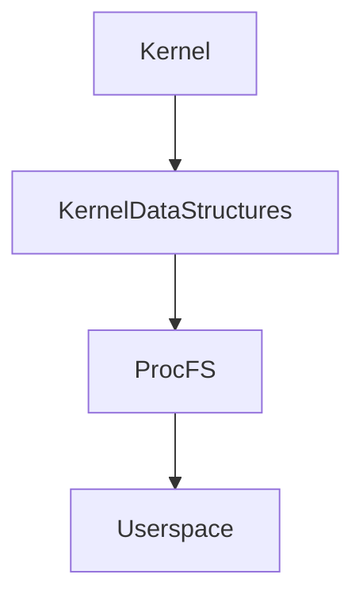

---

# ProcFS Is NOT Storage

This is extremely important.

Beginners think:

```text
/proc files

↓

Stored somewhere
```

Wrong.

Reality:

```text
cat /proc/cpuinfo

↓

Kernel generates output

↓

Displays output

↓

Done
```

No storage involved.

---

# How ProcFS Works

Example:

```bash
cat /proc/meminfo
```

Internally:

```text
Userspace

↓

VFS

↓

ProcFS Driver

↓

Kernel Structures

↓

Generated Data
```

---

# Data Flow Diagram

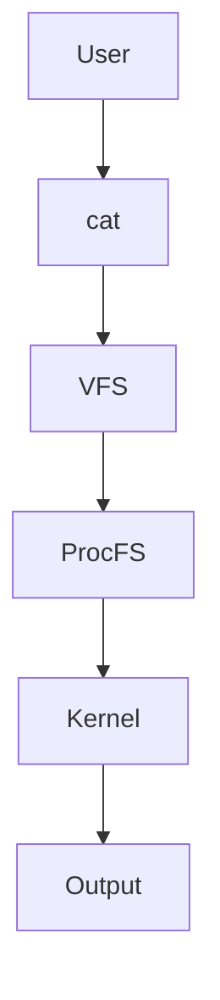

---

# Why ProcFS Exists

Linux engineers needed:

```text
Observability

Debugging

Performance Monitoring

Troubleshooting

Automation
```

Without ProcFS:

Linux would be blind.

---

# ProcFS Has Two Main Worlds

```text
System Information

Process Information
```

---

# ProcFS Layout

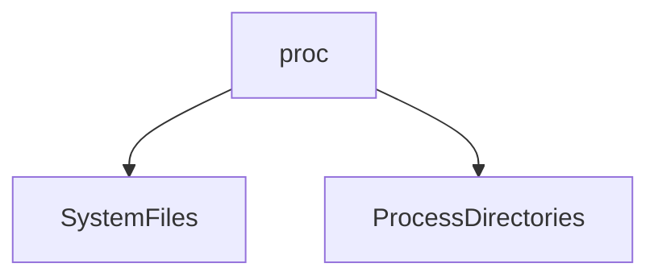

---

# World 1: System Information

Examples:

```text
/proc/cpuinfo

/proc/meminfo

/proc/uptime

/proc/loadavg

/proc/version

/proc/modules
```

Machine-level data.

---

# World 2: Process Information

Every process gets a directory.

Example:

```text
/proc/1

/proc/234

/proc/5000
```

PID = directory.

---

# Process Architecture

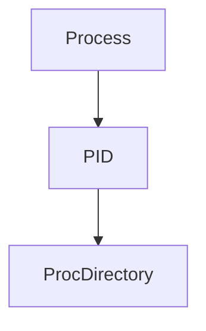

Each process exposes its internals.

---

# /proc/cpuinfo

Shows CPU details.

Example:

```bash
cat /proc/cpuinfo
```

Contains:

```text
Model

Cores

Threads

Frequency

Cache
```

---

# CPU Information Flow


---

# /proc/meminfo

Shows memory state.

Example:

```bash
cat /proc/meminfo
```

Contains:

```text
Total RAM

Free RAM

Buffers

Cached Memory

Swap
```

---

# Why Cached Memory Confuses Beginners

Example:

```text
64GB RAM

Free: 2GB
```

Panic?

No.

Because:

```text
Linux uses RAM aggressively.
```

Unused RAM is wasted RAM.

---

# Memory Layout Diagram

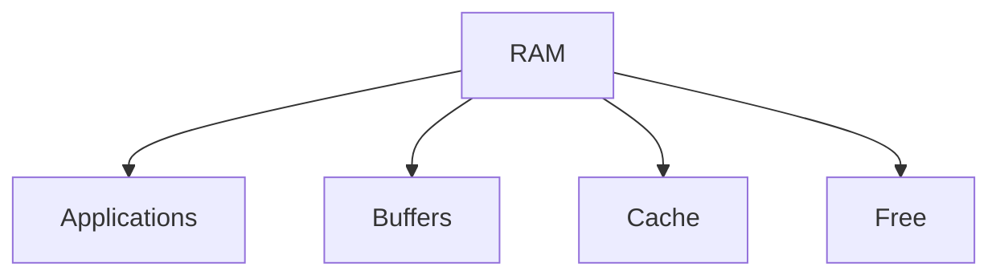

---

# /proc/uptime

Shows:

```text
System uptime

Idle time
```

Useful for:

```text
Monitoring

Automation

SRE tools
```

---

# /proc/loadavg

Shows system load.

Example:

```text
0.30

0.40

0.80
```

Represents:

```text
1 minute

5 minute

15 minute
```

load averages.

---

# What Is Load?

Load is NOT CPU usage.

Load is:

> Number of tasks waiting for CPU or uninterruptible resources.

---

# Load States

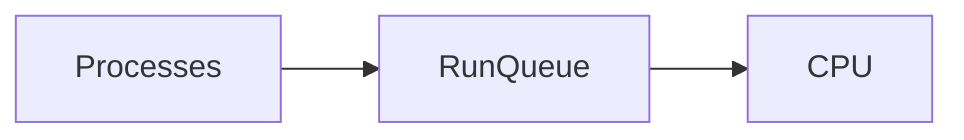

Long queue = high load.

---

# /proc/version

Shows:

```text
Linux version

Compiler

Build information
```

---

# /proc/modules

Shows loaded kernel modules.

Example:

```text
nvidia

kvm

bridge

overlay
```

These extend Linux functionality.

---

# Process Directories

Every PID gets information.

Example:

```text
/proc/1234
```

Contains:

```text
cmdline

status

maps

fd

environ

io

stat
```

This is process introspection.

---

# /proc/PID/status

Shows:

```text
Name

State

Memory

Threads

UID

GID
```

Process summary.

---

# Process Status Diagram

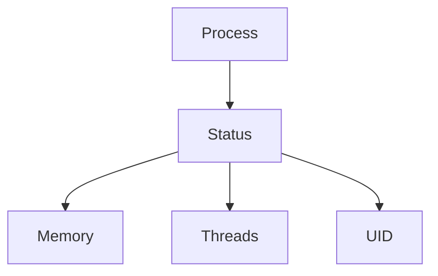

---

# /proc/PID/cmdline

Shows process command.

Example:

```text
python app.py
```

Useful for debugging.

---

# /proc/PID/fd

Very important.

Shows file descriptors.

Example:

```bash
ls /proc/1234/fd
```

Output:

```text
0

1

2

3

4
```

Everything the process opened.

---

# FD Diagram


---

# /proc/PID/maps

Shows memory layout.

Example:

```text
Text

Heap

Stack

Libraries
```

Extremely useful.

---

# Memory Layout

```text
High Address

+-----------+

Stack

+-----------+

Heap

+-----------+

Libraries

+-----------+

Text

+-----------+

Low Address
```

---

# /proc/PID/io

Shows:

```text
Bytes read

Bytes written

Disk operations
```

Useful for bottleneck analysis.

---

# /proc/PID/environ

Shows environment variables.

Example:

```text
PATH

HOME

DATABASE_URL
```

Be careful.

Contains secrets.

---

# Security Implications

Exposed:

```text
Tokens

Passwords

Secrets
```

Access should be restricted.

---

# /proc/sys

This is extremely important.

`/proc/sys` exposes kernel settings.

Examples:

```text
Networking

Memory

Security

Kernel tuning
```

---

# sysctl Relationship

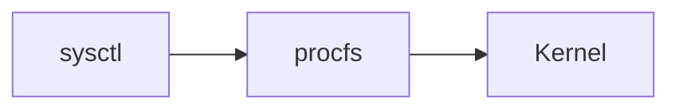

`sysctl` is a frontend for `/proc/sys`.

---

# Example

Read:

```bash
cat /proc/sys/net/ipv4/ip_forward
```

Enable:

```bash
echo 1 > /proc/sys/net/ipv4/ip_forward
```

Or:

```bash
sysctl -w net.ipv4.ip_forward=1
```

---

# ProcFS And Containers

Containers have their own `/proc`.

Question:

Why?

Namespaces.

Inside container:

```bash
ps aux
```

Only sees container processes.

Because:

```text
PID namespaces

↓

ProcFS
```

---

# Container Diagram

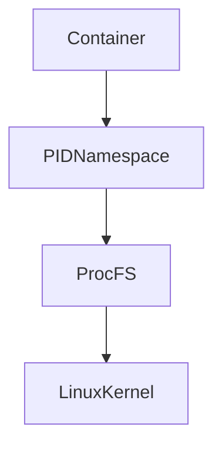

---

# ProcFS And Docker

Docker heavily uses:

```text
/proc

/sys

/cgroups
```

Everything eventually touches ProcFS.

---

# Kubernetes Connection

Kubernetes monitoring tools use ProcFS.

Examples:

```text
kubelet

cAdvisor

Prometheus exporters
```

All read ProcFS.

---

# Modern Observability Stack

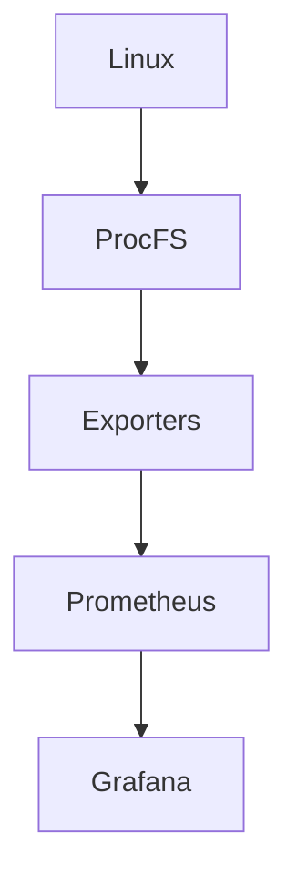

Huge connection.

---

# Why top Works

`top` is not magic.

It reads:

```text
/proc/stat

/proc/meminfo

/proc/PID
```

That's it.

---

# Why ps Works

`ps` reads:

```text
/proc/PID
```

No magic.

---

# Why free Works

`free` reads:

```text
/ proc/meminfo
```

---

# Why uptime Works

`uptime` reads:

```text
/ proc/uptime
```

---

# Why lsof Works

`lsof` reads:

```text
/ proc/PID/fd
```

Everything becomes ProcFS.

---

# Production Debugging Flow

Server slow?

Think:

```text
Symptoms

↓

CPU

↓

Memory

↓

Processes

↓

I/O

↓

ProcFS
```

Observe first.

---

# Production Investigation Flow

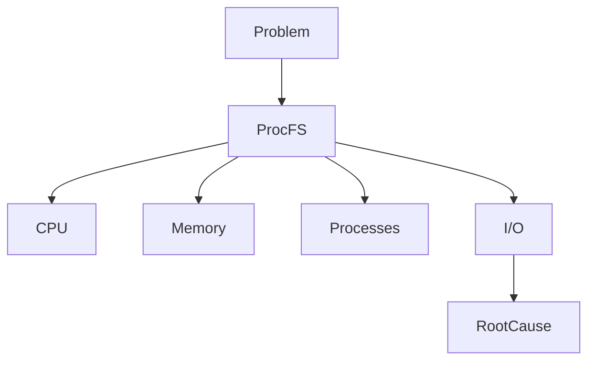

---

# Performance Implications

Reading ProcFS:

```text
Cheap

Dynamic

Frequent
```

But excessive polling can create overhead.

Large monitoring systems optimize polling frequency.

---

# Security Considerations

Protect:

```text
/ proc/PID/environ

/ proc/PID/maps

/ proc/PID/fd
```

Because attackers love information.

---

# Troubleshooting Checklist

Server unhealthy?

Check:

```bash
cat /proc/loadavg

cat /proc/meminfo

cat /proc/cpuinfo

ls /proc/PID/fd

cat /proc/PID/status
```

---

# Common Beginner Mistakes

## Mistake 1

Thinking `/proc` is stored on disk.

Wrong.

Dynamic.

---

## Mistake 2

Confusing load with CPU usage.

---

## Mistake 3

Ignoring `/proc/PID/fd`.

---

## Mistake 4

Ignoring security risks.

---

## Mistake 5

Ignoring container ProcFS behavior.

---

## Mistake 6

Memorizing commands without understanding ProcFS.

---

# Engineering Mindset

Do not think:

```text
top shows CPU.
```

Think:

```text
top reads ProcFS.
```

Do not think:

```text
ps shows processes.
```

Think:

```text
ps reads ProcFS.
```

Everything becomes Linux introspection.

---

# Interview Questions

### Beginner

What is ProcFS?

---

### Intermediate

Why is ProcFS called a virtual filesystem?

---

### Intermediate

Why does every process have a `/proc/PID` directory?

---

### Advanced

Explain how `top` works internally.

---

### Advanced

Explain the relationship between ProcFS and namespaces.

---

### Senior

How does Kubernetes monitoring depend on ProcFS?

---

### Architect

Explain how ProcFS enables observability across modern cloud infrastructure.

---

# Mind Map

```mermaid
mindmap

root((ProcFS))

System Information

cpuinfo

meminfo

loadavg

uptime

Process Information

status

fd

maps

environ

Observability

top

ps

free

lsof

Containers

Docker

Kubernetes

Monitoring

Prometheus

Security
```

---

# Cheat Sheet

```text
ProcFS = Live Linux Introspection System

Not stored on disk

Generated dynamically

Important Locations:

/proc/cpuinfo

/proc/meminfo

/proc/loadavg

/proc/PID

/proc/PID/status

/proc/PID/fd

/proc/sys

Golden Rules:

Everything eventually becomes kernel data.

Linux exposes kernel data via ProcFS.

Most Linux monitoring tools are ProcFS readers.
```

---

# Final Thought

Linux is one of the few systems in existence that allows engineers to open a window directly into its own brain while it is running.

`top`...

`ps`...

`free`...

`docker`...

`kubelet`...

`Prometheus`...

All eventually depend on one beautiful Linux idea:

> **Turn internal kernel state into files and let engineers observe reality.**
