# Linux Scheduler Internals

> Modern civilization is billions of processes competing for a finite number of CPUs.

> Linux decides who gets to work next.

---

# Why This Exists

Imagine a machine:

```text
32 CPU cores
```

Running:

```text
Chrome

VSCode

Docker

Nginx

PostgreSQL

Redis

NodeJS

Kubernetes

1000 Containers

5000 User Requests
```

Question:

> Who gets CPU time first?

There is only one answer:

> The Linux Scheduler.

Without a scheduler:

```text
Chaos

Starvation

Freezing

Unfairness

Resource monopolies
```

Linux would collapse.

---

# The Biggest Mindset Shift

Stop thinking:

```text
CPU executes applications.
```

Think:

```text
Applications compete.

Linux arbitrates.

CPU is rented.

Nobody owns the CPU.
```

---

# Mental Model: Linux Is An Airport

Imagine:

```text
Airport = CPU

Passengers = Processes

Air Traffic Controller = Scheduler

Flights = CPU Time Slices
```

Thousands want to take off.

Only a few can.

The scheduler decides.

---

# What Is A Scheduler?

A scheduler is:

> A kernel subsystem that decides which task runs, where it runs, and for how long it runs.

Three questions:

```text
Who runs?

Where do they run?

How long do they run?
```

This happens millions of times per second.

---

# The Golden Rule

> CPUs are finite.

> Demand is infinite.

Linux continuously balances both.

---

# CPU Sharing Problem

Imagine:

```text
1 CPU

1000 Processes
```

Impossible to execute simultaneously.

Linux creates an illusion.

---

# The Great Linux Illusion

Users think:

```text
Everything runs simultaneously.
```

Reality:

```text
Linux switches extremely fast.
```

This is called:

```text
Concurrency
```

---

# Concurrency Diagram

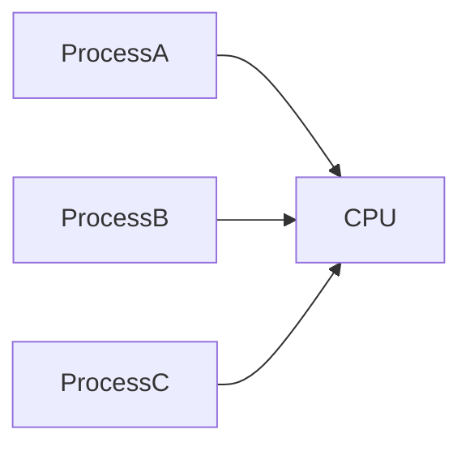

Only one executes at a time per core.

---

# Parallelism vs Concurrency

## Concurrency

```text
1 CPU

Many tasks

Take turns
```

---

## Parallelism

```text
4 CPUs

4 tasks

True simultaneous execution
```

---

# Parallelism Diagram

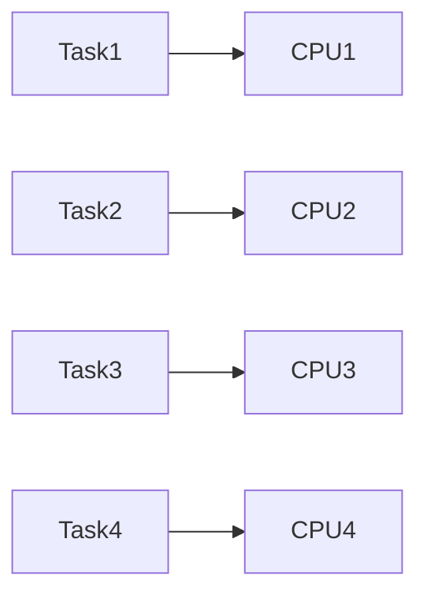

---

# Scheduler Architecture

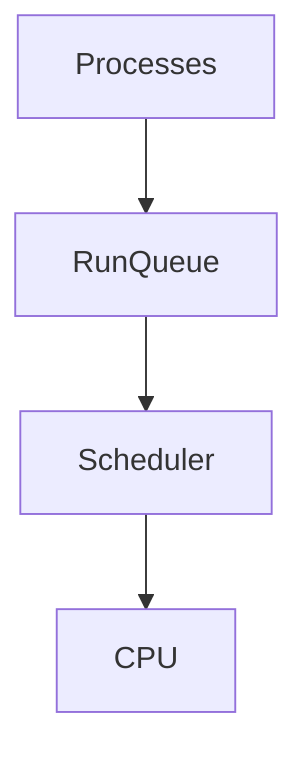

This is Linux constantly operating.

---

# Scheduler Inputs

Linux considers:

```text
Priority

CPU usage

Sleep time

Task type

Affinity

Policies

Load balancing
```

Very complex decisions.

---

# Task States

Processes constantly change states.

```text
Running

Runnable

Sleeping

Stopped

Zombie
```

---

# State Diagram

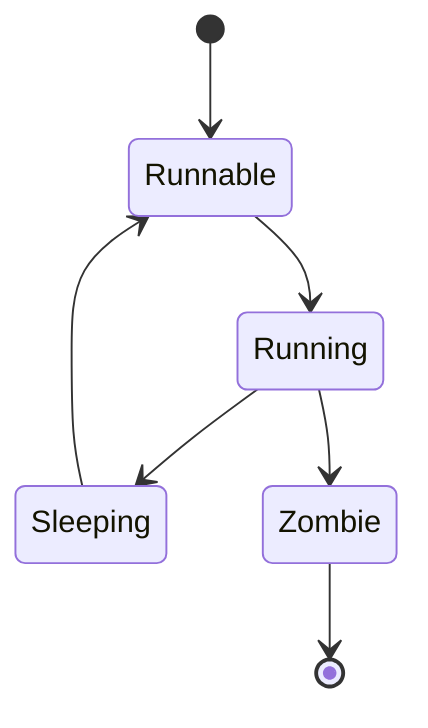

---

# Running vs Runnable

This confuses beginners.

## Running

Currently executing.

---

## Runnable

Ready to execute.

Waiting for CPU.

---

# Run Queue

Every CPU has a queue.

```text
CPU0

Task1

Task2

Task3
```

Waiting room.

---

# Run Queue Diagram

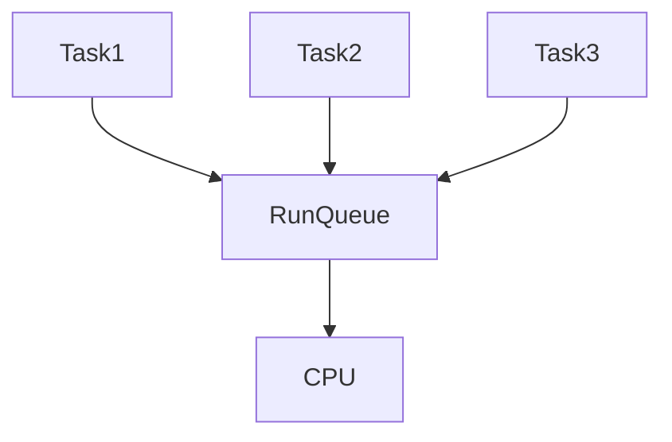

---

# Modern Servers

Example:

```text
16 CPU cores
```

Linux creates:

```text
16 run queues
```

One per core.

---

# Multi-Core Scheduler

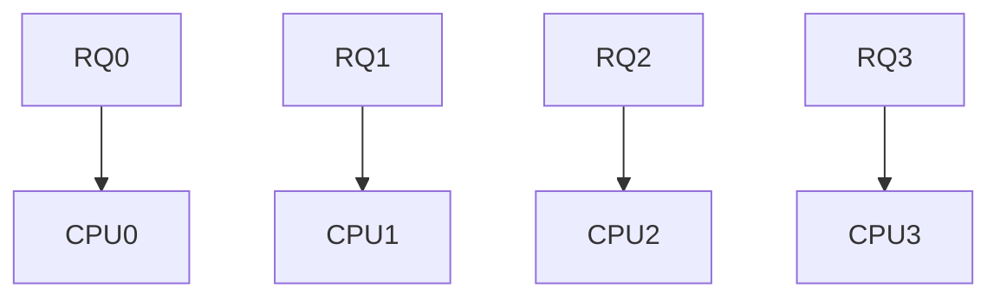

---

# Why Multiple Run Queues?

Performance.

One giant queue:

```text
Lock contention
```

Bad.

Separate queues:

```text
Scalable
```

Good.

---

# The Scheduler's Main Goals

Linux tries to optimize:

```text
Fairness

Responsiveness

Throughput

Efficiency
```

These compete with each other.

Tradeoffs exist.

---

# Fairness

Question:

```text
Does everyone get CPU time?
```

---

# Responsiveness

Question:

```text
Does the system feel fast?
```

---

# Throughput

Question:

```text
How much total work is completed?
```

---

# Efficiency

Question:

```text
How much CPU is wasted?
```

---

# Scheduling Is A Tradeoff Triangle

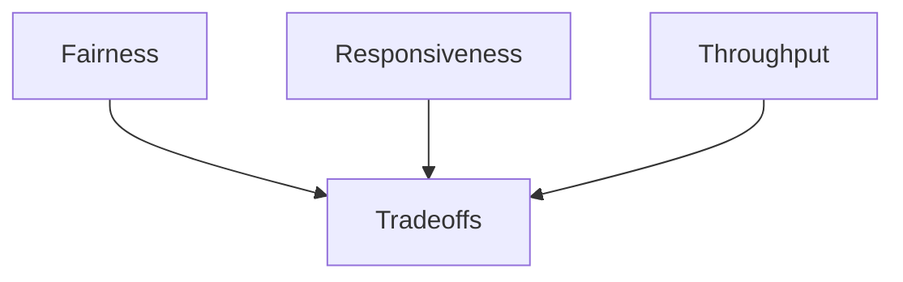

Perfect balance is impossible.

---

# Time Slices

Linux divides CPU into tiny chunks.

Example:

```text
Task A → 5ms

Task B → 5ms

Task C → 5ms
```

Very fast switching.

---

# Time Slice Diagram

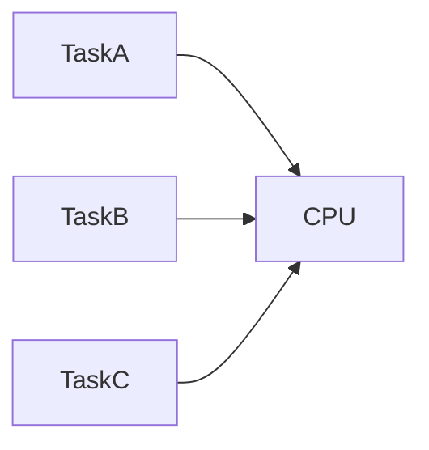

---

# Context Switching

Linux constantly switches tasks.

Example:

```text
Task A

↓

Save state

↓

Load Task B

↓

Execute
```

---

# Context Switch Diagram

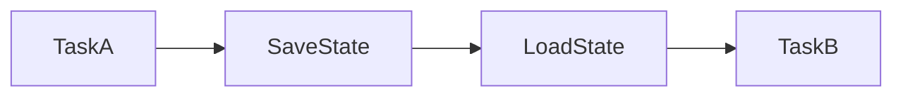

---

# What Gets Saved?

Linux saves:

```text
Registers

Program Counter

Stack Pointer

Flags

Memory State
```

Then restores another process.

---

# Context Switching Is Expensive

Too many switches create overhead.

Symptoms:

```text
High CPU

Low throughput

Poor performance
```

Context switching is not free.

---

# Linux Scheduling Classes

Linux has multiple scheduling systems.

```text
CFS

Real-Time

Deadline
```

---

# Scheduling Hierarchy

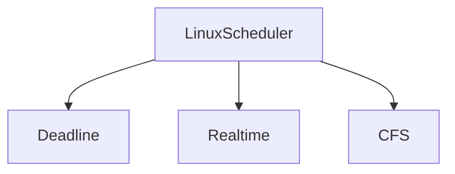

---

# CFS

Completely Fair Scheduler.

Default scheduler.

Most applications use this.

Examples:

```text
Chrome

Nginx

NodeJS

Docker

PostgreSQL
```

---

# CFS Philosophy

Question:

> How do we fairly share CPU?

Answer:

> Give everybody virtual runtime.

---

# Virtual Runtime (vruntime)

This is one of Linux's greatest ideas.

Linux tracks:

```text
How much CPU has each process already consumed?
```

The smallest value wins.

---

# CFS Diagram

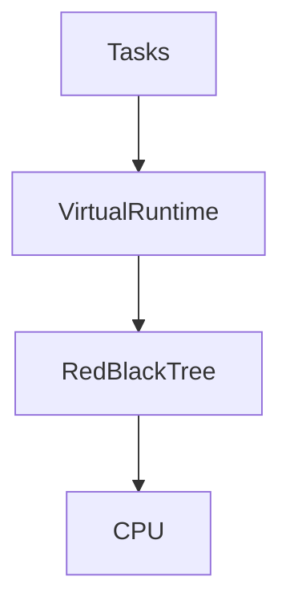

---

# Why Red-Black Trees?

Fast operations.

Complexity:

```text
O(log n)
```

Efficient for thousands of tasks.

---

# CFS Algorithm

Linux picks:

```text
Smallest vruntime
```

Execute.

Update.

Reinsert.

Repeat forever.

---

# Nice Values

Users influence priority.

Range:

```text
-20

↓

19
```

---

# Nice Interpretation

```text
-20 = Highest priority

0 = Default

19 = Lowest priority
```

---

# Example

```bash
nice -n 10 python app.py
```

Lower priority.

---

# Real-Time Scheduling

Used when deadlines matter.

Examples:

```text
Robotics

Industrial systems

Medical devices

Audio systems
```

---

# Real-Time Policies

```text
SCHED_FIFO

SCHED_RR
```

---

# Deadline Scheduler

Question:

> Must this task finish before a specific time?

Examples:

```text
Autonomous cars

Robotics

Industrial systems
```

Very specialized.

---

# CPU Affinity

Question:

> Which CPU core should this process run on?

Example:

```text
Task A → CPU 0

Task B → CPU 3
```

---

# Affinity Diagram

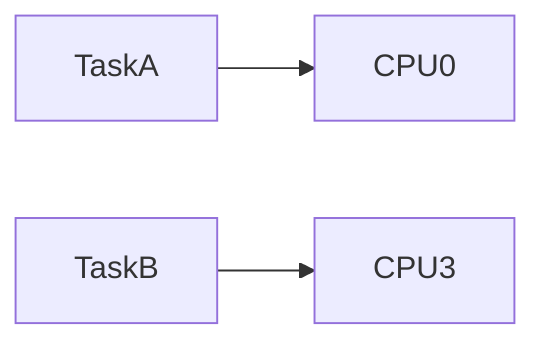

---

# Why Affinity Exists?

CPU caches.

Moving tasks frequently:

```text
Cache misses

Performance loss
```

Bad.

---

# NUMA Systems

Modern servers are complicated.

Example:

```text
CPU Group 1

Own Memory

----------------

CPU Group 2

Own Memory
```

Schedulers become smarter.

---

# NUMA Diagram

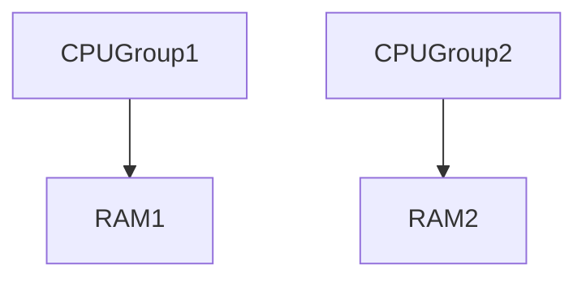

Distance matters.

---

# Scheduler Load Balancing

Problem:

```text
CPU0 = 100%

CPU1 = 10%
```

Linux moves tasks.

---

# Load Balancing Diagram

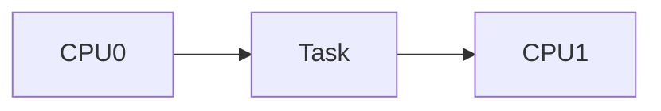

---

# Scheduler And Docker

Containers are processes.

Scheduler doesn't see:

```text
Docker
```

Scheduler sees:

```text
Processes
```

That's it.

---

# Docker Architecture

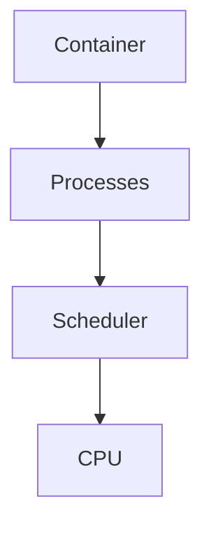

---

# Scheduler And Kubernetes

Pods become:

```text
Pods

↓

Containers

↓

Processes

↓

Scheduler

↓

CPU
```

Everything eventually becomes Linux tasks.

---

# Kubernetes Resource Limits

Example:

```yaml
cpu: 500m
```

Eventually:

```text
cgroups

↓

Scheduler
```

---

# Production Problem: CPU Starvation

Example:

```text
One process

↓

Consumes everything

↓

Other processes wait
```

Symptoms:

```text
High latency

Timeouts

Slow systems
```

---

# CPU Starvation Diagram

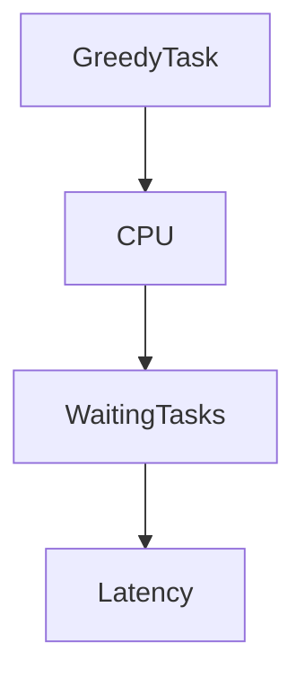

---

# Production Problem: Context Switch Storm

Symptoms:

```text
10000 threads

↓

Massive switching

↓

CPU wasted
```

Performance collapses.

---

# Production Problem: Thread Explosion

Bad architecture:

```text
1 thread

↓

1 request
```

At:

```text
100000 users
```

System dies.

---

# Why Nginx Is Fast

Instead of:

```text
100000 threads
```

Nginx uses:

```text
Few workers

Event loops

epoll
```

Huge improvement.

---

# Scheduler + epoll

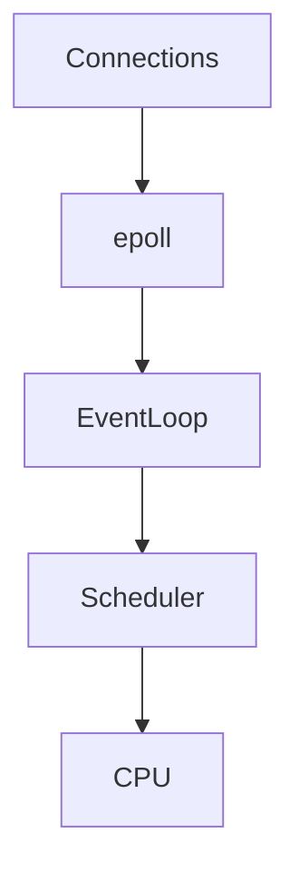

Efficient.

---

# Observability Tools

View CPU:

```bash
top
```

---

# Per CPU usage:

```bash
mpstat
```

---

# Process stats:

```bash
pidstat
```

---

# Scheduler stats:

```bash
vmstat
```

---

# Context switches:

```bash
pidstat -w
```

---

# Deep tracing:

```bash
perf

bpftrace
```

---

# ProcFS Connection

Scheduler information exists in:

```text
/proc/stat

/proc/schedstat
```

Everything eventually becomes ProcFS.

---

# Performance Checklist

Slow server?

Check:

```text
CPU usage

Run queue length

Load average

Context switches

CPU throttling

CPU affinity
```

---

# Security Considerations

Scheduler abuse exists.

Examples:

```text
Fork bombs

CPU miners

Infinite loops

Thread explosions
```

Protect using:

```text
cgroups

Limits

Monitoring
```

---

# Common Beginner Mistakes

## Mistake 1

Thinking CPUs execute everything simultaneously.

---

## Mistake 2

Confusing load with CPU usage.

---

## Mistake 3

Ignoring context switching.

---

## Mistake 4

Ignoring CPU affinity.

---

## Mistake 5

Ignoring cgroups.

---

## Mistake 6

Thinking Docker has its own scheduler.

Linux does.

---

# Engineering Mindset

Do not think:

```text
Applications run.
```

Think:

```text
Applications compete.

Linux arbitrates.

CPU time is rented.
```

---

# Interview Questions

### Beginner

What is a scheduler?

---

### Intermediate

What is a run queue?

---

### Intermediate

Difference between running and runnable?

---

### Advanced

Explain CFS.

---

### Advanced

What is vruntime?

---

### Senior

How does Linux scale scheduling across 64 cores?

---

### Architect

Explain why modern cloud infrastructure ultimately depends on Linux scheduler decisions.

---

# Mind Map

```mermaid
mindmap

root((Scheduler Internals))

CPU

Processes

Run Queues

CFS

Virtual Runtime

Context Switching

Load Balancing

Affinity

NUMA

Docker

Kubernetes

Performance

Observability

Production Systems
```

---

# Cheat Sheet

```text
Scheduler = CPU Traffic Controller

Core Concepts:

Run Queue

Time Slice

Context Switch

Virtual Runtime

CFS

CPU Affinity

Load Balancing

Golden Rules:

Nobody owns the CPU.

Everyone competes.

Linux arbitrates.

Containers are processes.

Cloud infrastructure eventually becomes scheduler decisions.
```

---

# Final Thought

At this exact moment...

Billions of applications...

Millions of databases...

Thousands of Kubernetes clusters...

Millions of Docker containers...

Are all asking one question to Linux:

> Can I have the CPU for a tiny moment?

The Linux scheduler spends its entire life answering that question.

And that tiny decision powers modern civilization.
