# Linux I/O Models

> Modern internet infrastructure is fundamentally a giant waiting system.

> CPUs are fast.

> Hardware is slow.

> Linux exists to manage waiting.

---

# Why This Exists

Imagine a server.

```text
16 CPU cores

10000 users

10000 network connections

10000 requests
```

Question:

Can CPUs process all users simultaneously?

No.

The real problem is worse.

Most applications are not computing.

They are waiting.

Waiting for:

```text
Disk

Network

Database

Memory

External APIs

Users
```

This is why I/O models exist.

---

# The Biggest Mindset Shift

Stop thinking:

```text
Applications spend time computing.
```

Think:

```text
Applications spend most of their lives waiting.
```

Modern servers are waiting machines.

---

# Mental Model: Linux Is A Restaurant

Imagine a restaurant.

```text
Restaurant = Linux

Customers = Connections

Waiters = Threads

Kitchen = CPU

Food Preparation = I/O
```

Question:

Should one waiter stand beside one customer?

Obviously not.

That would waste workers.

Linux solved the same problem.

---

# What Is I/O?

I/O means:

```text
Input / Output
```

Data moving between systems.

Examples:

```text
Read file

Write file

Network communication

Database query

Keyboard input

API calls
```

Anything waiting for external resources is I/O.

---

# The Golden Rule

> CPUs are millions of times faster than I/O devices.

---

# CPU vs Hardware Speed

Approximate numbers:

```text
CPU Register

0.5 ns

L1 Cache

1 ns

RAM

100 ns

SSD

100 µs

Network

1 ms

Internet

10-100 ms
```

Huge difference.

---

# Speed Diagram

```text
CPU Register

↓

L1 Cache

↓

RAM

↓

SSD

↓

Network

↓

Internet
```

Every layer gets slower.

---

# Why This Is A Problem

Imagine:

```python
data = read_database()
```

Database response:

```text
100ms
```

CPU speed:

```text
0.5ns
```

CPU spends almost all time waiting.

---

# CPU Waste Diagram


Waiting is expensive.

---

# Linux I/O Evolution

Linux evolved through multiple models.

```text
Blocking I/O

↓

Non-Blocking I/O

↓

I/O Multiplexing

↓

Signal Driven I/O

↓

Asynchronous I/O

↓

io_uring
```

Each solves scalability problems.

---

# Evolution Diagram


---

# Model 1: Blocking I/O

This is the simplest.

Example:

```python
data = socket.recv()
```

Process:

```text
Request

↓

Wait

↓

Wait

↓

Wait

↓

Receive Data

↓

Continue
```

CPU is wasted.

---

# Blocking Diagram

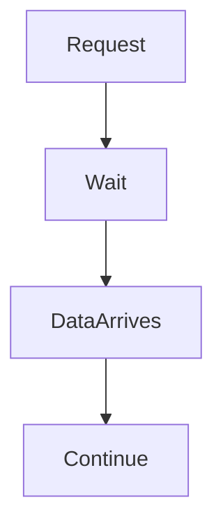

Simple.

But inefficient.

---

# Restaurant Analogy

One waiter.

One customer.

Waiter stands forever.

Terrible utilization.

---

# Thread Per Connection Problem

Imagine:

```text
10000 users
```

Blocking approach:

```text
10000 threads
```

Disaster.

---

# Why?

Threads consume:

```text
Memory

Context switches

CPU overhead
```

System eventually collapses.

---

# Thread Explosion Diagram

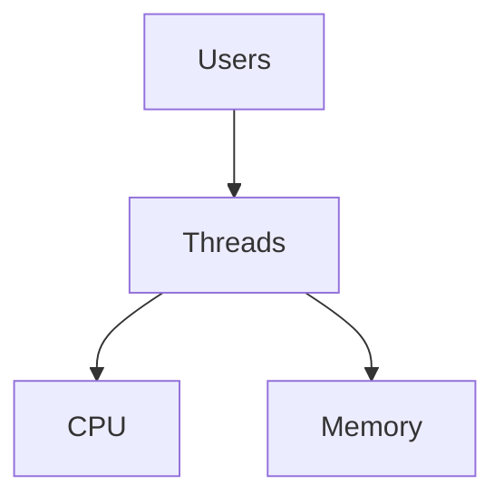

---

# Model 2: Non-Blocking I/O

Idea:

Don't wait.

Ask:

```text
Do you have data?
```

If no:

```text
Come back later.
```

---

# Example

```python
socket.setblocking(False)
```

Now:

```text
Ask

↓

No Data

↓

Continue Working
```

Better.

---

# Problem

Applications start polling.

Example:

```python
while True:

 if socket.ready():

   read()
```

CPU waste.

---

# Polling Diagram

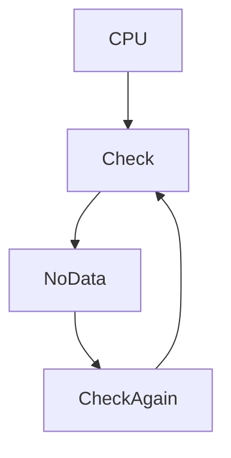

Busy waiting.

Bad.

---

# Model 3: select()

Linux says:

> Give me many FDs.

> I'll tell you who is ready.

---

# select Architecture

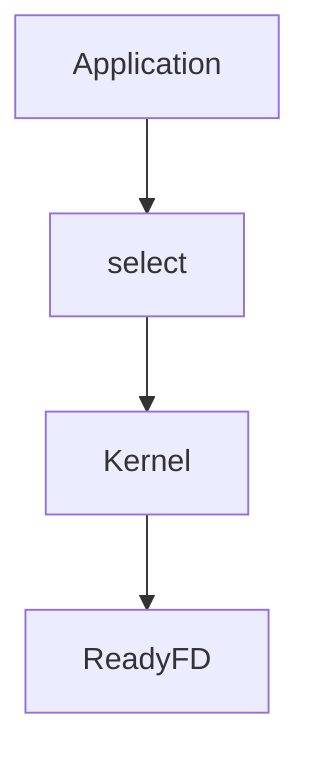

---

# Example

```text
100 sockets

↓

select()

↓

3 ready
```

Process only those 3.

Huge improvement.

---

# Problem With select()

Limitation:

```text
1024 file descriptors
```

Also:

```text
O(n)
```

Linux scans everything.

Slow.

---

# Model 4: poll()

Improvement over select.

Advantages:

```text
No FD limit
```

But still:

```text
O(n)
```

Linux still scans.

---

# poll Diagram

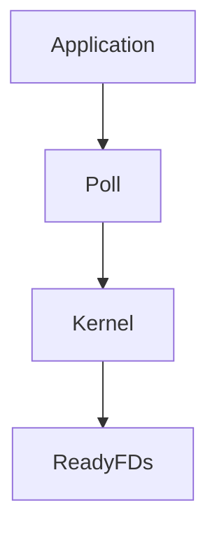

Better.

Still inefficient.

---

# Model 5: epoll

This changed the internet.

Linux says:

> Register your FDs once.

> I'll notify you when something happens.

This is revolutionary.

---

# epoll Mental Model

Restaurant:

Bad:

```text
Waiter repeatedly checks every customer.
```

Good:

```text
Customer rings bell.
```

Waiter only responds when needed.

---

# epoll Diagram

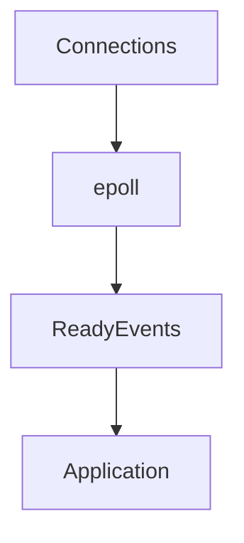

---

# epoll Complexity

Old:

```text
O(n)
```

epoll:

```text
O(1)
```

Massive improvement.

---

# Why Nginx Is Fast

Nginx uses:

```text
Few worker processes

+

epoll

+

Event loop
```

Example:

```text
4 workers

100000 connections
```

Amazing efficiency.

---

# Nginx Architecture

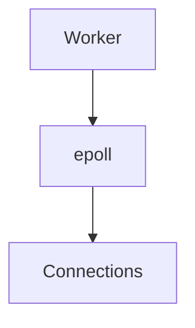

Few workers.

Massive scale.

---

# Why NodeJS Is Fast

NodeJS architecture:

```text
JavaScript

↓

Event Loop

↓

libuv

↓

epoll

↓

Linux
```

Everything eventually reaches epoll.

---

# NodeJS Diagram

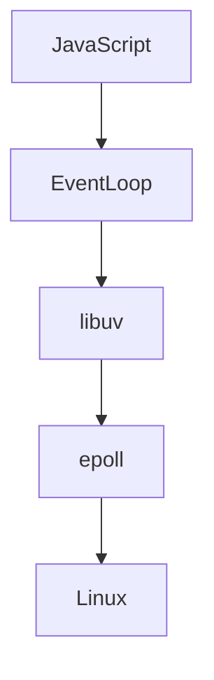

---

# Event Loop

Event loops are central.

Idea:

```text
One thread

Many tasks
```

Instead of:

```text
One thread

One task
```

---

# Event Loop Diagram

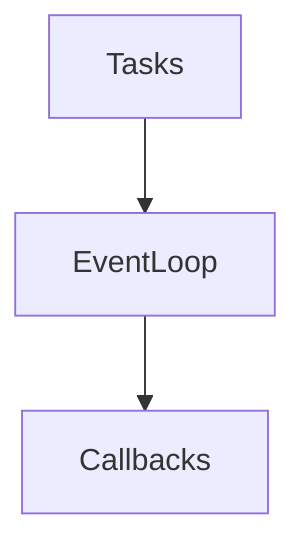

---

# Why Redis Is Fast

Redis:

```text
Single thread

Event loop

epoll
```

Millions of requests.

Very efficient.

---

# Why PostgreSQL Is Different

PostgreSQL uses:

```text
Process per connection
```

Architecture:

```text
Client

↓

Postgres Process

↓

Database
```

Different tradeoff.

---

# Database Architecture Comparison

Redis:

```text
1 process

↓

Many clients
```

PostgreSQL:

```text
1 client

↓

1 process
```

---

# PostgreSQL Diagram

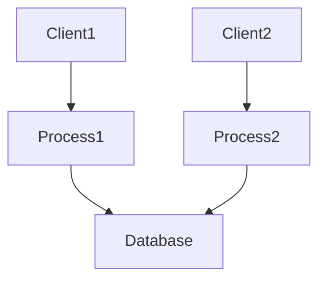

---

# Model 6: Signal Driven I/O

Linux sends notifications.

```text
Data arrives

↓

Signal

↓

Application wakes
```

Rarely used today.

Complex.

---

# Model 7: Asynchronous I/O

Application says:

```text
Do this.

Tell me when done.
```

Application continues working.

---

# Async Diagram

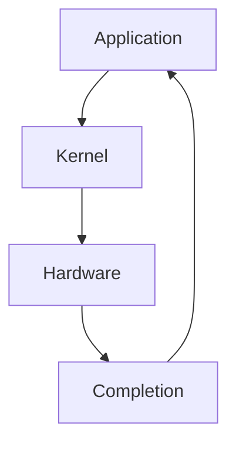

No waiting.

---

# Model 8: io_uring

Modern Linux revolution.

Introduced:

```text
Linux 5.1
```

Idea:

> Minimize kernel transitions.

---

# io_uring Architecture


Much faster.

---

# Why io_uring Is Important

Reduces:

```text
Syscalls

Context switches

Latency
```

Huge performance gains.

---

# The Modern Stack

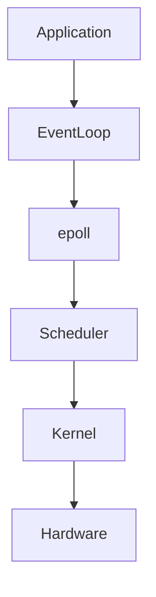

Everything works together.

---

# File Descriptor Connection

I/O models operate on:

```text
File descriptors
```

Examples:

```text
Sockets

Pipes

Files

Devices
```

Everything becomes FDs.

---

# Docker Connection

Docker containers eventually become:

```text
Processes

↓

FDs

↓

I/O models

↓

Linux
```

Everything reaches Linux.

---

# Kubernetes Connection

Pods become:

```text
Pod

↓

Container

↓

Process

↓

Sockets

↓

epoll

↓

Linux
```

Everything eventually becomes Linux I/O.

---

# Production Problem: Thread Explosion

Symptoms:

```text
100000 users

100000 threads
```

Results:

```text
High memory

High context switching

Poor performance
```

---

# Production Problem: Connection Storm

Example:

```text
50000 users

↓

50000 sockets

↓

Poor architecture

↓

Server collapse
```

---

# Production Problem: Slow APIs

Question:

Where is waiting happening?

Check:

```text
Database

External API

Disk

Network
```

Most performance issues are waiting problems.

---

# Waiting Pipeline

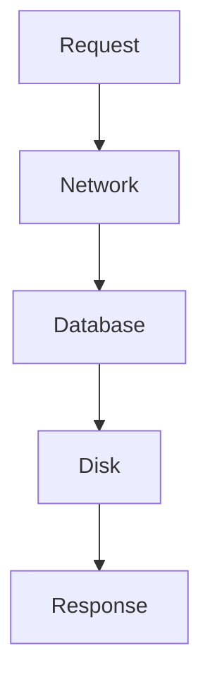

Every step can bottleneck.

---

# Performance Thinking

Always ask:

```text
Where is the waiting?

Who is waiting?

Why are they waiting?

Can we reduce waiting?
```

---

# Observability Tools

Network connections:

```bash
ss

netstat
```

Open FDs:

```bash
lsof
```

System calls:

```bash
strace
```

Performance:

```bash
perf
```

Deep tracing:

```bash
bpftrace
```

---

# Troubleshooting Checklist

Server slow?

Check:

```text
Thread count

Connection count

File descriptors

Context switches

Database latency

Network latency
```

---

# Security Considerations

Attackers abuse I/O too.

Examples:

```text
Connection floods

Slowloris attacks

FD exhaustion

Thread exhaustion
```

Protect systems.

---

# Common Beginner Mistakes

## Mistake 1

Thinking CPUs are slow.

They're incredibly fast.

---

## Mistake 2

Ignoring waiting time.

---

## Mistake 3

Creating one thread per user.

---

## Mistake 4

Ignoring file descriptors.

---

## Mistake 5

Ignoring epoll.

---

## Mistake 6

Thinking NodeJS magic exists.

Linux does the work.

---

# Engineering Mindset

Do not think:

```text
My server computes data.
```

Think:

```text
My server waits for data.

Linux optimizes waiting.
```

---

# Interview Questions

### Beginner

What is I/O?

---

### Intermediate

Difference between blocking and non-blocking I/O?

---

### Intermediate

What problem does epoll solve?

---

### Advanced

Why is Nginx fast?

---

### Advanced

How does NodeJS scale?

---

### Senior

Explain Linux I/O evolution.

---

### Architect

Explain why modern internet infrastructure is fundamentally a giant waiting system.

---

# Mind Map

```mermaid
mindmap

root((Linux I/O Models))

Blocking

NonBlocking

select

poll

epoll

Signal Driven

AIO

io_uring

Event Loops

NodeJS

Nginx

Redis

PostgreSQL

Docker

Kubernetes

Performance

Observability
```

---

# Cheat Sheet

```text
I/O = Waiting

Evolution:

Blocking

↓

NonBlocking

↓

select

↓

poll

↓

epoll

↓

AIO

↓

io_uring

Golden Rules:

CPUs are fast.

Hardware is slow.

Everything waits.

Linux optimizes waiting.

Modern internet depends on epoll.
```

---

# Final Thought

Every website...

Every API...

Every database...

Every Kubernetes cluster...

Every cloud provider...

Eventually becomes one giant question asked to Linux:

> While we wait for slow hardware, what useful work can we do next?

That question created event loops, epoll, NodeJS, Nginx, and modern internet architecture.
