# epoll Deep Dive

> epoll is one of the inventions that quietly powers the modern internet.

> Millions of servers survive millions of simultaneous users because Linux stopped asking:

> "Who is ready?"

and started saying:

> "I'll notify you when someone is ready."

---

# Why This Exists

Imagine a server.

```text
32 CPU cores

200,000 users

200,000 TCP connections

Thousands of requests per second
```

Question:

Can Linux continuously check all 200,000 connections?

No.

CPU would collapse.

Linux needed a smarter approach.

That solution became:

```text
epoll
```

---

# The Biggest Mindset Shift

Stop thinking:

```text
Applications process users.
```

Think:

```text
Applications wait for users.

Linux optimizes waiting.
```

epoll is a waiting optimization system.

---

# Mental Model: Linux Is A Hotel Receptionist

Imagine:

```text
Hotel = Server

Guests = Network Connections

Receptionist = Event Loop

Bell System = epoll
```

Bad receptionist:

```text
Walks to every room

Every second

Asks:

"Do you need anything?"
```

Terrible.

Good receptionist:

```text
Guest rings bell.

Receptionist responds.
```

This is epoll.

---

# What Is epoll?

epoll is:

> A Linux kernel event notification mechanism that efficiently monitors large numbers of file descriptors.

Keyword:

```text
Event Notification
```

Linux tells you when something is ready.

---

# The Golden Rule

> epoll watches file descriptors.

Remember:

```text
Sockets

Files

Pipes

Devices

Everything eventually becomes file descriptors.
```

---

# Why epoll Was Created

Before epoll:

Linux used:

```text
select()

poll()
```

Problems:

```text
Slow

Inefficient

CPU expensive

Poor scalability
```

---

# Evolution Of Linux Event Systems


Linux evolved because the internet evolved.

---

# The Core Problem

Imagine:

```text
100000 connections

Only 50 active
```

Question:

Should Linux scan all 100000?

No.

Wasteful.

Linux should only care about:

```text
50 active
```

This is epoll.

---

# The Old Way: select()

Application asks:

```text
Any connections ready?

Connection 1?

Connection 2?

Connection 3?

...

Connection 100000?
```

Very expensive.

---

# select Diagram

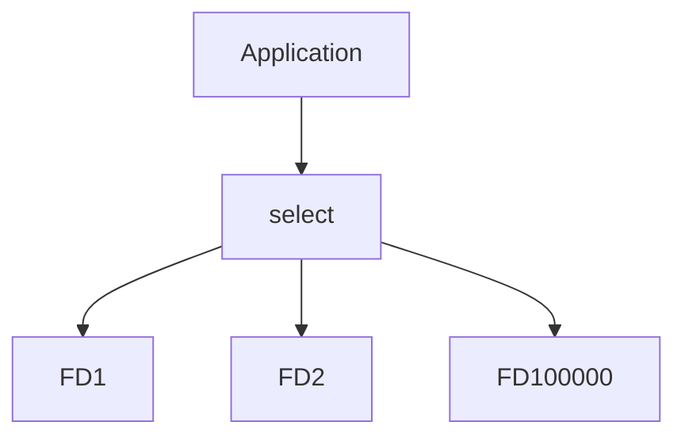

Every iteration scans everything.

---

# Complexity Problem

select:

```text
O(n)
```

Connections increase:

```text
1000

↓

10000

↓

100000
```

CPU usage explodes.

---

# poll()

Improvement.

Removed limits.

But still:

```text
O(n)
```

Still scanning.

Still inefficient.

---

# epoll Changes The Model

Instead of asking:

```text
Who is ready?
```

Linux says:

```text
I will notify you.
```

Huge difference.

---

# epoll Mental Model

Bad:

```text
Polling
```

Good:

```text
Notification
```

---

# epoll Architecture

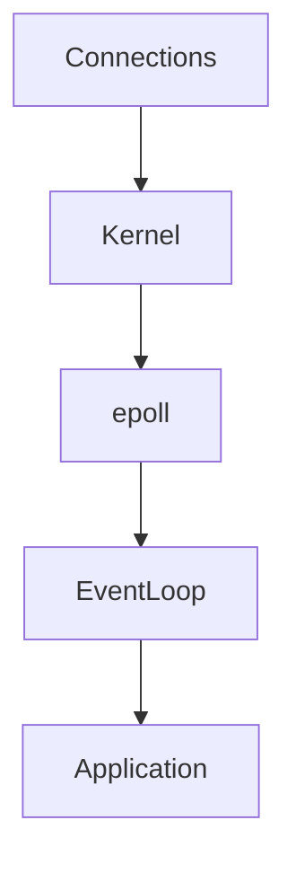

Linux does the watching.

Applications do the work.

---

# The Three epoll Operations

Every epoll system has three stages.

```text
Create

Register

Wait
```

---

# Stage 1: Create epoll Instance

Create event manager.

```c
epoll_create1()
```

Linux creates:

```text
Event Container
```

---

# Stage 2: Register File Descriptors

Add resources to monitor.

```c
epoll_ctl()
```

Example:

```text
Socket A

Socket B

Socket C
```

Linux remembers them.

---

# Stage 3: Wait For Events

```c
epoll_wait()
```

Application sleeps.

Linux watches.

---

# Lifecycle Diagram

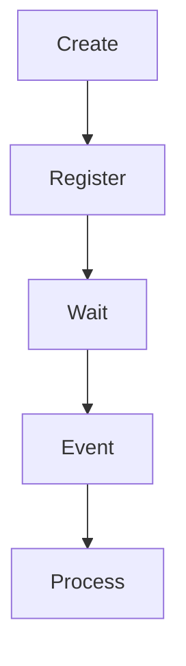

Simple.

Powerful.

---

# epoll Data Structures

Internally Linux creates:

```text
epoll instance

↓

Red Black Tree

↓

Ready Queue
```

---

# Internal Architecture

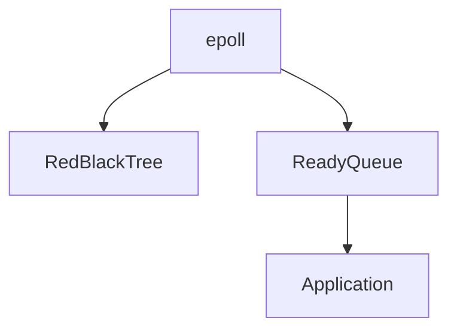

---

# Red Black Tree

Stores:

```text
Registered FDs
```

Operations:

```text
Insert

Delete

Search
```

Complexity:

```text
O(log n)
```

Efficient.

---

# Ready Queue

This is the secret.

Contains:

```text
Only active events
```

No scanning required.

---

# Event Flow


Very efficient.

---

# Event Driven Architecture

Old model:

```text
Ask repeatedly
```

New model:

```text
React when notified
```

Huge difference.

---

# Why epoll Is Fast

Three reasons.

---

# Reason 1: No Repeated Registration

Register once.

Linux remembers.

---

# Reason 2: No Scanning

Only active FDs.

---

# Reason 3: Event Notifications

Linux pushes events.

Applications react.

---

# Complexity Comparison

select:

```text
O(n)
```

poll:

```text
O(n)
```

epoll:

```text
Approximately O(1)
```

Huge improvement.

---

# Event Loop Architecture

epoll usually works with event loops.

Pattern:

```text
Wait

↓

Receive event

↓

Execute callback

↓

Wait again
```

Repeat forever.

---

# Event Loop Diagram

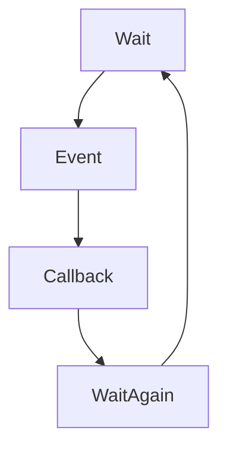

---

# Why Nginx Is Fast

Nginx architecture:

```text
4 workers

200000 connections
```

No problem.

Why?

```text
Workers

↓

epoll

↓

Connections
```

---

# Nginx Diagram

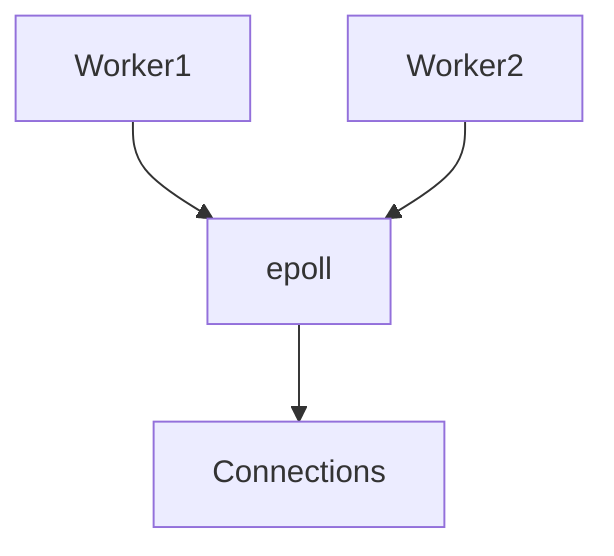

Few workers.

Massive scale.

---

# Why NodeJS Is Fast

NodeJS architecture:

```text
JavaScript

↓

Event Loop

↓

libuv

↓

epoll

↓

Linux
```

Everything eventually reaches epoll.

---

# NodeJS Architecture

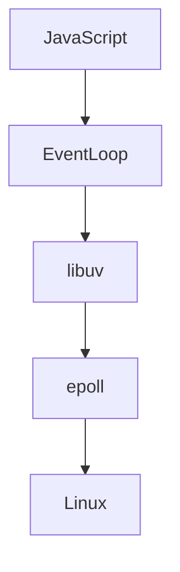

---

# Why Redis Is Fast

Redis architecture:

```text
Single Thread

↓

Event Loop

↓

epoll
```

Millions of operations.

Efficient.

---

# Redis Diagram

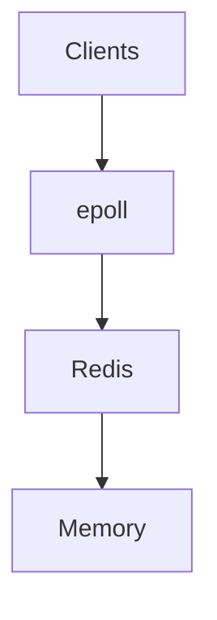

---

# PostgreSQL Is Different

PostgreSQL traditionally uses:

```text
Process per connection
```

Tradeoff:

Advantages:

```text
Isolation

Stability
```

Disadvantages:

```text
Memory usage

Process overhead
```

Different architecture.

---

# The Linux Internet Stack

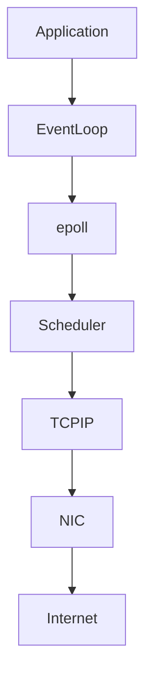

Everything works together.

---

# epoll And File Descriptors

Remember:

epoll never watches:

```text
Users
```

epoll watches:

```text
File descriptors
```

Examples:

```text
Socket FD

Pipe FD

Timer FD

Event FD
```

Everything becomes integers.

---

# Example Connection Lifecycle

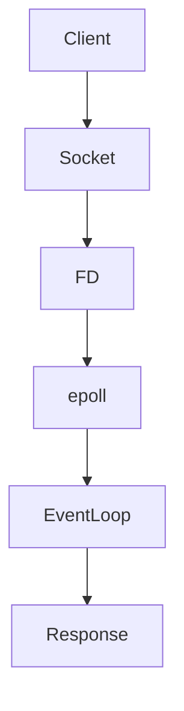

This powers websites.

---

# Level Triggered Mode

Default behavior.

Rule:

```text
If data exists

Keep notifying
```

Simple.

Safe.

---

# Level Trigger Example

```text
10 bytes unread

↓

Notify

↓

5 bytes remain

↓

Notify again
```

---

# Edge Triggered Mode

More efficient.

Rule:

```text
Notify once

Process everything
```

Application responsibility increases.

---

# Edge Trigger Diagram

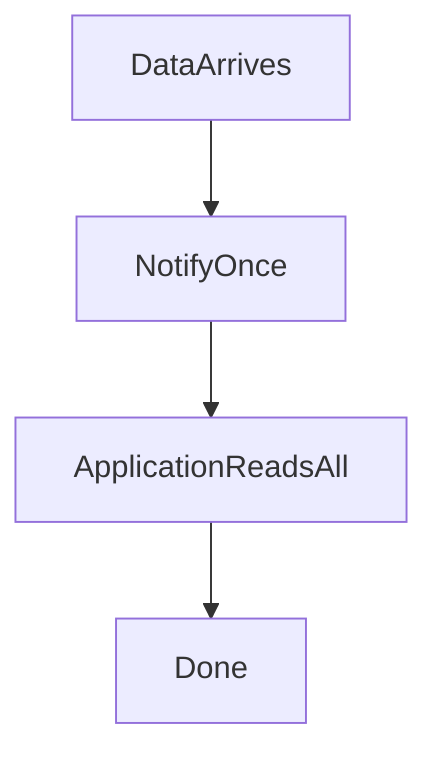

---

# Level Trigger vs Edge Trigger

Level Trigger:

```text
Simple

Safer

More notifications
```

Edge Trigger:

```text
Faster

Efficient

More complex
```

Tradeoffs exist.

---

# Docker Connection

Docker eventually becomes:

```text
Containers

↓

Processes

↓

Sockets

↓

FDs

↓

epoll
```

Everything eventually reaches Linux.

---

# Kubernetes Connection

Pods become:

```text
Pod

↓

Container

↓

Process

↓

Socket

↓

epoll
```

Everything becomes Linux.

---

# Production Problem: Thread Explosion

Bad architecture:

```text
100000 users

↓

100000 threads
```

System collapses.

---

# Better Architecture

```text
4 workers

↓

epoll

↓

100000 users
```

Huge difference.

---

# Production Problem: Slow APIs

Always ask:

```text
What are we waiting for?
```

Possible answers:

```text
Database

Network

Disk

External APIs
```

Most latency is waiting.

---

# Slow Request Pipeline

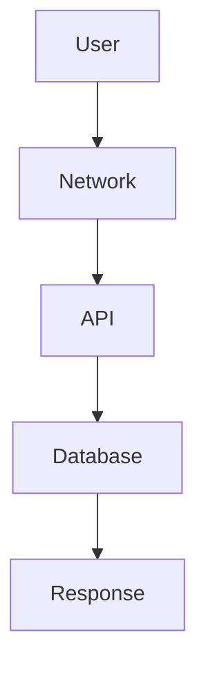

Every layer can bottleneck.

---

# Performance Considerations

epoll reduces:

```text
CPU usage

Context switching

Memory usage

Thread count
```

Massive improvements.

---

# Security Considerations

Attackers abuse connections.

Examples:

```text
Slowloris

Connection floods

FD exhaustion

Resource starvation
```

Protect with:

```text
Rate limiting

Connection limits

Timeouts

Monitoring
```

---

# Observability Tools

View connections:

```bash
ss -tulnp
```

Open FDs:

```bash
lsof
```

Performance:

```bash
perf
```

Deep tracing:

```bash
bpftrace
```

Observe network queues:

```bash
sar -n DEV
```

---

# Production Troubleshooting Checklist

Server slow?

Check:

```text
Connection count

FD count

CPU usage

Context switches

Database latency

Network latency
```

Always investigate waiting.

---

# Common Beginner Mistakes

## Mistake 1

Thinking epoll watches users.

It watches file descriptors.

---

## Mistake 2

Thinking epoll is NodeJS technology.

Linux created it.

---

## Mistake 3

Thinking Nginx magic exists.

epoll does the work.

---

## Mistake 4

Ignoring event loops.

---

## Mistake 5

Creating one thread per user.

---

## Mistake 6

Ignoring file descriptor limits.

---

# Engineering Mindset

Do not think:

```text
My server processes requests.
```

Think:

```text
My server waits for events.

Linux notifies me.

I react efficiently.
```

This is modern backend engineering.

---

# Interview Questions

### Beginner

What is epoll?

---

### Intermediate

Why is epoll better than select?

---

### Intermediate

What problem does epoll solve?

---

### Advanced

Explain epoll internals.

---

### Advanced

Difference between level triggered and edge triggered?

---

### Senior

Why can Nginx handle 100000 connections?

---

### Architect

Explain why the modern internet fundamentally depends on epoll.

---

# Mind Map

```mermaid
mindmap

root((epoll))

File Descriptors

Event Loops

select

poll

Red Black Tree

Ready Queue

Nginx

NodeJS

Redis

Docker

Kubernetes

Performance

Observability
```

---

# Cheat Sheet

```text
epoll = Linux Event Notification System

Core Operations:

epoll_create1()

epoll_ctl()

epoll_wait()

Key Components:

Red Black Tree

Ready Queue

Advantages:

Scalable

Efficient

Low CPU

Low Memory

Golden Rules:

epoll watches file descriptors.

Linux notifies applications.

Applications react.

Modern internet depends on epoll.
```

---

# Final Thought

Every time someone opens:

```text
YouTube

Instagram

Netflix

Amazon

GitHub

ChatGPT
```

Millions of Linux servers are doing something incredibly simple.

They are not constantly checking every user.

They are patiently waiting.

And when something happens, Linux quietly whispers:

> This connection is ready.

That whisper is called **epoll**.
