# CPU Management

> CPUs are the most expensive shared resource in a computer.

> Modern infrastructure is a giant competition for CPU time.

> Linux exists to manage that competition.

---

# Why This Exists

Imagine a machine.

```text
64 CPU cores

256 GB RAM

100 Docker containers

50 microservices

20000 users

Millions of requests
```

Question:

> Who gets CPU time?

Linux must answer this every microsecond.

Without CPU management:

```text
Applications freeze

Latency explodes

Servers crash

Users timeout

Infrastructure collapses
```

CPU management is civilization management.

---

# The Biggest Mindset Shift

Stop thinking:

```text
CPU executes applications.
```

Think:

```text
Applications compete.

Linux arbitrates.

CPU time is rented.

Nobody owns the CPU.
```

---

# Mental Model: CPU Is A Water Supply

Imagine a city.

```text
Linux = Water Authority

CPU = Water

Applications = Buildings

Containers = Apartments

Scheduler = Distribution System
```

Question:

Can one building consume all water?

No.

Linux enforces fairness.

---

# What Is CPU Management?

CPU management is:

> The process of allocating finite CPU resources across competing workloads.

Linux continuously answers:

```text
Who runs?

Where do they run?

For how long?

At what priority?

How much CPU can they consume?
```

Millions of times per second.

---

# The Golden Rule

> CPUs are finite.

> Demand is infinite.

Linux balances both.

---

# The CPU Hierarchy

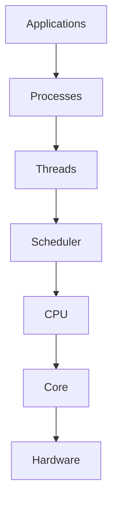

Everything eventually reaches the CPU.

---

# CPU Is Not A Single Thing

Modern CPUs are complex.

Example:

```text
CPU

↓

Sockets

↓

Cores

↓

Threads
```

---

# Modern CPU Architecture

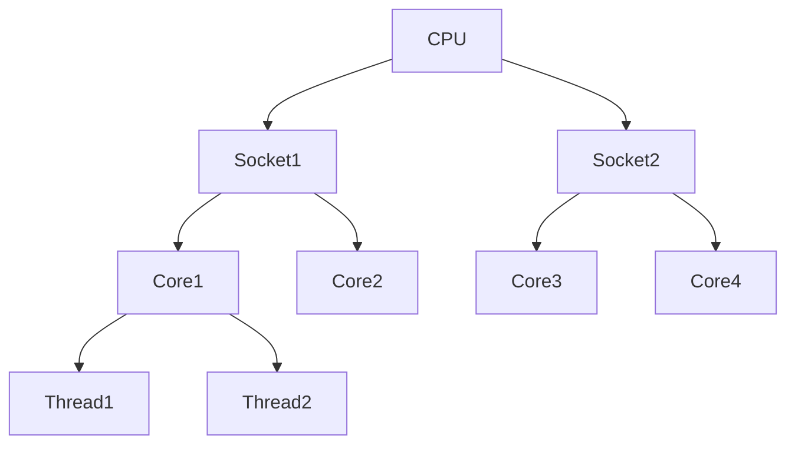

---

# Important Terms

## CPU

Physical processor package.

---

## Socket

Physical CPU installed on motherboard.

---

## Core

Independent execution engine.

---

## Thread

Virtual execution unit.

---

# Example Machine

```text
1 Socket

↓

8 Cores

↓

16 Threads
```

Linux sees:

```text
16 Logical CPUs
```

---

# Hyperthreading

One physical core exposes multiple logical CPUs.

Example:

```text
Physical Core

↓

Logical CPU 0

Logical CPU 1
```

Not double performance.

Usually:

```text
20%-40% improvement
```

Depends on workload.

---

# Hyperthreading Diagram

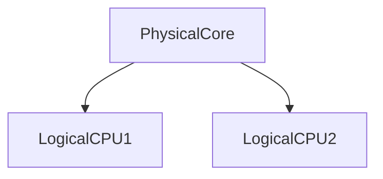

---

# Linux CPU View

View CPUs:

```bash
lscpu
```

Shows:

```text
Sockets

Cores

Threads

NUMA nodes
```

Linux builds a topology map.

---

# CPU Topology Diagram

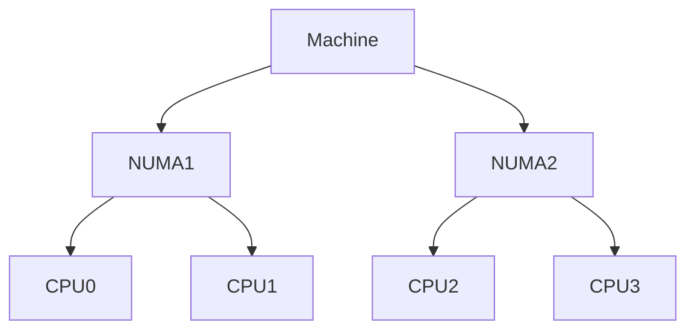

Linux understands physical placement.

---

# CPU Lifecycle

Every task follows:

```text
Create

↓

Wait

↓

Run

↓

Sleep

↓

Wake

↓

Finish
```

Repeat continuously.

---

# CPU Lifecycle Diagram

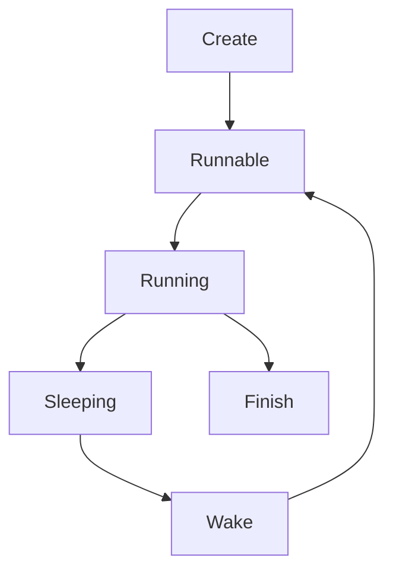

---

# The CPU Competition

Imagine:

```text
1 CPU

1000 processes
```

Impossible.

Linux creates an illusion.

---

# Concurrency Illusion

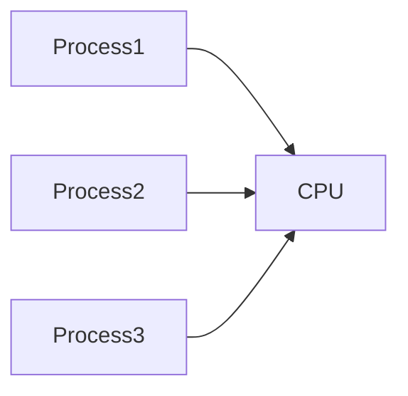

Linux switches extremely fast.

Users believe everything is simultaneous.

---

# CPU Scheduling Pipeline

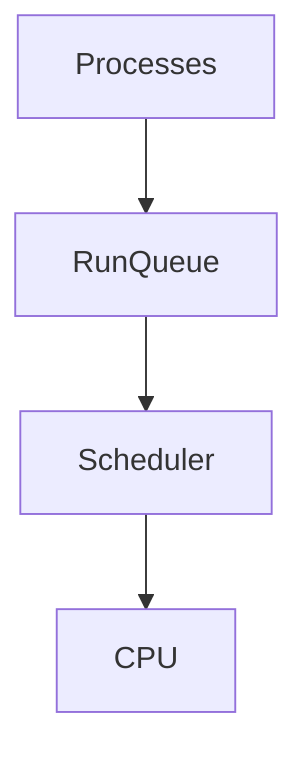

This pipeline powers everything.

---

# CPU Utilization

CPU states:

```text
User

System

Idle

I/O Wait

Steal

Nice
```

Very important.

---

# User CPU

Time spent executing applications.

Examples:

```text
NodeJS

Python

Java

Nginx
```

---

# System CPU

Time spent inside Linux kernel.

Examples:

```text
Syscalls

Networking

Scheduling

Memory management
```

---

# Idle CPU

Unused CPU.

Good.

Not always bad.

---

# I/O Wait

CPU waiting for hardware.

Examples:

```text
Disk

Database

Network
```

This is NOT CPU work.

---

# Steal Time

Virtualization metric.

Means:

```text
Hypervisor stole CPU time.
```

Common in cloud systems.

---

# CPU State Diagram

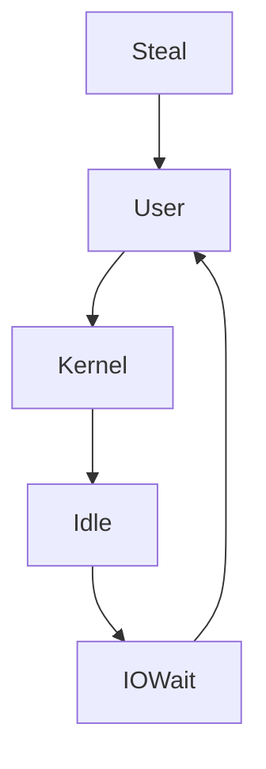

---

# CPU Usage Is Misleading

Example:

```text
CPU = 20%
```

Question:

Healthy?

Maybe.

Question:

```text
CPU = 95%
```

Healthy?

Maybe.

Context matters.

---

# CPU Management Is About Latency

Always ask:

```text
Can requests finish on time?
```

Not:

```text
Is CPU high?
```

High CPU can be healthy.

---

# CPU Saturation

Question:

> Is demand greater than capacity?

Symptoms:

```text
High load average

High latency

Timeouts

Growing queues
```

---

# CPU Saturation Diagram

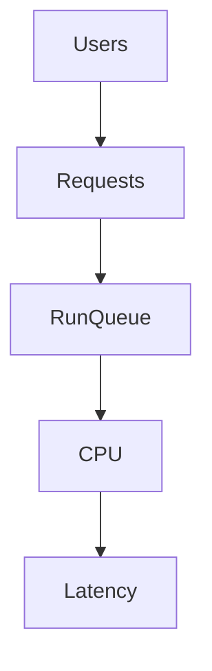

---

# CPU Bound Systems

Definition:

> Systems limited by CPU.

Examples:

```text
Video encoding

Compression

AI inference

Encryption
```

---

# I/O Bound Systems

Definition:

> Systems limited by waiting.

Examples:

```text
APIs

Databases

Web servers

Microservices
```

Most systems are I/O bound.

---

# CPU Bound vs I/O Bound

```text
CPU Bound

↓

More cores help

----------------

I/O Bound

↓

Faster storage helps

Faster networking helps
```

---

# CPU Affinity

Question:

> Which CPU should this task run on?

Linux can pin workloads.

Example:

```bash
taskset
```

Benefits:

```text
Cache locality

Predictability

Lower latency
```

---

# Affinity Diagram

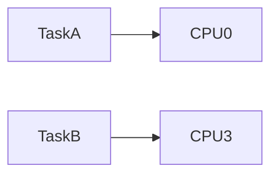

---

# CPU Cache Hierarchy

CPU speed depends heavily on cache.

Hierarchy:

```text
L1

↓

L2

↓

L3

↓

RAM
```

Each layer gets slower.

---

# Cache Diagram

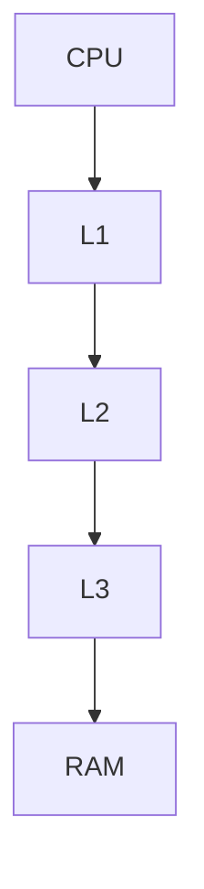

Cache misses are expensive.

---

# NUMA

Modern servers are not uniform.

NUMA:

```text
Non Uniform Memory Access
```

Means:

```text
Nearby memory

↓

Fast

Far memory

↓

Slow
```

---

# NUMA Diagram

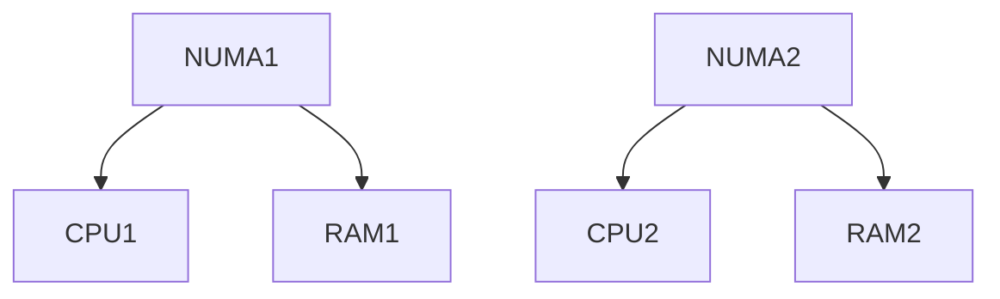

Distance matters.

---

# CPU Management And cgroups

Linux limits CPU usage.

Example:

```text
Container A

2 CPUs

Container B

1 CPU
```

Linux enforces fairness.

---

# cgroup Diagram

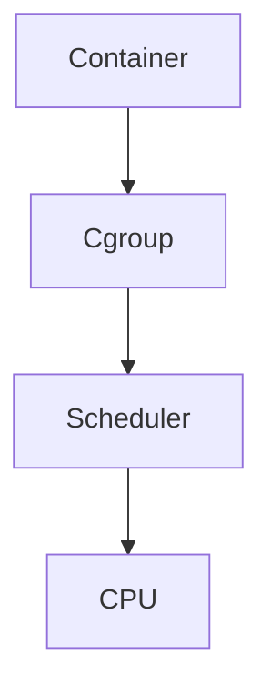

---

# Docker Connection

Example:

```bash
docker run --cpus=2 nginx
```

Docker translates this into:

```text
Linux cgroups
```

Linux does the work.

---

# Kubernetes Connection

Example:

```yaml
resources:

 requests:

   cpu: "500m"

 limits:

   cpu: "2"
```

Eventually becomes:

```text
Kubernetes

↓

Container Runtime

↓

cgroups

↓

Linux Scheduler

↓

CPU
```

---

# Kubernetes Flow

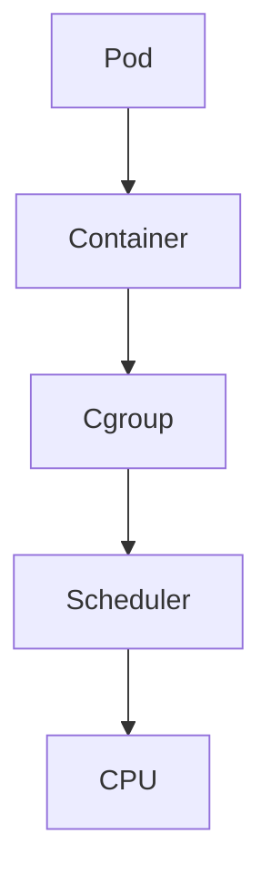

Everything eventually reaches Linux.

---

# CPU Throttling

Very common production issue.

Symptoms:

```text
Normal CPU usage

High latency

Slow APIs
```

Cause:

```text
CPU quota reached.
```

Linux intentionally slows workloads.

---

# Throttling Diagram

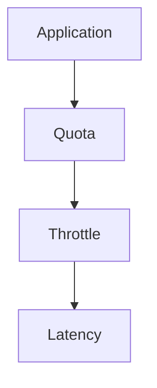

---

# CPU Overcommitment

Very common in cloud.

Example:

```text
8 CPUs

20 containers

Everyone wants CPU
```

Works because:

```text
Not everyone needs CPU simultaneously.
```

Risky if wrong.

---

# Production Bottlenecks

CPU bottlenecks include:

```text
Thread explosion

Infinite loops

Bad algorithms

Encryption overload

Compression overload

Context switch storms
```

---

# Production Example: Microservices

Request flow:


Every service consumes CPU.

Latency accumulates.

---

# Production Troubleshooting Workflow

Slow system?

Think:

```text
Users

↓

Requests

↓

Processes

↓

CPU

↓

Hardware
```

Never start with dashboards.

Start with systems thinking.

---

# CPU Pressure Indicators

Check:

```bash
uptime

top

htop

vmstat

mpstat

pidstat
```

---

# Important Metrics

Monitor:

```text
CPU usage

Load average

Run queue length

Context switches

CPU throttling

Steal time

Cache misses
```

---

# Observability Architecture

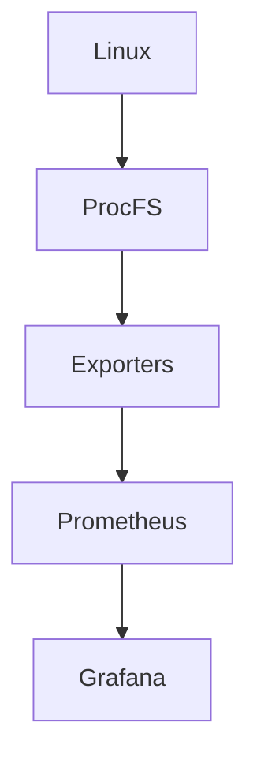

---

# Security Considerations

CPU abuse exists.

Examples:

```text
Crypto miners

Fork bombs

Infinite loops

DDoS amplification
```

Protect systems.

---

# Common Beginner Mistakes

## Mistake 1

Thinking high CPU is always bad.

---

## Mistake 2

Confusing CPU usage with performance.

---

## Mistake 3

Ignoring I/O wait.

---

## Mistake 4

Ignoring throttling.

---

## Mistake 5

Ignoring affinity.

---

## Mistake 6

Thinking Docker manages CPUs.

Linux does.

---

# Engineering Mindset

Do not think:

```text
My application runs on CPUs.
```

Think:

```text
My application competes.

Linux arbitrates.

CPU time is rented.
```

This is infrastructure thinking.

---

# Interview Questions

### Beginner

What is CPU management?

---

### Intermediate

Difference between core and thread?

---

### Intermediate

What is CPU affinity?

---

### Advanced

Explain CPU throttling.

---

### Advanced

Difference between CPU bound and I/O bound workloads?

---

### Senior

How does Kubernetes CPU management work internally?

---

### Architect

Explain why modern cloud infrastructure is fundamentally CPU arbitration at planetary scale.

---

# Mind Map

```mermaid
mindmap

root((CPU Management))

CPU Topology

Sockets

Cores

Threads

Scheduler

Run Queues

Affinity

Caches

NUMA

Docker

Kubernetes

Cgroups

Performance

Observability
```

---

# Cheat Sheet

```text
CPU Management = Resource Arbitration

Core Concepts:

Scheduler

Run Queue

Affinity

Caches

NUMA

Throttling

CPU Bound

I/O Bound

Golden Rules:

CPU is finite.

Demand is infinite.

Nobody owns CPU time.

Linux arbitrates everything.

Cloud infrastructure eventually becomes CPU management.
```

---

# Final Thought

Every cloud provider...

Every Kubernetes cluster...

Every AI workload...

Every database...

Every Docker container...

Every API request...

Eventually becomes one giant competition for an extremely precious resource.

That resource is not RAM.

It is not storage.

It is not networking.

It is **time on a CPU core**.

Linux spends every microsecond deciding who deserves that time.
