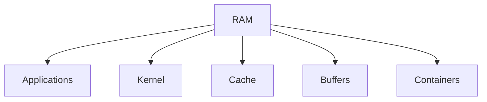
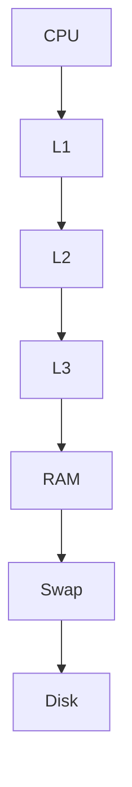
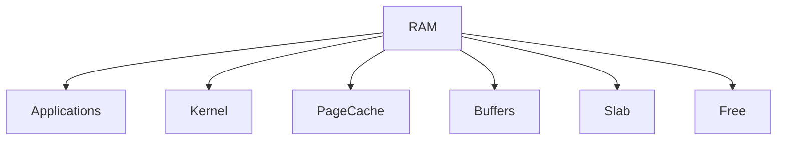
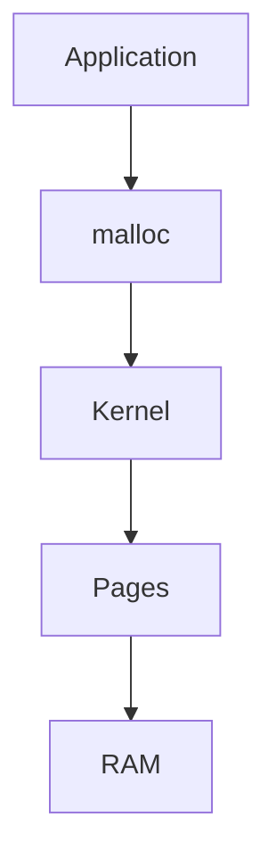
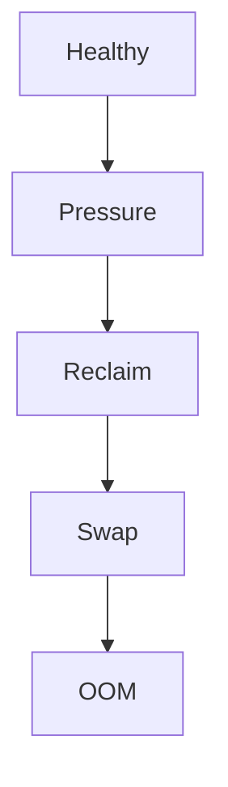
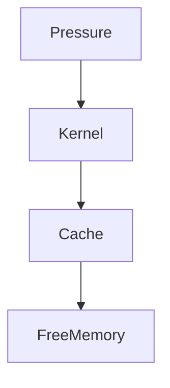
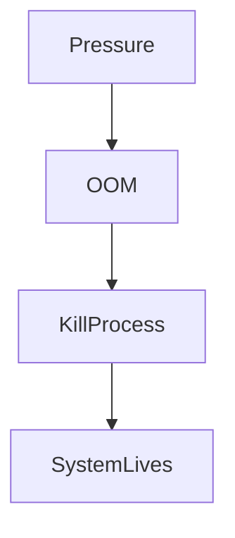
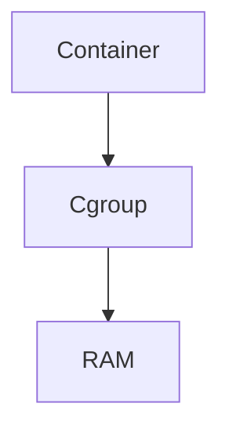
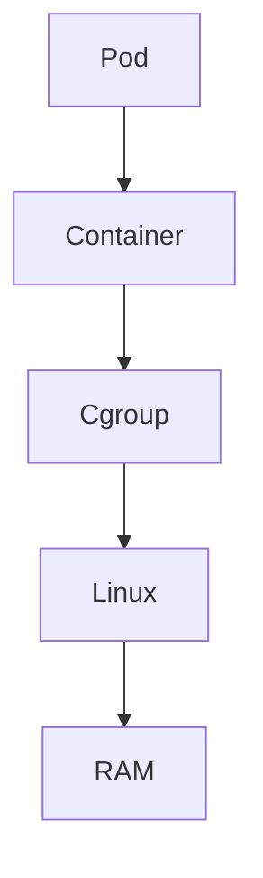
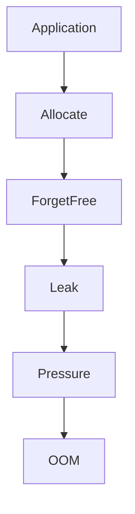

# Memory Pressure

> Linux does not fail when memory becomes full.

> Linux fails when memory demand exceeds Linux's ability to manage memory efficiently.

That condition is called:

> Memory Pressure.

---

# Why This Exists

Imagine a server.

```text
32 CPU cores

64 GB RAM

PostgreSQL

Redis

Nginx

NodeJS

Docker

Prometheus

20000 users
```

Everything works.

Traffic increases.

Suddenly:

```text
Slow APIs

High latency

Pod restarts

Disk activity spikes

OOM kills
```

Question:

Did RAM become full?

Maybe.

But that is not the root problem.

The real problem is:

```text
Memory pressure.
```

---

# The Biggest Mindset Shift

Stop thinking:

```text
Memory full = Bad
```

Think:

```text
Memory is always full.

Unmanageable memory demand = Bad
```

This is Linux engineering.

---

# Mental Model: RAM Is A City

Imagine:

```text
RAM = City

Applications = Citizens

Kernel = Mayor

Disk = Emergency Warehouse

OOM Killer = Emergency Evacuation Team
```

As the city fills:

```text
Linux reorganizes resources.
```

If demand exceeds capacity:

```text
Chaos begins.
```

---

# What Is Memory Pressure?

Memory pressure is:

> A condition where memory demand exceeds the kernel's ability to efficiently satisfy allocation requests.

Linux enters survival mode.

---

# The Golden Rule

> Memory pressure is not about memory quantity.

> Memory pressure is about memory competition.

---

# Memory Is A Shared Resource

Everything competes.

```text
Applications

Kernel

Filesystem Cache

Buffers

Containers

Databases

Monitoring Tools
```

Everyone wants RAM.

---

# Memory Competition Diagram



---

# Linux Memory Hierarchy



The farther away:

```text
The slower it gets.
```

---

# Why Linux Uses RAM Aggressively

Linux philosophy:

> Unused RAM is wasted RAM.

Linux intentionally fills RAM.

For:

```text
Page Cache

Buffers

Metadata

Performance optimization
```

This confuses beginners.

---

# Example

Bad interpretation:

```text
64GB RAM

60GB Used

4GB Free

Panic
```

Wrong.

Healthy server.

Because:

```text
40GB Page Cache
```

can be reclaimed.

---

# Memory Components

RAM is divided into:

```text
Application Memory

Kernel Memory

Page Cache

Buffers

Slab Memory

Free Memory
```

---

# Memory Layout



---

# Application Memory

Used by:

```text
Java

Python

NodeJS

Nginx

PostgreSQL
```

Direct process allocations.

---

# Kernel Memory

Used internally.

Examples:

```text
Networking

Scheduling

Inodes

File descriptors

Drivers
```

---

# Page Cache

Linux caches files.

Instead of:

```text
Disk

↓

Disk

↓

Disk
```

Linux does:

```text
Disk

↓

RAM

↓

Serve From RAM
```

Much faster.

---

# Page Cache Diagram


Page cache is performance.

---

# Buffers

Temporary storage.

Examples:

```text
Disk writes

Metadata

I/O optimization
```

---

# Slab Memory

Kernel object cache.

Stores:

```text
Inodes

Dentries

Task structures

Kernel objects
```

Linux avoids rebuilding objects repeatedly.

---

# Memory Allocation Lifecycle



Everything eventually becomes pages.

---

# Memory Is Managed In Pages

Linux does not manage bytes.

Linux manages:

```text
Pages
```

Typically:

```text
4 KB
```

Units.

---

# Example

```text
1 MB

↓

256 pages
```

Everything becomes pages.

---

# Memory Pressure Lifecycle

Linux enters phases.

```text
Healthy

↓

Moderate Pressure

↓

High Pressure

↓

Reclaim

↓

Swap

↓

OOM
```

---

# Memory Pressure Diagram



Linux escalates gradually.

---

# Stage 1: Healthy

Everything works.

Enough memory exists.

---

# Stage 2: Pressure Begins

Symptoms:

```text
Growing allocations

Growing caches

Growing applications
```

Linux notices.

---

# Stage 3: Memory Reclaim

Linux starts freeing memory.

Targets:

```text
Page Cache

Buffers

Inactive Pages
```

---

# Reclaim Diagram



---

# Stage 4: Swap

If reclaim fails:

Linux moves memory to disk.

```text
RAM

↓

Swap

↓

Disk
```

Slow.

---

# Swap Diagram


Swap is emergency storage.

---

# Stage 5: OOM Killer

If swap fails:

Linux kills processes.

Survival mode activated.

---

# OOM Diagram



---

# Why Memory Pressure Is Dangerous

Symptoms:

```text
Latency spikes

Slow APIs

Slow databases

Pod restarts

Timeouts

OOM kills
```

Performance collapses.

---

# Thrashing

Worst case scenario.

System continuously swaps.

```text
RAM

↓

Swap

↓

RAM

↓

Swap
```

No real work gets done.

---

# Thrashing Diagram


CPU wastes time moving memory.

---

# Linux Memory Watermarks

Linux uses thresholds.

```text
High

Medium

Low
```

Below thresholds:

Linux starts reclaiming.

---

# Watermark Diagram

```text
High

----------------

Medium

----------------

Low

----------------

Danger
```

---

# Databases And Memory Pressure

PostgreSQL:

Uses memory for:

```text
Shared buffers

Connections

WAL

Sorting

Queries
```

Memory demand grows quickly.

---

# Redis And Memory Pressure

Redis stores data in RAM.

Bad configuration:

```text
Unlimited memory
```

Dangerous.

Always set:

```text
maxmemory
```

---

# Java And Memory Pressure

Java is notorious.

Bad:

```text
64 GB machine

Java heap

60 GB
```

Linux has no room.

Disaster.

---

# Docker Connection

Docker containers share RAM.

Example:

```bash
docker run --memory=2g nginx
```

Docker uses:

```text
Linux cgroups
```

Linux enforces limits.

---

# Docker Diagram



---

# Kubernetes Connection

Example:

```yaml
resources:

 requests:

   memory: "512Mi"

 limits:

   memory: "1Gi"
```

Eventually becomes:

```text
Kubernetes

↓

Container Runtime

↓

cgroups

↓

Linux
```

---

# Kubernetes Memory Pipeline



Everything eventually becomes Linux memory management.

---

# Why Kubernetes Pods Restart

Very common.

Scenario:

```text
Java app

↓

Memory leak

↓

1GB limit

↓

1.5GB usage

↓

OOM kill

↓

Restart
```

Root cause:

```text
Linux memory pressure.
```

---

# Memory Leaks

Definition:

> Memory allocated but never released.

Symptoms:

```text
Memory usage continuously grows.
```

Eventually:

```text
Pressure

↓

OOM
```

---

# Leak Diagram



---

# Production Example

Machine:

```text
32 GB RAM
```

Services:

```text
PostgreSQL

8 GB

------------

Redis

6 GB

------------

NodeJS

4 GB

------------

Prometheus

2 GB

------------

Linux Cache

8 GB
```

Suddenly:

```text
Traffic doubles.
```

Redis grows.

Pressure begins.

---

# Performance Implications

Memory pressure causes:

```text
CPU spikes

Disk spikes

Latency spikes

Context switching

Slow systems
```

Everything degrades.

---

# Observability Tools

Memory overview:

```bash
free -h
```

Detailed:

```bash
cat /proc/meminfo
```

Processes:

```bash
top

htop
```

Virtual memory:

```bash
vmstat
```

Deep analysis:

```bash
sar -r
```

---

# Very Important Metrics

Monitor:

```text
Available memory

Page cache

Swap usage

OOM events

Major page faults

Minor page faults

Memory pressure
```

---

# PSI (Pressure Stall Information)

Modern Linux exposes pressure.

View:

```bash
cat /proc/pressure/memory
```

Extremely useful.

---

# Example PSI

```text
some avg10=0.20

full avg10=0.05
```

Means:

```text
Processes are waiting for memory.
```

---

# Production Troubleshooting Workflow

System slow?

Think:

```text
Users

↓

Applications

↓

Memory

↓

Reclaim

↓

Swap

↓

OOM
```

Find where pressure starts.

---

# Security Considerations

Attackers abuse memory.

Examples:

```text
Memory bombs

Memory leaks

Fork bombs

Cache exhaustion
```

Protect systems.

---

# Common Beginner Mistakes

## Mistake 1

Thinking free RAM is good.

---

## Mistake 2

Thinking used RAM is bad.

---

## Mistake 3

Ignoring page cache.

---

## Mistake 4

Ignoring swap.

---

## Mistake 5

Ignoring memory pressure.

---

## Mistake 6

Ignoring PSI metrics.

---

# Engineering Mindset

Do not think:

```text
How much RAM is used?
```

Think:

```text
How healthy is memory behavior?
```

That is production engineering.

---

# Interview Questions

### Beginner

What is memory pressure?

---

### Intermediate

Difference between used memory and memory pressure?

---

### Intermediate

What is page cache?

---

### Advanced

Explain Linux memory reclaim.

---

### Advanced

Explain swap.

---

### Senior

How does Kubernetes memory management work internally?

---

### Architect

Explain why modern cloud failures are often memory pressure problems rather than memory capacity problems.

---

# Mind Map

```mermaid
mindmap

root((Memory Pressure))

RAM

Pages

Page Cache

Buffers

Slab

Reclaim

Swap

OOM

PSI

Docker

Kubernetes

Performance

Observability
```

---

# Cheat Sheet

```text
Memory Pressure = Memory Competition

Lifecycle:

Healthy

↓

Pressure

↓

Reclaim

↓

Swap

↓

OOM

Tools:

free -h

vmstat

top

htop

/proc/meminfo

/proc/pressure/memory

Golden Rules:

Memory full != Bad

Memory competition = Pressure

Linux aggressively uses RAM

Pressure kills systems

Cloud failures often begin with memory pressure
```

---

# Final Thought

Every application...

Every database...

Every container...

Every Kubernetes pod...

Every cloud platform...

Is quietly competing for one invisible resource.

That resource is not RAM itself.

It is Linux's ability to continuously manage RAM without falling behind.

The moment Linux can no longer keep up with that competition,

**memory pressure begins.**
