# I/O Bottlenecks

> Modern infrastructure rarely fails because CPUs are too slow.

> Modern infrastructure fails because systems spend too much time waiting.

> Performance engineering is mostly waiting engineering.

---

# Why This Exists

Imagine a server.

```text
32 CPU cores

128 GB RAM

NVMe SSD

PostgreSQL

Redis

Nginx

NodeJS

50000 users
```

Users complain:

```text
Slow APIs

Timeouts

Latency spikes

Database delays
```

CPU usage:

```text
20%
```

Question:

> Why is the system slow?

Answer:

```text
I/O bottleneck.
```

The CPU is waiting.

---

# The Biggest Mindset Shift

Stop thinking:

```text
CPU does work.
```

Think:

```text
CPU spends most of its life waiting.
```

Modern systems are giant waiting machines.

---

# Mental Model: Linux Is A Factory

Imagine:

```text
Factory = Linux Server

Workers = CPUs

Materials = Data

Trucks = I/O Systems

Manager = Linux Kernel
```

Question:

What happens if workers are ready but trucks are late?

Workers wait.

Production stops.

The factory isn't CPU limited.

It's I/O limited.

---

# What Is An I/O Bottleneck?

An I/O bottleneck is:

> A condition where system performance is limited by data movement instead of computation.

The CPU cannot proceed because data has not arrived yet.

---

# The Golden Rule

> Computers are much faster than storage and networks.

Waiting dominates modern systems.

---

# Everything Eventually Waits

Applications wait for:

```text
Storage

Databases

Networks

External APIs

Memory

Locks

Users
```

Waiting is everywhere.

---

# Waiting Architecture

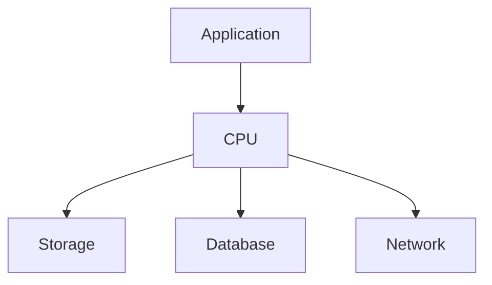

Every layer can become a bottleneck.

---

# The Hidden Truth

Most APIs do not compute.

Most APIs wait.

Example:

```text
User

↓

API

↓

Authentication

↓

Database

↓

Cache

↓

External API

↓

Response
```

Very little actual computation.

---

# Typical API Time Distribution

```text
Total = 500 ms

Database = 250 ms

External API = 150 ms

Network = 50 ms

CPU Computation = 50 ms
```

CPU only worked 10%.

---

# API Waiting Diagram

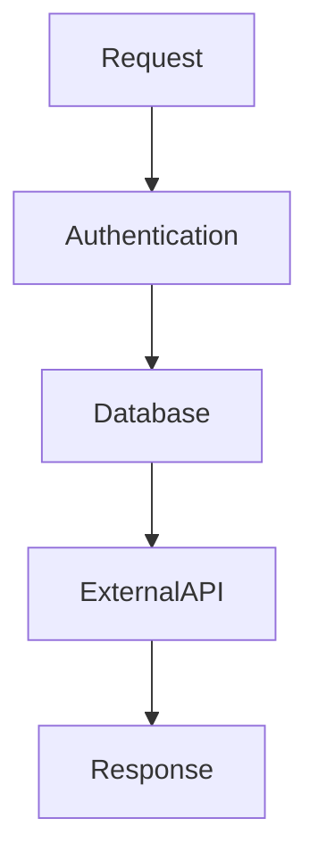

Every step introduces waiting.

---

# The Four Major I/O Bottlenecks

Linux engineers usually debug:

```text
Disk I/O

Network I/O

Database I/O

External Service I/O
```

These cause most production issues.

---

# Bottleneck Hierarchy

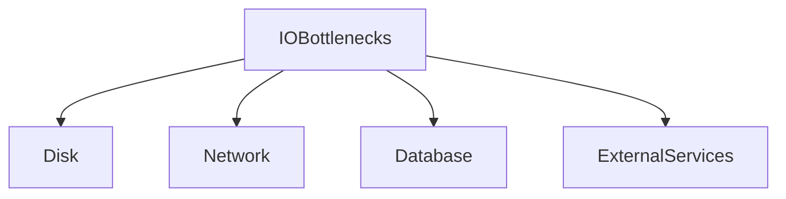

---

# Disk I/O Bottlenecks

Disk is slow compared to RAM.

Approximate latency:

```text
CPU Register = 0.5 ns

RAM = 100 ns

SSD = 100 µs

Network = 1 ms

Internet = 10-100 ms
```

Huge differences.

---

# Disk Access Diagram

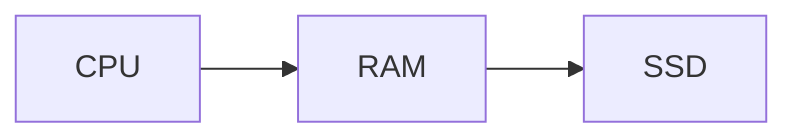

Every step becomes slower.

---

# Symptoms Of Disk Bottlenecks

Common signs:

```text
High iowait

Slow applications

Slow databases

Long backups

Slow boot times
```

---

# High iowait

Very important metric.

Question:

> Is CPU idle because it's waiting for storage?

This is:

```text
iowait
```

High values are dangerous.

---

# iowait Example

```text
CPU Usage = 15%

iowait = 50%
```

This machine is unhealthy.

CPU is waiting.

---

# Disk Queue Bottleneck

Problem:

```text
1000 requests

↓

1 SSD
```

Requests queue.

Latency grows.

---

# Disk Queue Diagram

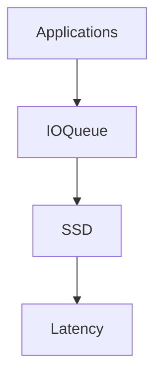

Queue growth creates bottlenecks.

---

# Database Bottlenecks

Databases are giant I/O systems.

Example:

```text
Application

↓

Database

↓

Disk

↓

Response
```

Everything depends on storage.

---

# Database Query Pipeline

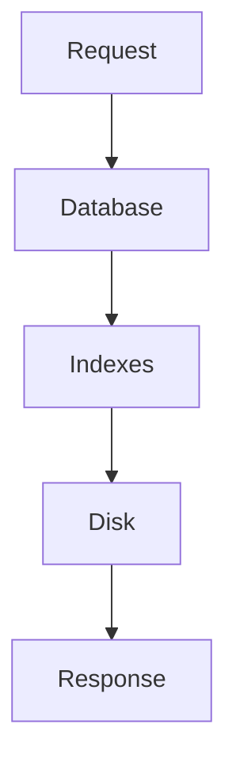

Slow queries create waiting.

---

# Why Missing Indexes Are Dangerous

Bad:

```sql
SELECT * FROM users;
```

On:

```text
100 million rows
```

Result:

```text
Huge disk reads

Latency explosion
```

---

# N+1 Query Problem

Very common.

Bad:

```text
1 query

↓

100 extra queries
```

Total:

```text
101 database operations
```

Disaster.

---

# N+1 Diagram

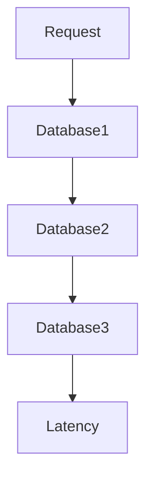

Latency compounds.

---

# Network Bottlenecks

Applications wait for networks.

Examples:

```text
Microservices

Cloud APIs

Databases

CDNs
```

Everything communicates.

---

# Network Pipeline

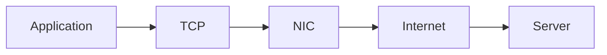

Every layer can slow down.

---

# External API Bottlenecks

Very common.

Example:

```text
User

↓

Your API

↓

Payment Gateway

↓

Response
```

You depend on someone else.

---

# External Dependency Diagram

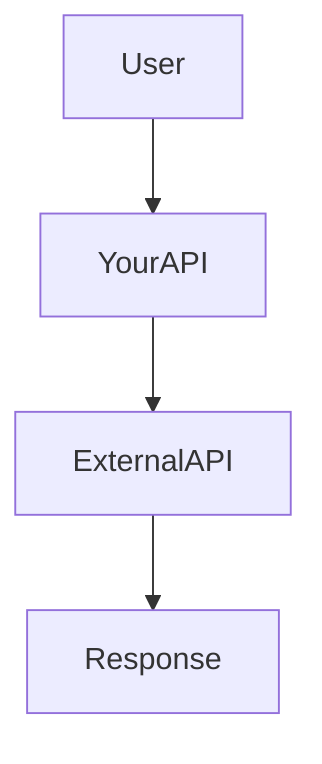

Dependencies create risk.

---

# Distributed Systems Amplify Waiting

Microservices add hops.

Example:

```text
Gateway

↓

Auth

↓

Orders

↓

Inventory

↓

Payments

↓

Notifications
```

Latency accumulates.

---

# Distributed Latency Diagram

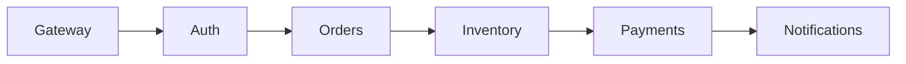

Tiny delays become huge delays.

---

# Queueing Theory

This is fundamental.

Question:

> What happens when requests arrive faster than they leave?

Answer:

```text
Queues grow.
```

Latency explodes.

---

# Queue Diagram

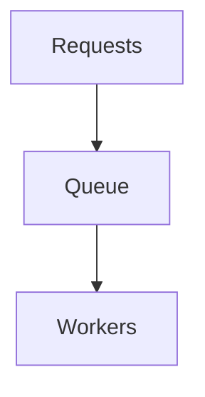

Every system has queues.

---

# The Latency Snowball Effect

Small delays become large delays.

Example:

```text
10 ms

↓

20 ms

↓

50 ms

↓

200 ms

↓

Timeout
```

Latency compounds.

---

# Snowball Diagram

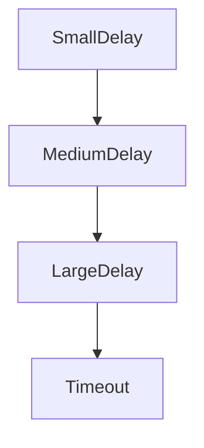

---

# Linux I/O Pipeline

Everything eventually becomes:

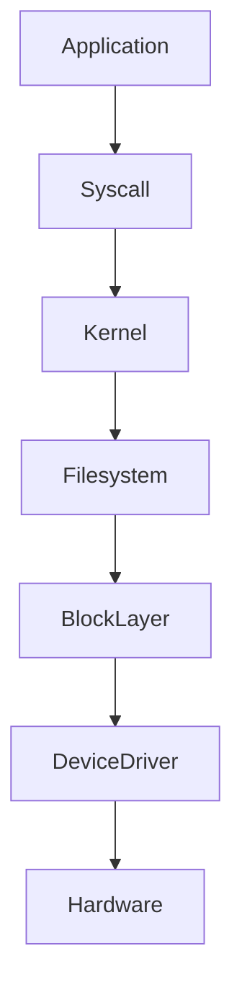

Linux orchestrates everything.

---

# Docker Connection

Containers do not have their own disks.

Containers share host resources.

Pipeline:

```text
Container

↓

OverlayFS

↓

Linux

↓

Storage
```

---

# Docker Diagram

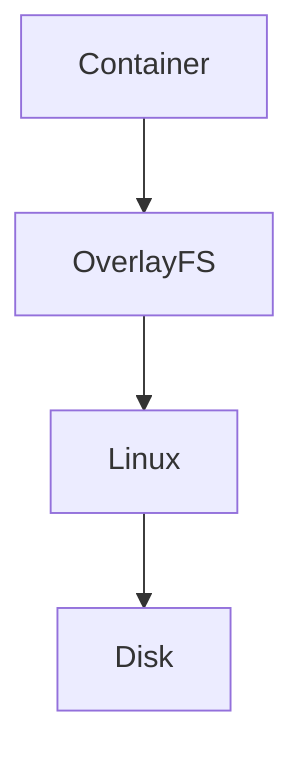

Everything eventually reaches Linux.

---

# Kubernetes Connection

Pods become:

```text
Pod

↓

Container

↓

Process

↓

Linux I/O
```

Everything depends on Linux.

---

# Kubernetes Storage Diagram

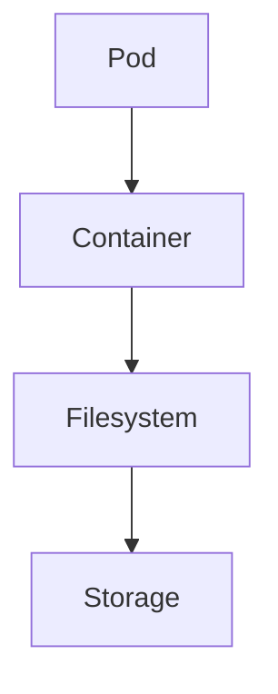

---

# Cloud Bottlenecks

Cloud introduces more layers.

```text
Application

↓

Virtual Machine

↓

Hypervisor

↓

Storage Network

↓

Physical Disk
```

Complexity increases.

---

# Cloud Diagram

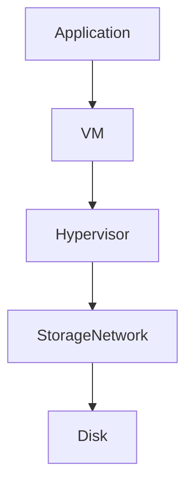

Many hidden bottlenecks.

---

# I/O Saturation

Question:

> Is demand greater than throughput?

Symptoms:

```text
Growing queues

Latency spikes

Timeouts

Retries
```

System degrades rapidly.

---

# The Retry Storm

Very dangerous.

Example:

```text
API slow

↓

Client retries

↓

More load

↓

API slower

↓

More retries
```

System collapses.

---

# Retry Storm Diagram

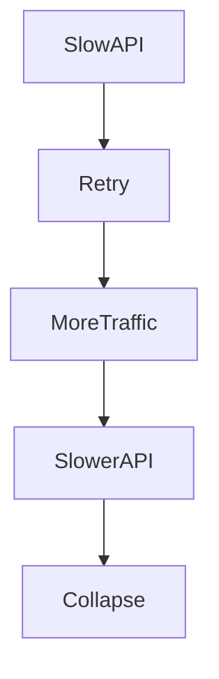

---

# Production Bottleneck Examples

### Scenario 1

```text
Database = 95% utilization

↓

API latency = 3 seconds
```

---

### Scenario 2

```text
External API = 500 ms

↓

Entire application = 500 ms
```

---

### Scenario 3

```text
Storage queue full

↓

Kubernetes pods unhealthy
```

---

# Important Metrics

Monitor:

```text
Latency

IOPS

Bandwidth

Queue depth

iowait

Throughput

Response time

Retries
```

---

# Observability Tools

CPU waiting:

```bash
top

htop
```

Storage:

```bash
iostat
```

Processes:

```bash
pidstat
```

Virtual memory:

```bash
vmstat
```

Block devices:

```bash
iotop
```

Open files:

```bash
lsof
```

Network:

```bash
ss

sar -n DEV
```

Deep tracing:

```bash
perf

bpftrace
```

---

# Production Troubleshooting Workflow

Application slow?

Think:

```text
Users

↓

Requests

↓

Queues

↓

Waiting

↓

Dependencies

↓

Root Cause
```

Always search for waiting.

---

# The USE Method

Very important SRE technique.

Check:

```text
Utilization

Saturation

Errors
```

For every resource.

---

# Security Considerations

Attackers exploit I/O too.

Examples:

```text
Slowloris

Connection floods

Retry storms

Storage exhaustion

Resource starvation
```

Protect systems.

---

# Common Beginner Mistakes

## Mistake 1

Thinking CPU is the bottleneck.

---

## Mistake 2

Ignoring queues.

---

## Mistake 3

Ignoring dependencies.

---

## Mistake 4

Ignoring retries.

---

## Mistake 5

Ignoring iowait.

---

## Mistake 6

Ignoring latency amplification.

---

# Engineering Mindset

Do not think:

```text
Why is my application slow?
```

Think:

```text
Who is waiting?

What are they waiting for?

Why are they waiting?

Can we remove the waiting?
```

That is performance engineering.

---

# Interview Questions

### Beginner

What is an I/O bottleneck?

---

### Intermediate

What is iowait?

---

### Intermediate

Why can low CPU usage still mean a slow system?

---

### Advanced

Explain latency amplification.

---

### Advanced

Explain retry storms.

---

### Senior

How do distributed systems amplify I/O bottlenecks?

---

### Architect

Explain why modern infrastructure is fundamentally waiting management.

---

# Mind Map

```mermaid
mindmap

root((I/O Bottlenecks))

Storage

Databases

Networks

External APIs

Queues

Latency

Retries

Docker

Kubernetes

Distributed Systems

Observability

Performance Engineering
```

---

# Cheat Sheet

```text
I/O Bottlenecks = Waiting Problems

Major Sources:

Disk

Database

Network

External APIs

Tools:

iostat

iotop

vmstat

pidstat

ss

perf

Golden Rules:

CPUs are fast.

Hardware is slow.

Queues create latency.

Retries amplify failures.

Modern infrastructure is waiting engineering.
```

---

# Final Thought

Every website...

Every Kubernetes cluster...

Every cloud provider...

Every distributed system...

Eventually reaches one unavoidable truth:

> Computers are not slow because they compute slowly.

They are slow because they spend most of their lives waiting for data to arrive.

Performance engineering is simply learning where that waiting lives.
