# Network Bottlenecks

> Modern infrastructure is a giant data transportation system.

> CPUs compute.

> Networks move civilization.

> If networks become slow, entire systems become slow.

---

# Why This Exists

Imagine a server.

```text
32 CPU cores

128 GB RAM

NVMe SSD

PostgreSQL

Redis

Kubernetes

50000 users
```

Everything seems healthy.

CPU:

```text
15%
```

Memory:

```text
50%
```

Disk:

```text
20%
```

Users still complain:

```text
Slow APIs

Timeouts

Failed requests
```

Question:

Where is the bottleneck?

Answer:

```text
The network.
```

---

# The Biggest Mindset Shift

Stop thinking:

```text
The network is the internet.
```

Think:

```text
The network is every data movement between systems.
```

Modern applications are giant data transportation systems.

---

# Mental Model: Infrastructure Is A Highway System

Imagine:

```text
Applications = Cities

Packets = Cars

Network = Highways

Routers = Traffic Intersections

Linux = Traffic Controller
```

Question:

What happens when highways become congested?

Entire cities slow down.

---

# What Is A Network Bottleneck?

A network bottleneck is:

> A condition where data movement limits system performance.

Data cannot move fast enough.

---

# The Golden Rule

> Modern systems spend more time moving data than computing data.

---

# Everything Is A Network Problem

Requests constantly move.

```text
Browser

↓

CDN

↓

Load Balancer

↓

API Gateway

↓

Microservices

↓

Database

↓

Cache

↓

Response
```

Networking is everywhere.

---

# Modern Request Journey


Every hop adds latency.

---

# Modern Applications Are Distributed

Old architecture:

```text
1 Server

↓

1 Application

↓

1 Database
```

Simple.

---

# Today's Architecture

```text
Gateway

↓

Authentication

↓

Users

↓

Payments

↓

Inventory

↓

Notifications

↓

Analytics
```

Many network hops.

---

# Distributed Systems Diagram

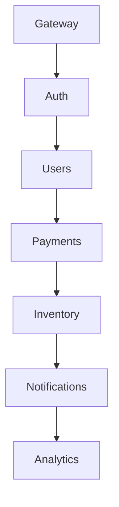

Networking dominates.

---

# Network Performance Fundamentals

Four metrics matter.

```text
Bandwidth

Latency

Throughput

Packet Loss
```

Everything derives from these.

---

# Bandwidth

Question:

> How much data can move?

Example:

```text
1 Gbps
```

Think:

```text
Road width
```

---

# Latency

Question:

> How long does data take?

Example:

```text
20 ms
```

Think:

```text
Travel time
```

---

# Throughput

Question:

> How much useful data is actually delivered?

Not theoretical.

Real world performance.

---

# Packet Loss

Question:

> How much data disappeared?

Lost packets hurt performance.

---

# Network Fundamentals Diagram

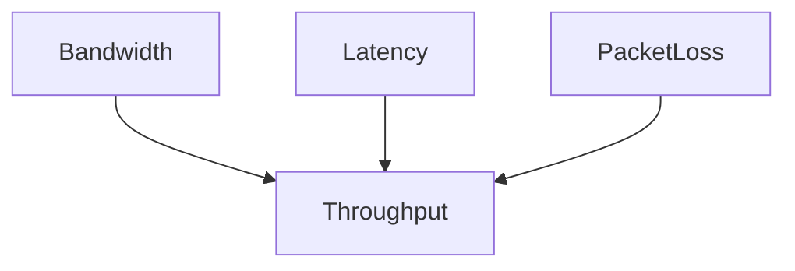

Everything is connected.

---

# The Speed Of Light Problem

Important truth.

Nothing beats physics.

Example:

```text
India → US

≈ 150 ms
```

Even perfect systems have latency.

---

# Network Latency Sources

Latency accumulates.

```text
DNS

TCP Handshake

TLS Handshake

Routing

Server Processing

Database

Response
```

Everything adds delay.

---

# Latency Pipeline

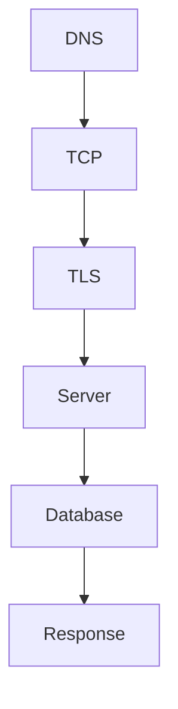

Small delays compound.

---

# Network Queues

This is fundamental.

Question:

> What happens when packets arrive faster than they leave?

Answer:

```text
Queues grow.
```

Latency increases.

---

# Queue Diagram

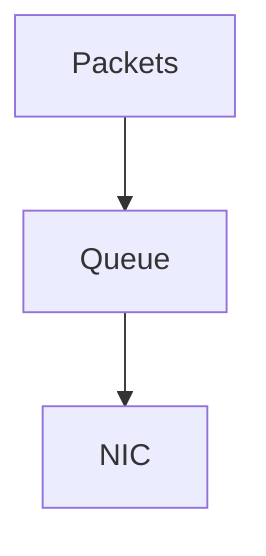

Queues exist everywhere.

---

# Linux Networking Pipeline

Everything eventually becomes:

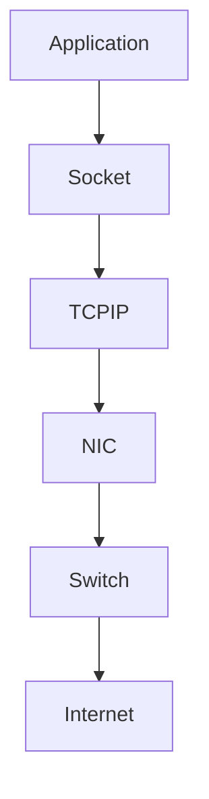

Linux orchestrates everything.

---

# The Kernel Networking Stack

Linux networking pipeline:

```text
Application

↓

Socket

↓

Kernel

↓

TCP/IP Stack

↓

NIC Driver

↓

Hardware
```

Every layer can bottleneck.

---

# Where Bottlenecks Usually Occur

Common locations:

```text
Socket buffers

TCP queues

NIC queues

Switches

Load balancers

Databases

External APIs
```

---

# Socket Buffer Bottlenecks

Applications are slower than incoming traffic.

Example:

```text
10000 packets arrive

↓

Application processes 1000
```

Buffers grow.

Latency grows.

---

# Socket Diagram

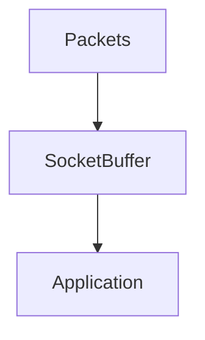

Buffers can overflow.

---

# TCP Bottlenecks

TCP prioritizes reliability.

Features:

```text
Acknowledgements

Retransmissions

Congestion control
```

These can become bottlenecks.

---

# TCP Pipeline


Many moving pieces.

---

# Packet Loss Is Expensive

Packet loss causes:

```text
Retransmissions

↓

Delays

↓

Timeouts

↓

Slow applications
```

Small losses matter.

---

# Packet Loss Diagram

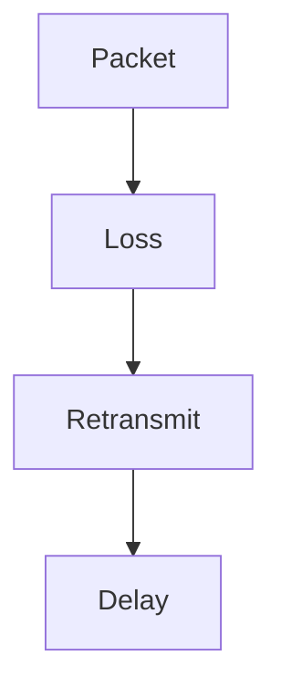

Performance degrades quickly.

---

# Congestion Happens Everywhere

Imagine:

```text
100000 users

↓

1 Gbps link
```

Impossible.

Queues form.

---

# Congestion Diagram

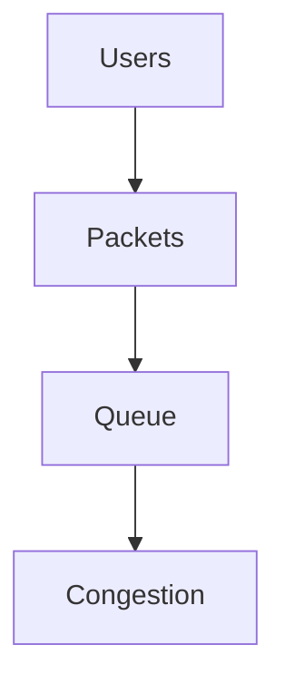

---

# Tail Latency

Very important concept.

Question:

> What about the slowest 1%?

Example:

```text
99 requests = 10 ms

1 request = 5 seconds
```

Users remember:

```text
5 seconds
```

Not averages.

---

# P99 Thinking

Production engineers optimize:

```text
P95

P99

P99.9
```

Not averages.

---

# Microservices Amplify Latency

Example:

```text
Gateway = 20 ms

Auth = 20 ms

Users = 20 ms

Payments = 20 ms

Inventory = 20 ms
```

Total:

```text
100 ms
```

Latency accumulates.

---

# Latency Amplification Diagram

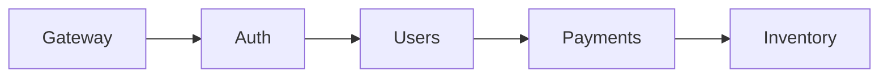

Tiny delays become big delays.

---

# The Retry Storm

Very dangerous.

Scenario:

```text
API slow

↓

Clients retry

↓

More traffic

↓

API slower

↓

More retries

↓

Collapse
```

---

# Retry Storm Diagram

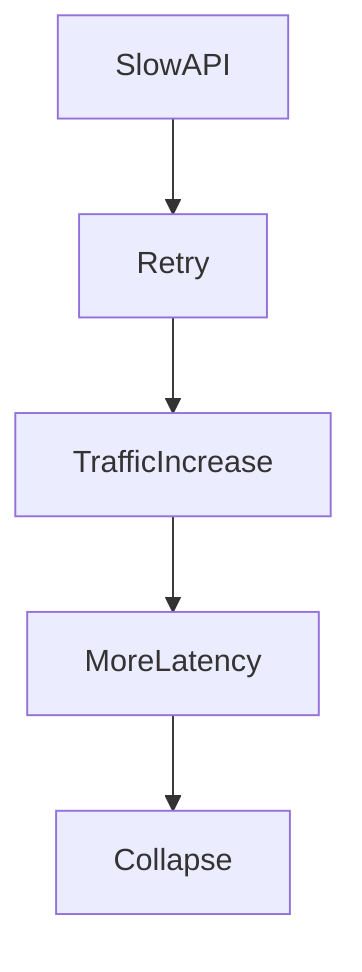

Common cloud failure.

---

# Load Balancer Bottlenecks

Very common.

Pipeline:

```text
Users

↓

Load Balancer

↓

Servers
```

Bad balancing creates hotspots.

---

# Load Balancer Diagram

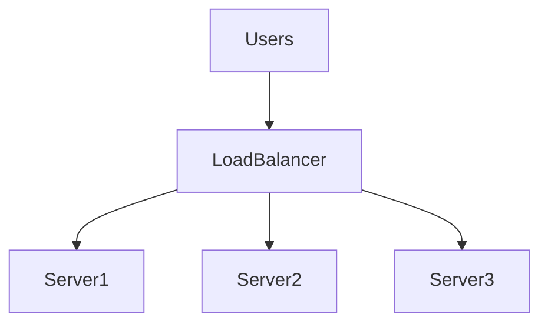

Uneven distribution hurts systems.

---

# DNS Bottlenecks

People forget DNS.

Every request starts with:

```text
DNS lookup
```

Slow DNS:

```text
Slow application
```

---

# DNS Diagram


Tiny delays matter.

---

# Database Networks

Databases are network systems.

Example:

```text
API

↓

Database

↓

Response
```

Network latency directly impacts queries.

---

# External APIs Are Dangerous

Example:

```text
Your API

↓

Payment Gateway

↓

SMS Provider

↓

AI API
```

You inherit their latency.

---

# External Dependency Diagram

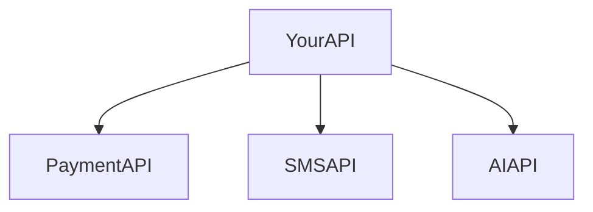

Dependencies multiply risk.

---

# Docker Connection

Containers are not magical.

Containers use:

```text
Linux namespaces

↓

Virtual Ethernet

↓

Linux networking
```

Everything becomes Linux networking.

---

# Docker Diagram

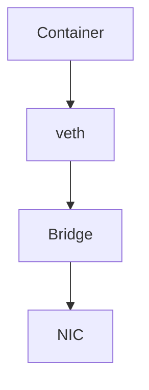

---

# Kubernetes Connection

Pods are network citizens.

Pipeline:

```text
Pod

↓

CNI

↓

Linux Networking

↓

NIC

↓

Network
```

Everything eventually becomes Linux.

---

# Kubernetes Diagram

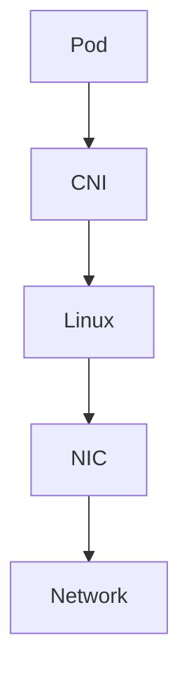

---

# Service Mesh Cost

Modern systems often add:

```text
Envoy

Istio

Sidecars
```

Extra hops.

Extra latency.

---

# Service Mesh Diagram

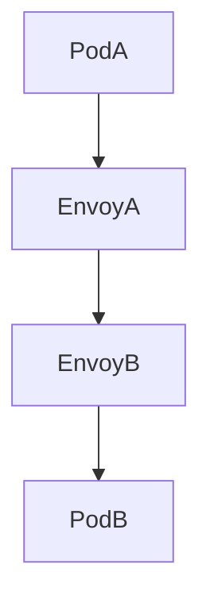

Convenience has costs.

---

# Cloud Networking Complexity

Cloud adds layers.

```text
Application

↓

Container

↓

Virtual NIC

↓

Hypervisor

↓

Physical NIC

↓

Switch

↓

Router

↓

Internet
```

Many hidden bottlenecks.

---

# Cloud Diagram

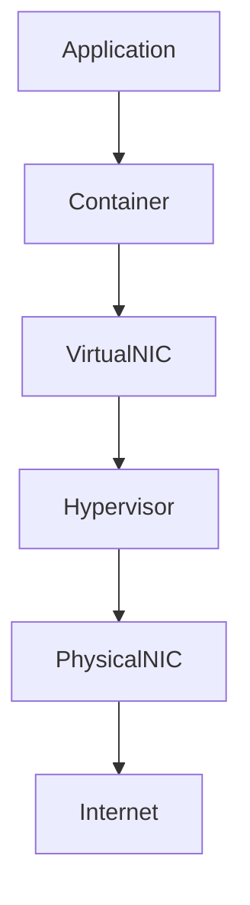

---

# Network Saturation

Question:

> Is demand greater than capacity?

Symptoms:

```text
Latency spikes

Timeouts

Retransmissions

Packet drops
```

---

# Important Metrics

Monitor:

```text
Bandwidth

Latency

Packet loss

Retransmissions

Queue depth

Connection count

P99 latency
```

---

# Linux Observability Tools

Connections:

```bash
ss -tulnp
```

Interfaces:

```bash
ip addr
```

Traffic:

```bash
sar -n DEV
```

Packets:

```bash
tcpdump
```

Errors:

```bash
netstat -s
```

Bandwidth:

```bash
iftop
```

Deep tracing:

```bash
perf

bpftrace
```

---

# Production Troubleshooting Workflow

System slow?

Think:

```text
Users

↓

Requests

↓

Packets

↓

Queues

↓

Dependencies

↓

Root Cause
```

Always search for where data stopped moving.

---

# The USE Method

For every network resource ask:

```text
Utilization

Saturation

Errors
```

This is core SRE thinking.

---

# Security Considerations

Attackers abuse networks.

Examples:

```text
DDoS

SYN floods

Slowloris

Retry storms

Connection exhaustion
```

Protect systems.

---

# Common Beginner Mistakes

## Mistake 1

Thinking network means internet.

---

## Mistake 2

Ignoring latency.

---

## Mistake 3

Ignoring queues.

---

## Mistake 4

Ignoring packet loss.

---

## Mistake 5

Ignoring retries.

---

## Mistake 6

Using averages instead of P99.

---

# Engineering Mindset

Do not think:

```text
My application is slow.
```

Think:

```text
Where is data movement slowing down?

Which queue is growing?

Which dependency is waiting?
```

That is production engineering.

---

# Interview Questions

### Beginner

What is a network bottleneck?

---

### Intermediate

Difference between bandwidth and latency?

---

### Intermediate

Why can low CPU usage still mean a slow application?

---

### Advanced

Explain retry storms.

---

### Advanced

Explain latency amplification.

---

### Senior

How do microservices amplify network bottlenecks?

---

### Architect

Explain why modern cloud infrastructure is fundamentally data transportation engineering.

---

# Mind Map

```mermaid
mindmap

root((Network Bottlenecks))

Bandwidth

Latency

Throughput

Packet Loss

Queues

TCP

DNS

Load Balancers

Microservices

Docker

Kubernetes

Cloud

P99

Observability
```

---

# Cheat Sheet

```text
Network Bottlenecks = Data Movement Problems

Core Metrics:

Bandwidth

Latency

Throughput

Packet Loss

Tools:

ss

ip

sar

tcpdump

iftop

perf

Golden Rules:

Modern systems move more data than they compute.

Queues create latency.

Retries amplify failures.

Distributed systems multiply network costs.

Physics always wins.
```

---

# Final Thought

Every website...

Every Kubernetes cluster...

Every cloud provider...

Every distributed system...

Eventually becomes a transportation problem.

The question is no longer:

> How fast can we compute?

The question becomes:

> How fast can we move information from one place to another without creating traffic jams?

Modern infrastructure engineering is simply traffic engineering at planetary scale.
