# Disk Pressure

> Modern systems do not fail because disks become full.

> Modern systems fail because storage systems cannot keep up with data demand.

> Disk pressure is a competition between data creation and storage capability.

---

# Why This Exists

Imagine a server.

```text
32 CPU cores

128 GB RAM

2 TB NVMe SSD

PostgreSQL

Redis

Docker

Kubernetes

50000 users
```

Everything seems healthy.

CPU:

```text
15%
```

Memory:

```text
60%
```

Disk Usage:

```text
40%
```

Users complain:

```text
Slow APIs

Timeouts

Database delays

Pods becoming unhealthy
```

Question:

How can storage be the problem?

Disk isn't full.

Answer:

```text
Disk pressure.
```

---

# The Biggest Mindset Shift

Stop thinking:

```text
Disk usage = Disk health
```

Think:

```text
Disk pressure = Storage workload health
```

These are different things.

---

# Mental Model: Linux Is A Warehouse

Imagine:

```text
Warehouse = Disk

Workers = CPUs

Boxes = Data

Forklifts = I/O Operations

Manager = Linux Kernel
```

Question:

What happens if boxes arrive faster than workers can move them?

The warehouse becomes congested.

Storage pressure begins.

---

# What Is Disk Pressure?

Disk pressure is:

> A condition where storage systems cannot satisfy data read/write demands efficiently.

The system falls behind.

---

# The Golden Rule

> Storage is infinitely slower than CPUs.

---

# Storage Speed Hierarchy

Approximate speeds:

```text
CPU Register = 0.5 ns

L1 Cache = 1 ns

RAM = 100 ns

NVMe SSD = 100 µs

SATA SSD = 500 µs

HDD = 10 ms

Network = 1 ms

Internet = 50 ms
```

Massive differences exist.

---

# Hierarchy Diagram

```text
CPU

↓

Cache

↓

RAM

↓

NVMe

↓

SSD

↓

HDD

↓

Network

↓

Internet
```

Every layer gets slower.

---

# Everything Eventually Reaches Storage

Applications generate data.

Pipeline:

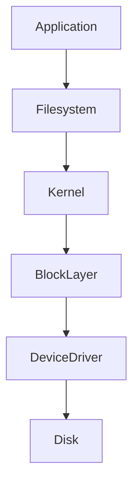

Everything eventually reaches disks.

---

# Linux Storage Pipeline

Every storage operation flows through:

```text
Application

↓

System Call

↓

VFS

↓

Filesystem

↓

Block Layer

↓

I/O Scheduler

↓

Driver

↓

Disk
```

Many layers exist.

---

# Storage Components

Linux storage includes:

```text
Filesystem

Page Cache

Block Layer

I/O Scheduler

Drivers

Physical Storage
```

Everything cooperates.

---

# Storage Architecture

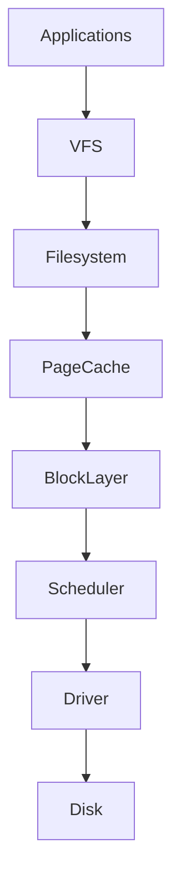

---

# The Three Major Disk Pressure Types

Most production problems belong here.

```text
Capacity Pressure

IOPS Pressure

Throughput Pressure
```

---

# Capacity Pressure

Question:

> Are we running out of space?

Symptoms:

```text
Disk 95%

Writes fail

Services crash
```

Easy to detect.

---

# IOPS Pressure

Question:

> Are we doing too many operations?

Example:

```text
100000 small writes
```

Even fast SSDs struggle.

---

# Throughput Pressure

Question:

> Are we moving too much data?

Example:

```text
10 GB backup

↓

1 Gbps storage network
```

Bottleneck appears.

---

# Pressure Diagram

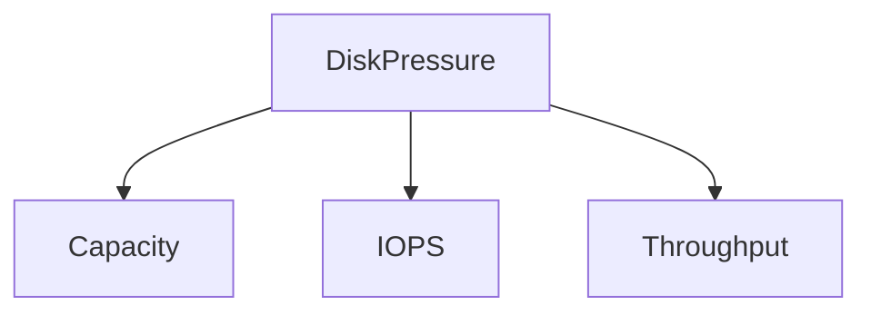

---

# IOPS Explained

IOPS means:

```text
Input Output Operations Per Second
```

Question:

How many operations can storage perform?

Example:

```text
HDD

≈ 100 IOPS

------------

SATA SSD

≈ 100000 IOPS

------------

NVMe

≈ 1000000 IOPS
```

Huge difference.

---

# Random Access Is Expensive

Bad:

```text
Read

↓

Jump

↓

Read

↓

Jump
```

Random operations are expensive.

---

# Sequential Access Is Efficient

Good:

```text
Read

↓

Read

↓

Read

↓

Read
```

Continuous movement.

Much faster.

---

# Random vs Sequential Diagram

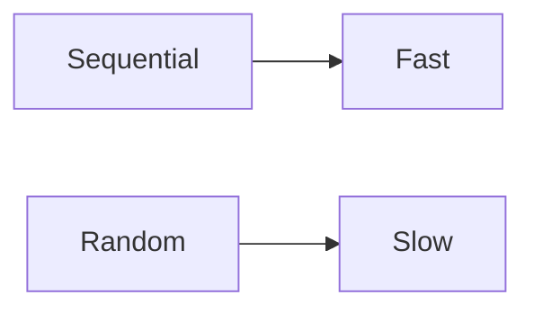

Storage loves predictability.

---

# Queue Depth

Storage creates queues.

Question:

> What happens when requests arrive faster than disks can process?

Answer:

```text
Queue growth
```

Latency increases.

---

# Queue Diagram

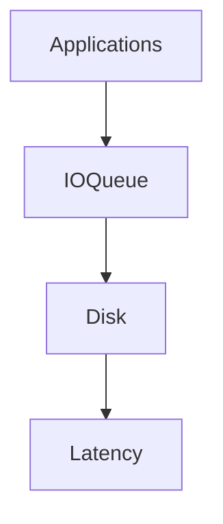

Everything eventually queues.

---

# Page Cache Saves Systems

Linux aggressively caches.

Instead of:

```text
Disk

↓

Disk

↓

Disk
```

Linux does:

```text
Disk

↓

RAM

↓

Serve From RAM
```

Huge improvement.

---

# Page Cache Diagram


RAM protects disks.

---

# Dirty Pages

Very important concept.

Question:

What happens when applications write data?

Linux does:

```text
Write

↓

RAM

↓

Later Disk
```

These are dirty pages.

---

# Dirty Page Lifecycle

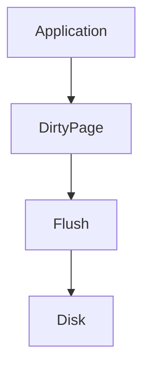

Writes are delayed intentionally.

---

# Why Linux Delays Writes

Benefits:

```text
Fewer disk operations

Better throughput

Less hardware stress
```

Linux optimizes storage.

---

# Write Amplification

Very important.

Question:

> Why did a 1 MB write become 10 MB?

Because storage performs extra work.

Examples:

```text
Metadata updates

Journaling

Replication

Checksums
```

Hidden costs exist.

---

# Write Amplification Diagram

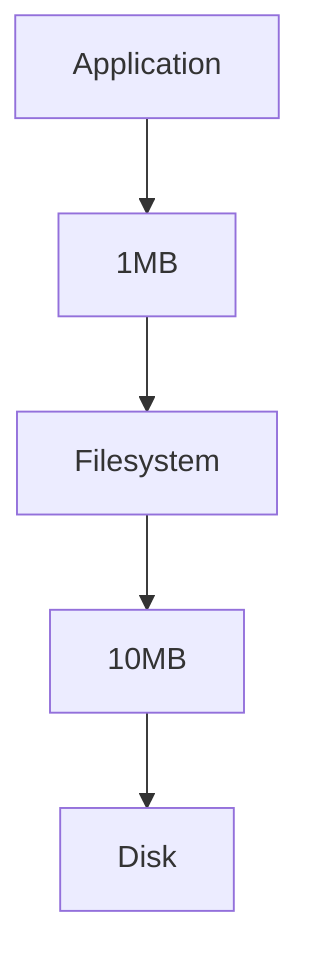

---

# Journaling Filesystems

Example:

```text
ext4

xfs
```

Linux writes twice.

```text
Journal

↓

Actual Data
```

Safer.

Slightly slower.

---

# Journal Diagram

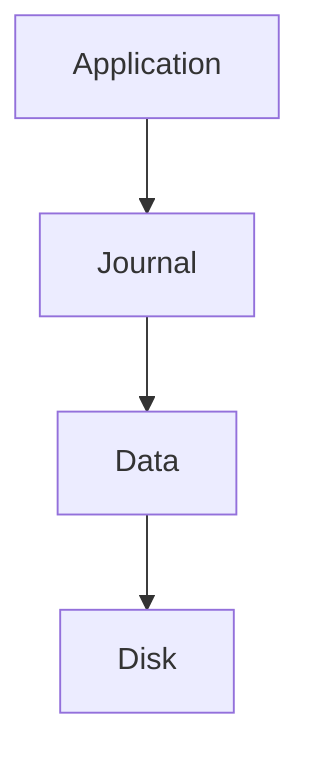

Safety has costs.

---

# Inode Pressure

Very common issue.

Example:

```text
Disk Usage = 20%

Inodes = 100%
```

System breaks.

No new files can be created.

---

# Inode Diagram

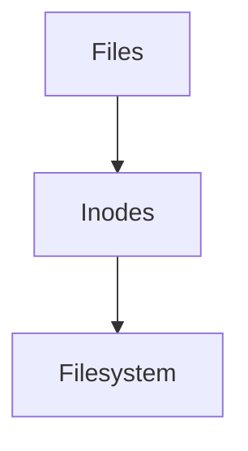

Storage isn't only bytes.

---

# Database Disk Pressure

Databases are giant storage engines.

Examples:

```text
PostgreSQL

MySQL

Elasticsearch
```

Storage becomes critical.

---

# PostgreSQL Storage

Components:

```text
Data files

Indexes

WAL

Temporary files
```

Heavy storage usage.

---

# WAL Pressure

Example:

```text
Transactions

↓

WAL

↓

Disk
```

High traffic:

```text
Huge writes
```

---

# WAL Diagram

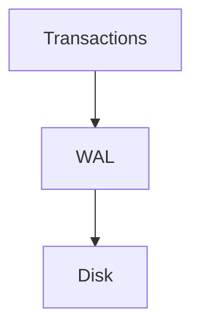

Very common bottleneck.

---

# Elasticsearch Pressure

Elasticsearch writes constantly.

Components:

```text
Indexes

Segments

Merges
```

Storage pressure grows rapidly.

---

# Logging Pressure

Very common.

Bad:

```text
Debug logs

↓

Millions per second

↓

Disk pressure
```

Observability itself can crash systems.

---

# Logging Diagram

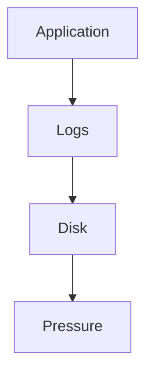

Logging has costs.

---

# Docker Connection

Containers are not isolated disks.

Containers share storage.

Pipeline:

```text
Container

↓

OverlayFS

↓

Host Disk
```

Everything reaches the host.

---

# Docker Diagram

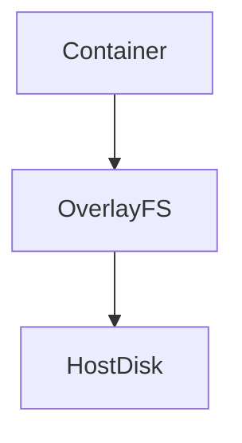

---

# OverlayFS Costs

Each layer adds overhead.

```text
Image Layer

↓

Container Layer

↓

Filesystem

↓

Disk
```

Extra work exists.

---

# Kubernetes Connection

Pods share nodes.

Storage competition occurs.

Pipeline:

```text
Pod

↓

Container

↓

Volume

↓

Node Disk
```

Everything eventually becomes Linux storage.

---

# Kubernetes Diagram

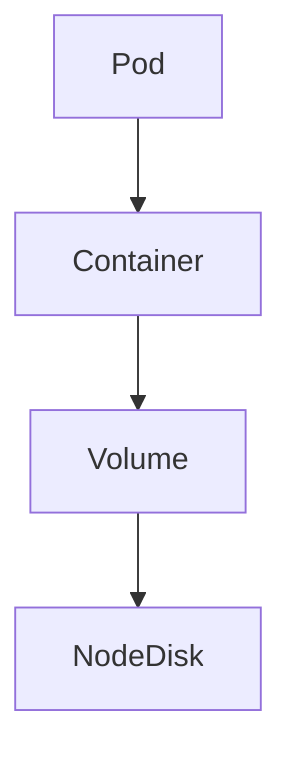

---

# Kubernetes Eviction

Very important.

Question:

What happens when disk pressure becomes severe?

Kubernetes evicts pods.

---

# Eviction Diagram

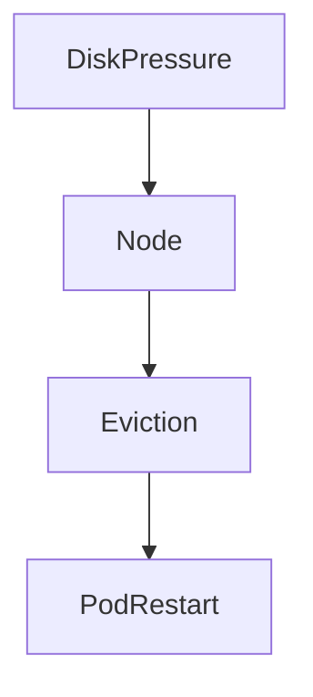

Linux influences Kubernetes.

---

# Cloud Storage Complexity

Cloud adds layers.

```text
Application

↓

Container

↓

VM

↓

Hypervisor

↓

Storage Network

↓

Physical Disk
```

Many hidden bottlenecks.

---

# Cloud Diagram

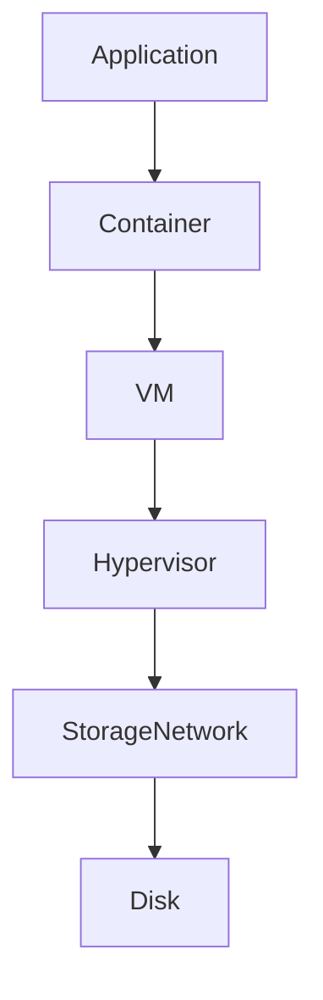

---

# Storage Saturation

Question:

> Is demand greater than storage capability?

Symptoms:

```text
Latency spikes

Queue growth

Timeouts

Slow databases
```

Very common.

---

# Observability Tools

Capacity:

```bash
df -h
```

Inodes:

```bash
df -i
```

Block devices:

```bash
lsblk
```

Disk performance:

```bash
iostat
```

I/O consumers:

```bash
iotop
```

Processes:

```bash
pidstat -d
```

Virtual memory:

```bash
vmstat
```

Open files:

```bash
lsof
```

Deep tracing:

```bash
perf

bpftrace
```

---

# Important Metrics

Monitor:

```text
Disk usage %

Inode usage %

IOPS

Latency

Queue depth

Throughput

Dirty pages

Page cache hit ratio
```

---

# Production Troubleshooting Workflow

System slow?

Think:

```text
Users

↓

Requests

↓

Writes

↓

Queues

↓

Storage

↓

Root Cause
```

Always search for where data stopped moving.

---

# USE Method

For every disk resource ask:

```text
Utilization

Saturation

Errors
```

This is SRE thinking.

---

# Security Considerations

Attackers abuse storage too.

Examples:

```text
Log flooding

Disk exhaustion

Ransomware

Infinite file creation

Storage bombs
```

Protect systems.

---

# Common Beginner Mistakes

## Mistake 1

Thinking disk usage equals disk health.

---

## Mistake 2

Ignoring queue depth.

---

## Mistake 3

Ignoring inodes.

---

## Mistake 4

Ignoring page cache.

---

## Mistake 5

Ignoring logging overhead.

---

## Mistake 6

Thinking containers have separate disks.

---

# Engineering Mindset

Do not think:

```text
My disk is full.
```

Think:

```text
Can my storage subsystem keep up with demand?
```

That is production engineering.

---

# Interview Questions

### Beginner

What is disk pressure?

---

### Intermediate

Difference between capacity pressure and IOPS pressure?

---

### Intermediate

What are dirty pages?

---

### Advanced

Explain Linux page cache.

---

### Advanced

Explain write amplification.

---

### Senior

How does Kubernetes react to disk pressure?

---

### Architect

Explain why storage engineering is fundamentally queue management.

---

# Mind Map

```mermaid
mindmap

root((Disk Pressure))

Capacity

IOPS

Throughput

Queues

Page Cache

Dirty Pages

Journaling

Databases

Docker

Kubernetes

Cloud

Observability
```

---

# Cheat Sheet

```text
Disk Pressure = Storage Competition

Core Concepts:

Capacity

IOPS

Throughput

Queue Depth

Page Cache

Dirty Pages

Write Amplification

Tools:

df -h

df -i

iostat

iotop

pidstat

vmstat

Golden Rules:

Disk full != Disk pressure

Storage is slower than RAM

Queues create latency

Containers share host disks

Modern systems are data movement systems
```

---

# Final Thought

Every API...

Every database...

Every Kubernetes cluster...

Every cloud provider...

Eventually reaches one unavoidable truth:

> Data is being created faster than storage can absorb it.

At that moment,

you no longer have a storage problem.

You have a **time problem**.

Because storage engineering is fundamentally the science of **moving data before the next data arrives**.
