# Performance Engineering

> Performance engineering is not optimization.

> Performance engineering is the science of turning finite resources into predictable user experiences.

---

# Why This Exists

Imagine a company.

```text
100 engineers

50 microservices

50000 users

500 Kubernetes pods

10 databases

Multiple cloud regions
```

Users complain:

```text
Slow APIs

Timeouts

Latency spikes

System instability
```

Question:

Where do you start?

CPU?

Memory?

Database?

Network?

Code?

Cloud?

The answer is:

> Understand the system first.

That discipline is called:

> Performance Engineering.

---

# The Biggest Mindset Shift

Stop thinking:

```text
Make code faster.
```

Think:

```text
Understand where time is being spent.
```

Performance engineering is time engineering.

---

# Mental Model: Linux Is A City

Imagine:

```text
City = Infrastructure

Citizens = Users

Roads = Network

Factories = CPUs

Warehouses = Storage

Buildings = Memory

Traffic Controller = Linux
```

Question:

Can you optimize a city without understanding traffic?

Impossible.

Performance engineering is city engineering.

---

# What Is Performance Engineering?

Performance engineering is:

> The systematic process of designing, measuring, understanding, and improving system behavior under real workloads.

Four words matter:

```text
Design

Measure

Understand

Improve
```

In that order.

---

# The Golden Rule

> Never optimize something you do not understand.

---

# Performance Is A System Problem

Everything is connected.

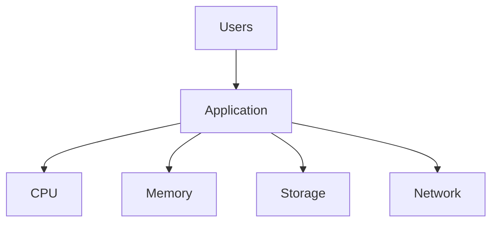

One bottleneck affects everything.

---

# The Great Performance Lie

Many beginners believe:

```text
Slow application

↓

Optimize code
```

Wrong.

Real systems look like this:

```text
Slow application

↓

CPU?

↓

Memory?

↓

Storage?

↓

Database?

↓

Network?

↓

External API?
```

Performance engineering is investigation.

---

# Modern Systems Are Waiting Machines

Most systems do not compute.

Most systems wait.

Example API:

```text
User

↓

API

↓

Database

↓

External API

↓

Response
```

CPU often does less than 10% of the work.

---

# API Time Distribution

```text
500 ms request

Database = 250 ms

External API = 150 ms

Network = 50 ms

CPU = 50 ms
```

---

# Waiting Diagram

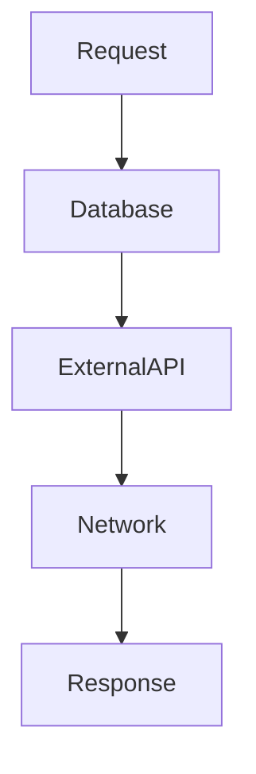

Waiting dominates.

---

# Performance Engineering Pyramid

Always investigate in this order.

```text
Users

↓

Requests

↓

Applications

↓

Resources

↓

Hardware
```

---

# Pyramid Diagram

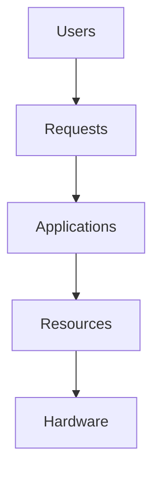

---

# The Four Resources Of Computing

Everything eventually competes for:

```text
CPU

Memory

Storage

Network
```

That's all.

---

# Resource Diagram

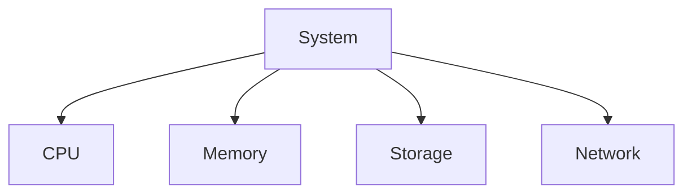

Everything reduces to these.

---

# Performance Is Resource Conversion

Question:

> How efficiently can we convert resources into useful work?

Inputs:

```text
CPU

RAM

Storage

Network
```

Output:

```text
User Experience
```

---

# Resource Conversion Diagram

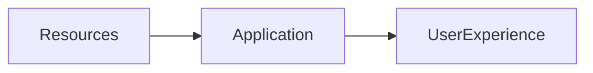

---

# Performance Metrics

Four metrics dominate engineering.

```text
Latency

Throughput

Utilization

Saturation
```

Memorize these.

---

# Latency

Question:

> How long does one operation take?

Example:

```text
50 ms
```

---

# Throughput

Question:

> How much work can we complete?

Example:

```text
5000 requests/second
```

---

# Utilization

Question:

> How busy is a resource?

Example:

```text
CPU = 80%
```

---

# Saturation

Question:

> Is demand greater than capacity?

````

Example:

```text
Queue growth
````

---

# Performance Metrics Diagram

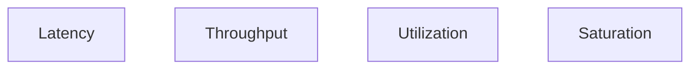

These explain almost every system.

---

# Queues Rule Everything

This is one of the most important engineering principles.

Question:

> What happens when requests arrive faster than resources can process?

Answer:

```text
Queues grow.
```

Latency explodes.

---

# Queue Diagram

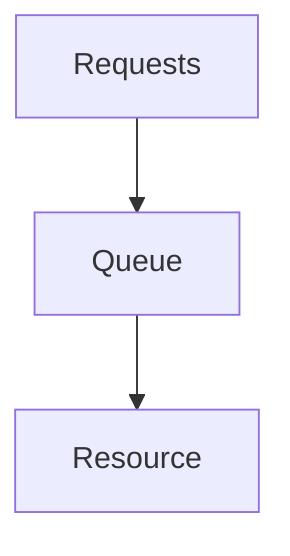

Every system is queues.

---

# The Universal Bottleneck Formula

```text
Demand > Capacity

↓

Queues

↓

Latency

↓

Timeouts

↓

Failures
```

This explains most outages.

---

# Failure Diagram

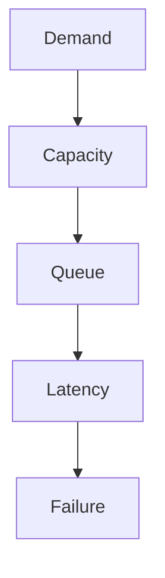

---

# The Four Major Bottlenecks

Most production problems belong here.

```text
CPU Bottlenecks

Memory Bottlenecks

Storage Bottlenecks

Network Bottlenecks
```

---

# CPU Bottlenecks

Symptoms:

```text
High load average

Long run queues

High latency

Context switch storms
```

Question:

Can CPUs keep up?

---

# Memory Bottlenecks

Symptoms:

```text
Swap

OOM

Page reclaim

High PSI
```

Question:

Can memory keep up?

---

# Storage Bottlenecks

Symptoms:

```text
High iowait

Long queues

Slow databases
```

Question:

Can storage keep up?

---

# Network Bottlenecks

Symptoms:

```text
Packet loss

Retries

Latency spikes
```

Question:

Can data move fast enough?

---

# Bottleneck Diagram

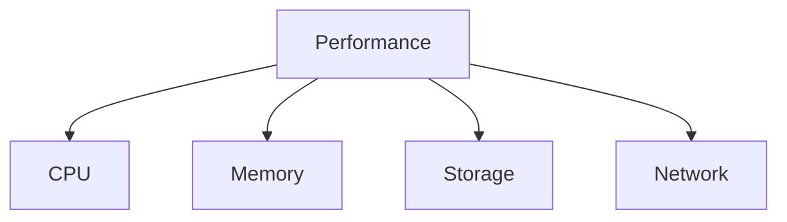

---

# The Five Universal Performance Questions

Every engineer should ask:

```text
What is slow?

Who is waiting?

What are they waiting for?

Why are they waiting?

Can waiting be reduced?
```

These solve many problems.

---

# The Linux Performance Stack

Everything eventually becomes:

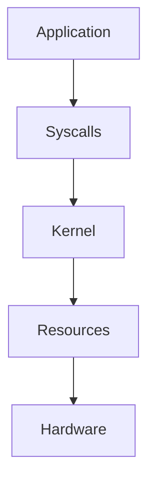

Everything eventually reaches Linux.

---

# Modern Infrastructure Stack

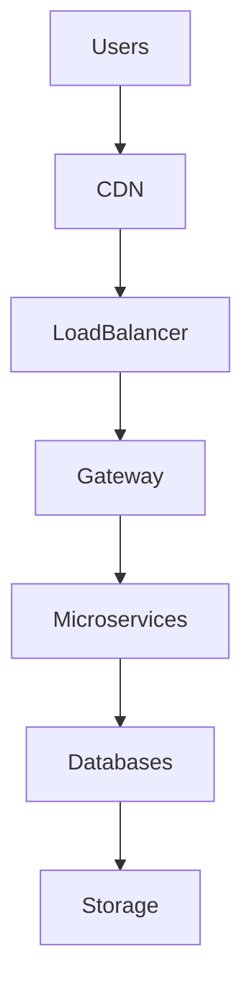

Every layer adds latency.

---

# The Latency Snowball Effect

Tiny delays accumulate.

Example:

```text
Gateway = 20 ms

Auth = 20 ms

Users = 20 ms

Inventory = 20 ms

Payments = 20 ms

Total = 100 ms
```

Distributed systems amplify latency.

---

# Snowball Diagram

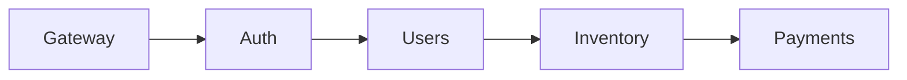

---

# The Three Laws Of Performance Engineering

## Law 1

Nothing is free.

Every abstraction has a cost.

---

## Law 2

Every optimization moves bottlenecks.

Fix one problem.

Another appears.

---

## Law 3

Queues always form somewhere.

You cannot eliminate queues.

Only move them.

---

# Docker Connection

Containers do not create resources.

Containers share resources.

Pipeline:

```text
Container

↓

Namespaces

↓

cgroups

↓

Linux
```

Linux does everything.

---

# Docker Diagram

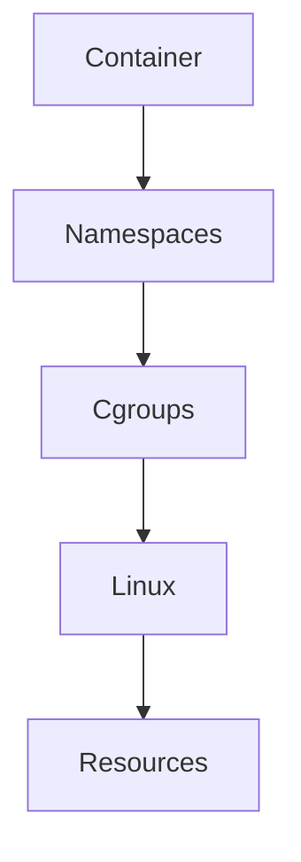

---

# Kubernetes Connection

Kubernetes is a giant resource scheduler.

Pipeline:

```text
Pod

↓

Container

↓

Linux

↓

Resources
```

Everything eventually becomes Linux.

---

# Kubernetes Diagram

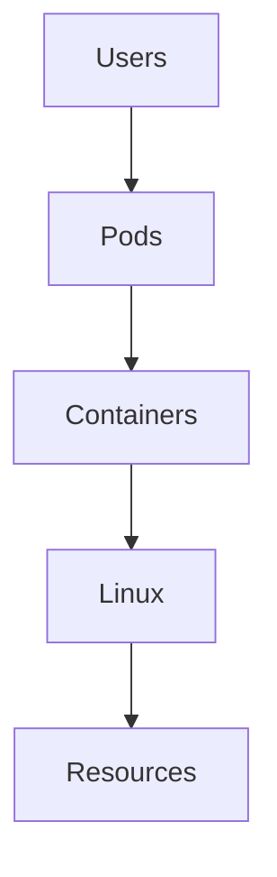

---

# Databases Are Performance Machines

Databases transform:

```text
Storage

↓

Indexes

↓

Queries

↓

Results
```

Performance depends heavily on data access patterns.

---

# Observability Is Mandatory

You cannot optimize blind systems.

Three pillars:

```text
Metrics

Logs

Traces
```

---

# Observability Diagram

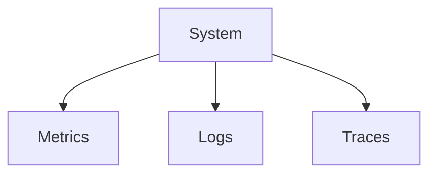

---

# The USE Method

One of the most important SRE techniques.

For every resource ask:

```text
Utilization

Saturation

Errors
```

Example:

```text
CPU

Memory

Disk

Network
```

---

# The RED Method

For applications monitor:

```text
Rate

Errors

Duration
```

Very important.

---

# P99 Thinking

Never optimize averages.

Optimize:

```text
P95

P99

P99.9
```

Users remember worst experiences.

---

# P99 Example

```text
99 requests = 50 ms

1 request = 5000 ms
```

Average:

```text
99 ms
```

Users still hate it.

---

# The Retry Storm

Very common failure.

```text
Slow API

↓

Retries

↓

More traffic

↓

Slower API

↓

Collapse
```

---

# Retry Storm Diagram

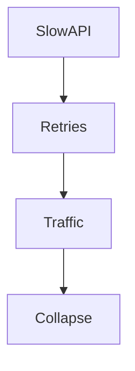

---

# Production Troubleshooting Workflow

Never jump to solutions.

Always think:

```text
Symptoms

↓

Metrics

↓

Resources

↓

Bottlenecks

↓

Root Cause

↓

Fix
```

---

# Troubleshooting Diagram

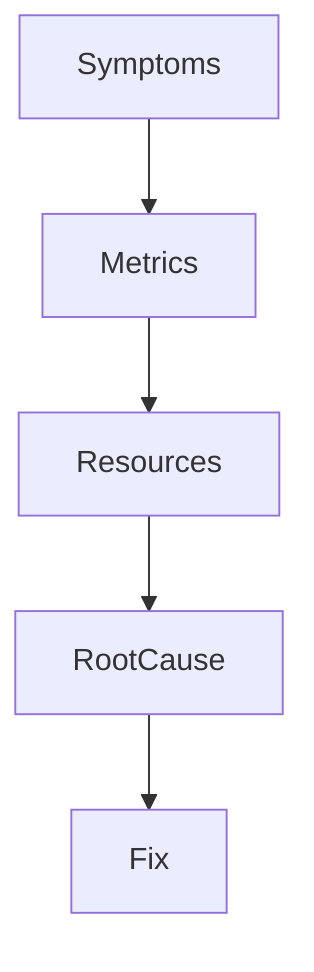

---

# Production Case Study

Symptoms:

```text
API latency = 5 seconds
```

Investigation:

```text
CPU = 20%

Memory = 60%

Disk Queue = High

Database = Slow
```

Root cause:

```text
Storage bottleneck
```

Not CPU.

---

# Important Linux Tools

CPU:

```bash
top

htop

mpstat

pidstat
```

Memory:

```bash
free -h

vmstat
```

Storage:

```bash
iostat

iotop
```

Network:

```bash
ss

sar -n DEV
```

Processes:

```bash
ps

lsof
```

Deep tracing:

```bash
perf

strace

bpftrace
```

---

# Security Considerations

Attackers exploit performance too.

Examples:

```text
DDoS

Retry storms

Fork bombs

Memory bombs

Connection floods
```

Performance engineering is also defense engineering.

---

# Common Beginner Mistakes

## Mistake 1

Optimizing code first.

---

## Mistake 2

Ignoring waiting.

---

## Mistake 3

Ignoring queues.

---

## Mistake 4

Ignoring P99 latency.

---

## Mistake 5

Ignoring observability.

---

## Mistake 6

Thinking Docker or Kubernetes solve performance.

Linux still does the work.

---

# Engineering Mindset

Do not think:

```text
How do I make this faster?
```

Think:

```text
How does this entire system transform finite resources into useful work?
```

That is performance engineering.

---

# Interview Questions

### Beginner

What is performance engineering?

---

### Intermediate

Difference between latency and throughput?

---

### Intermediate

What is saturation?

---

### Advanced

Explain queueing theory.

---

### Advanced

Why are distributed systems harder to optimize?

---

### Senior

Explain USE and RED methodologies.

---

### Architect

Explain why performance engineering is fundamentally resource conversion engineering.

---

# Mind Map

```mermaid
mindmap

root((Performance Engineering))

Users

Resources

CPU

Memory

Storage

Network

Latency

Throughput

Utilization

Saturation

Queues

Observability

Docker

Kubernetes

Distributed Systems

P99

SRE
```

---

# Cheat Sheet

```text
Performance Engineering = Resource → User Experience Conversion

Core Metrics:

Latency

Throughput

Utilization

Saturation

Core Questions:

What is slow?

Who is waiting?

What are they waiting for?

Why are they waiting?

Can waiting be reduced?

Frameworks:

USE

RED

Golden Rules:

Never optimize blindly

Everything eventually queues

Waiting dominates systems

Optimize bottlenecks, not code first

Linux powers everything underneath
```

---

# Final Thought

Every cloud provider...

Every Kubernetes cluster...

Every AI platform...

Every database...

Every distributed system...

Eventually becomes one giant question:

> Given finite resources and infinite demand, how do we create predictable experiences for humans?

That question is **Performance Engineering**.

And Linux is the machine that answers it every microsecond.
