# Benchmarking

> Benchmarking is not measuring speed.

> Benchmarking is performing scientific experiments on systems.

> Bad benchmarks create bad engineers.

---

# Why This Exists

Imagine two engineers.

Engineer A:

```text
"I optimized the application."

"It is 50% faster."
```

Engineer B asks:

```text
How did you measure it?

What workload?

How many users?

What hardware?

What metrics?

How many runs?
```

Engineer A says:

```text
I ran it once.
```

That is not benchmarking.

That is guessing.

---

# The Biggest Mindset Shift

Stop thinking:

```text
Benchmarking = Speed test
```

Think:

```text
Benchmarking = Controlled scientific experimentation
```

---

# Mental Model: Benchmarking Is A Laboratory

Imagine:

```text
Linux System = Human Body

Workload = Exercise

Metrics = Vital Signs

Benchmark = Medical Experiment

Engineer = Scientist
```

Question:

Can a doctor diagnose health with one heartbeat?

No.

Can engineers understand systems with one measurement?

No.

---

# What Is Benchmarking?

Benchmarking is:

> The systematic process of measuring system behavior under controlled workloads.

Three words matter:

```text
Controlled

Repeatable

Measurable
```

---

# The Golden Rule

> Never trust a benchmark you cannot reproduce.

---

# Why Benchmarking Exists

Systems are too complex to guess.

Modern systems contain:

```text
CPU

Memory

Storage

Network

Databases

Containers

Cloud infrastructure
```

Everything interacts.

Benchmarking reveals behavior.

---

# Benchmarking Architecture

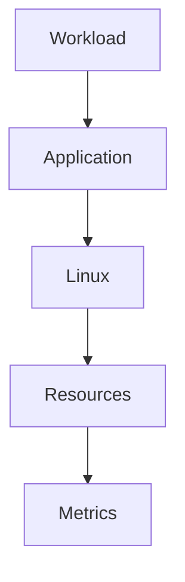

Everything must be measured.

---

# Benchmarking Answers Five Questions

```text
How fast?

How much?

How many?

How long?

Where is the bottleneck?
```

---

# Benchmarking Is Not Optimization

Many engineers do this:

```text
Benchmark

↓

Optimize

↓

Stop
```

Wrong.

Correct process:

```text
Benchmark

↓

Understand

↓

Optimize

↓

Benchmark Again
```

Benchmarking is continuous.

---

# Benchmarking Lifecycle

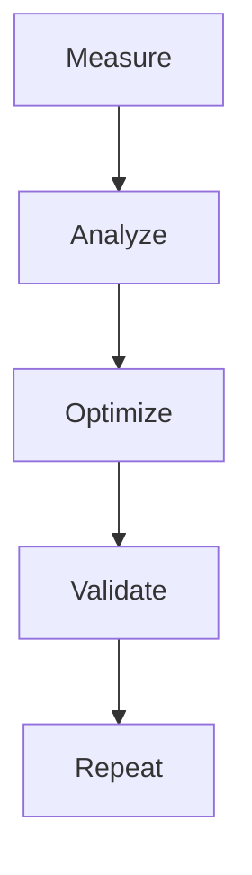

---

# Performance Is Multi-Dimensional

Never use one metric.

Measure multiple dimensions.

```text
Latency

Throughput

CPU

Memory

Storage

Network

Errors
```

---

# Performance Metrics Diagram

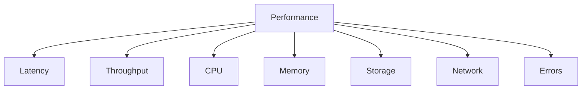

---

# The Three Benchmark Types

Every benchmark belongs here.

```text
Micro Benchmark

Component Benchmark

System Benchmark
```

---

# Micro Benchmark

Measures tiny pieces.

Example:

```text
String operations

Algorithms

Functions

Sorting
```

Very isolated.

---

# Component Benchmark

Measures one subsystem.

Examples:

```text
Database

Disk

CPU

Network
```

---

# System Benchmark

Measures entire systems.

Examples:

```text
API

Microservices

Platforms

Infrastructure
```

Closest to reality.

---

# Benchmark Hierarchy

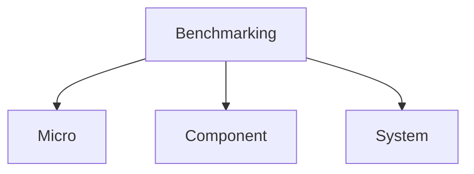

---

# Benchmarking Variables

Every experiment has variables.

Examples:

```text
Users

Concurrency

Hardware

Memory

Network

Storage

Region
```

Never ignore variables.

---

# The Benchmark Formula

```text
Environment

+

Workload

+

Metrics

=

Benchmark
```

Missing one?

Results become meaningless.

---

# Benchmark Triangle

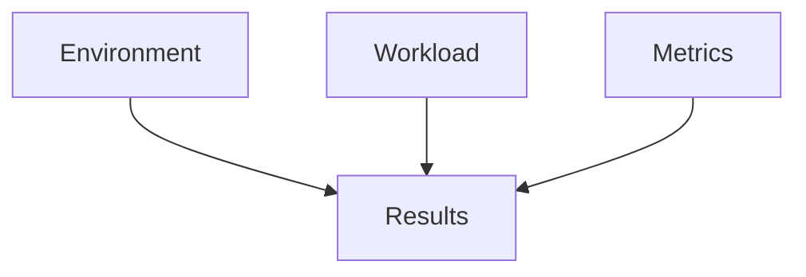

---

# Workload Is Everything

Question:

> What are we testing?

Examples:

```text
100 users

1000 users

10000 users

50000 users
```

Different workloads.

Different results.

---

# Common Workload Types

```text
Steady

Burst

Spike

Stress

Chaos
```

All are useful.

---

# Steady Load

Constant traffic.

Example:

```text
1000 users

↓

1000 users

↓

1000 users
```

Predictable.

---

# Burst Load

Short spikes.

Example:

```text
1000 users

↓

10000 users

↓

1000 users
```

Common in production.

---

# Stress Test

Push beyond limits.

Question:

```text
When does it break?
```

---

# Chaos Testing

Question:

```text
What happens if something fails?
```

Real-world engineering.

---

# Workload Diagram


---

# Latency Is More Important Than Averages

Bad:

```text
Average = 50 ms
```

Good:

```text
P50

P95

P99

P99.9
```

Users experience worst cases.

---

# Example

```text
99 requests = 50 ms

1 request = 5000 ms
```

Average:

```text
99 ms
```

Users still hate it.

---

# Percentile Diagram

```text
P50 = Typical User

P95 = Busy User

P99 = Unlucky User

P99.9 = Disaster User
```

Optimize P99.

---

# Benchmarking CPU

Question:

```text
How much computation can we perform?
```

Tools:

```bash
stress-ng

sysbench
```

Metrics:

```text
Utilization

Load

Context switches
```

---

# Benchmarking Memory

Question:

```text
How fast can memory operate?
```

Measure:

```text
Bandwidth

Latency

Allocation speed
```

Tools:

```bash
sysbench
```

---

# Benchmarking Storage

Question:

```text
How fast can storage move data?
```

Metrics:

```text
IOPS

Latency

Throughput
```

Tools:

```bash
fio
```

---

# Storage Diagram

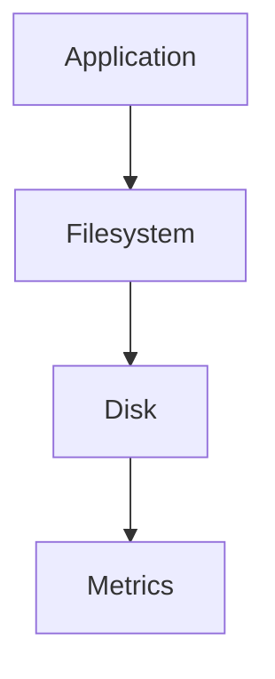

---

# Benchmarking Networks

Question:

```text
How fast can data move?
```

Metrics:

```text
Bandwidth

Latency

Packet loss
```

Tools:

```bash
iperf3
```

---

# Network Diagram

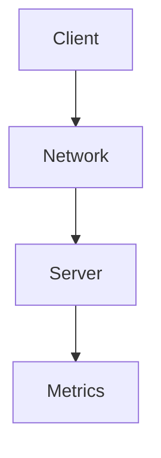

---

# Benchmarking APIs

Question:

```text
How many requests can the API handle?
```

Metrics:

```text
RPS

Latency

Errors
```

Tools:

```bash
wrk

hey

ab
```

---

# API Benchmark Diagram

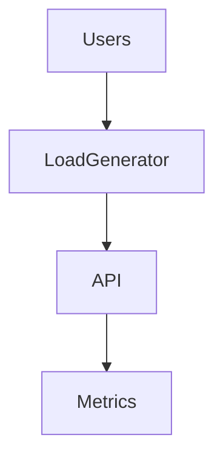

---

# Database Benchmarking

Questions:

```text
Reads?

Writes?

Concurrent users?

Complex queries?
```

Tools:

```bash
pgbench

sysbench
```

---

# Database Diagram

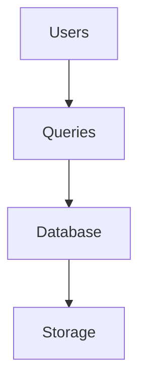

---

# Benchmarking Containers

Containers are not magical.

Pipeline:

```text
Container

↓

Namespaces

↓

cgroups

↓

Linux
```

Everything becomes Linux.

---

# Docker Diagram

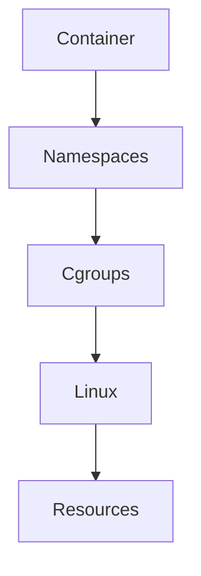

---

# Benchmarking Kubernetes

Benchmark:

```text
Pods

Services

Ingress

Storage

Networking
```

Everything eventually becomes Linux.

---

# Kubernetes Diagram

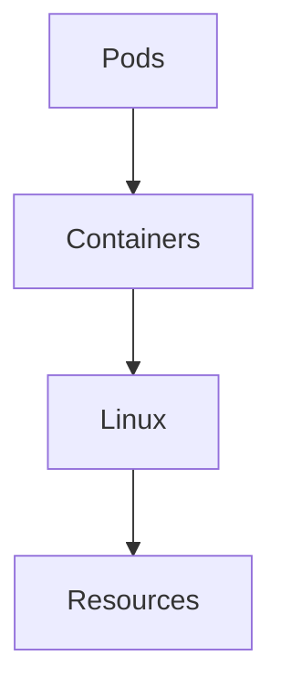

---

# Cloud Benchmarking Is Hard

Cloud adds variability.

Examples:

```text
Neighbors

Hypervisors

Storage networks

Regions
```

Results fluctuate.

---

# Cloud Diagram

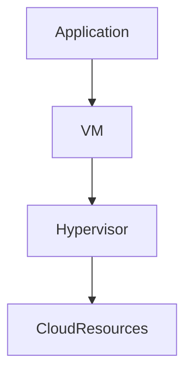

---

# The Benchmarking Pyramid

Always benchmark in this order.

```text
Hardware

↓

Resources

↓

Applications

↓

Systems

↓

Users
```

---

# Benchmarking Mistakes Engineers Make

## Mistake 1

Benchmarking once.

Bad.

---

## Mistake 2

Ignoring workload realism.

Bad.

---

## Mistake 3

Benchmarking production systems.

Dangerous.

---

## Mistake 4

Ignoring warm-up time.

Very common.

---

## Mistake 5

Ignoring cache effects.

Huge mistake.

---

## Mistake 6

Using averages only.

Never enough.

---

# Cold vs Warm Systems

Cold:

```text
Empty caches

No optimization
```

Warm:

```text
Caches populated

Stable behavior
```

Huge differences.

---

# Cache Diagram

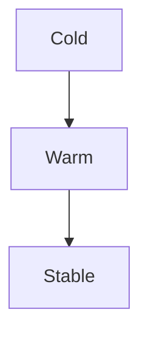

---

# Benchmarking Methodology

Always follow:

```text
Define Goal

↓

Control Variables

↓

Create Workload

↓

Collect Metrics

↓

Analyze Results

↓

Repeat
```

---

# Methodology Diagram

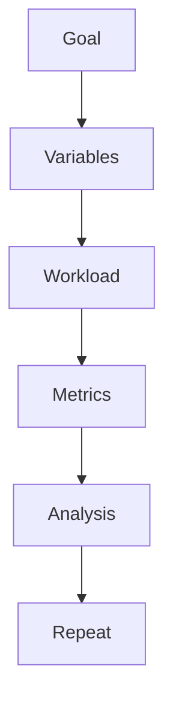

---

# Production Benchmark Example

Goal:

```text
Can our API support 10000 users?
```

Test:

```text
100

500

1000

5000

10000 users
```

Collect:

```text
P95

P99

CPU

Memory

Errors
```

Analyze.

---

# Observability Is Mandatory

Benchmarking without observability is useless.

Monitor:

```text
Metrics

Logs

Traces
```

---

# Observability Diagram

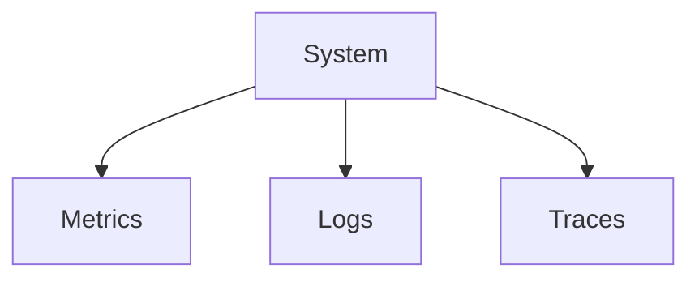

---

# Linux Benchmarking Tools

CPU:

```bash
stress-ng

sysbench
```

Memory:

```bash
sysbench
```

Storage:

```bash
fio
```

Network:

```bash
iperf3
```

API:

```bash
wrk

hey

ab
```

Processes:

```bash
pidstat
```

System:

```bash
top

htop

vmstat

iostat

sar
```

Deep tracing:

```bash
perf

strace

bpftrace
```

---

# Production Troubleshooting Workflow

Never do:

```text
System slow

↓

Optimize immediately
```

Do:

```text
System slow

↓

Benchmark

↓

Measure

↓

Find bottleneck

↓

Fix

↓

Benchmark again
```

---

# Security Considerations

Benchmarking can become dangerous.

Bad benchmarks can:

```text
Crash servers

Exhaust memory

Fill storage

Overload databases
```

Never benchmark production carelessly.

---

# Engineering Mindset

Do not think:

```text
How fast is this system?
```

Think:

```text
Under what conditions does this system behave predictably?
```

That is benchmarking.

---

# Interview Questions

### Beginner

What is benchmarking?

---

### Intermediate

Difference between benchmarking and profiling?

---

### Intermediate

Why are averages misleading?

---

### Advanced

Explain P99 latency.

---

### Advanced

Why are cloud benchmarks difficult?

---

### Senior

How would you benchmark a Kubernetes cluster?

---

### Architect

Explain why benchmarking is fundamentally scientific experimentation.

---

# Mind Map

```mermaid
mindmap

root((Benchmarking))

Experiments

Workloads

Metrics

Latency

Throughput

P99

CPU

Memory

Storage

Network

Docker

Kubernetes

Cloud

Observability

Performance Engineering
```

---

# Cheat Sheet

```text
Benchmarking = Scientific Measurement

Formula:

Environment

+

Workload

+

Metrics

=

Results

Benchmark Types:

Micro

Component

System

Golden Rules:

Never trust one run

Benchmark reality

Measure multiple metrics

Optimize P99

Control variables

Benchmark before optimization
```

---

# Final Thought

The difference between beginners and elite engineers is often a single habit.

Beginners ask:

> How fast is this system?

Elite engineers ask:

> Under exactly what conditions does this system remain predictable?

That question is benchmarking.

And benchmarking is the language that allows engineers to have a scientific conversation with infrastructure.
