# Profiling

> Benchmarking tells you **what** is slow.

> Profiling tells you **why** it is slow.

> Great engineers do not guess.

> Great engineers investigate.

---

# Why This Exists

Imagine an API.

Users complain:

```text
5 second response time
```

Question:

Why?

Possibilities:

```text
CPU?

Memory?

Database?

Network?

Disk?

Locks?

Code?
```

Without profiling:

```text
You guess.
```

With profiling:

```text
You know.
```

---

# The Biggest Mindset Shift

Stop thinking:

```text
Profiling = Developer tool
```

Think:

```text
Profiling = System investigation science
```

---

# Mental Model: Profiling Is An MRI Scanner

Imagine a hospital.

```text
Human Body = Infrastructure

Organs = System Components

Symptoms = Performance Problems

MRI Scanner = Profiler

Engineer = Doctor
```

Question:

Would doctors perform surgery without diagnosis?

No.

Would engineers optimize without profiling?

They shouldn't.

---

# What Is Profiling?

Profiling is:

> The process of observing where systems spend time and resources during execution.

It answers:

```text
Where is time spent?

Where are resources consumed?

Where are bottlenecks created?
```

---

# The Golden Rule

> Never optimize blind systems.

---

# Benchmarking vs Profiling

This distinction is extremely important.

Benchmarking asks:

```text
How fast?
```

Profiling asks:

```text
Why?
```

---

# Comparison Diagram

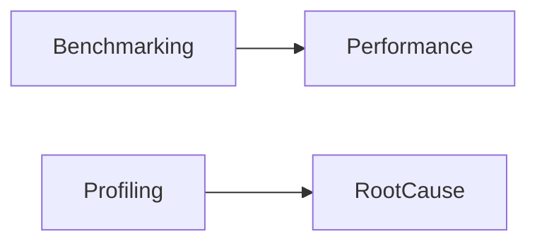

Both are necessary.

---

# Example

Benchmark says:

```text
API latency = 5 seconds
```

Profiling says:

```text
Database = 4 seconds

CPU = 100 ms

Network = 300 ms

Application = 600 ms
```

Now we understand the system.

---

# Modern Systems Are Time Distribution Machines

Every request spends time somewhere.

Example:

```text
User

↓

Gateway

↓

Authentication

↓

Database

↓

External API

↓

Response
```

Every stage consumes time.

---

# Time Distribution Diagram

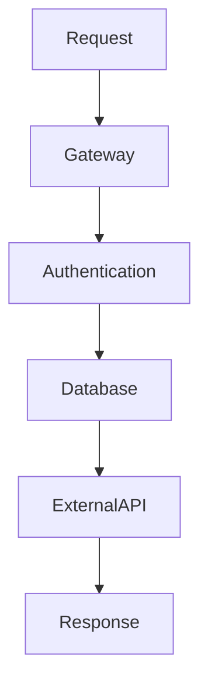

Profiling discovers where time lives.

---

# The Universal Profiling Question

Always ask:

```text
Where is the system spending time?
```

That is profiling.

---

# Profiling Categories

Everything belongs here.

```text
CPU Profiling

Memory Profiling

I/O Profiling

Network Profiling

Application Profiling

System Profiling
```

---

# Profiling Hierarchy

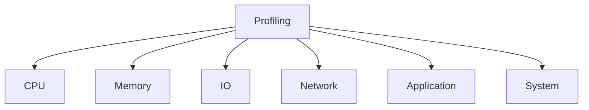

---

# CPU Profiling

Question:

```text
What is the CPU doing?
```

Examples:

```text
Functions

Algorithms

Loops

Context switches
```

CPU profiling is time analysis.

---

# CPU Profiling Example

Bad:

```python
for user in users:

 expensive_operation()
```

Profiling reveals:

```text
95% CPU here
```

Easy fix.

---

# CPU Time Distribution Diagram

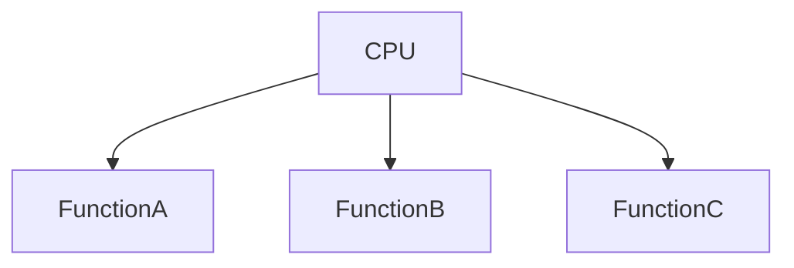

---

# Memory Profiling

Question:

```text
Where is memory going?
```

Examples:

```text
Leaks

Caches

Buffers

Large objects
```

---

# Memory Leak Example

```python
cache=[]

while True:

 cache.append(data)
```

Memory grows forever.

Profiling finds it.

---

# Memory Diagram

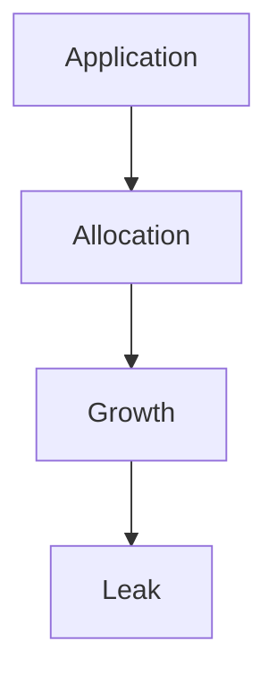

---

# I/O Profiling

Question:

```text
Who is waiting?
```

Examples:

```text
Database

Storage

External APIs

Filesystem
```

Very common.

---

# I/O Diagram

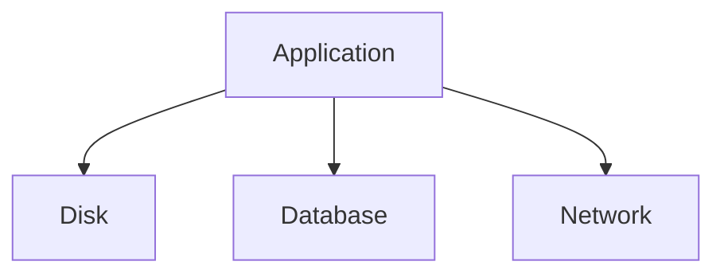

---

# Network Profiling

Question:

```text
Where is latency accumulating?
```

Examples:

```text
DNS

TCP

TLS

API calls

Packet loss
```

---

# Network Pipeline

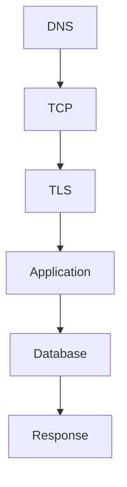

---

# Application Profiling

Question:

```text
Which functions are expensive?
```

Examples:

```text
Authentication

Serialization

Encryption

Parsing
```

Application profiling is code profiling.

---

# System Profiling

Question:

```text
How does the entire machine behave?
```

Observe:

```text
CPU

Memory

Storage

Network

Scheduler
```

Everything together.

---

# System Diagram

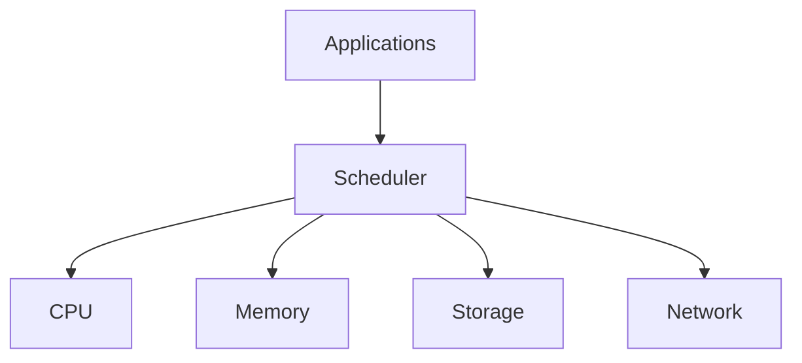

---

# Linux Profiling Stack

Everything eventually becomes:

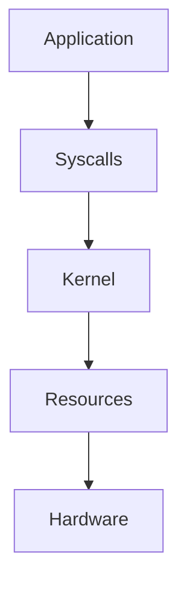

Linux exposes everything.

---

# Sampling Profilers

Most modern profilers sample.

Idea:

```text
Observe periodically.

Do not observe continuously.
```

Example:

```text
100 times per second
```

Build statistical models.

---

# Sampling Diagram

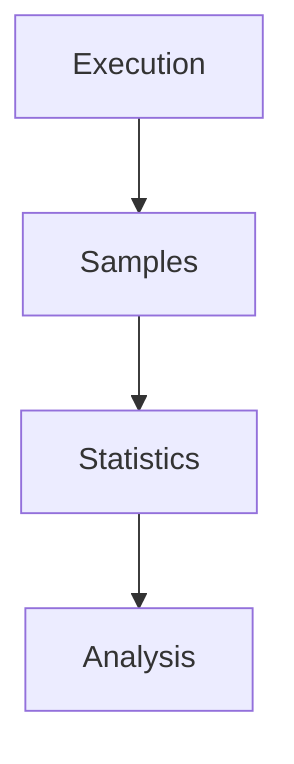

---

# Instrumentation Profilers

Instrumentation inserts measurement code.

Example:

```text
Start timer

↓

Execute

↓

End timer
```

Precise.

More overhead.

---

# Sampling vs Instrumentation

Sampling:

```text
Low overhead

Statistical

Production friendly
```

Instrumentation:

```text
Precise

Higher overhead
```

Both matter.

---

# Flame Graphs

One of the most important tools.

They answer:

```text
Where is CPU time spent?
```

---

# Flame Graph Mental Model

Think:

```text
Wide = Expensive

Narrow = Cheap
```

---

# Flame Graph Example

```text
Request

└── API

    ├── Authentication

    ├── Database ████████

    └── Response
```

Database dominates.

---

# Flame Graph Diagram

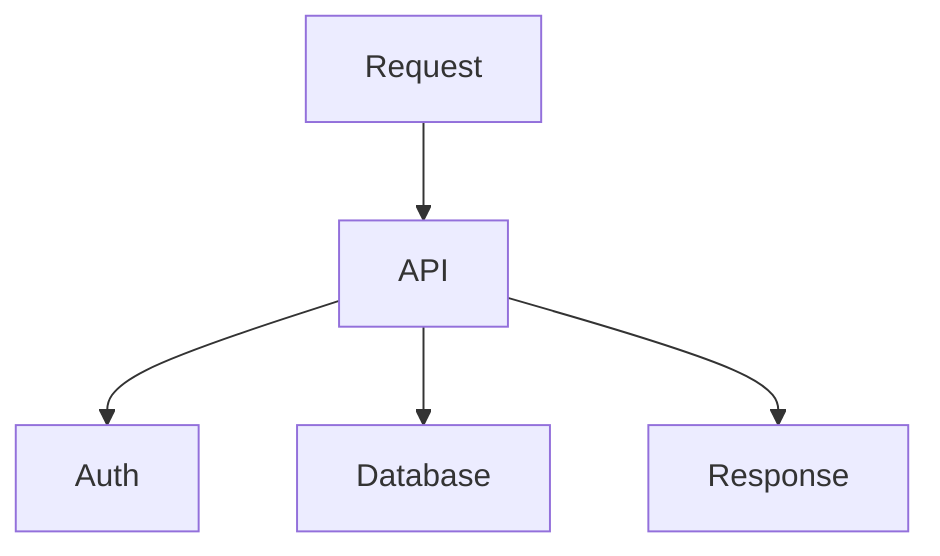

---

# Syscall Profiling

Question:

```text
What is Linux doing?
```

Observe:

```text
read()

write()

open()

epoll()

accept()
```

Very powerful.

---

# Syscall Pipeline

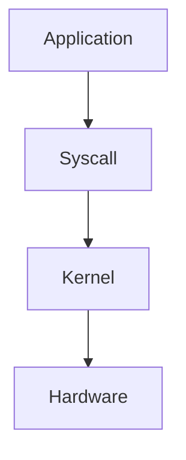

Everything reaches syscalls.

---

# Scheduler Profiling

Question:

```text
Who gets CPU time?
```

Observe:

```text
Run queues

Context switches

CPU migration
```

---

# Scheduler Diagram

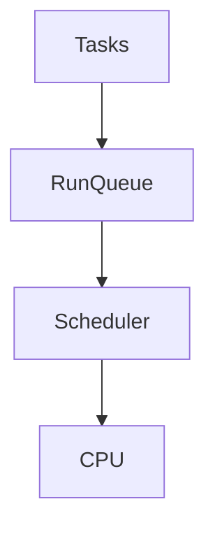

---

# Database Profiling

Question:

```text
Why are queries slow?
```

Observe:

```text
Indexes

Scans

Locks

Storage
```

---

# Database Diagram

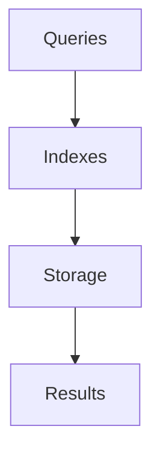

---

# Distributed System Profiling

Very important.

Question:

```text
Where is latency distributed?
```

Observe:

```text
Gateway

Authentication

Users

Payments

Notifications
```

---

# Distributed Diagram

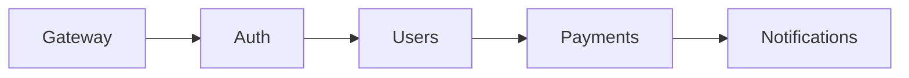

Every hop matters.

---

# Tracing Is Distributed Profiling

Tracing answers:

```text
Where did every millisecond go?
```

Very important.

---

# Trace Example

```text
Request

↓

Gateway

20 ms

↓

Auth

50 ms

↓

Database

500 ms

↓

Response
```

Easy to find bottlenecks.

---

# Docker Connection

Containers are still Linux.

Pipeline:

```text
Container

↓

Namespaces

↓

cgroups

↓

Linux
```

Profile Linux.

Not Docker.

---

# Docker Diagram

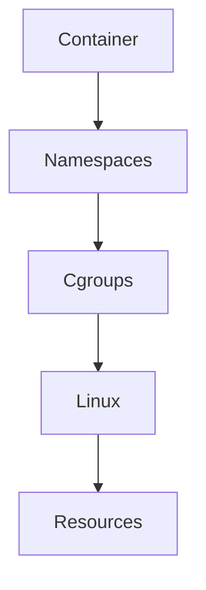

---

# Kubernetes Connection

Pods eventually become:

```text
Pod

↓

Container

↓

Linux

↓

Resources
```

Everything becomes Linux profiling.

---

# Kubernetes Diagram

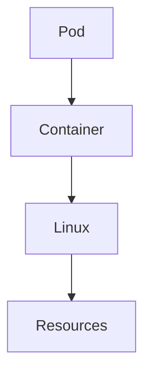

---

# Cloud Complexity

Cloud adds layers.

```text
Application

↓

Container

↓

VM

↓

Hypervisor

↓

Hardware
```

Profile every layer.

---

# Cloud Diagram

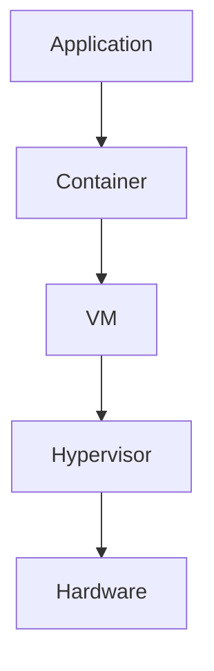

---

# Production Profiling Workflow

Never do:

```text
System slow

↓

Guess
```

Do:

```text
System slow

↓

Profile

↓

Find bottleneck

↓

Fix

↓

Validate
```

---

# Investigation Workflow

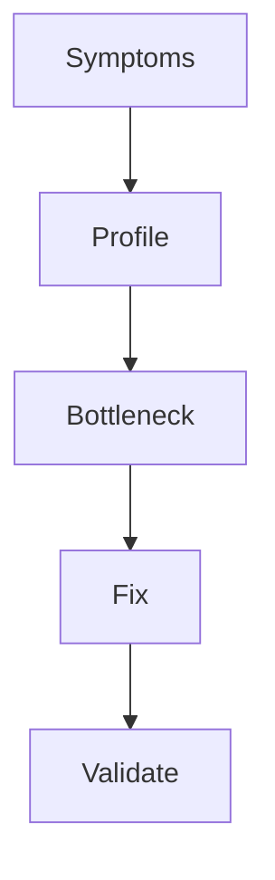

---

# Production Case Study

Symptoms:

```text
API latency = 5 seconds
```

Profile:

```text
CPU = 15%

Memory = 50%

Database = 4 seconds
```

Root cause:

```text
Missing index
```

Not CPU.

---

# Linux Profiling Tools

CPU:

```bash
perf
```

Processes:

```bash
pidstat
```

System calls:

```bash
strace
```

Memory:

```bash
vmstat
```

Storage:

```bash
iostat

iotop
```

Network:

```bash
ss

tcpdump
```

Kernel:

```bash
bpftrace
```

System overview:

```bash
top

htop

sar
```

---

# The Linux Observability Pyramid

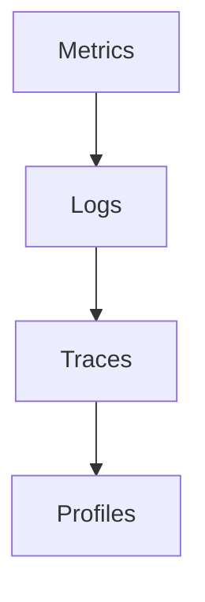

Deeper layers answer deeper questions.

---

# Performance Implications

Profiling helps reduce:

```text
Latency

Resource waste

Queues

Context switches

Lock contention
```

Everything becomes more efficient.

---

# Security Considerations

Profilers are powerful.

Improper use can expose:

```text
System internals

Sensitive data

Execution paths
```

Use carefully.

---

# Common Beginner Mistakes

## Mistake 1

Optimizing before profiling.

---

## Mistake 2

Only looking at CPU.

---

## Mistake 3

Ignoring I/O waits.

---

## Mistake 4

Ignoring distributed latency.

---

## Mistake 5

Ignoring flame graphs.

---

## Mistake 6

Thinking Docker needs separate profiling.

Linux already exposes everything.

---

# Engineering Mindset

Do not think:

```text
How do I make this faster?
```

Think:

```text
Where exactly is time being spent?
```

That is profiling.

---

# Interview Questions

### Beginner

What is profiling?

---

### Intermediate

Difference between benchmarking and profiling?

---

### Intermediate

What is a flame graph?

---

### Advanced

Difference between sampling and instrumentation profiling?

---

### Advanced

Why is tracing distributed profiling?

---

### Senior

How would you profile a Kubernetes application?

---

### Architect

Explain why profiling is fundamentally time distribution analysis.

---

# Mind Map

```mermaid
mindmap

root((Profiling))

CPU

Memory

I/O

Network

Syscalls

Flame Graphs

Tracing

Scheduler

Docker

Kubernetes

Cloud

Observability

Performance Engineering
```

---

# Cheat Sheet

```text
Profiling = Finding Where Time Lives

Core Questions:

Where is time spent?

Where are resources consumed?

Where are bottlenecks?

Types:

CPU

Memory

I/O

Network

Application

System

Tools:

perf

strace

pidstat

vmstat

iostat

bpftrace

Golden Rules:

Never optimize blind systems

Benchmark tells WHAT

Profiling tells WHY

Time always lives somewhere

Linux exposes everything
```

---

# Final Thought

Every slow system...

Every cloud outage...

Every Kubernetes issue...

Every overloaded API...

Eventually becomes a detective story.

The engineer who guesses will always lose.

The engineer who profiles will eventually find the truth.

Because profiling is simply learning **where time disappears inside a system**.
