# Latency vs Throughput

> Every computer system is fundamentally a machine that transforms resources into work.

> Two questions always exist:

> How fast can one task finish?

> How many tasks can finish?

These questions are called:

```text
Latency

Throughput
```

Understanding their relationship is one of the most important skills in engineering.

---

# Why This Exists

Imagine a restaurant.

Question 1:

```text
How long does one customer wait?
```

That's latency.

Question 2:

```text
How many customers can be served every hour?
```

That's throughput.

Modern infrastructure works exactly the same way.

---

# The Biggest Mindset Shift

Stop thinking:

```text
Fast system = Good system
```

Think:

```text
Systems are tradeoff machines.

Optimizing one metric often hurts another.
```

---

# Mental Model: Infrastructure Is A Highway

Imagine:

```text
Cars = Requests

Road = Infrastructure

Travel Time = Latency

Cars Per Hour = Throughput
```

Question:

Can a road have:

```text
Low latency

AND

Infinite throughput?
```

No.

Physics exists.

---

# What Is Latency?

Latency is:

> The amount of time required to complete a single operation.

Question:

```text
How long does one task take?
```

Examples:

```text
API request = 100 ms

Database query = 20 ms

Disk read = 500 µs
```

Latency measures delay.

---

# What Is Throughput?

Throughput is:

> The amount of work completed per unit time.

Question:

```text
How much work can we complete?
```

Examples:

```text
5000 requests/second

100 MB/s

10000 messages/minute
```

Throughput measures capacity.

---

# The Golden Rule

> Latency measures one task.

> Throughput measures many tasks.

---

# Mental Model Diagram

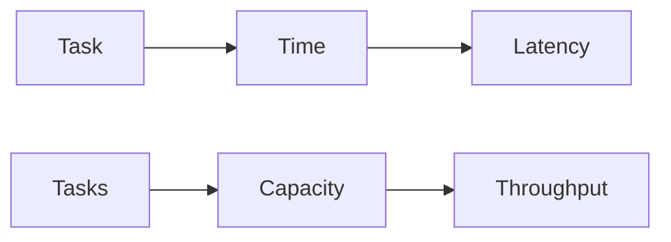

---

# The Restaurant Example

Restaurant:

```text
1 chef

1 meal

5 minutes
```

Latency:

```text
5 minutes
```

Throughput:

```text
12 meals/hour
```

Different metrics.

---

# The Highway Example

Highway:

```text
1 car

10 minutes
```

Latency:

```text
10 minutes
```

Throughput:

```text
10000 cars/hour
```

Different questions.

---

# Linux Is A Work Processing Machine

Linux continuously transforms:

```text
Users

↓

Requests

↓

Processes

↓

Resources

↓

Results
```

Everything eventually becomes work.

---

# Linux Pipeline

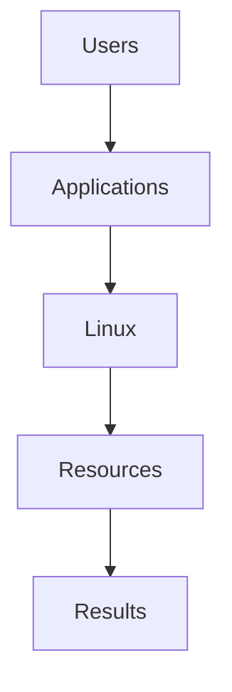

---

# The Relationship Between Latency And Throughput

This is extremely important.

At low load:

```text
Low latency

Good throughput
```

As load increases:

```text
Latency rises.
```

Eventually:

```text
Queues explode.
```

---

# Load Curve

```text
Users

↓

Requests

↓

Queues

↓

Latency

↓

Failures
```

---

# Load Diagram

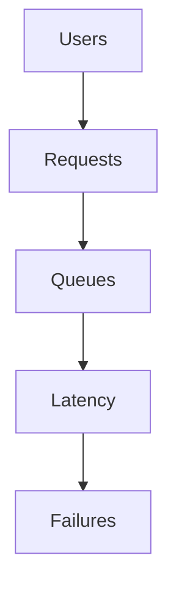

This explains most outages.

---

# Little's Law (Very Important)

One of the most important equations in engineering.

```text
L = λ × W
```

Where:

```text
L = Items in system

λ = Throughput

W = Latency
```

Meaning:

```text
More work

↓

More waiting
```

Unless capacity increases.

---

# Example

System:

```text
100 requests/sec

100 ms latency
```

Requests inside system:

```text
100 × 0.1

=

10 requests
```

Simple.

---

# The Queue Is The Enemy

Question:

What happens when:

```text
1000 requests arrive

500 requests processed
```

Answer:

```text
500 requests queue
```

Latency grows.

---

# Queue Diagram

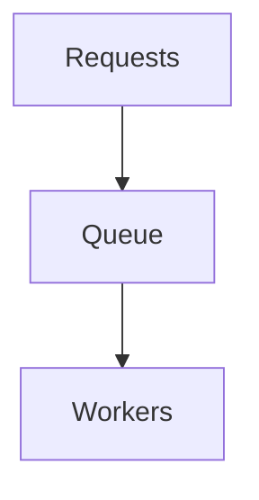

Every system eventually becomes queues.

---

# The Universal Performance Formula

```text
Demand > Capacity

↓

Queues

↓

Latency

↓

Timeouts

↓

Failures
```

Memorize this.

---

# The Three System Zones

Every system operates here.

```text
Healthy

Busy

Saturated
```

---

# Healthy Zone

Example:

```text
100 requests

100 workers
```

Latency:

```text
Low
```

Throughput:

```text
Healthy
```

---

# Busy Zone

Example:

```text
500 requests

400 workers
```

Latency:

```text
Increasing
```

Throughput:

```text
Good
```

---

# Saturated Zone

Example:

```text
1000 requests

500 workers
```

Latency:

```text
Explodes
```

Throughput:

```text
Plateaus
```

---

# Saturation Diagram

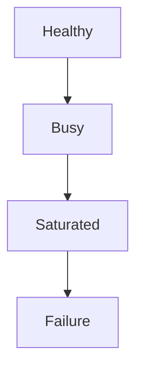

---

# Why Throughput Eventually Stops Growing

Question:

Can infinite users create infinite throughput?

No.

Resources are finite.

Example:

```text
CPU

Memory

Storage

Network
```

All have limits.

---

# Resource Diagram

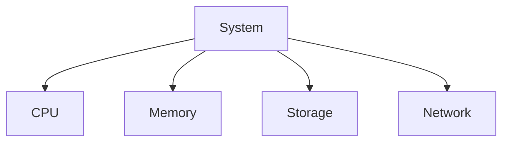

---

# CPU Example

Machine:

```text
8 cores
```

Requests:

```text
1000/sec
```

Fine.

Requests:

```text
100000/sec
```

CPU saturates.

Latency rises.

---

# Database Example

Database:

```text
100 queries/sec
```

Traffic:

```text
500 queries/sec
```

Queue forms.

Latency explodes.

---

# Database Diagram

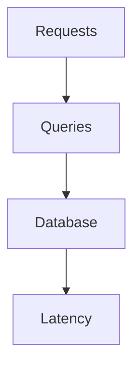

---

# Network Example

Question:

Can a:

```text
1 Gbps link
```

Transfer:

```text
10 Gbps traffic?
```

No.

Queues appear.

---

# Storage Example

Storage:

```text
50000 IOPS
```

Demand:

```text
100000 IOPS
```

Latency rises.

---

# Latency Is User Experience

Humans perceive latency.

Examples:

```text
100 ms

Feels instant

------------

300 ms

Noticeable

------------

1000 ms

Feels slow

------------

5000 ms

Feels broken
```

---

# Throughput Is Business Capacity

Businesses care about throughput.

Examples:

```text
Netflix

Streams/sec

------------

Amazon

Orders/sec

------------

WhatsApp

Messages/sec
```

Businesses monetize throughput.

---

# Latency vs Throughput Tradeoff

Very important.

Question:

Can we increase throughput?

Yes.

How?

```text
Batching
```

Problem:

```text
Latency increases.
```

---

# Batching Example

Without batching:

```text
1 item

↓

Send
```

Low latency.

Low throughput.

---

# With batching

```text
100 items

↓

Send
```

High throughput.

Higher latency.

---

# Batching Diagram

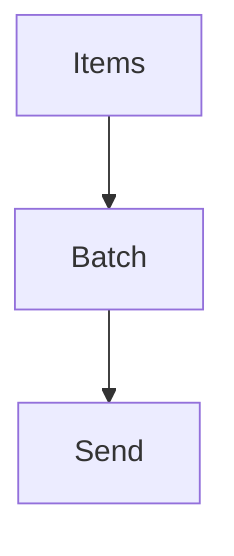

Tradeoffs exist.

---

# Parallelism Changes Throughput

Question:

Can more workers help?

Yes.

Example:

```text
1 worker

↓

100 requests/sec
```

4 workers:

```text
400 requests/sec
```

Throughput grows.

---

# Parallelism Diagram

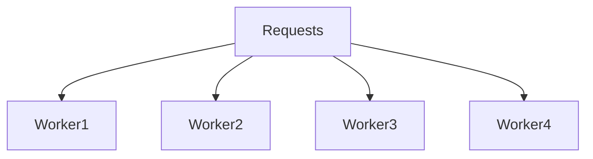

---

# But Parallelism Has Costs

More workers create:

```text
Locks

Context switches

Contention

Synchronization
```

Nothing is free.

---

# Distributed Systems Make This Harder

Example:

```text
Gateway

↓

Auth

↓

Inventory

↓

Payments

↓

Notifications
```

Every hop adds latency.

---

# Distributed Diagram

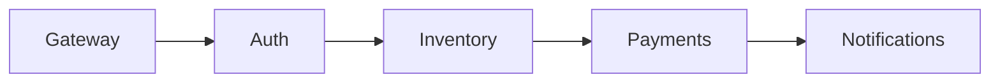

Latency compounds.

---

# The Tail Latency Problem

Very important.

Example:

```text
99 requests = 50 ms

1 request = 5000 ms
```

Users remember:

```text
5000 ms
```

Not averages.

---

# P99 Thinking

Never optimize:

```text
Average
```

Optimize:

```text
P95

P99

P99.9
```

---

# Retry Storms Destroy Throughput

Scenario:

```text
Slow API

↓

Clients retry

↓

More traffic

↓

Slower API

↓

More retries

↓

Collapse
```

---

# Retry Storm Diagram

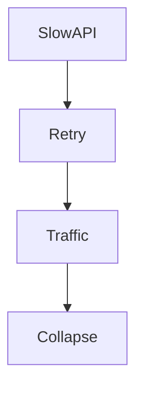

---

# Docker Connection

Containers do not create performance.

Containers share Linux resources.

Pipeline:

```text
Container

↓

Namespaces

↓

cgroups

↓

Linux
```

Linux manages throughput.

---

# Docker Diagram

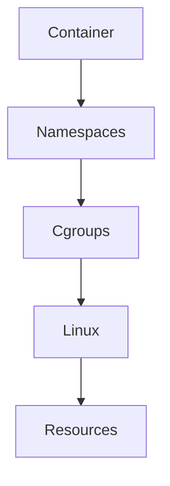

---

# Kubernetes Connection

Kubernetes is a giant scheduler.

Pipeline:

```text
Pods

↓

Containers

↓

Linux

↓

Resources
```

Everything eventually becomes Linux.

---

# Kubernetes Diagram

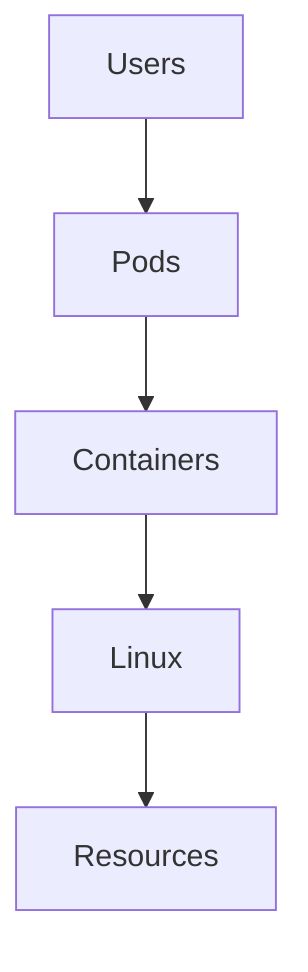

---

# Cloud Infrastructure Is Capacity Engineering

Cloud providers solve:

```text
Millions of users

↓

Millions of requests

↓

Millions of resources
```

At planetary scale.

---

# Cloud Diagram

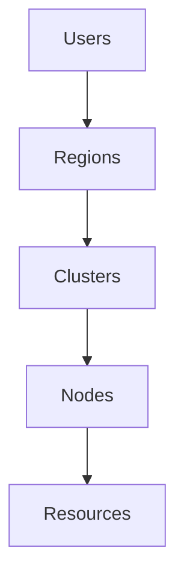

---

# Observability Is Mandatory

Monitor:

```text
Latency

Throughput

Queues

Errors
```

Together.

---

# The Four Golden Metrics

Very important SRE concepts.

```text
Latency

Traffic

Errors

Saturation
```

---

# Four Golden Signals Diagram

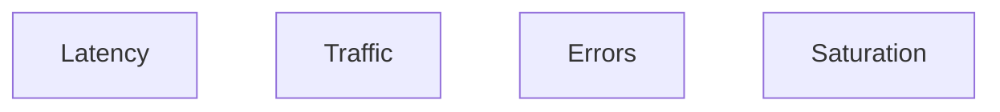

Monitor these everywhere.

---

# Linux Tools

CPU:

```bash
top

htop

mpstat
```

Memory:

```bash
free -h

vmstat
```

Storage:

```bash
iostat

iotop
```

Network:

```bash
ss

sar -n DEV
```

Processes:

```bash
pidstat
```

Deep tracing:

```bash
perf

bpftrace
```

---

# Production Troubleshooting Workflow

Never do:

```text
System slow

↓

Scale immediately
```

Do:

```text
System slow

↓

Find queues

↓

Find saturation

↓

Find bottleneck

↓

Fix
```

---

# Security Considerations

Attackers exploit throughput.

Examples:

```text
DDoS

Connection floods

Retry storms

Resource exhaustion
```

Security is performance engineering too.

---

# Common Beginner Mistakes

## Mistake 1

Thinking low latency means high throughput.

---

## Mistake 2

Ignoring queues.

---

## Mistake 3

Optimizing averages.

---

## Mistake 4

Ignoring P99.

---

## Mistake 5

Ignoring saturation.

---

## Mistake 6

Thinking scaling solves everything.

---

# Engineering Mindset

Do not think:

```text
How do I make this faster?
```

Think:

```text
How do I balance user experience and system capacity?
```

That is systems engineering.

---

# Interview Questions

### Beginner

What is latency?

---

### Beginner

What is throughput?

---

### Intermediate

How are they different?

---

### Intermediate

What is saturation?

---

### Advanced

Explain Little's Law.

---

### Advanced

Why do queues create latency?

---

### Senior

How do distributed systems amplify latency?

---

### Architect

Explain why infrastructure engineering is balancing latency against throughput.

---

# Mind Map

```mermaid
mindmap

root((Latency vs Throughput))

Latency

Throughput

Queues

Little's Law

Saturation

P99

Batching

Parallelism

Docker

Kubernetes

Distributed Systems

Cloud

Observability
```

---

# Cheat Sheet

```text
Latency = Time per task

Throughput = Tasks per unit time

Little's Law:

L = λ × W

L = Work in system

λ = Throughput

W = Latency

Golden Rules:

Demand > Capacity = Queues

Queues = Latency

Latency = User Experience

Throughput = Business Capacity

P99 matters more than averages

Everything eventually saturates
```

---

# Final Thought

Every startup...

Every cloud provider...

Every Kubernetes cluster...

Every AI platform...

Eventually discovers one uncomfortable truth:

> You cannot build infinite capacity with finite resources.

Engineering is the art of deciding:

> Which is more important right now?

**Finishing one task faster?**

Or

**Finishing many tasks at once?**

That tradeoff is called:

**Latency vs Throughput.**
