# Caching Strategies

> Modern computing is impossible without caching.

> Every fast system is secretly a cache.

> Every scalability problem eventually becomes a caching problem.

---

# Why This Exists

Imagine this API.

```text
User

↓

API

↓

Database

↓

Response
```

1 user:

```text
50 ms
```

10000 users:

```text
Database overload
```

Question:

Can we ask the database 10000 times for the same data?

No.

So we duplicate information closer to where it's needed.

That is caching.

---

# The Biggest Mindset Shift

Stop thinking:

```text
Cache = Make things fast
```

Think:

```text
Cache = Controlled duplication of expensive data
```

This is the entire idea.

---

# Mental Model: Civilization Runs On Caches

Imagine a library.

Without caching:

```text
Student

↓

National Library

↓

Book

↓

Student
```

Every request goes far away.

Terrible.

With caching:

```text
Student

↓

Local Library

↓

Book

↓

Student
```

Much faster.

That's caching.

---

# What Is A Cache?

A cache is:

> A smaller, faster storage layer that stores copies of expensive data.

Two important words:

```text
Smaller

Copy
```

Caches are copies.

Not the source of truth.

---

# The Golden Rule

> A cache is a performance optimization, never a source of truth.

Memorize this.

---

# Why Caches Exist

Because physics exists.

Data movement is expensive.

Approximate speeds:

```text
CPU Register = 0.5 ns

L1 Cache = 1 ns

RAM = 100 ns

NVMe SSD = 100 µs

Network = 1 ms

Internet = 50 ms
```

Latency explodes as distance increases.

---

# Latency Hierarchy

```text
CPU

↓

Cache

↓

RAM

↓

SSD

↓

Network

↓

Internet
```

Every level is a cache.

---

# Computing Is A Giant Cache Hierarchy

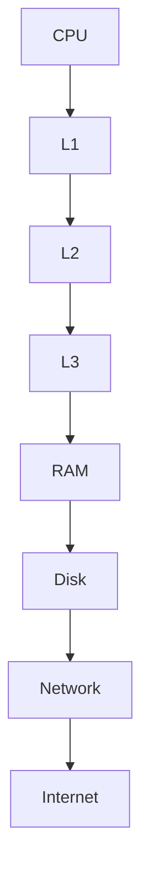

Everything is caching.

---

# The Universal Cache Pattern

Every cache follows:

```text
Client

↓

Cache

↓

Source Of Truth
```

Simple architecture.

---

# Universal Cache Diagram


---

# Cache Vocabulary

You must know these.

```text
Hit

Miss

Eviction

TTL

Invalidation

Warmup
```

These are universal.

---

# Cache Hit

Data exists.

```text
User

↓

Cache

↓

Response
```

Fast.

---

# Cache Miss

Data doesn't exist.

```text
User

↓

Cache

↓

Database

↓

Cache

↓

Response
```

Slower.

---

# Hit/Miss Diagram

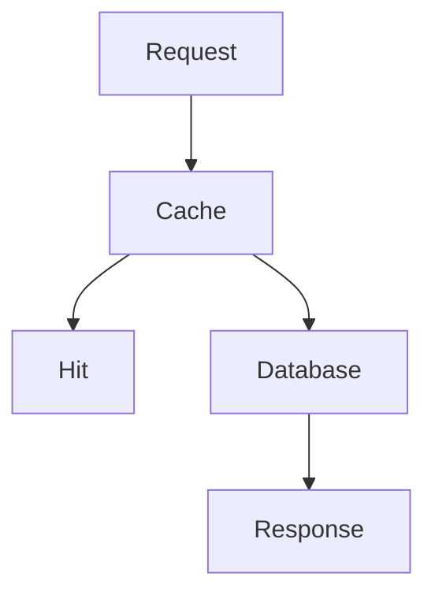

---

# Hit Ratio

Very important metric.

Formula:

```text
Hits

/

Total Requests
```

Example:

```text
900 hits

100 misses

=

90%
```

Excellent.

---

# Cache Warmup

Question:

> What happens after restart?

Everything is empty.

This is called:

```text
Cold Cache
```

Performance suffers.

---

# Warmup Diagram

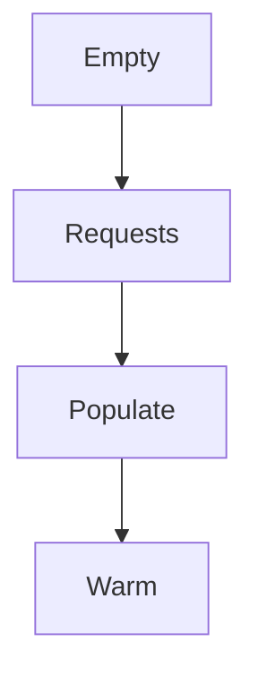

---

# The Three Universal Costs Of Caching

Caching always creates tradeoffs.

```text
Memory Cost

Complexity Cost

Consistency Cost
```

Nothing is free.

---

# Cache Tradeoff Diagram

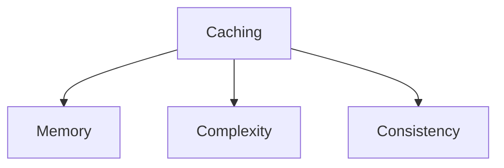

---

# The Hardest Problem In Computer Science

There is a famous joke:

> There are only two hard things in Computer Science:

```text
Cache invalidation

Naming things
```

Cache invalidation is genuinely difficult.

---

# Cache Invalidation Problem

Question:

```text
Database changes.

Who updates the cache?
```

This is the core challenge.

---

# Example

Database:

```text
User = John
```

Cache:

```text
User = John
```

Database changes:

```text
User = Jack
```

Cache still says:

```text
John
```

Wrong.

---

# Stale Data Diagram

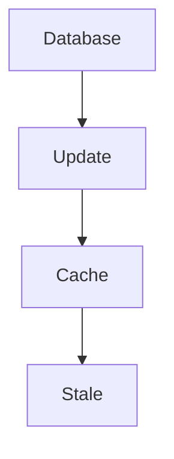

---

# Cache Placement Strategies

There are many places to cache.

```text
CPU Cache

Application Cache

Database Cache

Distributed Cache

CDN Cache
```

---

# Multi-Layer Cache Architecture

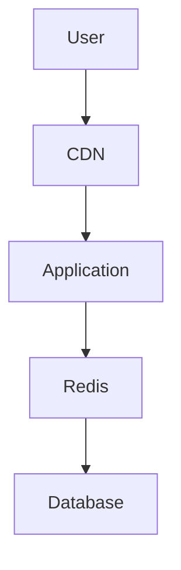

Modern systems use multiple caches.

---

# CPU Cache

Fastest cache.

Levels:

```text
L1

L2

L3
```

Linux heavily relies on CPU caches.

---

# CPU Cache Diagram

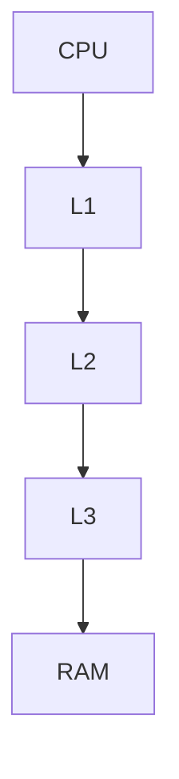

---

# Linux Page Cache

Very important.

Linux automatically caches disk data in RAM.

Instead of:

```text
Disk

↓

Disk

↓

Disk
```

Linux does:

```text
Disk

↓

RAM

↓

Application
```

Huge performance gains.

---

# Page Cache Diagram

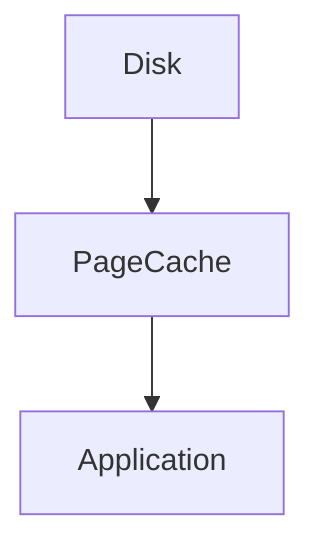

---

# Database Caching

Databases cache aggressively.

Examples:

```text
PostgreSQL

MySQL

MongoDB
```

They cache:

```text
Indexes

Queries

Pages
```

---

# Database Diagram

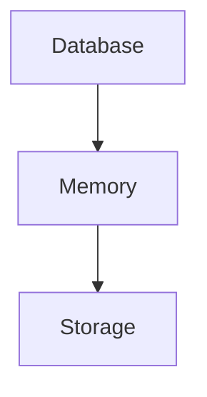

---

# Redis Cache

Redis is distributed RAM.

Architecture:

```text
Application

↓

Redis

↓

Database
```

Very common.

---

# Redis Diagram

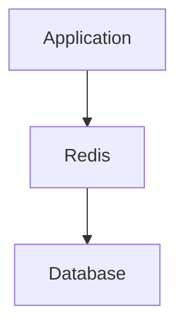

---

# CDN Caching

CDN means:

```text
Content Delivery Network
```

Instead of:

```text
India → US Server
```

Use:

```text
India → Local Edge Server
```

Much faster.

---

# CDN Diagram


---

# Cache Strategies

These are extremely important.

There are four major strategies.

```text
Cache Aside

Write Through

Write Back

Write Around
```

Memorize these.

---

# 1. Cache Aside

Most common.

Read flow:

```text
Application

↓

Cache

↓

Database

↓

Cache

↓

Application
```

---

# Cache Aside Diagram

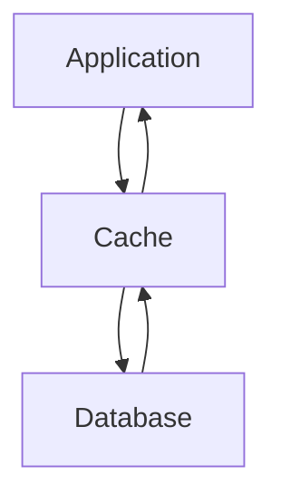

---

# Advantages

```text
Simple

Popular

Easy to implement
```

Problems:

```text
Stale data
```

---

# 2. Write Through

Every write updates both.

```text
Application

↓

Cache

↓

Database
```

---

# Write Through Diagram

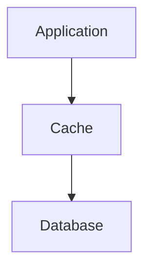

Advantages:

```text
Consistency
```

Problems:

```text
Slower writes
```

---

# 3. Write Back

Write to cache first.

Later persist.

```text
Application

↓

Cache

↓

Later Database
```

Very fast.

Risky.

---

# Write Back Diagram

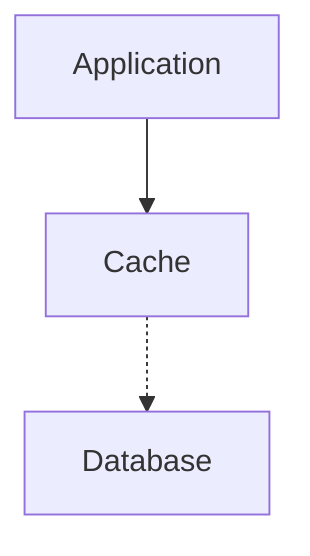

---

# 4. Write Around

Skip cache on writes.

```text
Application

↓

Database
```

Cache later.

Useful for infrequent reads.

---

# Eviction Policies

Caches are finite.

Something must be removed.

Common policies:

```text
LRU

LFU

FIFO

TTL
```

---

# LRU

Least Recently Used.

Old data removed.

---

# LFU

Least Frequently Used.

Rare data removed.

---

# TTL

Time To Live.

Example:

```text
60 seconds
```

After that:

```text
Delete
```

---

# Cache Eviction Diagram

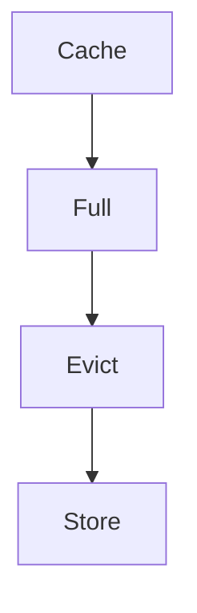

---

# Cache Stampede

Very important production issue.

Scenario:

```text
100000 users

↓

Cache expires

↓

Everyone hits database

↓

Database crashes
```

Disaster.

---

# Stampede Diagram

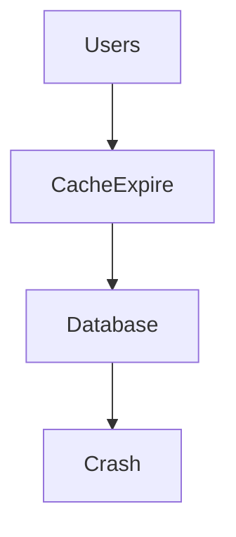

---

# Solutions

Use:

```text
TTL Jitter

Locks

Prewarming

Background Refresh
```

---

# Cache Avalanche

Scenario:

```text
All keys expire simultaneously
```

Database explodes.

---

# Avalanche Diagram

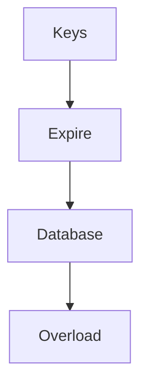

---

# Cache Penetration

Question:

```text
What if users request invalid data?
```

Example:

```text
User ID = -999999
```

Cache miss.

Database hit.

Repeated forever.

Dangerous.

---

# Solutions

```text
Bloom Filters

Null Caching
```

---

# Docker Connection

Containers don't have magical caches.

Containers share Linux page cache.

Pipeline:

```text
Container

↓

Linux

↓

Page Cache

↓

Disk
```

---

# Docker Diagram

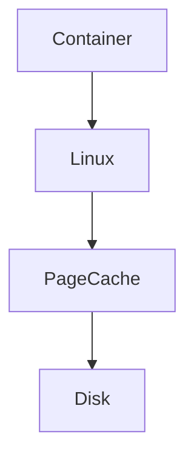

---

# Kubernetes Connection

Kubernetes itself uses caches everywhere.

Examples:

```text
API Server Cache

DNS Cache

Image Cache

Page Cache
```

Everything caches.

---

# Kubernetes Diagram

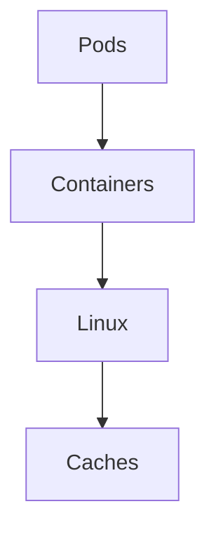

---

# AI Systems Are Cache Systems

Modern AI systems cache:

```text
Embeddings

Prompts

Responses

Tokens

Models
```

AI is becoming a caching problem too.

---

# Cloud Is Massive Caching

Cloud providers cache:

```text
DNS

Images

Storage

Metadata

Networks
```

Everything caches.

---

# Observability Metrics

Monitor:

```text
Hit Ratio

Miss Ratio

Evictions

Latency

Memory Usage

TTL Expirations
```

---

# Linux Tools

Page cache:

```bash
free -h
```

Memory:

```bash
vmstat
```

Kernel memory:

```bash
cat /proc/meminfo
```

Storage:

```bash
iostat
```

Redis:

```bash
redis-cli info
```

---

# Production Troubleshooting Workflow

System slow?

Think:

```text
Requests

↓

Cache

↓

Misses

↓

Database

↓

Bottleneck
```

---

# Security Considerations

Caching introduces risks.

Examples:

```text
Sensitive data leaks

Session leakage

Stale permissions

Cache poisoning
```

Protect caches.

---

# Common Beginner Mistakes

## Mistake 1

Using cache as a database.

---

## Mistake 2

Ignoring invalidation.

---

## Mistake 3

Caching everything.

---

## Mistake 4

Ignoring cache stampedes.

---

## Mistake 5

Ignoring TTL.

---

## Mistake 6

Thinking Redis is mandatory.

Linux already has page cache.

---

# Engineering Mindset

Do not think:

```text
How do I make this faster?
```

Think:

```text
What expensive computation is being repeated unnecessarily?
```

That is caching.

---

# Interview Questions

### Beginner

What is caching?

---

### Intermediate

Difference between cache hit and cache miss?

---

### Intermediate

What is cache invalidation?

---

### Advanced

Explain Cache Aside.

---

### Advanced

Explain cache stampede.

---

### Senior

How would you design caching for a high traffic API?

---

### Architect

Explain why modern infrastructure is fundamentally a giant cache hierarchy.

---

# Mind Map

```mermaid
mindmap

root((Caching Strategies))

CPU Cache

Linux Page Cache

Redis

CDN

Cache Aside

Write Through

Write Back

Write Around

TTL

Evictions

Stampede

Docker

Kubernetes

Cloud

AI Systems
```

---

# Cheat Sheet

```text
Cache = Controlled Duplication

Core Concepts:

Hit

Miss

TTL

Eviction

Invalidation

Strategies:

Cache Aside

Write Through

Write Back

Write Around

Problems:

Stale Data

Stampede

Avalanche

Penetration

Golden Rules:

Cache is not source of truth

Everything is a cache

Caching trades consistency for performance

Every fast system is secretly a cache
```

---

# Final Thought

Every operating system...

Every database...

Every cloud provider...

Every CDN...

Every AI platform...

Eventually rediscovers the same truth.

> Computing is mostly moving information closer to where it will be needed next.

That is caching.

And civilization itself is simply a giant optimization engine built on that idea.
