# Production Server Design

> A production server is not a computer.

> A production server is a machine responsible for protecting user trust.

> Production engineering is trust engineering.

---

# Why This Exists

Imagine this.

Your application reaches:

```text
100 users

↓

1000 users

↓

10000 users

↓

100000 users
```

Suddenly everything changes.

Questions appear.

```text
What if CPU spikes?

What if memory leaks?

What if storage fills?

What if databases fail?

What if servers restart?

What if regions go down?

What if attackers appear?
```

At this point:

You are no longer building software.

You are building infrastructure.

---

# The Biggest Mindset Shift

Stop thinking:

```text
Server = Machine
```

Think:

```text
Server = Responsibility
```

Because users do not care about:

```text
CPU

RAM

Docker

Kubernetes
```

Users care about:

```text
Availability

Reliability

Trust
```

---

# Mental Model: Production Server Is A City

Imagine:

```text
City = Production Server

Citizens = Users

Roads = Network

Power = CPU

Buildings = Memory

Warehouses = Storage

Traffic Police = Linux

Emergency Services = Monitoring

Government = Infrastructure Team
```

Question:

Can a city survive with only roads?

No.

Everything must work together.

Production servers work the same way.

---

# What Is Production Server Design?

Production server design is:

> The process of building systems that remain reliable, secure, observable, maintainable, and scalable under real-world conditions.

Five words matter:

```text
Reliable

Secure

Observable

Scalable

Recoverable
```

---

# The Golden Rule

> Production systems are designed for failures, not success.

---

# The Evolution Of A Server

### Stage 1

Personal computer.

```text
User

↓

Application
```

---

### Stage 2

Single server.

```text
Users

↓

Server
```

---

### Stage 3

Production infrastructure.

```text
Users

↓

Load Balancer

↓

Applications

↓

Databases

↓

Storage
```

---

# Production Architecture Diagram

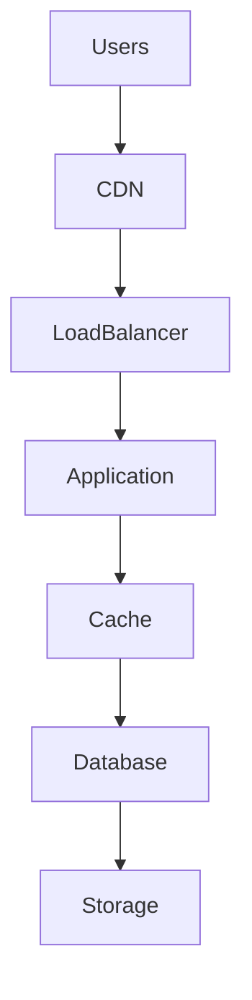

---

# The 7 Pillars Of Production Server Design

Every production server should be designed around these.

```text
Compute

Memory

Storage

Networking

Security

Observability

Reliability
```

---

# Pillars Diagram

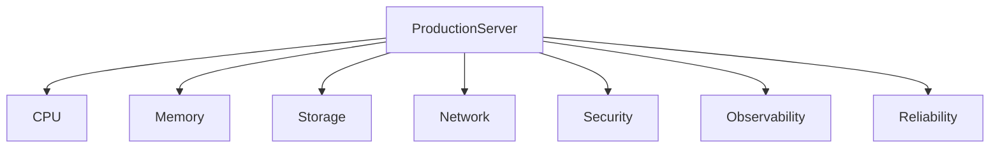

---

# Layer 1: Compute Design

Question:

> How will work be executed?

Consider:

```text
CPU cores

CPU affinity

Schedulers

Thread pools

Concurrency
```

---

# Compute Pipeline

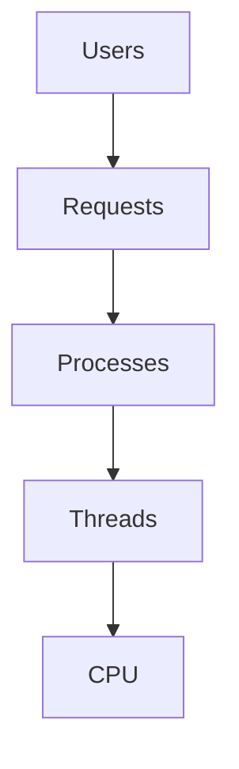

---

# Layer 2: Memory Design

Question:

> How will memory be protected?

Think:

```text
Memory limits

Memory pressure

OOM prevention

Swap strategy

Page cache
```

---

# Memory Pipeline

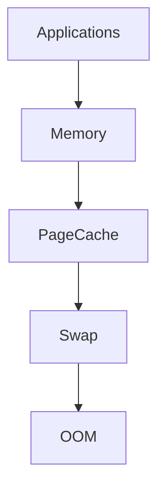

---

# Layer 3: Storage Design

Question:

> Where will data live?

Think:

```text
Filesystem

Volumes

Databases

Backups

Snapshots
```

---

# Storage Pipeline

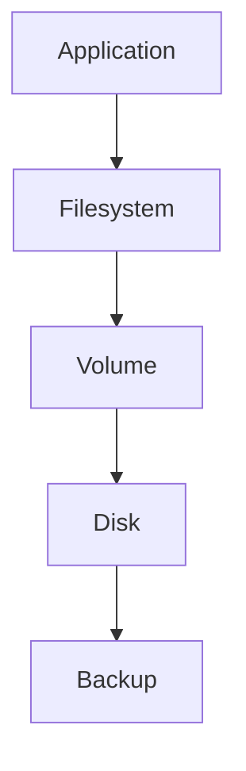

---

# Layer 4: Network Design

Question:

> How will data move?

Think:

```text
Bandwidth

Latency

DNS

TLS

Load balancing
```

---

# Network Pipeline

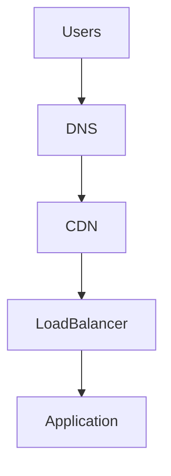

---

# Layer 5: Security Design

Question:

> Assume attackers exist.

Protect:

```text
Network

Processes

Users

Secrets

Data
```

---

# Security Layers

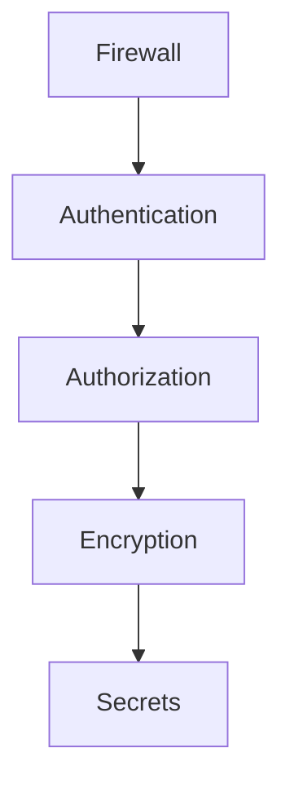

---

# Layer 6: Observability Design

Question:

> How do we know something is broken?

Three pillars:

```text
Metrics

Logs

Traces
```

---

# Observability Diagram

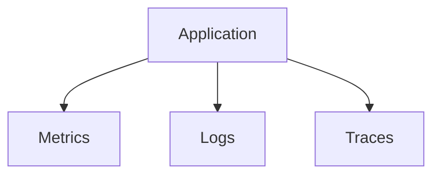

---

# Layer 7: Reliability Design

Question:

> What happens when things fail?

Think:

```text
Retries

Backups

Replication

Failover

Recovery
```

---

# Reliability Diagram

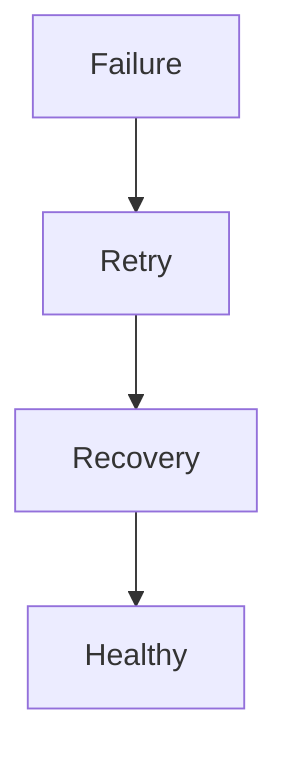

---

# The Golden Production Flow

A production request should flow like this.


---

# Production Server Layout

Never put everything together.

Bad:

```text
Server

├── Database

├── API

├── Monitoring

├── Logs

├── Backups
```

Everything fights for resources.

---

# Better Design

```text
Layered Infrastructure

Edge Layer

↓

Application Layer

↓

Cache Layer

↓

Database Layer

↓

Storage Layer

↓

Observability Layer
```

---

# Production Resource Budgeting

Never allocate 100%.

Bad:

```text
64 GB RAM

Application = 64 GB
```

Good:

```text
64 GB RAM

Application = 40 GB

Page Cache = 12 GB

Monitoring = 4 GB

OS Reserve = 8 GB
```

Leave breathing room.

---

# CPU Budgeting

Bad:

```text
32 cores

32 application workers
```

Good:

```text
32 cores

24 workers

4 monitoring

4 system reserve
```

---

# Disk Budgeting

Bad:

```text
95% usage
```

Good:

```text
60%-70% usage
```

Reserve space.

---

# Network Budgeting

Always reserve bandwidth.

Bad:

```text
100% utilized
```

Good:

```text
70%-80% utilized
```

---

# Production Directory Mental Model

```text
/

├── /etc

├── /var

├── /opt

├── /srv

├── /home

├── /tmp

├── /proc
```

Keep things organized.

---

# Example Production Application Layout

```text
/opt/myapp/

├── app/

├── config/

├── logs/

├── backups/

├── scripts/

├── releases/
```

---

# Production Logging Design

Never log everything.

Bad:

```text
Debug forever
```

Good:

```text
INFO

WARN

ERROR
```

Use log rotation.

---

# Logging Pipeline

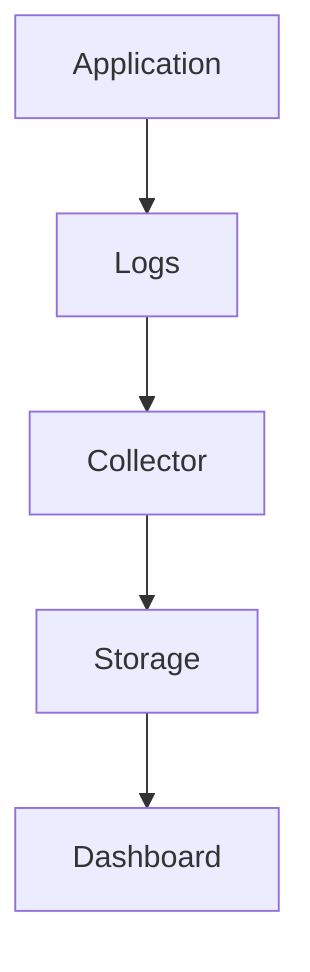

---

# Production Monitoring Stack

Common setup:

```text
Node Exporter

↓

Prometheus

↓

Grafana
```

---

# Monitoring Diagram

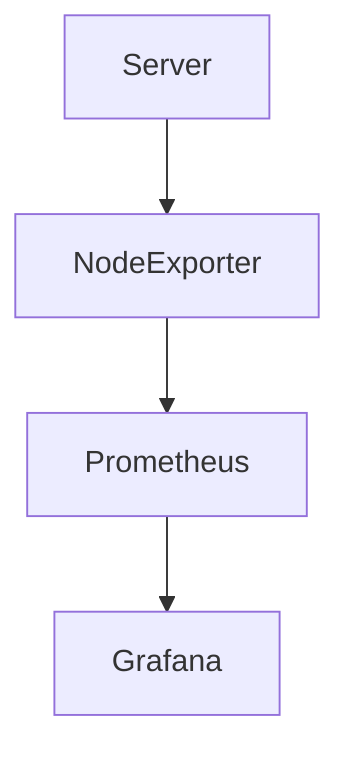

---

# Health Checks Are Mandatory

Never assume servers are healthy.

Health endpoints:

```text
/health

/ready

/live
```

---

# Health Check Diagram

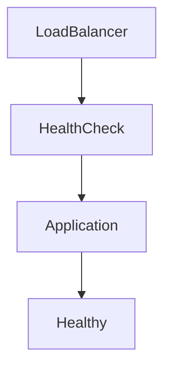

---

# Backups Are Mandatory

Rule:

```text
3-2-1 Rule

3 Copies

2 Different Media

1 Offsite Backup
```

---

# Backup Diagram

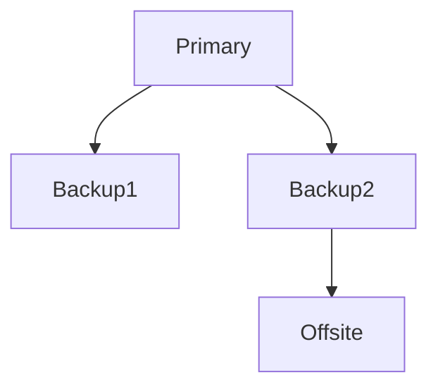

---

# Failure Domains

Never put everything together.

Bad:

```text
1 Region

1 Server

1 Database
```

Good:

```text
Multiple Availability Zones

↓

Replication

↓

Failover
```

---

# Failure Domain Diagram

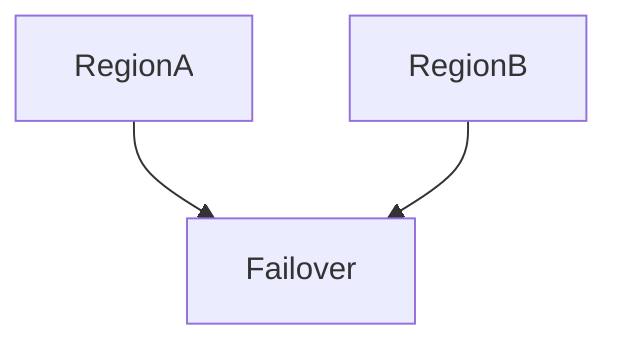

---

# Docker Connection

Containers are not servers.

Containers are isolated processes.

```text
Container

↓

Namespaces

↓

cgroups

↓

Linux
```

Linux still does everything.

---

# Docker Diagram

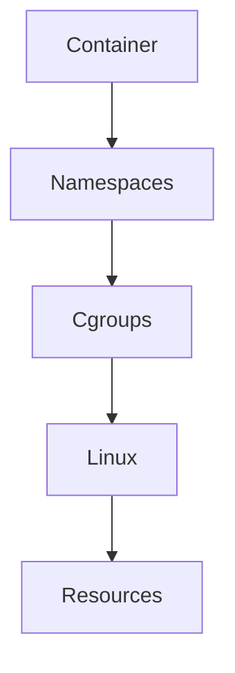

---

# Kubernetes Connection

Kubernetes is not infrastructure.

Kubernetes is infrastructure orchestration.

```text
Pods

↓

Containers

↓

Linux

↓

Resources
```

Everything eventually becomes Linux.

---

# Kubernetes Diagram

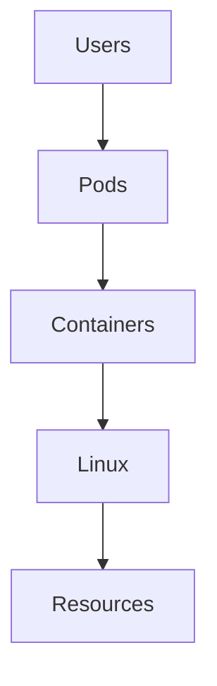

---

# Production Server Checklist

Always verify:

```text
✓ CPU headroom

✓ Memory headroom

✓ Disk headroom

✓ Network headroom

✓ Monitoring

✓ Logging

✓ Backups

✓ Health checks

✓ Security

✓ Recovery plans
```

---

# Production Troubleshooting Workflow

Never do:

```text
Server slow

↓

Restart
```

Do:

```text
Symptoms

↓

Metrics

↓

Resources

↓

Bottleneck

↓

Root Cause

↓

Fix
```

---

# Troubleshooting Diagram

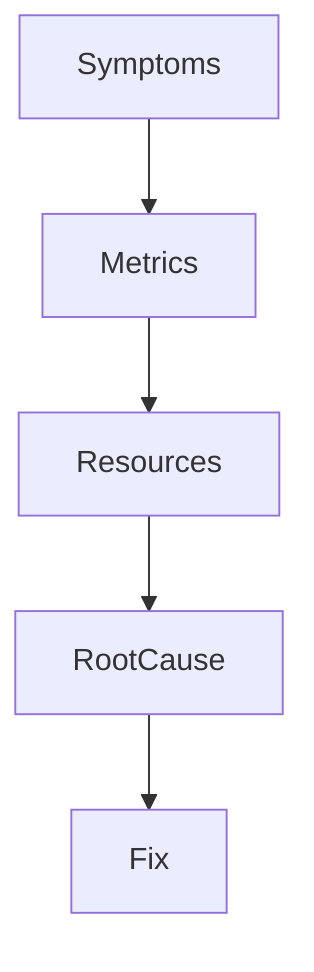

---

# Security Considerations

Protect:

```text
SSH

Secrets

APIs

Users

Databases

Backups
```

Always assume attackers exist.

---

# Common Beginner Mistakes

## Mistake 1

Treating servers as computers.

---

## Mistake 2

Using 100% of resources.

---

## Mistake 3

Ignoring observability.

---

## Mistake 4

Ignoring backups.

---

## Mistake 5

Ignoring failure domains.

---

## Mistake 6

Thinking Docker replaces Linux.

---

# Engineering Mindset

Do not think:

```text
How do I deploy my application?
```

Think:

```text
How do I build a machine that users can trust at 3 AM during failures?
```

That is production engineering.

---

# Interview Questions

### Beginner

What is a production server?

---

### Intermediate

What are the pillars of production infrastructure?

---

### Intermediate

Why is observability important?

---

### Advanced

What is a failure domain?

---

### Advanced

Why should resources never be allocated at 100%?

---

### Senior

How would you design infrastructure for one million users?

---

### Architect

Explain why production engineering is fundamentally trust engineering.

---

# Mind Map

```mermaid
mindmap

root((Production Server Design))

CPU

Memory

Storage

Network

Security

Observability

Reliability

Docker

Kubernetes

Monitoring

Backups

Health Checks

Recovery
```

---

# Cheat Sheet

```text
Production Server = Trust Machine

7 Pillars:

Compute

Memory

Storage

Networking

Security

Observability

Reliability

Golden Rules:

Design for failure

Always leave headroom

Everything must be observable

Everything must be recoverable

Users trust systems, not servers
```

---

# Final Thought

At small scale...

You deploy applications.

At medium scale...

You deploy infrastructure.

At large scale...

You deploy trust.

And every production server is ultimately a machine whose only job is this:

> Keep promises to users even when everything around it is failing.
