# Scaling Linux Systems

> Scaling is not making systems bigger.

> Scaling is teaching systems how to survive growth.

> Every successful company eventually becomes a scaling problem.

---

# Why This Exists

Imagine a startup.

Day 1:

```text
100 users
```

Everything works.

Month 6:

```text
5000 users
```

Still works.

Year 2:

```text
500000 users
```

Suddenly:

```text
Slow APIs

Database overload

Memory pressure

Network bottlenecks

Pod restarts

Latency spikes
```

Question:

What happened?

Nothing broke.

Growth happened.

Growth itself is a failure mode.

---

# The Biggest Mindset Shift

Stop thinking:

```text
Scaling = Add servers
```

Think:

```text
Scaling = Remove bottlenecks continuously
```

---

# Mental Model: Infrastructure Is A City

Imagine:

```text
City = Infrastructure

People = Users

Cars = Requests

Roads = Networks

Factories = CPUs

Warehouses = Storage

Buildings = Memory

Government = Linux
```

Question:

Can you solve city growth by adding roads only?

No.

Everything must grow together.

Infrastructure behaves the same way.

---

# What Is Scaling?

Scaling is:

> The ability of a system to handle increasing demand while maintaining acceptable performance, reliability, and cost.

Three words matter:

```text
Demand

Performance

Reliability
```

---

# The Golden Rule

> Scaling is bottleneck management.

---

# Growth Changes Everything

Growth creates pressure everywhere.

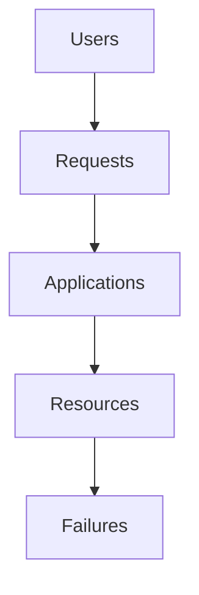

Growth always reaches Linux.

---

# The Universal Scaling Formula

```text
More Users

↓

More Requests

↓

More Resource Usage

↓

More Bottlenecks

↓

More Complexity
```

This is unavoidable.

---

# Every System Has Four Resources

Everything competes for:

```text
CPU

Memory

Storage

Network
```

Scaling always involves these.

---

# Resource Diagram

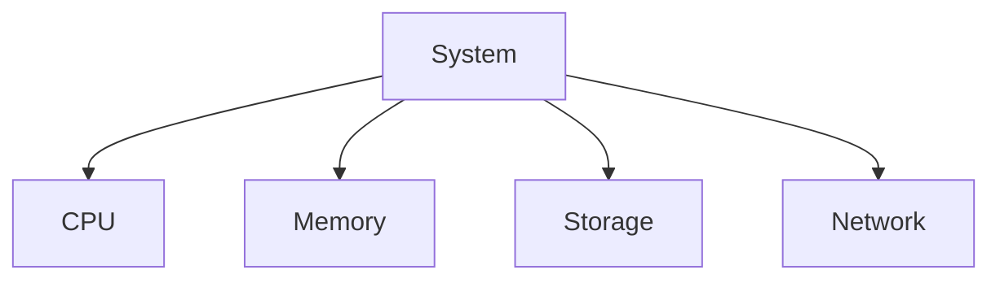

---

# The Five Stages Of Scaling

Most systems evolve through these stages.

```text
Single Machine

↓

Optimized Machine

↓

Multiple Machines

↓

Distributed Systems

↓

Planet Scale Systems
```

---

# Scaling Journey Diagram

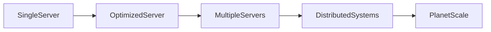

---

# Stage 1: Single Server

Architecture:

```text
Users

↓

Linux

↓

Application

↓

Database
```

Simple.

---

# Single Server Diagram

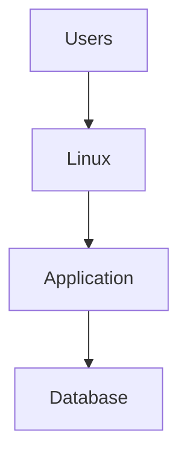

---

# Single Server Advantages

```text
Simple

Cheap

Easy debugging
```

---

# Single Server Problems

Eventually:

```text
CPU limits

Memory limits

Disk limits

Network limits
```

Physics wins.

---

# Stage 2: Vertical Scaling

Question:

> Can we buy bigger hardware?

Example:

```text
4 CPU

↓

8 CPU

↓

16 CPU

↓

64 CPU
```

This is:

```text
Scale Up
```

---

# Vertical Scaling Diagram

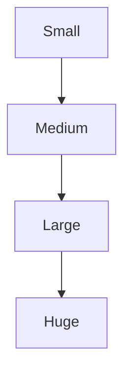

---

# Advantages

```text
Easy

Fast

Minimal code changes
```

---

# Problems

Eventually:

```text
Expensive

Finite

Single point of failure
```

You hit limits.

---

# Stage 3: Horizontal Scaling

Question:

> Can we add more machines?

Example:

```text
Server1

Server2

Server3

Server4
```

This is:

```text
Scale Out
```

---

# Horizontal Scaling Diagram

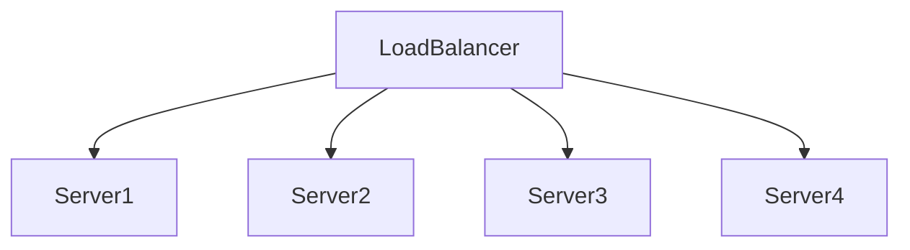

---

# Advantages

```text
High availability

Fault tolerance

Near infinite growth
```

---

# New Problems Appear

Scaling introduces complexity.

```text
Synchronization

Networking

Databases

Consistency

Observability
```

Growth creates new problems.

---

# The Three Universal Bottlenecks

Every large system eventually struggles here.

```text
Compute

Data

Coordination
```

---

# Bottleneck Diagram

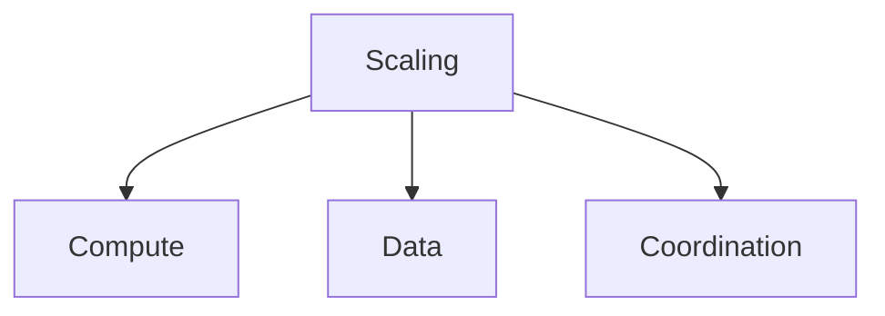

---

# Compute Scaling

Question:

> Can CPUs process requests fast enough?

Solutions:

```text
Parallelism

Concurrency

Load balancing
```

---

# Compute Diagram

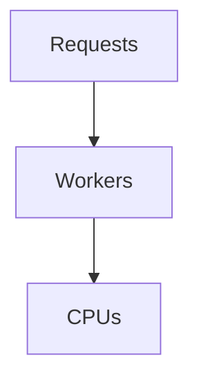

---

# Memory Scaling

Question:

> Can RAM hold the workload?

Problems:

```text
Memory pressure

Swap

OOM
```

Solutions:

```text
Caching

Memory limits

Memory optimization
```

---

# Memory Diagram

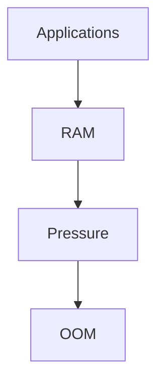

---

# Storage Scaling

Question:

> Can storage absorb data growth?

Problems:

```text
IOPS

Throughput

Latency
```

Solutions:

```text
SSD

Partitioning

Caching
```

---

# Storage Diagram

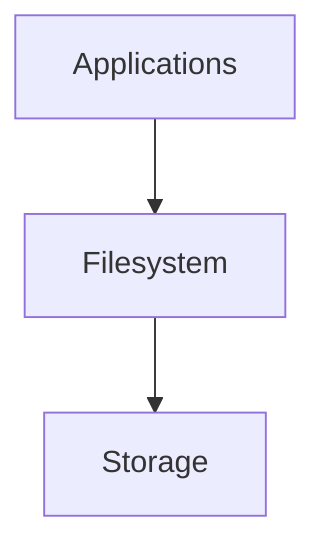

---

# Network Scaling

Question:

> Can data move fast enough?

Problems:

```text
Packet loss

Congestion

Retries
```

Solutions:

```text
CDN

Compression

Load balancing
```

---

# Network Diagram

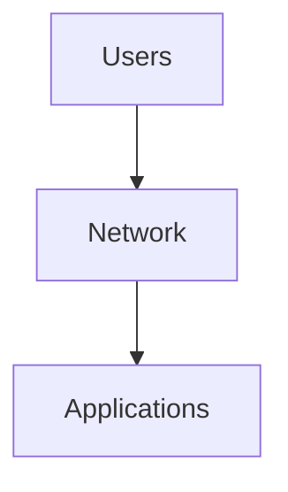

---

# The Queue Principle

This is one of the most important concepts.

Question:

What happens when:

```text
Demand > Capacity
```

Answer:

```text
Queues
```

Always.

---

# Queue Diagram

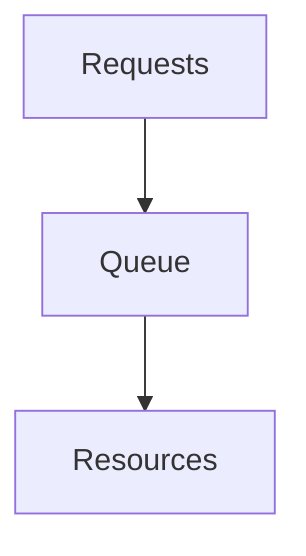

Every large system becomes queues.

---

# The Universal Scaling Failure

```text
More Users

↓

More Queues

↓

More Latency

↓

More Timeouts

↓

More Retries

↓

Collapse
```

Very common.

---

# Failure Diagram

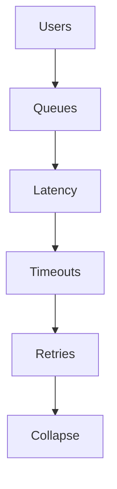

---

# Stateless Systems Scale Better

Bad:

```text
Session stored in application memory
```

Good:

```text
Session stored externally
```

Examples:

```text
Redis

Databases
```

---

# Stateless Diagram

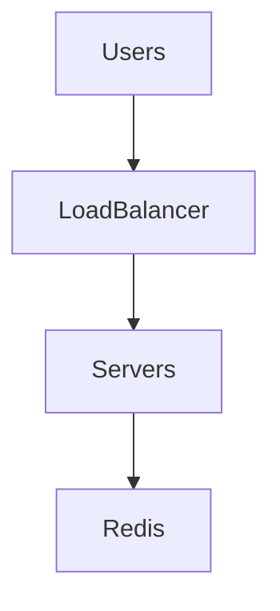

---

# Caching Is Mandatory

Question:

Can databases handle millions of repeated reads?

No.

Use caches.

Architecture:

```text
User

↓

Application

↓

Redis

↓

Database
```

---

# Cache Diagram

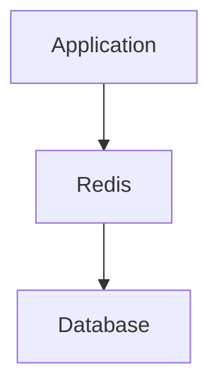

---

# Database Scaling

Databases become bottlenecks quickly.

Solutions:

```text
Indexes

Read replicas

Partitioning

Sharding
```

---

# Database Diagram

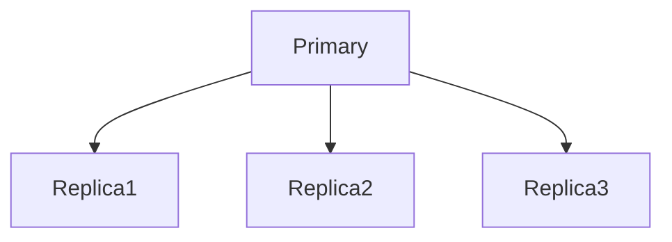

---

# Sharding

Question:

Can one database hold everything?

No.

Split data.

Example:

```text
User A-M

↓

Shard1

------------

User N-Z

↓

Shard2
```

---

# Sharding Diagram

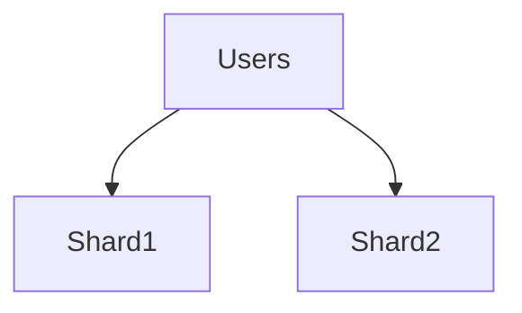

---

# Load Balancing

Very important.

Question:

Can one machine handle all traffic?

No.

Distribute it.

---

# Load Balancer Diagram

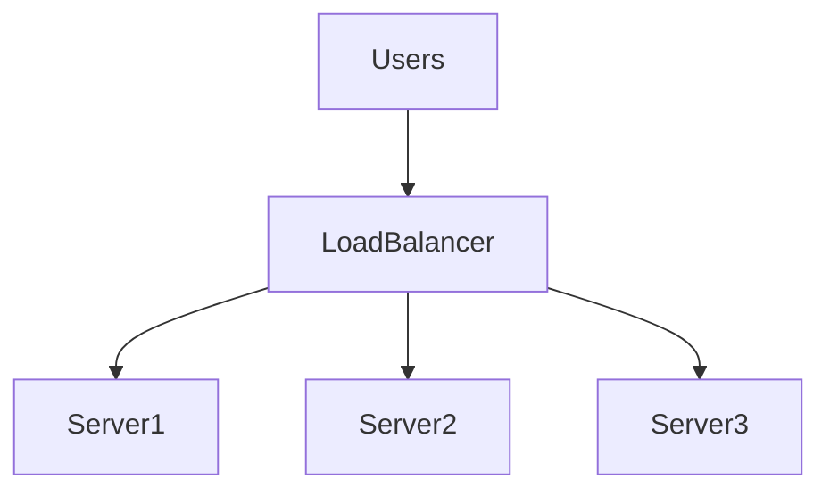

---

# Distributed Systems Introduce New Problems

Examples:

```text
Latency

Consistency

Coordination

Observability
```

Scaling creates complexity.

---

# CAP Thinking

Distributed systems cannot optimize everything.

Choose tradeoffs.

```text
Consistency

Availability

Partition Tolerance
```

---

# CAP Diagram

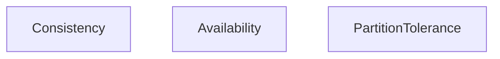

---

# Docker Connection

Containers do not scale applications.

Containers package applications.

Linux still scales systems.

Pipeline:

```text
Container

↓

Namespaces

↓

cgroups

↓

Linux
```

---

# Docker Diagram

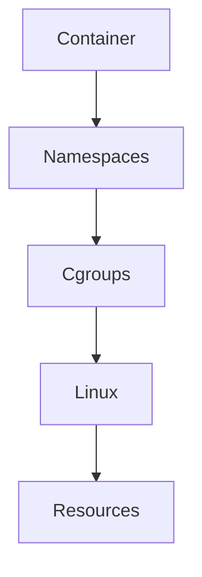

---

# Kubernetes Connection

Kubernetes automates scaling.

Question:

What does Kubernetes actually scale?

Answer:

```text
Linux resources
```

Pipeline:

```text
Users

↓

Pods

↓

Containers

↓

Linux

↓

Resources
```

---

# Kubernetes Diagram

```mermaid
flowchart TD

Users

Pods

Containers

Linux

Resources

Users --> Pods

Pods --> Containers

Containers --> Linux

Linux --> Resources
```

---

# Autoscaling

Kubernetes can scale automatically.

Triggers:

```text
CPU

Memory

Requests
```

Example:

```text
2 pods

↓

5 pods

↓

20 pods
```

---

# Autoscaling Diagram

```mermaid
flowchart TD

LowTraffic

MediumTraffic

HighTraffic

LowTraffic --> MediumTraffic

MediumTraffic --> HighTraffic
```

---

# Cloud Scaling

Cloud providers solve:

```text
Millions of users

Millions of servers

Millions of containers
```

At planetary scale.

---

# Cloud Diagram

```mermaid
flowchart TD

Users

Regions

Clusters

Nodes

Resources

Users --> Regions

Regions --> Clusters

Clusters --> Nodes

Nodes --> Resources
```

---

# The Four Golden Signals

Always monitor:

```text
Latency

Traffic

Errors

Saturation
```

These explain growth behavior.

---

# Four Golden Signals Diagram

```mermaid
flowchart TD

Latency

Traffic

Errors

Saturation
```

---

# Production Scaling Workflow

Never do:

```text
Traffic increased

↓

Add servers
```

Do:

```text
Traffic increased

↓

Find bottleneck

↓

Remove bottleneck

↓

Measure

↓

Repeat
```

---

# Scaling Loop

```mermaid
flowchart TD

Growth

Measure

Bottleneck

Fix

Repeat

Growth --> Measure

Measure --> Bottleneck

Bottleneck --> Fix

Fix --> Repeat
```

---

# Production Example

Traffic:

```text
10000 users

↓

500000 users
```

Investigation:

```text
CPU = Fine

Memory = Fine

Database = Overloaded
```

Solution:

```text
Redis

Indexes

Read replicas
```

Do not scale blindly.

---

# Linux Tools

CPU:

```bash
top

htop

mpstat

pidstat
```

Memory:

```bash
free -h

vmstat
```

Storage:

```bash
iostat

iotop
```

Network:

```bash
ss

sar -n DEV
```

Processes:

```bash
ps

lsof
```

Deep tracing:

```bash
perf

strace

bpftrace
```

---

# Security Considerations

Growth attracts attackers.

Examples:

```text
DDoS

Connection floods

Bot traffic

Retry storms
```

Security must scale too.

---

# Common Beginner Mistakes

## Mistake 1

Thinking scaling means adding servers.

---

## Mistake 2

Ignoring bottlenecks.

---

## Mistake 3

Ignoring databases.

---

## Mistake 4

Ignoring observability.

---

## Mistake 5

Ignoring queues.

---

## Mistake 6

Thinking Kubernetes automatically solves scaling.

Linux still does the work.

---

# Engineering Mindset

Do not think:

```text
How do I support one million users?
```

Think:

```text
As demand grows, what will break next?
```

That is scaling engineering.

---

# Interview Questions

### Beginner

What is scaling?

---

### Intermediate

Difference between vertical and horizontal scaling?

---

### Intermediate

Why do queues appear?

---

### Advanced

What are the bottlenecks of distributed systems?

---

### Advanced

Why are stateless systems easier to scale?

---

### Senior

How would you scale a Linux application from 1000 to 1 million users?

---

### Architect

Explain why scaling is fundamentally bottleneck management.

---

# Mind Map

```mermaid
mindmap

root((Scaling Linux Systems))

Users

Requests

CPU

Memory

Storage

Network

Queues

Caching

Databases

Load Balancing

Docker

Kubernetes

Cloud

Observability
```

---

# Cheat Sheet

```text
Scaling = Bottleneck Management

Growth Formula:

Users

↓

Requests

↓

Resources

↓

Bottlenecks

↓

Complexity

Golden Rules:

Everything eventually queues

Demand > Capacity = Saturation

Growth creates new problems

Remove bottlenecks continuously

Linux powers everything underneath
```

---

# Final Thought

Every startup...

Every unicorn...

Every cloud provider...

Every AI company...

Eventually discovers the same truth.

> Success itself is a failure mode.

Because every new user is another request asking your infrastructure:

> Can you still keep your promises?

Scaling is simply learning how to answer:

**"Yes."**

Even when the entire world arrives at once.
