# Production Patterns

> Technologies are temporary.

> Patterns are permanent.

> Companies do not scale because of tools.

> Companies scale because they repeatedly apply proven patterns.

---

# Why This Exists

Imagine a startup.

Day 1:

```text
1 server

1 database

100 users
```

Everything works.

2 years later:

```text
500000 users

100 microservices

20 databases

50 engineers
```

Suddenly:

```text
Slow APIs

Database overload

Failures

Timeouts

Complexity
```

Question:

How do companies solve these repeatedly?

The answer:

```text
Production patterns
```

Patterns are reusable solutions to recurring problems.

---

# The Biggest Mindset Shift

Stop thinking:

```text
Technology first
```

Think:

```text
Problem first

↓

Pattern

↓

Technology
```

---

# Mental Model: Production Patterns Are LEGO Blocks

Imagine:

```text
LEGO Blocks = Patterns

Buildings = Systems

City = Infrastructure
```

Companies repeatedly assemble the same blocks.

---

# What Is A Production Pattern?

A production pattern is:

> A reusable engineering solution for a recurring infrastructure problem.

Pattern formula:

```text
Problem

↓

Constraint

↓

Solution

↓

Tradeoffs
```

Every pattern has tradeoffs.

---

# The Golden Rule

> Every pattern solves one problem while creating another.

Nothing is free.

---

# The 10 Universal Production Patterns

Every large company eventually uses these.

```text
Load Balancing

Caching

Queueing

Replication

Sharding

Circuit Breakers

Bulkheads

Retries

Rate Limiting

Autoscaling
```

Memorize these.

---

# Production Pattern Map

```mermaid
mindmap

root((Production Patterns))

Load Balancing

Caching

Queueing

Replication

Sharding

Circuit Breakers

Bulkheads

Retries

Rate Limiting

Autoscaling
```

---

# Pattern 1: Load Balancing

## Problem

One server cannot handle everything.

---

## Solution

Distribute traffic.

Architecture:

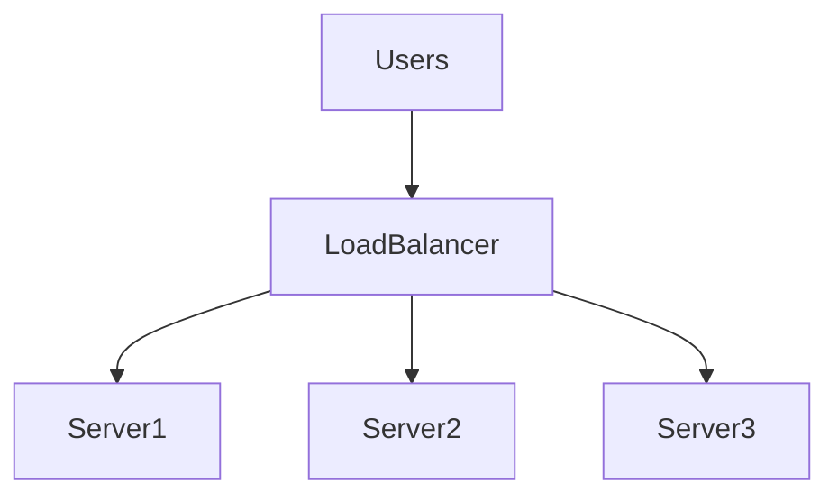

---

## Benefits

```text
Availability

Scalability

Fault tolerance
```

---

## Tradeoffs

```text
Extra infrastructure

Complexity

Health checks
```

---

# Pattern 2: Caching

## Problem

Repeated expensive computations.

Example:

```text
100000 users

↓

Same query
```

Bad.

---

## Solution

Store copies.

Architecture:

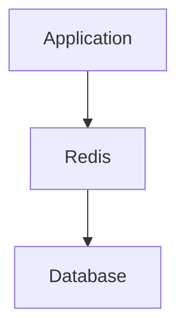

---

## Benefits

```text
Lower latency

Lower database load
```

---

## Tradeoffs

```text
Stale data

Cache invalidation
```

---

# Pattern 3: Queueing

## Problem

Demand exceeds processing capability.

---

## Solution

Store requests temporarily.

Architecture:

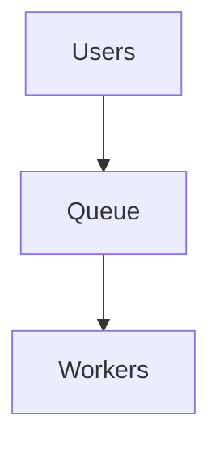

---

## Examples

```text
Kafka

RabbitMQ

SQS

Redis Streams
```

---

## Benefits

```text
Smooth traffic

Async processing
```

---

## Tradeoffs

```text
Latency

Ordering complexity
```

---

# Pattern 4: Replication

## Problem

Single point of failure.

---

## Solution

Duplicate systems.

Architecture:

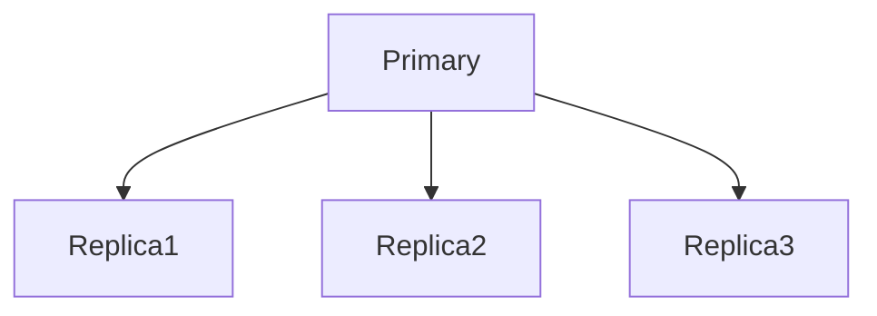

---

## Benefits

```text
High availability

Fault tolerance
```

---

## Tradeoffs

```text
Consistency delays
```

---

# Pattern 5: Sharding

## Problem

One database cannot scale forever.

---

## Solution

Split data.

Example:

```text
A-M → Shard1

N-Z → Shard2
```

---

# Sharding Diagram

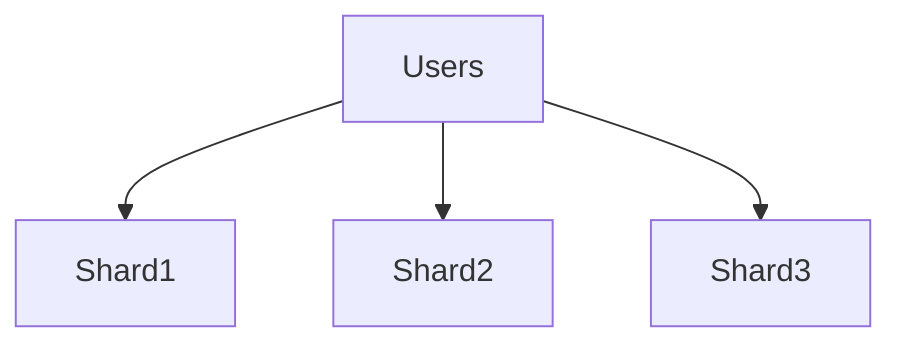

---

## Tradeoffs

```text
Cross-shard joins

Complexity
```

---

# Pattern 6: Circuit Breaker

One of the most important patterns.

---

## Problem

Slow services cause cascading failures.

Example:

```text
Service A

↓

Service B

↓

Timeout
```

Service A waits forever.

Bad.

---

## Solution

Stop calling unhealthy services.

---

# Circuit Breaker States

```text
Closed

↓

Open

↓

Half Open
```

---

# Circuit Breaker Diagram

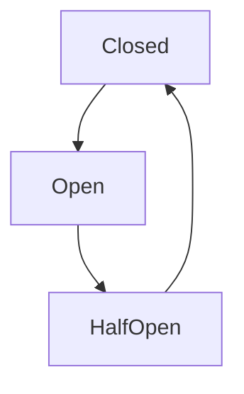

---

## Benefits

```text
Prevent cascading failures
```

---

# Pattern 7: Bulkhead Pattern

Inspired by ships.

Ships have compartments.

If one compartment floods:

```text
Ship survives.
```

Infrastructure should behave similarly.

---

## Problem

One failure affects everything.

---

## Solution

Isolation.

Example:

```text
Auth Service

Payment Service

Search Service
```

Each has separate resources.

---

# Bulkhead Diagram

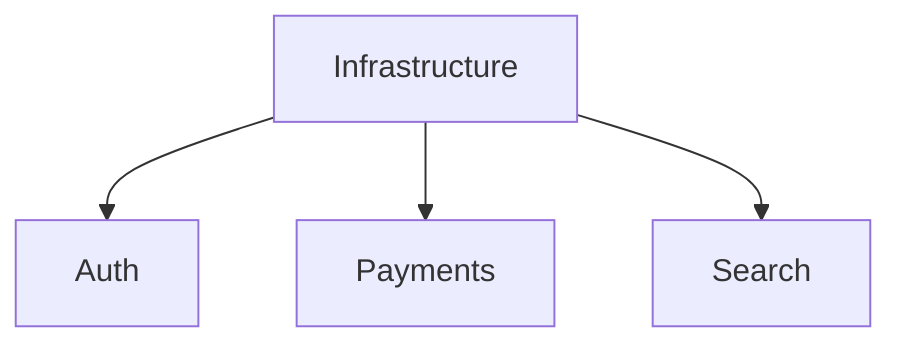

---

# Pattern 8: Retry Pattern

## Problem

Temporary failures happen.

---

## Solution

Retry intelligently.

Bad:

```text
Infinite retries
```

Good:

```text
3 retries

Exponential backoff
```

---

# Retry Diagram

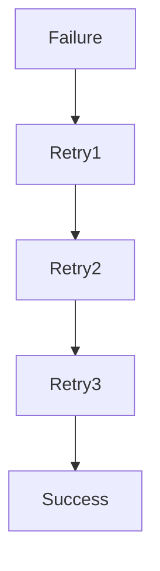

---

# Retry Storm (Very Dangerous)

```text
Slow API

↓

Retries

↓

More traffic

↓

Collapse
```

Common production disaster.

---

# Pattern 9: Rate Limiting

## Problem

Infinite users.

Finite resources.

---

## Solution

Control access.

Example:

```text
100 requests/minute
```

Algorithms:

```text
Token Bucket

Leaky Bucket

Fixed Window

Sliding Window
```

---

# Rate Limiter Diagram

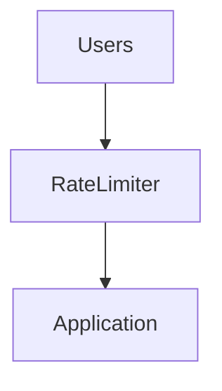

---

# Pattern 10: Autoscaling

## Problem

Traffic changes.

---

## Solution

Adjust resources automatically.

Example:

```text
2 pods

↓

5 pods

↓

20 pods
```

---

# Autoscaling Diagram

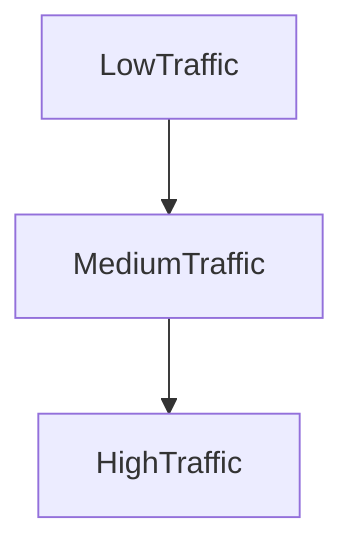

---

# Linux Is Under Every Pattern

People forget this.

Every pattern eventually becomes Linux.

Pipeline:

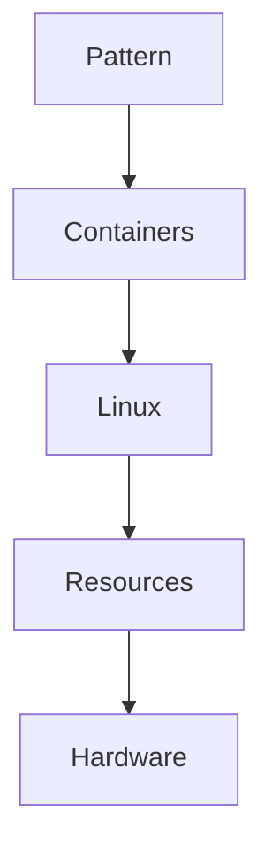

Linux powers everything.

---

# Production Request Lifecycle

A request usually touches multiple patterns.

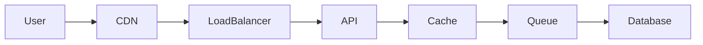

Patterns work together.

---

# The Layered Production Architecture

```text
Users

↓

Edge Layer

↓

Application Layer

↓

Cache Layer

↓

Queue Layer

↓

Database Layer

↓

Storage Layer
```

---

# Layered Diagram

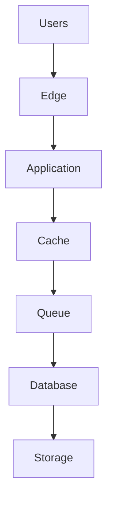

---

# Docker Connection

Docker is not a pattern.

Docker is a packaging tool.

Docker uses Linux patterns.

Pipeline:

```text
Container

↓

Namespaces

↓

cgroups

↓

Linux
```

---

# Kubernetes Connection

Kubernetes orchestrates patterns.

Kubernetes itself heavily uses:

```text
Load balancing

Retries

Health checks

Autoscaling
```

---

# Kubernetes Diagram

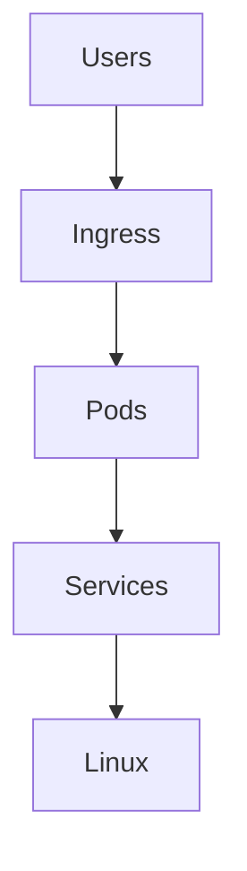

---

# Cloud Is Pattern Automation

AWS, Azure and GCP automate patterns.

Examples:

```text
ELB → Load Balancing

ElastiCache → Caching

SQS → Queues

RDS Replicas → Replication

Auto Scaling Groups → Autoscaling
```

Cloud is mostly managed patterns.

---

# The Production Evolution Journey

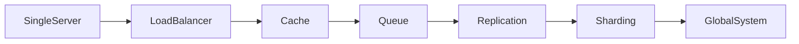

This is how companies grow.

---

# The Four Golden Signals

Always monitor:

```text
Latency

Traffic

Errors

Saturation
```

Patterns are useless without observability.

---

# Observability Diagram

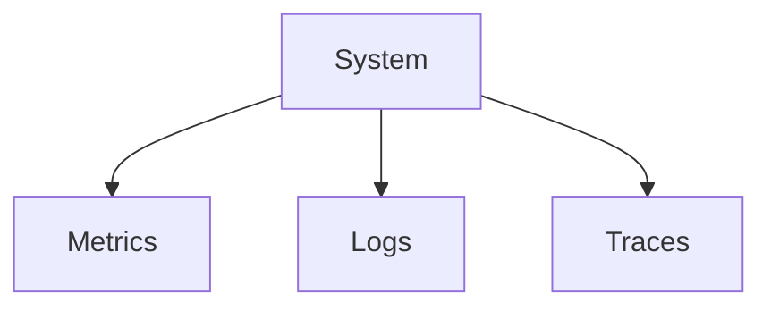

---

# Production Troubleshooting Workflow

Never do:

```text
System slow

↓

Add servers
```

Do:

```text
System slow

↓

Find bottleneck

↓

Find matching pattern

↓

Apply pattern

↓

Measure
```

---

# Pattern Selection Decision Tree

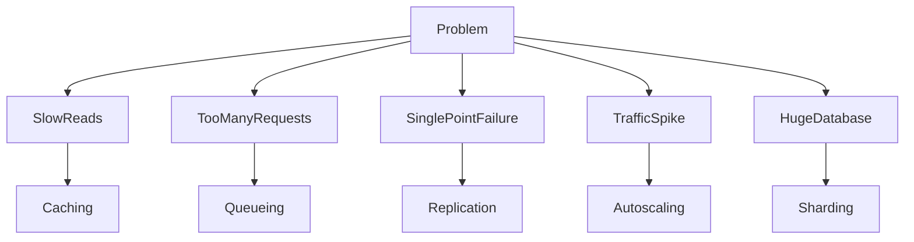

---

# Security Considerations

Attackers target patterns too.

Examples:

```text
DDoS

Cache poisoning

Retry storms

Queue flooding

Rate limit bypass
```

Security must be built into patterns.

---

# Common Beginner Mistakes

## Mistake 1

Learning tools instead of patterns.

---

## Mistake 2

Applying patterns too early.

---

## Mistake 3

Thinking patterns are free.

---

## Mistake 4

Ignoring observability.

---

## Mistake 5

Adding complexity without bottlenecks.

---

## Mistake 6

Thinking Kubernetes is architecture.

Kubernetes only orchestrates architecture.

---

# Engineering Mindset

Do not think:

```text
Which technology should I learn?
```

Think:

```text
Which recurring problem am I solving?
```

Then choose the pattern.

Then choose the technology.

That is senior engineering.

---

# Interview Questions

### Beginner

What is a production pattern?

---

### Intermediate

What is load balancing?

---

### Intermediate

What is the difference between replication and sharding?

---

### Advanced

What is the circuit breaker pattern?

---

### Advanced

Why do retry storms happen?

---

### Senior

How would you design infrastructure for one million users?

---

### Architect

Explain why patterns outlive technologies.

---

# Mind Map

```mermaid
mindmap

root((Production Patterns))

Load Balancing

Caching

Queueing

Replication

Sharding

Circuit Breakers

Bulkheads

Retries

Rate Limiting

Autoscaling

Docker

Kubernetes

Cloud
```

---

# Cheat Sheet

```text
Production Patterns = Reusable Infrastructure Solutions

Core Patterns:

Load Balancing

Caching

Queueing

Replication

Sharding

Circuit Breakers

Bulkheads

Retries

Rate Limiting

Autoscaling

Golden Rules:

Pattern first

Technology second

Every pattern creates tradeoffs

Linux powers everything underneath
```

---

# Final Thought

Every company...

Every cloud provider...

Every AI platform...

Every billion-user application...

Eventually rediscovers the same truth:

> The problems are rarely unique.

The scale changes.

The technologies change.

The names change.

But the patterns remain the same.

Learn technologies and you'll be productive for a few years.

Learn patterns and you'll be productive for decades.
