# Architecture Diagrams

> Great engineers do not memorize systems.

> Great engineers visualize systems.

> If you cannot draw it, you do not fully understand it.

---

# Why This Exists

Humans understand stories and pictures better than isolated facts.

Most Linux learning fails because people memorize:

```text
Commands

Configurations

Tools
```

But infrastructure is actually:

```text
Relationships

Data flow

Resources

Dependencies
```

This file converts infrastructure into pictures.

---

# Diagram 1: Linux Universe

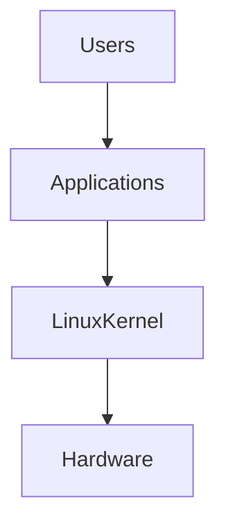

Mental model:

> Linux is the translator between software and hardware.

---

# Diagram 2: Linux Internals

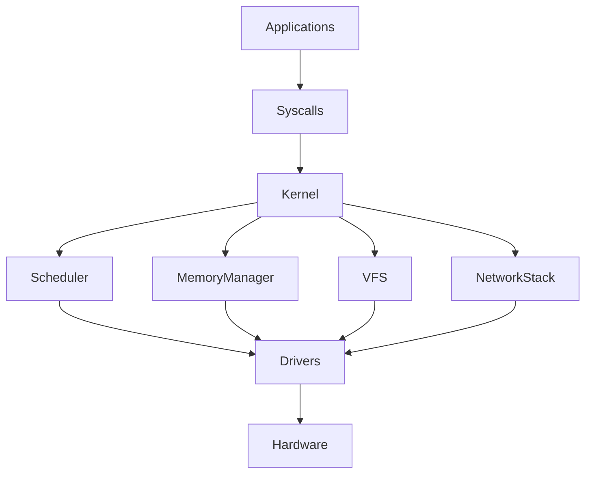

---

# Diagram 3: Request Lifecycle


Question:

> Where can latency occur?

Answer:

```text
Every arrow.
```

---

# Diagram 4: Linux Process Lifecycle

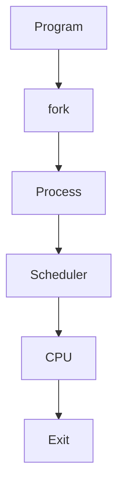

---

# Diagram 5: Process Memory Layout

```text
High Memory

+----------------+
| Kernel Space   |
+----------------+

| Stack          |

| Shared Library |

| Heap           |

| Data Segment   |

| Text Segment   |

+----------------+

Low Memory
```

---

# Diagram 6: Syscall Journey

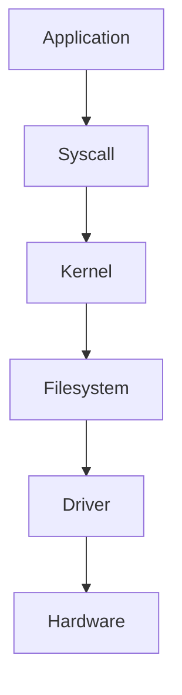

---

# Diagram 7: CPU Scheduling

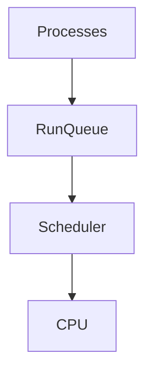

---

# Diagram 8: Context Switching

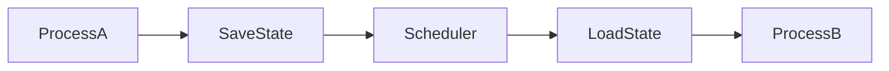

---

# Diagram 9: Memory Hierarchy

```text
Fast

CPU Register

↓

L1 Cache

↓

L2 Cache

↓

L3 Cache

↓

RAM

↓

SSD

↓

HDD

↓

Internet

Slow
```

---

# Diagram 10: Linux Memory Management

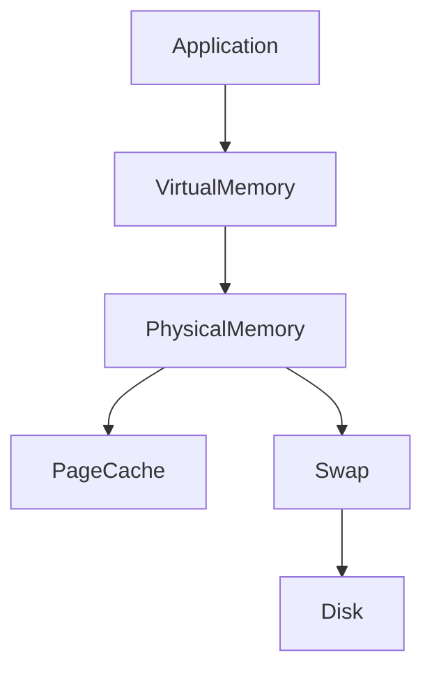

---

# Diagram 11: OOM Killer Decision

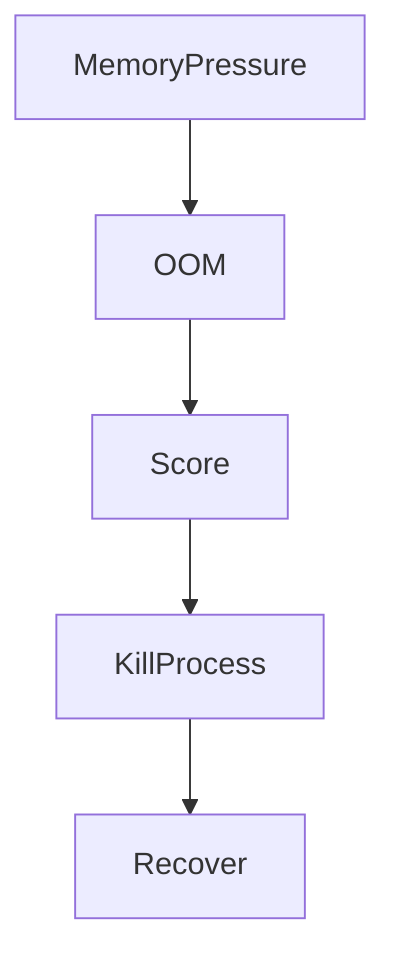

---

# Diagram 12: Linux Storage Pipeline

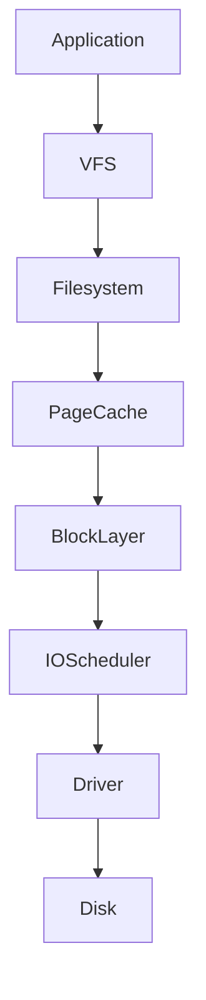

---

# Diagram 13: Network Stack

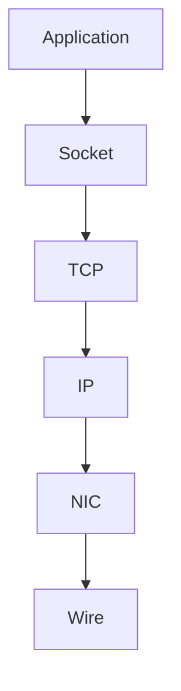

---

# Diagram 14: TCP Connection

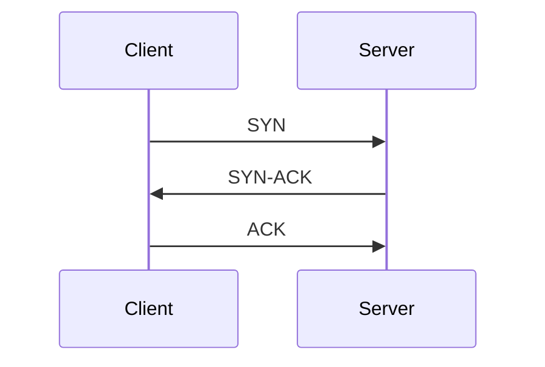

---

# Diagram 15: Docker Architecture

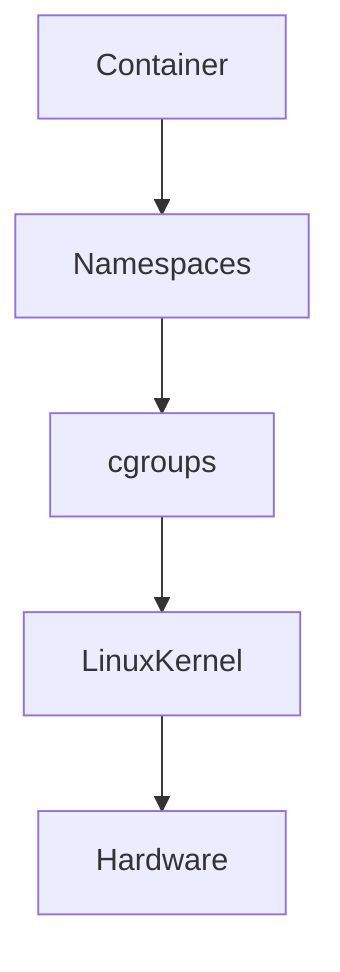

---

# Diagram 16: Container Internals

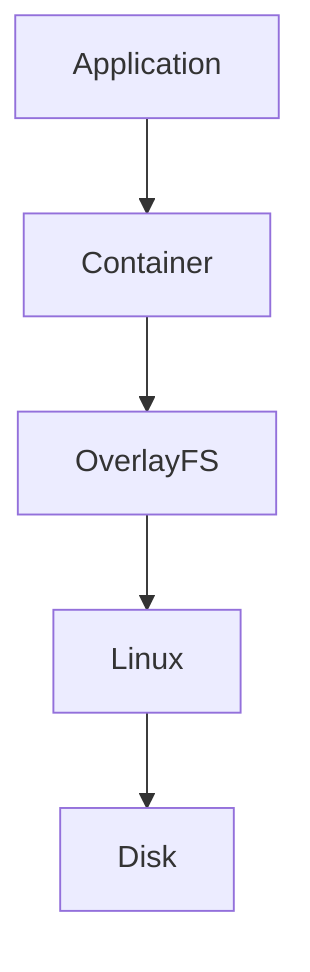

---

# Diagram 17: Kubernetes Architecture

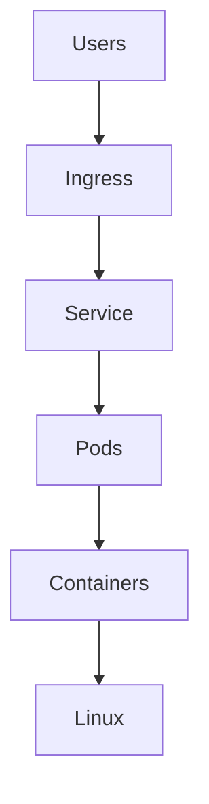

---

# Diagram 18: Kubernetes Cluster

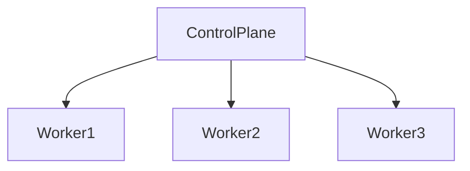

---

# Diagram 19: Production Architecture

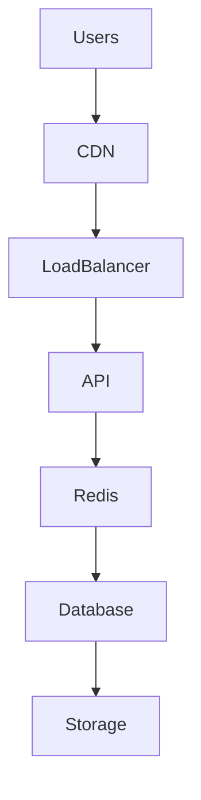

---

# Diagram 20: Caching Hierarchy

```text
CPU Cache

↓

Linux Page Cache

↓

Redis

↓

CDN

↓

Database
```

Every layer is a cache.

---

# Diagram 21: Queueing System

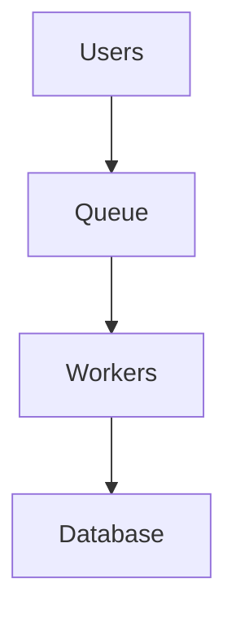

---

# Diagram 22: Event Driven Architecture

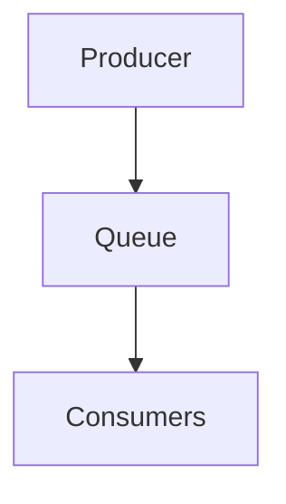

---

# Diagram 23: Microservice Architecture

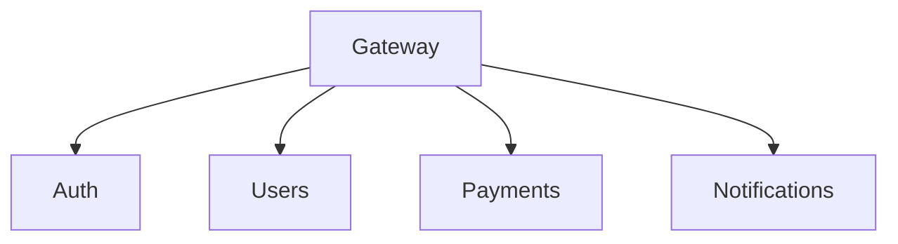

---

# Diagram 24: Database Replication

```mermaid
flowchart TD

Primary

Replica1

Replica2

Replica3

Primary --> Replica1

Primary --> Replica2

Primary --> Replica3
```

---

# Diagram 25: Database Sharding

```mermaid
flowchart TD

Users

ShardA

ShardB

ShardC

Users --> ShardA

Users --> ShardB

Users --> ShardC
```

---

# Diagram 26: Load Balancer

```mermaid
flowchart TD

Users

LoadBalancer

Server1

Server2

Server3

Users --> LoadBalancer

LoadBalancer --> Server1

LoadBalancer --> Server2

LoadBalancer --> Server3
```

---

# Diagram 27: Circuit Breaker

```mermaid
flowchart TD

Closed

Open

HalfOpen

Closed --> Open

Open --> HalfOpen

HalfOpen --> Closed
```

---

# Diagram 28: Retry Storm

```mermaid
flowchart TD

SlowService

Retries

Traffic

Collapse

SlowService --> Retries

Retries --> Traffic

Traffic --> Collapse
```

---

# Diagram 29: Scaling Journey

```mermaid
flowchart LR

SingleServer

VerticalScaling

HorizontalScaling

DistributedSystems

GlobalSystems

SingleServer --> VerticalScaling

VerticalScaling --> HorizontalScaling

HorizontalScaling --> DistributedSystems

DistributedSystems --> GlobalSystems
```

---

# Diagram 30: Observability Pillars

```mermaid
flowchart TD

Infrastructure

Metrics

Logs

Traces

Profiles

Infrastructure --> Metrics

Infrastructure --> Logs

Infrastructure --> Traces

Infrastructure --> Profiles
```

---

# Diagram 31: The Four Golden Signals

```mermaid
flowchart TD

Latency

Traffic

Errors

Saturation
```

Monitor these everywhere.

---

# Diagram 32: Linux Powers Everything

```mermaid
flowchart TD

AI

Cloud

Kubernetes

Docker

Databases

Linux

Hardware

AI --> Linux

Cloud --> Linux

Kubernetes --> Linux

Docker --> Linux

Databases --> Linux

Linux --> Hardware
```

---

# Diagram 33: The Universal Bottleneck Formula

```text
Demand

↓

Capacity

↓

Queues

↓

Latency

↓

Timeouts

↓

Failures
```

This explains most outages.

---

# Diagram 34: Production Troubleshooting Flow

```mermaid
flowchart TD

Symptoms

Metrics

Resources

Bottleneck

RootCause

Fix

Symptoms --> Metrics

Metrics --> Resources

Resources --> Bottleneck

Bottleneck --> RootCause

RootCause --> Fix
```

---

# Diagram 35: Infrastructure Evolution

```text
Laptop

↓

Server

↓

Cluster

↓

Distributed System

↓

Cloud

↓

Planetary Infrastructure
```

---

# Diagram 36: The Modern Technology Stack

```mermaid
flowchart TD

Users

Frontend

API

Cache

Database

Linux

Hardware

Users --> Frontend

Frontend --> API

API --> Cache

Cache --> Database

Database --> Linux

Linux --> Hardware
```

---

# Diagram 37: Systems Thinking Diagram

```mermaid
flowchart TD

Users

Requests

Applications

Resources

Failures

Users --> Requests

Requests --> Applications

Applications --> Resources

Resources --> Failures
```

Everything is connected.

---

# Diagram 38: The Engineer Evolution Journey

```text
Commands

↓

Tools

↓

Systems

↓

Patterns

↓

Architecture

↓

Engineering Thinking
```

---

# Diagram 39: The Linux Engineering Universe

```mermaid
mindmap

root((Linux Engineering))

Processes

CPU

Memory

Storage

Networking

Security

Performance

Reliability

Containers

Kubernetes

Cloud

Databases

Distributed Systems

SRE

Platform Engineering
```

---

# Diagram 40: The Entire Modern Internet

```mermaid
flowchart TD

Users

DNS

CDN

LoadBalancer

Microservices

Caches

Databases

Linux

Hardware

Users --> DNS

DNS --> CDN

CDN --> LoadBalancer

LoadBalancer --> Microservices

Microservices --> Caches

Caches --> Databases

Databases --> Linux

Linux --> Hardware
```

---

# Engineering Mindset

Do not memorize diagrams.

Ask three questions for every diagram:

```text
Who creates the data?

Who moves the data?

Who becomes the bottleneck?
```

---

# Cheat Sheet

```text
If you can draw it

↓

You can understand it

↓

You can troubleshoot it

↓

You can optimize it

↓

You can scale it

↓

You can build it
```

---

# Final Thought

The biggest difference between beginners and architects is not knowledge.

It is visualization.

Beginners see:

```text
Tools
```

Architects see:

```text
Relationships
```

Because modern infrastructure is simply millions of moving pieces that engineers have learned how to visualize.
