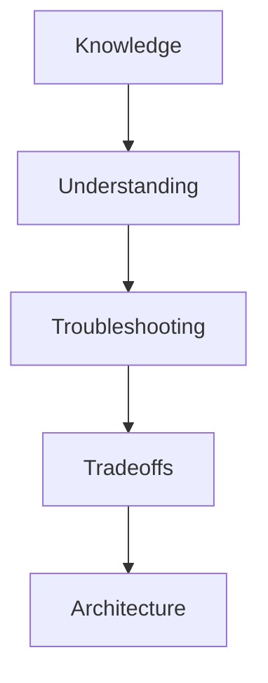
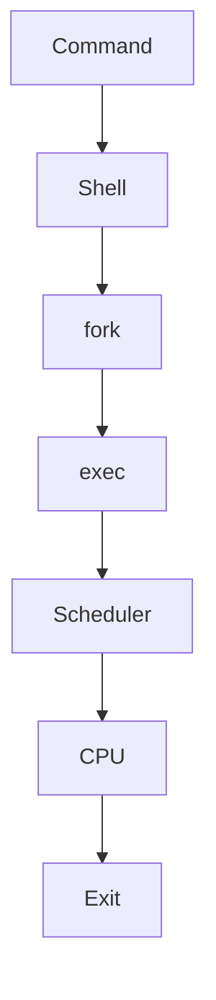
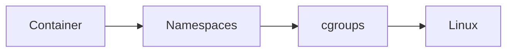
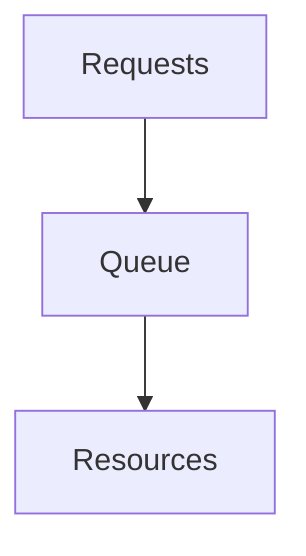
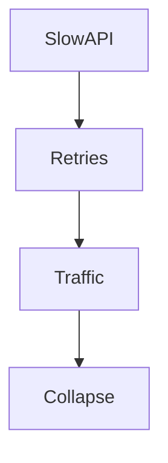
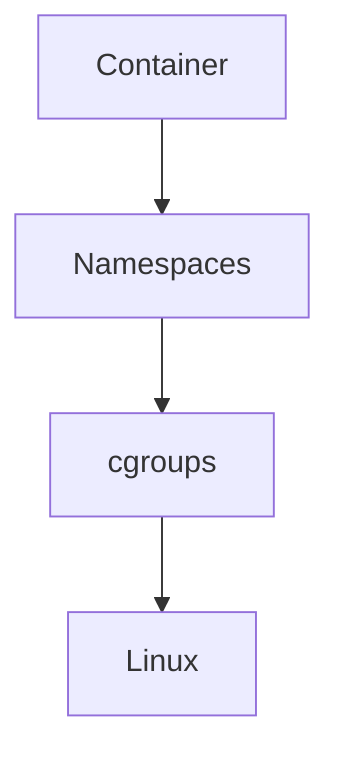
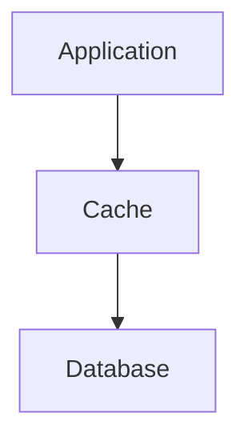
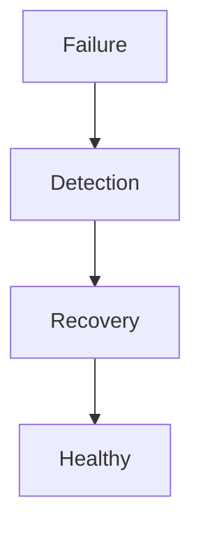
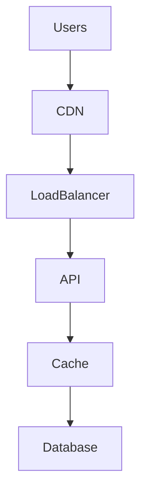

# Linux Engineering Interview Questions

> Interviews are not memory tests.

> Interviews are compressed simulations of engineering thinking.

> The goal is not to memorize answers.

> The goal is to build systems intuition.

---

# Why This Exists

Most people prepare incorrectly.

They memorize:

```text
Commands

Definitions

Tools
```

But elite engineers think in:

```text
Relationships

Tradeoffs

Failures

Data flow

Bottlenecks
```

This file teaches that mindset.

---

# Engineering Growth Ladder

```text
Level 1

Linux User

↓

Level 2

Linux Administrator

↓

Level 3

Backend Engineer

↓

Level 4

DevOps Engineer

↓

Level 5

Cloud Engineer

↓

Level 6

SRE

↓

Level 7

Platform Engineer

↓

Level 8

Staff Engineer

↓

Level 9

System Architect
```

Questions evolve with levels.

---

# The 5 Dimensions Every Interview Measures

```text
Knowledge

↓

Understanding

↓

Troubleshooting

↓

Tradeoffs

↓

System Thinking
```

---

# Interview Pyramid



---

# Section 1: Beginner Linux Engineer

---

## Q1

What is Linux?

Bad answer:

```text
Linux is an operating system.
```

Good answer:

> Linux is a kernel that manages hardware resources and provides abstractions so applications can safely execute.

---

## Q2

What are the primary responsibilities of Linux?

Expected:

```text
CPU management

Memory management

Storage management

Networking

Security

Process management
```

---

## Q3

What is a process?

---

## Q4

Difference between program and process?

---

## Q5

What happens when you execute a command?

Expected flow:

```text
Shell

↓

fork()

↓

exec()

↓

Scheduler

↓

CPU

↓

Exit
```

---

# Process Lifecycle Diagram



---

## Q6

What is a system call?

---

## Q7

What is the difference between kernel space and user space?

---

## Q8

What is virtual memory?

---

## Q9

What is a file descriptor?

---

## Q10

What is the purpose of `/proc`?

---

# Section 2: Linux Administrator Questions

---

## Q11

Why is a server slow?

Do not say:

```text
CPU issue
```

Use methodology.

```text
CPU?

Memory?

Storage?

Network?

Processes?
```

---

## Q12

Difference between load average and CPU utilization?

---

## Q13

Why can load average be high while CPU usage is low?

Expected:

```text
I/O wait

Blocked processes

Resource contention
```

---

## Q14

How would you troubleshoot high memory usage?

Workflow:

```text
free

↓

vmstat

↓

top

↓

ps

↓

Root cause
```

---

## Q15

How would you investigate disk pressure?

Tools:

```text
df

iostat

iotop

lsof
```

---

# Section 3: Linux Internals Questions

---

## Q16

Explain Linux process scheduling.

---

## Q17

What is a context switch?

---

## Q18

Why are context switches expensive?

Expected:

```text
Save state

Restore state

Cache invalidation

CPU overhead
```

---

## Q19

What is a run queue?

---

## Q20

What is epoll?

---

## Q21

Why is epoll better than select?

---

## Q22

What are namespaces?

---

## Q23

What are cgroups?

---

## Q24

Difference between namespaces and cgroups?

Expected:

```text
Namespaces = Isolation

cgroups = Resource limits
```

---

# Namespace/Cgroup Diagram



---

# Section 4: Performance Engineering Questions

---

## Q25

What is latency?

---

## Q26

What is throughput?

---

## Q27

Explain Little's Law.

Expected:

```text
L = λ × W
```

---

## Q28

What is saturation?

---

## Q29

Why do queues appear?

Expected:

```text
Demand > Capacity
```

---

## Q30

Why is P99 more important than average latency?

---

# Queue Diagram



---

# Section 5: Memory Questions

---

## Q31

What is Linux page cache?

---

## Q32

What are dirty pages?

---

## Q33

What is swapping?

---

## Q34

What is memory pressure?

---

## Q35

How does OOM Killer work?

---

## Q36

Why can systems crash even when RAM is available?

Expected:

```text
Fragmentation

Pressure

cgroup limits

Kernel memory issues
```

---

# Section 6: Storage Questions

---

## Q37

Difference between capacity pressure and disk pressure?

---

## Q38

What is IOPS?

---

## Q39

Difference between sequential and random I/O?

---

## Q40

What is write amplification?

---

## Q41

What is journaling?

---

## Q42

What is inode exhaustion?

---

# Section 7: Networking Questions

---

## Q43

What happens when you open a website?

Expected:

```text
DNS

↓

TCP

↓

TLS

↓

HTTP

↓

Response
```

---

## Q44

What is TCP three-way handshake?

---

## Q45

What is packet loss?

---

## Q46

Why is DNS important?

---

## Q47

Why are retries dangerous?

---

# Retry Storm Diagram



---

# Section 8: Docker Questions

---

## Q48

What is a container?

Best answer:

> A container is an isolated Linux process.

---

## Q49

What powers containers?

Expected:

```text
Namespaces

cgroups

Linux kernel
```

---

## Q50

What is OverlayFS?

---

## Q51

Do containers have separate kernels?

Expected:

```text
No

Containers share host kernel.
```

---

# Docker Diagram



---

# Section 9: Kubernetes Questions

---

## Q52

What is Kubernetes?

Best answer:

> Kubernetes is a distributed orchestration system for Linux resources.

---

## Q53

What does Kubernetes actually manage?

Expected:

```text
Linux resources
```

---

## Q54

Why do pods restart?

---

## Q55

What is a node?

---

## Q56

What is a control plane?

---

## Q57

How does Kubernetes react to disk pressure?

Expected:

```text
Pod eviction
```

---

# Section 10: Database Questions

---

## Q58

Why do databases become bottlenecks?

---

## Q59

What is replication?

---

## Q60

What is sharding?

---

## Q61

When should you shard?

---

## Q62

Why is caching necessary?

---

# Database Diagram



---

# Section 11: Reliability Engineering Questions

---

## Q63

What is reliability?

---

## Q64

What is MTTR?

Expected:

```text
Mean Time To Recovery
```

---

## Q65

What is MTBF?

Expected:

```text
Mean Time Between Failures
```

---

## Q66

What is an SLO?

---

## Q67

What is an SLA?

---

## Q68

Why are failures inevitable?

---

# Reliability Diagram



---

# Section 12: Observability Questions

---

## Q69

What are the three pillars?

Expected:

```text
Metrics

Logs

Traces
```

---

## Q70

Difference between metrics and logs?

---

## Q71

What is tracing?

---

## Q72

Difference between benchmarking and profiling?

Expected:

```text
Benchmarking

↓

What is slow?

------------

Profiling

↓

Why is it slow?
```

---

# Section 13: Production Engineering Questions

---

## Q73

What are the four golden signals?

Expected:

```text
Latency

Traffic

Errors

Saturation
```

---

## Q74

What are failure domains?

---

## Q75

Why should servers never run at 100%?

---

## Q76

How would you design infrastructure for one million users?

Expected thought process:

```text
Load balancing

↓

Caching

↓

Queues

↓

Databases

↓

Replication

↓

Observability

↓

Autoscaling
```

---

# Infrastructure Diagram



---

# Section 14: Senior Engineer Questions

---

## Q77

Why do successful companies eventually become infrastructure companies?

---

## Q78

Why is every system eventually a queue?

---

## Q79

Why is every fast system secretly a cache?

---

## Q80

Why does every scaling problem become a bottleneck problem?

---

## Q81

Why does every distributed system become a coordination problem?

---

## Q82

Why does every production outage become an observability problem?

---

# Section 15: Staff Engineer Questions

---

## Q83

Design a Linux infrastructure for:

```text
10 million users

Global traffic

99.99% uptime

100 ms response time
```

---

## Q84

How would you reduce costs while maintaining performance?

---

## Q85

How would you reduce operational complexity?

---

## Q86

What systems would you build instead of buying?

---

# Section 16: System Architect Questions

---

## Q87

Explain the entire journey of an API request from browser to database.

---

## Q88

Explain why Linux powers almost all modern infrastructure.

---

## Q89

Explain how Docker, Kubernetes, cloud, databases, and AI all eventually become Linux resource management.

---

## Q90

What is the fundamental job of infrastructure?

Best answer:

> Convert finite resources into predictable user experiences.

---

# Ultimate Meta Questions

These are the most important questions in this repository.

For every system ask:

### Question 1

Who creates the data?

---

### Question 2

Who moves the data?

---

### Question 3

Who stores the data?

---

### Question 4

Who becomes the bottleneck?

---

### Question 5

What happens during failure?

---

### Question 6

How do we observe the failure?

---

### Question 7

How do we recover?

---

# Interview Evolution Mind Map

```mermaid
mindmap

root((Linux Engineering Interviews))

Linux

Processes

Memory

Storage

Networking

Performance

Docker

Kubernetes

Databases

Reliability

Observability

Production

Architecture

Systems Thinking
```

---

# 10 Golden Rules For Linux Interviews

```text
1. Do not memorize definitions.

2. Explain data flow.

3. Explain tradeoffs.

4. Explain bottlenecks.

5. Explain failures.

6. Explain observability.

7. Think in systems.

8. Think in queues.

9. Think in resources.

10. Linux powers everything.
```

---

# Ultimate Cheat Sheet

```text
Beginner:

What is this?

------------

Intermediate:

How does this work?

------------

Advanced:

Why does this exist?

------------

Senior:

What breaks?

------------

Staff:

What are the tradeoffs?

------------

Architect:

How does everything connect together?
```

---

# Final Thought

The goal of this repository is **not to help someone pass interviews.**

The goal is something much bigger.

If you can answer these questions naturally...

Without memorization...

By reasoning from first principles...

You are no longer preparing for interviews.

You are already thinking like an engineer.
