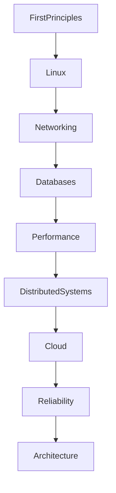
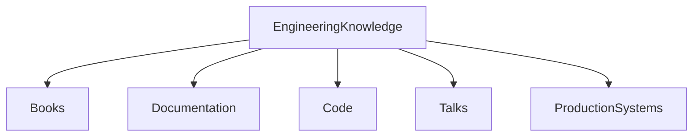
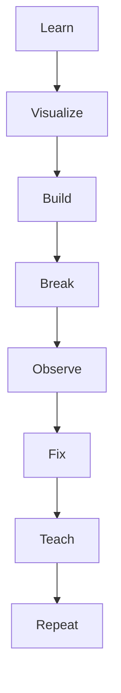
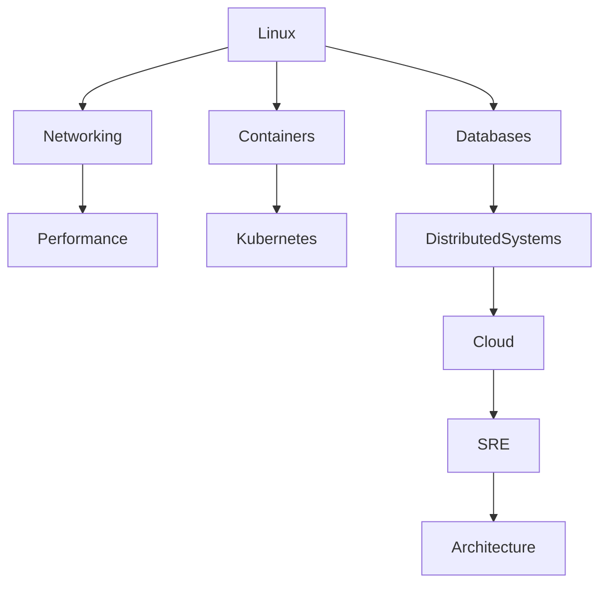

# References

> Great engineers are not people who know everything.

> Great engineers are people who know where truth lives.

> This file is not a list of resources.

> This is your engineering knowledge operating system.

---

# Why This Exists

Modern engineering is impossible to memorize.

Nobody memorizes:

```text
Linux

Docker

Kubernetes

Cloud

Databases

Networking

Distributed Systems

Performance

Reliability
```

The goal is different.

Learn:

```text
Mental models

First principles

Patterns

Documentation navigation

Troubleshooting habits
```

---

# The Engineering Knowledge Pyramid

Learn in this order.

```text
First Principles

↓

Linux Internals

↓

Networking

↓

Databases

↓

Performance

↓

Distributed Systems

↓

Cloud

↓

Reliability

↓

Architecture
```

---

# Knowledge Pyramid



---

# The 5 Types Of Knowledge Sources

Every engineer should use these.

```text
Books

Documentation

Code

Talks

Production Systems
```

Never rely on one source.

---

# Knowledge Sources Diagram



---

# Section 1: Linux Foundations

These are mandatory.

---

## Book 1

How Linux Works

Purpose:

```text
Beginner → Intermediate Linux understanding
```

Learn:

```text
Processes

Memory

Devices

Storage

Networking
```

---

## Book 2

The Linux Programming Interface

Purpose:

```text
Intermediate → Advanced Linux internals
```

Learn:

```text
Processes

Threads

Syscalls

Signals

IPC

Namespaces
```

---

## Book 3

Understanding the Linux Kernel

Purpose:

```text
Kernel internals
```

Learn:

```text
Schedulers

Memory

Interrupts

Kernel subsystems
```

---

# Section 2: Computer Systems Foundations

These books build engineers.

---

## Book 4

Computer Systems: A Programmer's Perspective

Purpose:

```text
Understand computers deeply.
```

Learn:

```text
Memory

Assembly

Caching

Concurrency

Storage
```

---

## Book 5

Operating Systems: Three Easy Pieces

Purpose:

```text
Operating system intuition.
```

Learn:

```text
Virtual memory

Scheduling

Filesystems

Concurrency
```

---

# Section 3: Networking

---

## Book 6

Computer Networking: A Top-Down Approach

Purpose:

```text
Networking intuition.
```

Learn:

```text
DNS

TCP

HTTP

Congestion

Routing
```

---

## Book 7

TCP/IP Illustrated, Volume 1

Purpose:

```text
Advanced networking.
```

Learn:

```text
Packets

TCP internals

Network troubleshooting
```

---

# Section 4: Performance Engineering

---

## Book 8

Systems Performance: Enterprise and the Cloud

This is mandatory.

Purpose:

```text
Performance engineering
```

Learn:

```text
CPU

Memory

Storage

Networking

Cloud
```

---

## Book 9

BPF Performance Tools

Purpose:

```text
Advanced observability
```

Learn:

```text
eBPF

Kernel tracing

Performance analysis
```

---

# Section 5: Databases

---

## Book 10

Designing Data-Intensive Applications

Mandatory.

Purpose:

```text
Distributed systems intuition
```

Learn:

```text
Replication

Sharding

Consistency

Streaming

Distributed systems
```

---

# Section 6: Reliability Engineering

---

## Book 11

Site Reliability Engineering

Purpose:

```text
Production engineering
```

Learn:

```text
SLIs

SLOs

Error budgets

Operations
```

---

## Book 12

The Site Reliability Workbook

Purpose:

```text
Practical SRE
```

---

# Section 7: System Design

---

## Book 13

System Design Interview – An Insider's Guide

Purpose:

```text
System design foundations
```

---

# Section 8: Distributed Systems

---

## Book 14

Distributed Systems

Purpose:

```text
Distributed system fundamentals
```

---

## Book 15

Distributed Systems Observability

Purpose:

```text
Observability mindset
```

---

# Section 9: Official Linux Documentation

Always trust official docs first.

Important places:

* [Linux Kernel Documentation](https://docs.kernel.org/?utm_source=chatgpt.com)
* [The Linux man-pages project](https://man7.org/linux/man-pages/?utm_source=chatgpt.com)
* [GNU Documentation](https://www.gnu.org/doc/doc.html?utm_source=chatgpt.com)

---

# Section 10: Docker Documentation

Official source:

* [Docker Documentation](https://docs.docker.com/?utm_source=chatgpt.com)

Study:

```text
Images

Containers

Volumes

Networks

Compose
```

---

# Section 11: Kubernetes Documentation

Official source:

* [Kubernetes Documentation](https://kubernetes.io/docs/?utm_source=chatgpt.com)

Study:

```text
Pods

Services

Deployments

Nodes

Control Plane
```

---

# Section 12: Cloud Documentation

Official docs matter.

Study all three.

* [AWS Documentation](https://docs.aws.amazon.com/?utm_source=chatgpt.com)
* [Google Cloud Documentation](https://cloud.google.com/docs?utm_source=chatgpt.com)
* [Microsoft Azure Documentation](https://learn.microsoft.com/azure/?utm_source=chatgpt.com)

---

# Section 13: Database Documentation

Study official docs.

* [PostgreSQL Documentation](https://www.postgresql.org/docs/?utm_source=chatgpt.com)
* [MySQL Documentation](https://dev.mysql.com/doc/?utm_source=chatgpt.com)
* [MongoDB Documentation](https://www.mongodb.com/docs/?utm_source=chatgpt.com)
* [Redis Documentation](https://redis.io/docs/latest/?utm_source=chatgpt.com)

---

# Section 14: Elite Engineers To Learn From

These people shaped modern infrastructure thinking.

### Linux

Linus Torvalds

---

### Performance Engineering

Brendan Gregg

---

### Distributed Systems

Martin Kleppmann

---

### Systems Thinking

Andrew S. Tanenbaum

---

### SRE

Betsy Beyer

---

### Observability

Cindy Sridharan

---

# Section 15: Linux Commands That Are Living Documentation

Never memorize outputs.

Understand systems.

```bash
man

info

apropos

whatis
```

---

# Section 16: Build Your Engineering Knowledge Loop

Never learn linearly.

Use this loop forever.



---

# Section 17: Resource Consumption Strategy

### Beginner (0-6 months)

Consume:

```text
70% Linux

20% Networking

10% Databases
```

---

### Intermediate (6-18 months)

Consume:

```text
40% Linux

20% Databases

20% Performance

20% Docker/Kubernetes
```

---

### Advanced (18-36 months)

Consume:

```text
30% Distributed Systems

30% Reliability

20% Performance

20% Architecture
```

---

### Staff/Architect

Consume:

```text
Patterns

Tradeoffs

Economics

Reliability

Scalability
```

---

# The Knowledge Dependency Graph



---

# The Universal Learning Formula

```text
Read

↓

Visualize

↓

Build

↓

Break

↓

Observe

↓

Fix

↓

Repeat
```

Memorization is not included.

---

# Engineering Mindset

Do not ask:

```text
What should I memorize?
```

Ask:

```text
Where does truth live?
```

That question will accelerate your career.

---

# Cheat Sheet

```text
Books build foundations.

Documentation builds correctness.

Code builds intuition.

Production builds wisdom.

Failures build engineers.
```

---

# Final Thought

The internet was not built by people who memorized commands.

It was built by engineers who understood:

```text
Physics

Resources

Tradeoffs

Failures

Systems
```

This repository is not trying to teach Linux.

It is trying to teach **how to think about computers as living systems**.

The day you stop asking:

> "What command should I run?"

and start asking:

> "How does this entire system behave?"

You begin the journey from Linux user to systems engineer.
