# Visuals

> Great engineers think in pictures.

> Great architects think in connected pictures.

> This file is the visual brain of this repository.

---

# How To Read This File

For every diagram ask:

```text
Who creates the data?

↓

Who moves the data?

↓

Who stores the data?

↓

Who becomes the bottleneck?

↓

What happens during failure?
```

---

# Diagram 1: The Entire Linux Universe

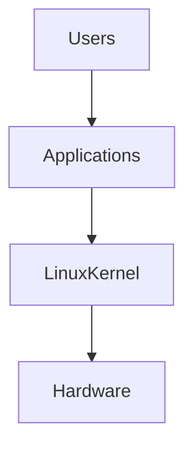

Mental Model:

```text
Users want outcomes.

Applications create requests.

Linux manages resources.

Hardware executes work.
```

---

# Diagram 2: Linux Kernel Universe

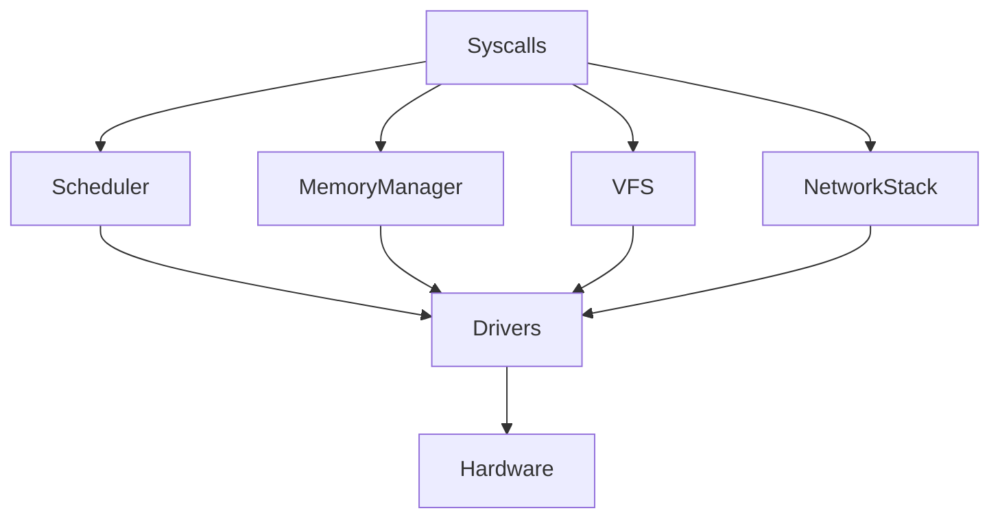

Mental model:

```text
Linux is multiple subsystems collaborating together.
```

---

# Diagram 3: Modern Request Journey

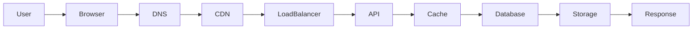

Question:

> Where can latency happen?

Answer:

```text
Every arrow.
```

---

# Diagram 4: Every System Is Resource Transformation

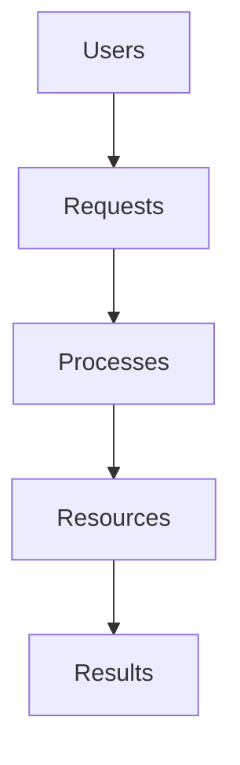

---

# Diagram 5: Linux Resource Engine

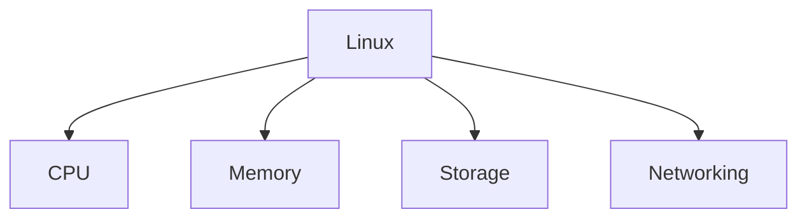

Everything eventually becomes one of these.

---

# Diagram 6: CPU Work Pipeline

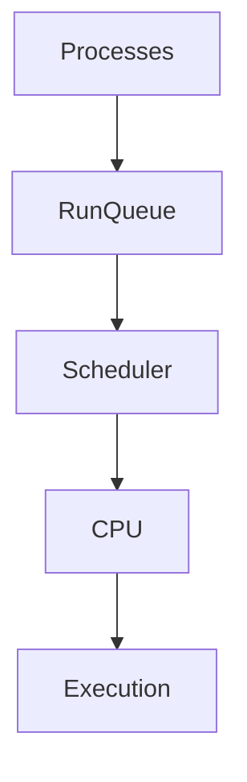

---

# Diagram 7: Memory Pipeline

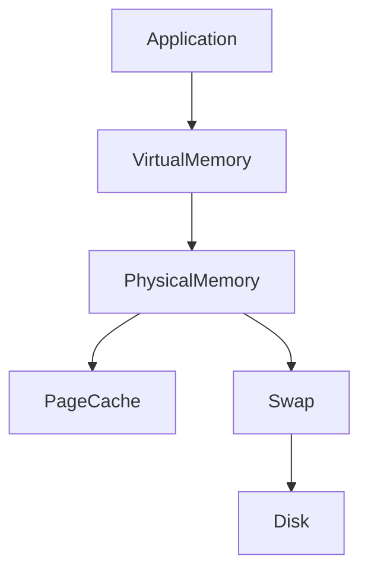

---

# Diagram 8: Storage Pipeline

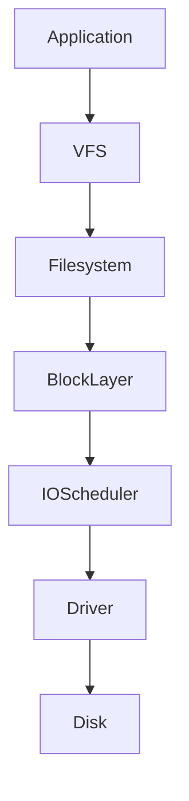

---

# Diagram 9: Network Pipeline

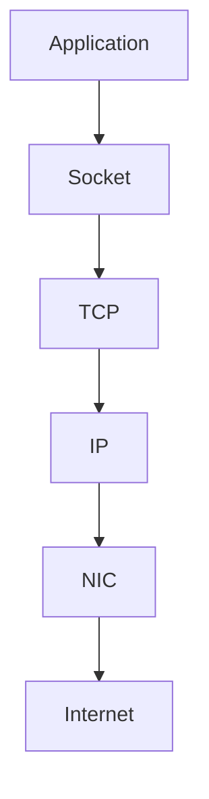

---

# Diagram 10: Universal Performance Formula

```text
Demand

↓

Capacity

↓

Queues

↓

Latency

↓

Timeouts

↓

Failures
```

This explains most outages.

---

# Diagram 11: Queue Universe

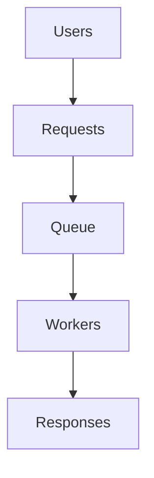

Everything eventually becomes queues.

---

# Diagram 12: Latency Explosion

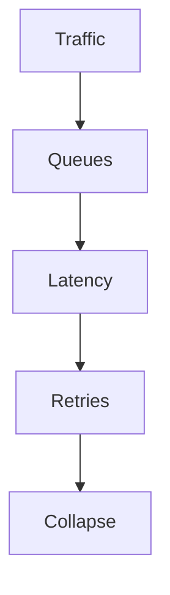

---

# Diagram 13: Cache Hierarchy

```text
CPU Registers

↓

L1 Cache

↓

L2 Cache

↓

L3 Cache

↓

RAM

↓

Linux Page Cache

↓

Redis

↓

CDN

↓

Database

↓

Storage
```

Everything is a cache.

---

# Diagram 14: Linux To Cloud Evolution

```text
Linux

↓

Server

↓

Cluster

↓

Containers

↓

Kubernetes

↓

Cloud

↓

Planetary Infrastructure
```

---

# Diagram 15: Docker Internals

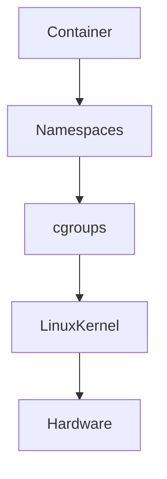

Containers are Linux.

---

# Diagram 16: Kubernetes Internals

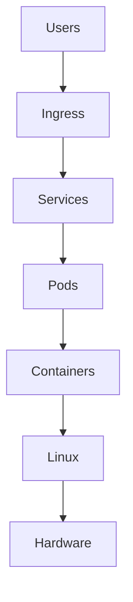

Kubernetes is Linux orchestration.

---

# Diagram 17: Distributed System

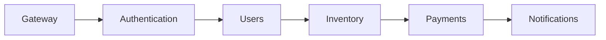

---

# Diagram 18: Production Architecture

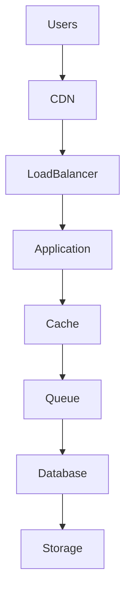

---

# Diagram 19: Database Scaling Journey

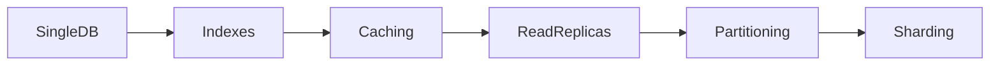

---

# Diagram 20: Infrastructure Growth Journey

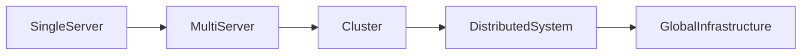

---

# Diagram 21: Reliability Loop

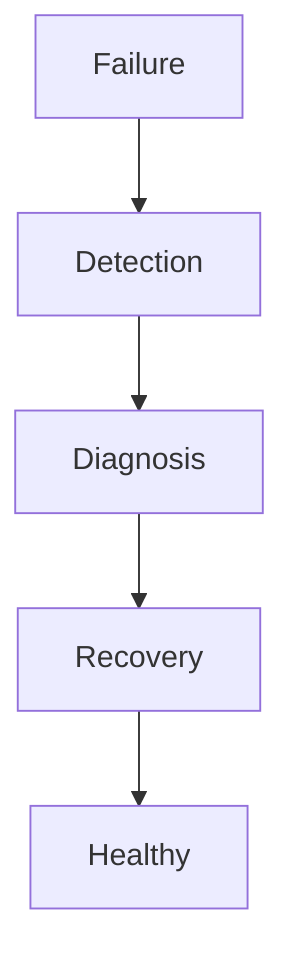

---

# Diagram 22: Observability Universe

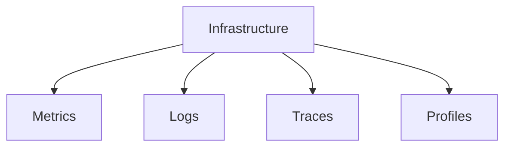

---

# Diagram 23: The Four Golden Signals

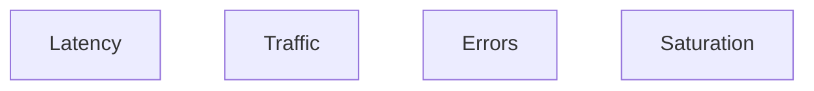

Monitor these everywhere.

---

# Diagram 24: Scaling Loop

```mermaid
flowchart TD

Growth

Measure

Bottleneck

Fix

Repeat

Growth --> Measure

Measure --> Bottleneck

Bottleneck --> Fix

Fix --> Repeat
```

Scaling never ends.

---

# Diagram 25: Universal Failure Loop

```mermaid
flowchart TD

Demand

Overload

Queues

Timeouts

Retries

Collapse

Demand --> Overload

Overload --> Queues

Queues --> Timeouts

Timeouts --> Retries

Retries --> Collapse
```

---

# Diagram 26: Security Layers

```mermaid
flowchart TD

Users

Firewall

Authentication

Authorization

Encryption

Infrastructure

Users --> Firewall

Firewall --> Authentication

Authentication --> Authorization

Authorization --> Encryption

Encryption --> Infrastructure
```

---

# Diagram 27: Linux Powers Everything

```mermaid
flowchart TD

AI

Databases

Docker

Kubernetes

Cloud

SRE

PlatformEngineering

Linux

Hardware

AI --> Linux

Databases --> Linux

Docker --> Linux

Kubernetes --> Linux

Cloud --> Linux

SRE --> Linux

PlatformEngineering --> Linux

Linux --> Hardware
```

---

# Diagram 28: The Entire Modern Internet

```mermaid
flowchart TD

Users

Devices

DNS

CDN

LoadBalancer

Microservices

Caches

Queues

Databases

Linux

Hardware

Users --> Devices

Devices --> DNS

DNS --> CDN

CDN --> LoadBalancer

LoadBalancer --> Microservices

Microservices --> Caches

Caches --> Queues

Queues --> Databases

Databases --> Linux

Linux --> Hardware
```

---

# Diagram 29: Engineering Evolution

```text
Linux User

↓

Linux Administrator

↓

Backend Engineer

↓

DevOps Engineer

↓

Cloud Engineer

↓

SRE

↓

Platform Engineer

↓

Staff Engineer

↓

System Architect
```

---

# Diagram 30: The Linux Engineering Mind

```mermaid
mindmap

root((Linux Engineering))

Processes

CPU

Memory

Storage

Networking

Security

Performance

Caching

Observability

Reliability

Containers

Kubernetes

Cloud

Databases

Distributed Systems

Architecture

Systems Thinking
```

---

# The Universal Engineering Questions

Every diagram in this repository can be understood with these questions.

```text
1. Who creates the work?

2. Who executes the work?

3. Who stores the work?

4. Who moves the work?

5. Who becomes the bottleneck?

6. What fails first?

7. How do we observe it?

8. How do we recover?
```

---

# The 7 Universal Laws Of Infrastructure

```text
Law 1

Everything is a resource management problem.

----------------

Law 2

Everything eventually becomes queues.

----------------

Law 3

Everything eventually becomes bottlenecks.

----------------

Law 4

Every fast system is secretly a cache.

----------------

Law 5

Growth creates complexity.

----------------

Law 6

Failures are inevitable.

----------------

Law 7

Linux powers everything.
```

---

# Final Thought

If this entire repository disappeared tomorrow...

And you only remembered these diagrams...

You could still rebuild most of your Linux engineering knowledge.

Because elite engineers do not memorize technologies.

They visualize systems.

And once you can visualize systems, you can build almost anything.
