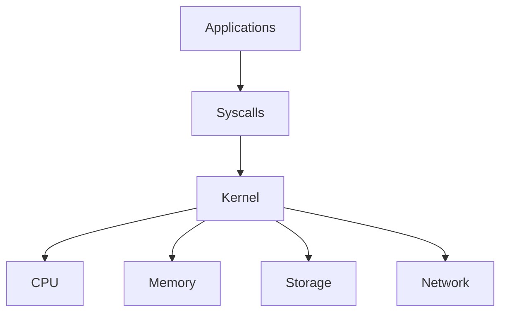
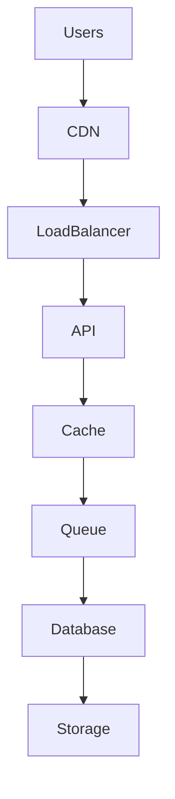

# Mind Map

> Do not memorize Linux.

> Build a map inside your brain.

> Great engineers don't have more knowledge.

> Great engineers have better maps.

---

# Why This Exists

Most people learn Linux like this:

```text
Commands

↓

Commands

↓

Commands

↓

More Commands
```

This creates confusion.

Instead, Linux should be learned as:

```text
Resources

↓

Systems

↓

Relationships

↓

Infrastructure

↓

Architecture
```

---

# Master Linux Engineering Universe

```mermaid
mindmap

root((Linux Engineering))

Engineering Foundations

Linux Internals

Resource Management

Performance Engineering

Production Linux

Containers

Kubernetes

Cloud

Databases

Distributed Systems

Reliability

Observability

Security

System Architecture
```

---

# Big Picture Learning Journey

```text
Computer

↓

Linux

↓

Resources

↓

Applications

↓

Infrastructure

↓

Distributed Systems

↓

Cloud

↓

Platform Engineering

↓

System Architecture
```

---

# Diagram 1: Engineering Foundations

```mermaid
mindmap

root((Engineering Foundations))

Engineering Mindset

Systems Thinking

Production Thinking

Infrastructure Thinking

Reliability Engineering

Failure Thinking
```

Question:

> How do engineers think?

Answer:

```text
Systems

Tradeoffs

Failures

Bottlenecks
```

---

# Diagram 2: Linux Internals

```mermaid
mindmap

root((Linux Internals))

Process Tree

Process Isolation

Syscalls

Namespaces

cgroups

File Descriptors

procfs

Scheduler

I/O Models

epoll
```

Question:

> How does Linux actually work?

---

# Diagram 3: Linux Resource Universe

```mermaid
mindmap

root((Linux Resources))

CPU

Memory

Storage

Network
```

Everything eventually becomes one of these.

---

# Diagram 4: CPU Universe

```mermaid
mindmap

root((CPU))

Processes

Threads

Run Queue

Scheduler

Context Switch

Affinity

Interrupts

Concurrency

Parallelism
```

---

# Diagram 5: Memory Universe

```mermaid
mindmap

root((Memory))

Virtual Memory

RAM

Page Cache

Swap

OOM Killer

Memory Pressure

NUMA

Huge Pages
```

---

# Diagram 6: Storage Universe

```mermaid
mindmap

root((Storage))

VFS

Filesystem

Inodes

Journaling

IO Scheduler

SSD

HDD

IOPS
```

---

# Diagram 7: Networking Universe

```mermaid
mindmap

root((Networking))

DNS

TCP

UDP

TLS

Sockets

HTTP

Load Balancing

CDN
```

---

# Diagram 8: Linux Internals Relationship Map



---

# Diagram 9: Request Lifecycle


---

# Diagram 10: Performance Engineering Universe

```mermaid
mindmap

root((Performance))

Benchmarking

Profiling

Latency

Throughput

Caching

Queues

Bottlenecks

Saturation
```

---

# Diagram 11: Bottleneck Universe

```text
Demand

↓

Capacity

↓

Queues

↓

Latency

↓

Timeouts

↓

Failures
```

This explains most systems.

---

# Diagram 12: Caching Universe

```mermaid
mindmap

root((Caching))

CPU Cache

Linux Page Cache

Redis

CDN

TTL

Evictions

Invalidation

Cache Aside
```

---

# Diagram 13: Production Linux Universe

```mermaid
mindmap

root((Production Linux))

Production Server Design

Scaling

Production Patterns

Reliability

Observability

Security

Recovery
```

---

# Diagram 14: Production Architecture



---

# Diagram 15: Docker Universe

```mermaid
mindmap

root((Docker))

Images

Containers

Volumes

Networks

Namespaces

cgroups

OverlayFS
```

---

# Diagram 16: Kubernetes Universe

```mermaid
mindmap

root((Kubernetes))

Pods

Nodes

Services

Deployments

Control Plane

Scheduler

Ingress

Autoscaling
```

---

# Diagram 17: Cloud Universe

```mermaid
mindmap

root((Cloud))

Regions

Availability Zones

VMs

Containers

Storage

Networking

Load Balancers
```

---

# Diagram 18: Database Universe

```mermaid
mindmap

root((Databases))

Indexes

Transactions

Replication

Sharding

Caching

Partitioning

Connections
```

---

# Diagram 19: Distributed Systems Universe

```mermaid
mindmap

root((Distributed Systems))

Consistency

Availability

Partition Tolerance

Retries

Queues

Replication

Coordination
```

---

# Diagram 20: Reliability Universe

```mermaid
mindmap

root((Reliability))

SLI

SLO

SLA

MTTR

MTBF

Recovery

Error Budgets
```

---

# Diagram 21: Observability Universe

```mermaid
mindmap

root((Observability))

Metrics

Logs

Traces

Profiles

Dashboards

Alerts
```

---

# Diagram 22: Security Universe

```mermaid
mindmap

root((Security))

Authentication

Authorization

Encryption

Secrets

Firewalls

Auditing
```

---

# Diagram 23: Platform Engineering Universe

```mermaid
mindmap

root((Platform Engineering))

Infrastructure

Automation

CI/CD

Observability

Reliability

Developer Experience
```

---

# Diagram 24: The Entire Modern Stack

```mermaid
flowchart TD

Users

Frontend

Backend

Cache

Queue

Database

Linux

Hardware

Users --> Frontend

Frontend --> Backend

Backend --> Cache

Cache --> Queue

Queue --> Database

Database --> Linux

Linux --> Hardware
```

---

# Diagram 25: Docker + Kubernetes + Linux Relationship

```mermaid
flowchart TD

Kubernetes

Docker

Linux

Hardware

Kubernetes --> Docker

Docker --> Linux

Linux --> Hardware
```

---

# Diagram 26: Engineer Evolution Map

```text
Linux User

↓

Linux Administrator

↓

Backend Engineer

↓

DevOps Engineer

↓

Cloud Engineer

↓

SRE

↓

Platform Engineer

↓

Staff Engineer

↓

System Architect
```

---

# Diagram 27: The Universal Linux Laws

```mermaid
mindmap

root((Linux Laws))

Everything Is Resource Management

Everything Eventually Queues

Everything Eventually Bottlenecks

Every Fast System Is A Cache

Growth Creates Complexity

Failures Are Inevitable

Linux Powers Everything
```

---

# Diagram 28: The Grand Unified Linux Engineering Diagram

```mermaid
flowchart TD

Users

Applications

Linux

CPU

Memory

Storage

Network

Docker

Kubernetes

Cloud

Databases

DistributedSystems

Reliability

Observability

Architecture

Users --> Applications

Applications --> Linux

Linux --> CPU

Linux --> Memory

Linux --> Storage

Linux --> Network

Linux --> Docker

Docker --> Kubernetes

Kubernetes --> Cloud

Cloud --> Databases

Databases --> DistributedSystems

DistributedSystems --> Reliability

Reliability --> Observability

Observability --> Architecture
```

---

# The 10 Questions Every Engineer Must Ask

```text
1. Who creates the work?

2. Who executes the work?

3. Who stores the work?

4. Who moves the work?

5. Where is time spent?

6. Where is memory spent?

7. Where is the bottleneck?

8. What fails first?

9. How do we observe it?

10. How do we recover?
```

---

# Learning Order Cheat Sheet

```text
Step 1

Linux Basics

↓

Step 2

Linux Internals

↓

Step 3

CPU

Memory

Storage

Networking

↓

Step 4

Performance

↓

Step 5

Production Linux

↓

Step 6

Docker

↓

Step 7

Kubernetes

↓

Step 8

Cloud

↓

Step 9

Distributed Systems

↓

Step 10

Architecture Thinking
```

---

# Engineering Mindset

Never ask:

```text
What technology should I learn?
```

Ask:

```text
What problem does this technology solve?
```

Then ask:

```text
What Linux resources does it manage?
```

Then ask:

```text
What bottlenecks will it create?
```

This is systems thinking.

---

# Final Thought

This repository is secretly teaching one thing.

Not Linux.

Not Docker.

Not Kubernetes.

It is teaching you to see computers as **living systems**.

The day your brain automatically starts visualizing:

```text
Users

↓

Requests

↓

Resources

↓

Bottlenecks

↓

Failures

↓

Recovery
```

You have crossed the boundary from learner to engineer.
