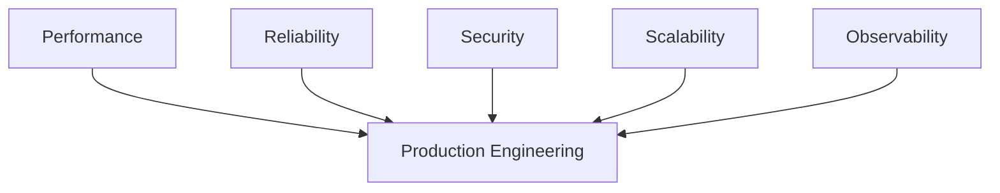
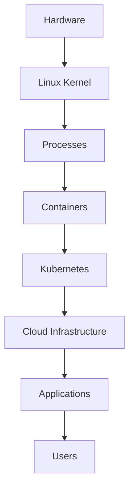
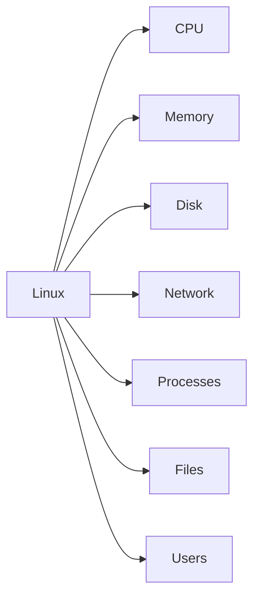
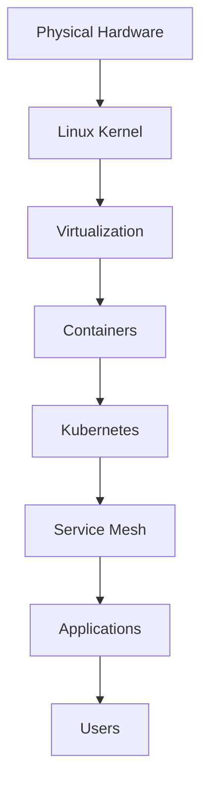
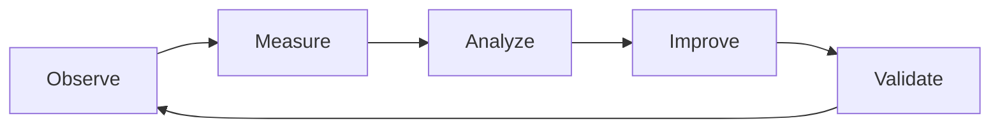

# 12-Advanced Linux Engineering

> Linux is not a collection of commands.
>
> Linux is a resource orchestration engine that modern civilization runs on.

---

# Why this folder exists

Most Linux courses stop here:

```text
ls
cd
grep
find
chmod
systemctl
docker
```

People become command users.

But modern engineers are not command users.

Modern engineers answer questions like:

```text
Why did latency suddenly increase?

Why is CPU usage low but users are experiencing slowness?

Why does Kubernetes exist?

Why do databases become bottlenecks?

Why does memory fragmentation happen?

Why do servers crash despite having free RAM?

Why do distributed systems fail?

Why do successful companies invest heavily in observability?

Why does Netflix build Chaos Engineering?

Why do Google and Amazon obsess over reliability?
```

This folder exists to answer those questions.

---

# The Philosophy Of This Repository

This is **NOT a Linux notes repository.**

This is an **Engineering Handbook**.

We do not teach:

```text
Commands first
```

We teach:

```text
Problems first
```

We do not teach:

```text
Tools first
```

We teach:

```text
Systems first
```

We do not teach:

```text
Memorization
```

We teach:

```text
Mental models
```

We do not teach:

```text
How Linux works
```

We teach:

```text
Why Linux was designed this way
```

---

# The Linux Engineering Pyramid

```text
                  Founder

                     ▲

             System Architect

                     ▲

            Platform Engineer

                     ▲

                SRE Engineer

                     ▲

              Cloud Engineer

                     ▲

              DevOps Engineer

                     ▲

             Backend Engineer

                     ▲

           Linux Administrator

                     ▲

                Linux User
```

Each level solves larger problems.

---

# Engineering Philosophy

Throughout this folder, always think in systems.

Never think:

```text
One machine
```

Think:

```text
Entire infrastructure
```

Never think:

```text
One process
```

Think:

```text
Thousands of processes
```

Never think:

```text
One request
```

Think:

```text
Millions of requests
```

Never think:

```text
One failure
```

Think:

```text
Failure chains
```

Never think:

```text
CPU usage
```

Think:

```text
Resource orchestration
```

---

# The Core Engineering Question

Every file in this folder answers one question:

> How do we build systems that continue to work even when things go wrong?

That is engineering.

---

# The Five Engineering Pillars



Every production system balances these five pillars.

---

# How Linux Powers Modern Systems



Linux sits underneath everything.

---

# Engineering Mindset Shift

## Beginner mindset

```text
I need to learn commands.
```

---

## Intermediate mindset

```text
I need to automate tasks.
```

---

## Advanced mindset

```text
I need to understand systems.
```

---

## Expert mindset

```text
I need to understand failure.
```

---

## Architect mindset

```text
I need to understand tradeoffs.
```

---

## Founder mindset

```text
I need to understand infrastructure economics.
```

---

# The Golden Engineering Rule

Everything is a tradeoff.

You cannot optimize everything.

Optimizing one thing hurts another.

```text
Fast
Cheap
Reliable

Choose carefully.
```

Examples:

```text
More caching
↓
Higher complexity

More replicas
↓
Higher cost

More logging
↓
More storage

More security
↓
More latency

More availability
↓
More inconsistency
```

Engineering is balancing tradeoffs.

---

# Linux Is Resource Management

Linux fundamentally manages only a few things.



Everything else is abstraction.

---

# Modern Infrastructure Stack



Modern engineering is layers built on Linux.

---

# Systems Thinking Model

Every system can be decomposed into five questions.

## 1. What enters?

```text
Input
```

## 2. What transforms it?

```text
Compute
```

## 3. What stores it?

```text
Storage
```

## 4. What moves it?

```text
Network
```

## 5. What observes it?

```text
Observability
```


---

# The Production Engineering Loop



This loop never ends.

---

# Folder Structure

## Engineering Foundations

```text
engineering-mindset.md

systems-thinking.md

production-thinking.md

infrastructure-thinking.md

reliability-engineering.md

failure-thinking.md
```

Purpose:

Teach engineers how to think.

---

## Linux Internals

```text
process-tree-internals.md

process-isolation.md

syscall-lifecycle.md

namespaces.md

cgroups.md

file-descriptors-deep-dive.md

procfs-internals.md

scheduler-internals.md

io-models.md

epoll.md
```

Purpose:

Teach how Linux actually works internally.

---

## Resource Management

```text
cpu-management.md

memory-pressure.md

oom-killer.md

io-bottlenecks.md

network-bottlenecks.md

disk-pressure.md
```

Purpose:

Teach why systems become slow.

---

## Performance Engineering

```text
performance-engineering.md

benchmarking.md

profiling.md

latency-vs-throughput.md

caching-strategies.md
```

Purpose:

Teach optimization.

---

## Production Linux

```text
production-server-design.md

scaling-linux-systems.md

production-patterns.md

architecture-diagrams.md
```

Purpose:

Teach real-world systems.

---

# How To Read This Folder

Recommended order:

```text
1. engineering-mindset.md

2. systems-thinking.md

3. production-thinking.md

4. infrastructure-thinking.md

5. reliability-engineering.md

6. failure-thinking.md

7. Linux Internals

8. Resource Management

9. Performance

10. Production Linux
```

Do not skip Engineering Foundations.

They are the most important files in the entire repository.

---

# Golden Rules

Always remember:

```text
Everything fails.

Everything is connected.

Everything is a tradeoff.

Everything consumes resources.

Everything becomes bottlenecks.

Everything eventually scales.

Everything must be observed.

Everything must be secured.
```

---

# Repository Mission

After finishing this repository, a reader should no longer say:

> "I know Linux commands."

They should say:

> "I understand how modern infrastructure works."

That is the ultimate goal of this Linux Engineering Handbook.
