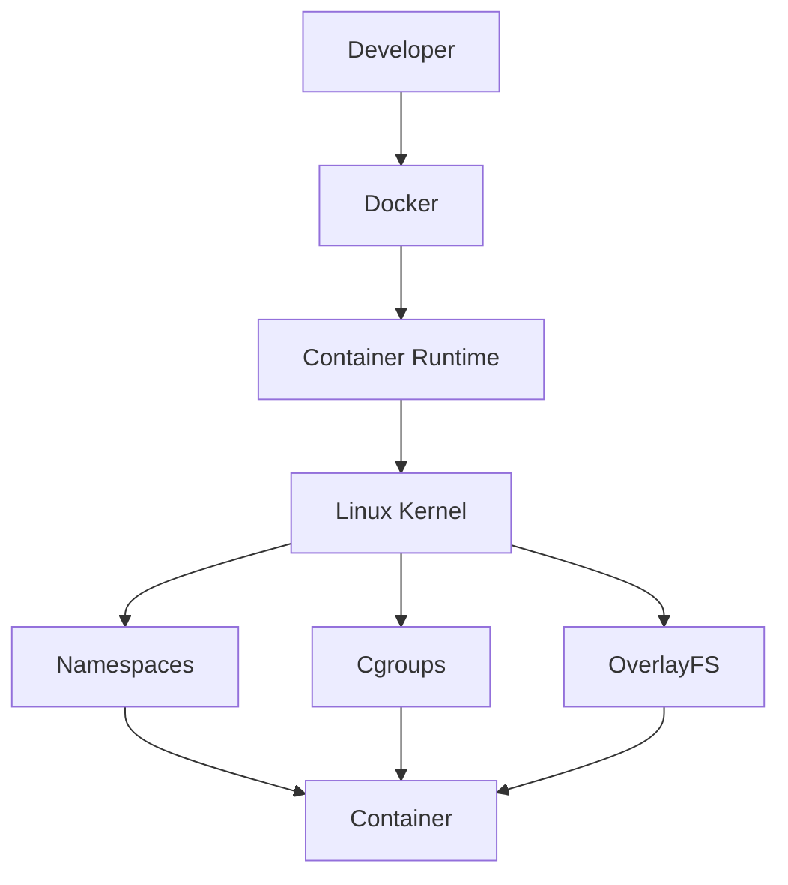
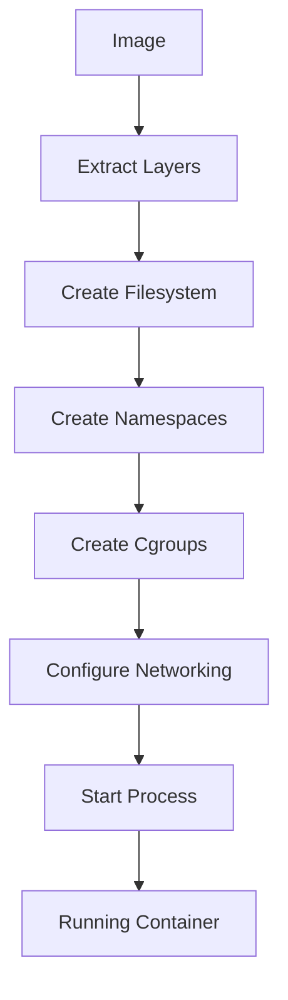
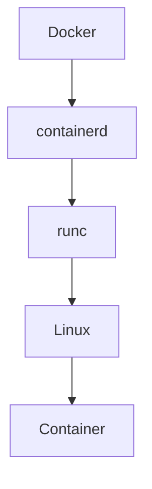
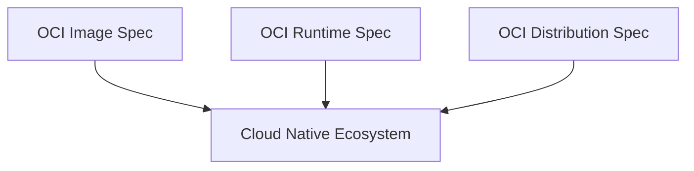
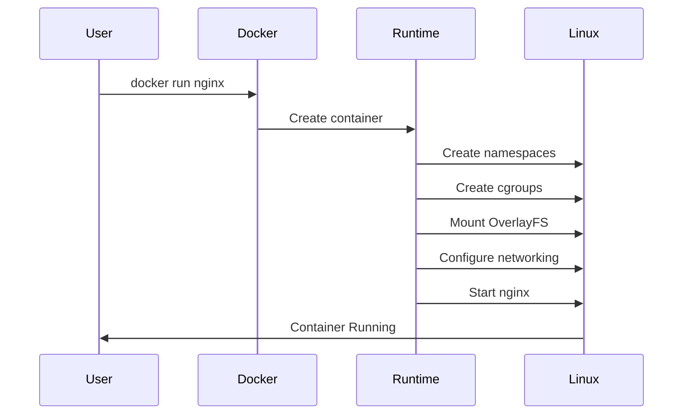
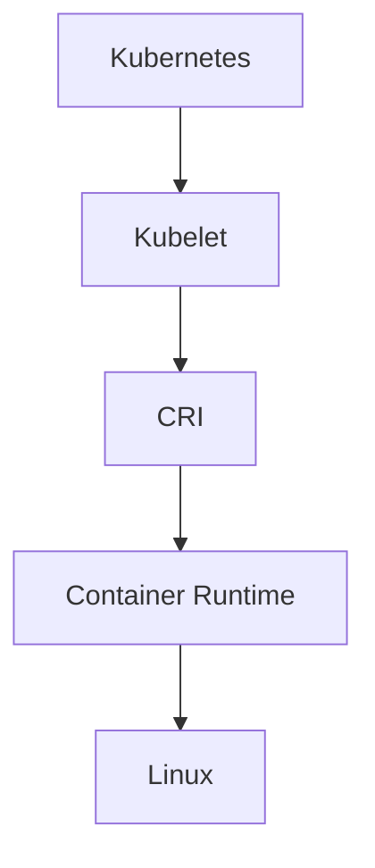
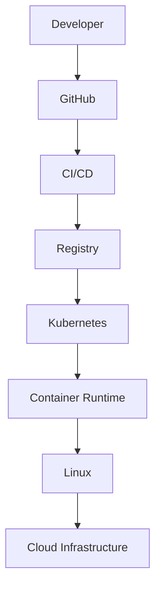

# Container Runtime

> "Containers do not run themselves. A container runtime is the engine that converts a static image into a running Linux process."

---

# Why This File Exists

Most engineers learn:

```bash
docker run nginx
```

and stop there.

But this command hides an entire infrastructure stack.

Questions most engineers cannot answer:

```text
Who starts the container?

Who creates namespaces?

Who creates cgroups?

Who mounts OverlayFS?

Who starts the application process?

Who talks to Linux?
```

The answer is:

# Container Runtime

Without container runtimes:

```text
Docker

Kubernetes

Cloud Native Infrastructure
```

cannot exist.

---

# The Biggest Misconception

Many people think:

```text
Docker

↓

Container
```

Wrong.

Reality:

```text
Docker

↓

Container Runtime

↓

Linux Kernel

↓

Container
```

Docker is not the execution engine.

The runtime is.

---

# The Core Problem

Suppose we have:

```text
nginx image
```

This is just files.

Images do not execute themselves.

We need something that can transform:

```text
Image

↓

Running Process
```

That transformation engine is the runtime.

---

# The Biggest Mental Model

Think:

> Container Runtime = Operating System Translator

It translates:

```text
Container Specification

↓

Linux Instructions
```

---

# Mental Model 1: Movie Player

Movie:

```text
MP4 file
```

Cannot play itself.

Needs:

```text
Video Player
```

Docker equivalent:

```text
Image

↓

Runtime

↓

Running Container
```

---

# Mental Model 2: Blueprint vs Construction Worker

Blueprint:

```text
Static
```

Construction Worker:

```text
Builds reality
```

Equivalent:

```text
Image

↓

Container Runtime

↓

Container
```

---

# Mental Model 3: Compiler

Source code:

```text
Static
```

Compiler:

```text
Transforms it
```

Equivalent:

```text
Image

↓

Runtime

↓

Linux Process
```

---

# Official Definition

> A container runtime is software responsible for creating, executing, and managing containers.

Simple definition:

> A runtime converts images into running isolated Linux processes.

---

# The Big Formula

```text
Container Runtime

=

Image

+

Namespaces

+

Cgroups

+

OverlayFS

+

Networking

+

Process Creation
```

---

# The Big Picture Architecture



---

# Explain This Diagram

Container runtime is the bridge.

It sits between:

```text
Container Ecosystem

↓

Linux Kernel
```

---

# What Does A Runtime Actually Do?

Responsibilities:

```text
Download Images

Unpack Images

Create Filesystems

Create Namespaces

Create Cgroups

Configure Networking

Start Process

Monitor Lifecycle
```

---

# Runtime Lifecycle



---

# Container Runtime Components

Modern systems usually contain:

```text
High Level Runtime

Low Level Runtime
```

---

# High Level Runtime

Responsibilities:

```text
Image management

Container lifecycle

Networking

Storage

Monitoring
```

Examples:

```text
containerd

CRI-O

Docker Engine
```

---

# Low Level Runtime

Responsibilities:

```text
Namespaces

Cgroups

OverlayFS

Process Execution
```

Examples:

```text
runc

crun

kata-runtime
```

---

# Architecture Visualization



---

# Container Runtime Evolution

Early days:

```text
Docker did everything.
```

Problem:

Too monolithic.

Industry evolved.

---

# Timeline

```text
2013

Docker

↓

2015

OCI

↓

2016

containerd

↓

2017

CRI

↓

Today

Modular Ecosystem
```

---

# OCI Standard

OCI = Open Container Initiative.

Before OCI:

Chaos.

Every company built incompatible systems.

OCI standardized:

```text
Images

Runtimes

Distribution
```

---

# OCI Architecture



---

# What Happens During `docker run`?

Suppose:

```bash
docker run nginx
```

Behind the scenes:



---

# Relationship With Linux Topics

Everything you've learned connects here.

```text
Processes

↓

Namespaces

↓

Storage

↓

Networking

↓

Cgroups

↓

OverlayFS

↓

Runtime

↓

Container
```

Linux knowledge compounds.

---

# Relationship With Docker

Docker is mostly:

```text
User Interface

API

Build System
```

Execution is delegated.

---

# Relationship With Kubernetes

Kubernetes never directly creates containers.

Instead:

```text
Kubernetes

↓

CRI

↓

Container Runtime

↓

Linux
```

---

# Kubernetes Architecture



---

# Runtime Responsibilities Deep Dive

## 1. Image Management

Tasks:

```text
Download

Verify

Store

Extract
```

---

## 2. Filesystem Setup

Tasks:

```text
OverlayFS

Writable Layers

Mount Points
```

---

## 3. Namespace Creation

Tasks:

```text
PID

NET

MNT

UTS

IPC

USER
```

---

## 4. Resource Control

Tasks:

```text
CPU

Memory

Disk

PIDs
```

using cgroups.

---

## 5. Networking

Tasks:

```text
veth

Bridges

NAT

DNS
```

---

## 6. Process Execution

Tasks:

```text
Launch Application
```

Finally.

---

# Data Flow Diagram


---

# Cloud Native Architecture

Modern infrastructure:



---

# Cloud Provider Connection

AWS:

```text
EKS

ECS

Fargate
```

Use runtimes.

Google:

```text
GKE
```

Uses runtimes.

Azure:

```text
AKS
```

Uses runtimes.

Runtime knowledge is universal.

---

# Production Example

Microservices:

```text
Authentication

Payments

Notifications

Analytics
```

Each service:

```text
Image

↓

Runtime

↓

Container
```

Thousands of times.

---

# Performance Considerations

Performance bottlenecks:

```text
Large images

Slow storage

Network latency

CPU throttling

Slow startup
```

Optimize:

```text
Image size

Storage speed

Layer count
```

---

# Security Considerations

Protect:

```text
Runtime

Images

Namespaces

Privileges
```

Avoid:

```bash
--privileged
```

unless necessary.

---

# Scaling Considerations

Container runtimes enable:

```text
Hundreds

Thousands

Millions
```

of containers worldwide.

Without them:

Cloud-native infrastructure collapses.

---

# Observability Considerations

Monitor:

```text
Container startup time

Runtime errors

CPU

Memory

Filesystem

Latency
```

Tools:

```text
containerd metrics

Prometheus

Grafana

cAdvisor

OpenTelemetry
```

---

# Useful Commands

Docker info:

```bash
docker info
```

See runtime:

```bash
docker info | grep Runtime
```

Containerd:

```bash
ctr version
```

Processes:

```bash
ps aux | grep containerd
```

---

# Common Mistakes

## Mistake 1

Thinking Docker runs containers.

Wrong.

Runtime does.

---

## Mistake 2

Ignoring Linux knowledge.

Huge mistake.

---

## Mistake 3

Thinking runtimes are optional.

Impossible.

---

## Mistake 4

Confusing images with containers.

Wrong.

---

## Mistake 5

Ignoring OCI.

Very important standard.

---

# Troubleshooting Guide

Container won't start?

Check:

```text
Image issue?
```

↓

```text
Filesystem issue?
```

↓

```text
Runtime issue?
```

↓

```text
Linux issue?
```

---

Useful commands:

```bash
docker info

journalctl -u containerd

ctr containers ls

dmesg
```

---

# Engineering Mindset

Do not think:

```text
Docker → Container
```

Think:

```text
Docker

↓

Runtime

↓

Linux

↓

Container
```

Docker is orchestration.

Linux is execution.

Runtime is the bridge.

---

# Evolution Of Thinking

```text
Linux

↓

Namespaces

↓

Cgroups

↓

OverlayFS

↓

Runtime

↓

Docker

↓

Kubernetes

↓

Cloud Native Systems
```

---

# Interview Questions

## Beginner

1. What is a container runtime?

2. Why do runtimes exist?

3. What problem do they solve?

4. Is Docker a runtime?

5. Why do images need runtimes?

---

## Intermediate

6. Explain runtime lifecycle.

7. Explain high vs low level runtimes.

8. Explain OCI.

9. Explain Docker architecture.

10. Explain Kubernetes architecture.

---

## Advanced

11. Explain container startup internals.

12. Explain OCI standards.

13. Explain cloud native runtime architecture.

14. Explain performance bottlenecks.

15. Explain runtime security.

---

# Cheat Sheet

```text
Container Runtime

=

Execution Engine


Responsibilities:

Image Management

Filesystem Setup

Namespaces

Cgroups

Networking

Process Execution


Architecture:

Docker

↓

Container Runtime

↓

Linux

↓

Container


Evolution:

Docker

↓

OCI

↓

containerd

↓

CRI

↓

Cloud Native Ecosystem
```

---

# Final Thought

Containers are one of Linux's greatest abstractions.

But abstractions do not execute themselves.

Container runtimes are the invisible engines that transform static files into living systems.

Without container runtimes:

**Docker becomes a CLI.**

**Kubernetes becomes YAML.**

**Cloud Native infrastructure stops moving.**
