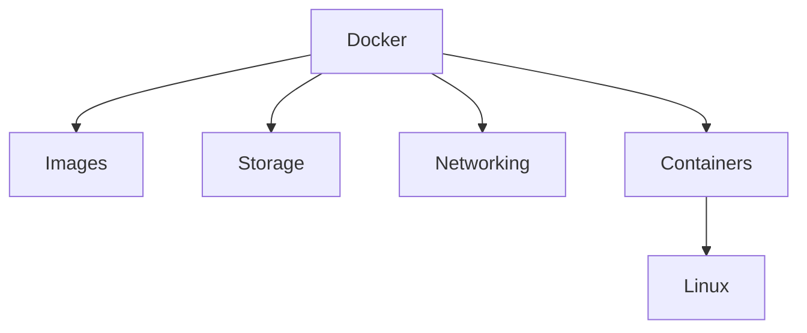
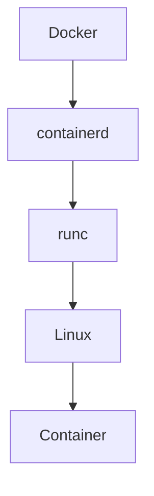
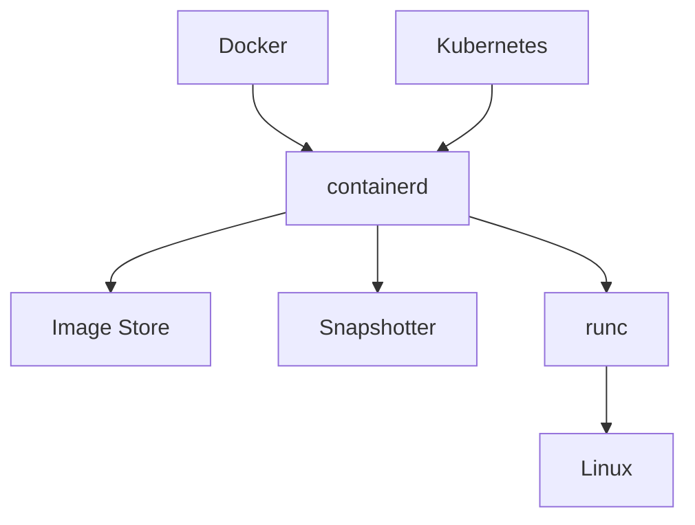
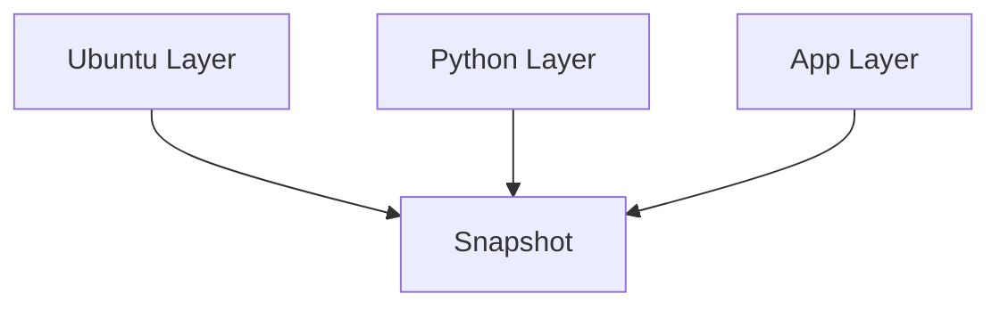
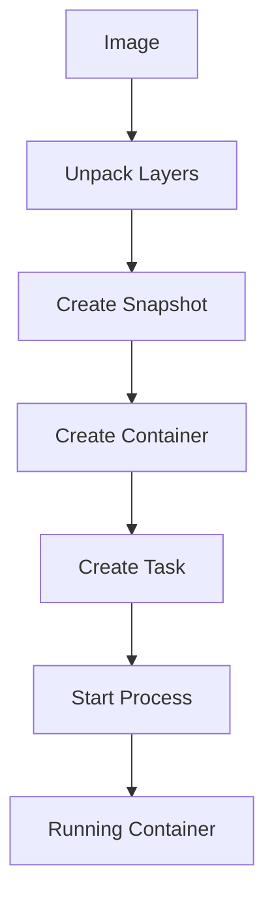
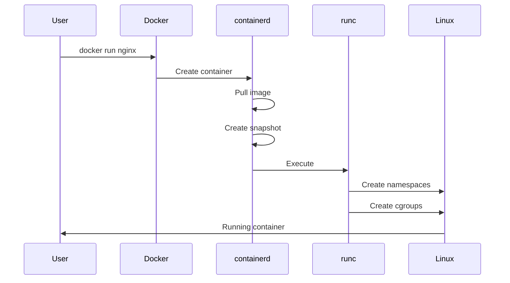
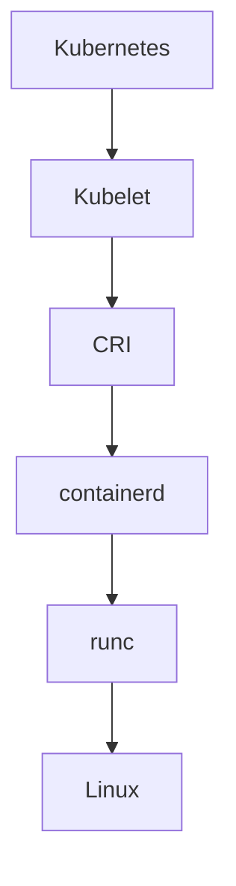
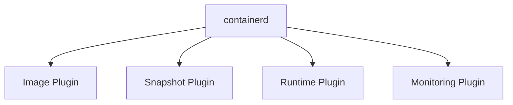
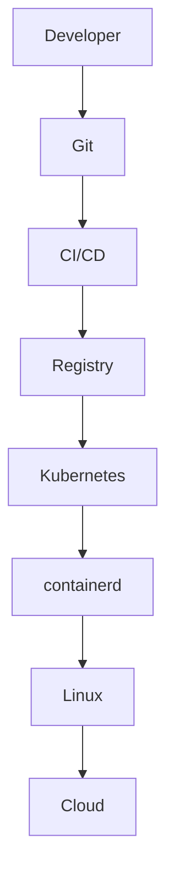

# containerd

> "Docker made containers popular. containerd made containers scalable."

---

# Why This File Exists

Most engineers know this.

```bash
docker run nginx
```

But very few engineers know this.

```text
Docker

↓

containerd

↓

runc

↓

Linux
```

Questions most engineers cannot answer:

```text
Why does containerd exist?

Why did Docker split itself?

Why does Kubernetes use containerd?

What problem does containerd solve?
```

This file exists to answer those questions.

---

# The Biggest Misconception

Many people think:

```text
Docker

↓

Linux

↓

Container
```

Wrong.

Reality:

```text
Docker

↓

containerd

↓

runc

↓

Linux

↓

Container
```

Docker is not the execution engine.

containerd is.

---

# The Core Problem

Early Docker did everything.

Responsibilities:

```text
CLI

API

Image Management

Networking

Storage

Runtime

Container Execution
```

One giant application.

This created problems.

---

# Monolith Problem

Large monolithic systems become difficult to:

```text
Scale

Maintain

Replace

Standardize

Integrate
```

The ecosystem needed modularity.

---

# Docker Was Too Big

Old architecture:



Everything lived inside Docker.

Not ideal.

---

# The Revolutionary Idea

Split responsibilities.

Docker became:

```text
Developer Experience
```

containerd became:

```text
Container Lifecycle Manager
```

runc became:

```text
Low Level Runtime
```

---

# Modern Architecture



---

# Mental Model 1: Restaurant

Docker:

```text
Manager
```

containerd:

```text
Kitchen Manager
```

runc:

```text
Chef
```

Linux:

```text
Kitchen
```

Container:

```text
Meal
```

---

# Mental Model 2: Airport

Docker:

```text
Passenger Interface
```

containerd:

```text
Air Traffic Control
```

runc:

```text
Pilot
```

Linux:

```text
Aircraft
```

Container:

```text
Flight
```

---

# Official Definition

> containerd is an industry-standard container runtime manager responsible for the entire lifecycle of containers.

Simple definition:

> containerd manages containers at scale.

---

# What Does containerd Actually Do?

Responsibilities:

```text
Pull Images

Store Images

Unpack Images

Manage Snapshots

Manage Container Lifecycle

Manage Tasks

Delegate Execution

Expose APIs
```

---

# The Big Formula

```text
containerd

=

Image Manager

+

Snapshot Manager

+

Container Manager

+

Task Manager

+

Runtime Manager
```

---

# High Level Architecture



---

# Explain This Diagram

containerd is middleware.

It connects:

```text
High Level Systems

↓

Low Level Linux
```

---

# Containerd Components

Core subsystems:

```text
Image Service

Snapshotter

Content Store

Container Service

Task Service

Runtime Service
```

---

# Image Service

Responsibilities:

```text
Pull

Push

Store

Verify
```

images.

---

# Content Store

Stores:

```text
Image Layers

Metadata

Manifests
```

Think:

```text
Warehouse
```

---

# Snapshotter

Very important.

Creates filesystems.

Usually uses:

```text
OverlayFS
```

Responsibilities:

```text
Filesystem Layers

Copy-On-Write

Snapshots
```

---

# Snapshotter Visualization



---

# Container Service

Creates container definitions.

Stores:

```text
Metadata

Configuration

References
```

Not running yet.

---

# Task Service

Tasks are:

```text
Running Processes
```

Think:

```text
Container Definition

↓

Task

↓

Running Application
```

---

# Runtime Service

Delegates execution.

Usually:

```text
runc
```

---

# The Lifecycle



---

# What Happens During docker run?

Suppose:

```bash
docker run nginx
```

Flow:



---

# Relationship With runc

Very important.

containerd does NOT directly create namespaces.

runc does.

Responsibilities:

containerd:

```text
Manage lifecycle
```

runc:

```text
Execute container
```

---

# Relationship With Docker

Docker today is mostly:

```text
CLI

API

Builder

Developer Experience
```

containerd does infrastructure work.

---

# Relationship With Kubernetes

This is extremely important.

Kubernetes does NOT use Docker anymore.

Modern architecture:



---

# Why Kubernetes Removed Docker

Docker was too large.

Kubernetes only needed:

```text
Container lifecycle management
```

containerd was enough.

---

# CRI Relationship

CRI = Container Runtime Interface.

Think:

```text
Translator
```

Architecture:

```text
Kubernetes

↓

CRI

↓

containerd

↓

runc
```

---

# Linux Relationship

Everything eventually reaches Linux.

```text
Namespaces

Cgroups

OverlayFS

Networking

Processes
```

Linux executes everything.

---

# Containerd Plugins

containerd is plugin based.

Examples:

```text
Snapshotter Plugins

Runtime Plugins

Monitoring Plugins
```

This makes it extensible.

---

# Plugin Architecture



---

# Where containerd Runs

Service:

```bash
containerd
```

Check:

```bash
systemctl status containerd
```

Process:

```bash
ps aux | grep containerd
```

---

# Configuration File

Location:

```bash
/etc/containerd/config.toml
```

---

# Useful Commands

Containerd CLI:

```bash
ctr version
```

Images:

```bash
ctr images ls
```

Containers:

```bash
ctr containers ls
```

Tasks:

```bash
ctr tasks ls
```

Namespaces:

```bash
ctr namespaces ls
```

---

# Data Flow


---

# Cloud Native Architecture



---

# Production Example

1000 microservices.

Each deployment:

```text
Image

↓

containerd

↓

runc

↓

Linux

↓

Container
```

Thousands of times daily.

---

# AI Infrastructure Example

AI systems run:

```text
Inference Servers

Embeddings

Model APIs

Pipelines
```

All use:

```text
containerd
```

underneath Kubernetes.

---

# Performance Considerations

Optimize:

```text
Image Size

Layer Count

Storage Speed

Snapshot Efficiency
```

Bottlenecks:

```text
Slow Registry

Slow Disk

Large Images
```

---

# Security Considerations

Protect:

```text
Runtime

Images

Privileges

Namespaces
```

Use:

```text
Least Privilege

Signed Images

Image Scanning
```

---

# Scaling Considerations

containerd enables:

```text
Thousands

Millions

of containers globally.
```

Its design prioritizes:

```text
Efficiency

Modularity

Performance
```

---

# Observability Considerations

Monitor:

```text
Task Startup

Image Pull Time

Snapshot Creation

Memory

CPU

Failures
```

Tools:

```text
Prometheus

Grafana

OpenTelemetry

cAdvisor
```

---

# Common Mistakes

## Mistake 1

Thinking containerd is Docker.

Wrong.

---

## Mistake 2

Thinking containerd creates namespaces.

runc does.

---

## Mistake 3

Ignoring Kubernetes relationship.

Huge knowledge gap.

---

## Mistake 4

Ignoring OCI.

Important.

---

## Mistake 5

Thinking Docker disappeared.

It didn't.

Its role changed.

---

# Troubleshooting Guide

Container won't start?

Check:

```text
Image issue?
```

↓

```text
Snapshot issue?
```

↓

```text
Runtime issue?
```

↓

```text
Linux issue?
```

Useful commands:

```bash
ctr containers ls

ctr tasks ls

journalctl -u containerd

systemctl status containerd
```

---

# Engineering Mindset

Do not think:

```text
Docker → Container
```

Think:

```text
Docker

↓

containerd

↓

runc

↓

Linux

↓

Container
```

containerd is one of the invisible engines powering modern cloud infrastructure.

---

# Evolution Of Thinking

```text
Docker

↓

containerd

↓

Kubernetes

↓

Cloud Native Platforms

↓

Distributed Systems
```

---

# Interview Questions

## Beginner

1. What is containerd?

2. Why does containerd exist?

3. Why was Docker split?

4. Is containerd a runtime?

5. What is a snapshotter?

---

## Intermediate

6. Explain container lifecycle.

7. Explain task vs container.

8. Explain containerd architecture.

9. Explain Kubernetes integration.

10. Explain image management.

---

## Advanced

11. Explain CRI architecture.

12. Explain OCI relationship.

13. Explain plugin architecture.

14. Explain production scaling.

15. Explain cloud-native execution flow.

---

# Cheat Sheet

```text
containerd

=

Lifecycle Manager


Responsibilities:

Image Management

Snapshot Management

Container Management

Task Management

Runtime Delegation


Architecture:

Docker

↓

containerd

↓

runc

↓

Linux

↓

Container
```

---

# Final Thought

Docker made containers easy.

containerd made containers industrial.

It transformed containers from a developer tool into a global infrastructure platform.

Modern cloud infrastructure is largely built on this invisible engine.
