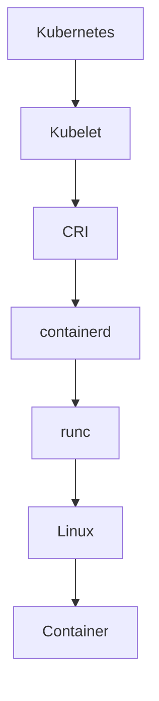
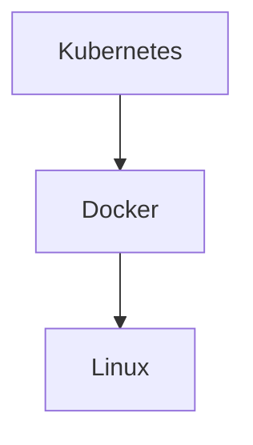
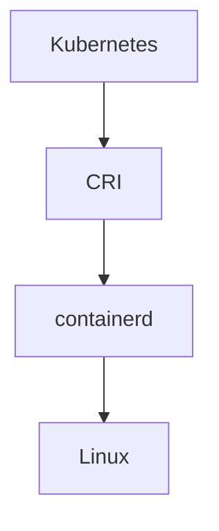
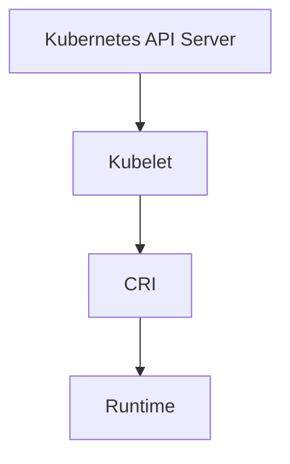
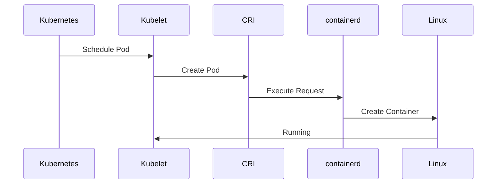
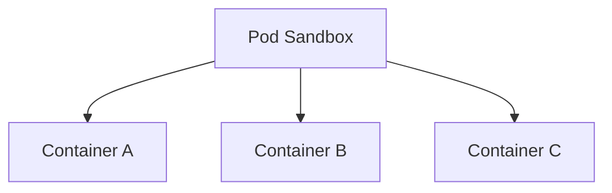
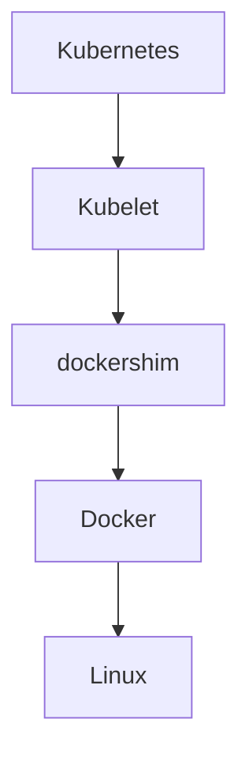
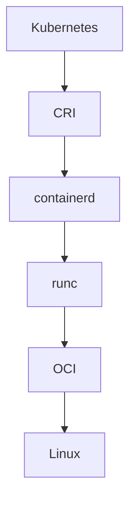
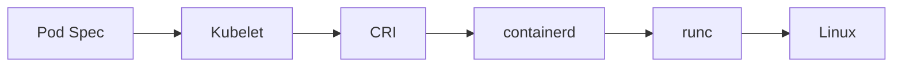

# CRI (Container Runtime Interface)

> "CRI is one of the most important abstractions in cloud-native infrastructure. It allowed Kubernetes to stop depending on Docker and start depending on standards."

---

# Why This File Exists

One of the most confusing statements engineers hear is:

```text
Kubernetes removed Docker.
```

People panic.

Questions immediately appear.

```text
Can Kubernetes no longer run Docker?

Did Docker die?

Why was Docker removed?

What replaced Docker?

What is CRI?
```

This file exists to answer those questions.

---

# The Biggest Misconception

Many people think:

```text
Kubernetes

↓

Docker

↓

Container
```

Wrong.

Modern reality:

```text
Kubernetes

↓

CRI

↓

containerd

↓

runc

↓

Linux

↓

Container
```

CRI is the missing piece.

---

# The Core Problem

Early Kubernetes tightly integrated with Docker.

Architecture:

```text
Kubernetes

↓

Docker

↓

Linux
```

This created a huge problem.

Kubernetes became dependent on a specific implementation.

This violates one of software engineering's biggest principles:

> Do not tightly couple systems.

---

# The Big Engineering Lesson

Avoid:

```text
Application

↓

Specific Vendor
```

Prefer:

```text
Application

↓

Interface

↓

Implementation
```

CRI is that interface.

---

# Mental Model 1: USB Port

Think:

```text
Laptop

↓

USB Port

↓

Keyboard
```

Laptop doesn't care:

```text
Logitech

HP

Dell

Lenovo
```

As long as USB standards are followed.

CRI works exactly the same way.

---

# Mental Model 2: Electrical Outlet

Your house doesn't care whether you plug in:

```text
TV

Laptop

Phone Charger
```

It only cares:

```text
Standard Interface
```

CRI is the electrical outlet.

---

# Mental Model 3: Database Drivers

Applications do:

```text
Application

↓

Database Driver

↓

Database
```

instead of:

```text
Application

↓

Direct Database Implementation
```

CRI is similar.

---

# Official Definition

> CRI (Container Runtime Interface) is an API that allows Kubernetes to communicate with container runtimes.

Simple definition:

> CRI is a translator between Kubernetes and runtimes.

---

# The Big Formula

```text
CRI

=

Kubernetes

+

Standard API

+

Runtime Independence
```

---

# Big Picture Architecture



---

# Explain This Diagram

Kubernetes:

```text
Cluster Brain
```

Kubelet:

```text
Node Agent
```

CRI:

```text
Translator
```

containerd:

```text
Lifecycle Manager
```

runc:

```text
Execution Engine
```

Linux:

```text
Kernel
```

Container:

```text
Process
```

---

# The Problem Kubernetes Faced

Early architecture:



Problem:

```text
Docker changes

↓

Kubernetes breaks
```

Bad design.

---

# The Solution

Insert abstraction.



Now:

```text
Kubernetes independent

containerd replaceable

runtime interchangeable
```

Huge improvement.

---

# What Is Kubelet?

Very important.

Kubelet runs on every node.

Responsibilities:

```text
Watch Pod Definitions

Create Containers

Monitor Containers

Report Health
```

Kubelet does not directly create containers.

It delegates.

---

# Kubelet Architecture



---

# What Does CRI Actually Do?

CRI defines APIs for:

```text
Run Pod

Stop Pod

Create Container

Delete Container

List Images

Pull Images

Monitor Status
```

It defines communication rules.

---

# CRI Is NOT Software

This is important.

CRI is:

```text
Interface

Contract

API Specification
```

It is NOT:

```text
Runtime

Program

Container Engine
```

---

# Runtime Communication Flow



---

# CRI Responsibilities

It standardizes operations.

Categories:

```text
Runtime Service

Image Service
```

---

# Runtime Service

Examples:

```text
RunPodSandbox

CreateContainer

StartContainer

StopContainer

RemoveContainer
```

---

# Image Service

Examples:

```text
PullImage

ListImages

RemoveImage
```

---

# Pod Sandbox Concept

This is extremely important.

Before containers start:

Kubernetes creates:

```text
Pod Sandbox
```

Think:

```text
Empty House
```

Containers become:

```text
Residents
```

---

# Pod Sandbox Visualization



---

# Supported Runtimes

CRI supports multiple runtimes.

Examples:

```text
containerd

CRI-O
```

Historically:

```text
Docker via dockershim
```

---

# Runtime Comparison

| Runtime | Uses CRI | Popularity |
|---------|---------|------------|
| containerd | Yes | Very High |
| CRI-O | Yes | High |
| Docker Engine | Indirect | Lower in Kubernetes |

---

# What Was Dockershim?

Important history.

Early Kubernetes created:

```text
dockershim
```

to translate:

```text
Kubernetes

↓

dockershim

↓

Docker
```

Later removed.

---

# Dockershim Visualization



Problem:

Extra complexity.

---

# Why Dockershim Was Removed

Reasons:

```text
Complexity

Maintenance Burden

Redundant Layer

Performance Overhead
```

Containerd became enough.

---

# Relationship With OCI

Very important.

Architecture:

```text
OCI

↓

runc

↓

containerd

↓

CRI

↓

Kubernetes
```

Everything stacks together.

---

# Layered Architecture



---

# Relationship With Linux

Eventually everything becomes:

```text
Linux Process
```

Linux still powers everything.

CRI simply creates abstraction.

---

# Relationship With Docker

Docker still exists.

Docker is now mostly:

```text
Developer Tool

Builder

CLI

Image Creator
```

Kubernetes doesn't need Docker anymore.

---

# Cloud Provider Architecture

AWS:

```text
EKS

↓

containerd

↓

runc
```

Google:

```text
GKE

↓

containerd

↓

runc
```

Azure:

```text
AKS

↓

containerd

↓

runc
```

Very similar.

---

# Production Example

Suppose:

```text
1000 Nodes

50000 Containers
```

Flow:

```text
Kubernetes

↓

Kubelet

↓

CRI

↓

containerd

↓

runc

↓

Linux
```

Millions of times per day.

---

# Data Flow



---

# Performance Considerations

Optimize:

```text
Image Pull Speed

Container Startup

Storage Speed

Node Density
```

Bottlenecks:

```text
Huge Images

Slow Registries

Slow Disks
```

---

# Security Considerations

Protect:

```text
Images

Runtime

Node Access

Privileges
```

Use:

```text
Signed Images

Least Privilege

Image Scanning
```

---

# Scaling Considerations

CRI enabled Kubernetes to scale independently from Docker.

Benefits:

```text
Modularity

Replaceability

Extensibility

Maintainability
```

---

# Observability Considerations

Monitor:

```text
Pod Startup Time

Runtime Failures

Node Health

Image Pull Time

Container Density
```

Tools:

```text
Prometheus

Grafana

OpenTelemetry
```

---

# Useful Commands

See runtime:

```bash
kubectl get nodes -o wide
```

Check container runtime:

```bash
kubectl describe node
```

On node:

```bash
crictl info
```

List pods:

```bash
crictl pods
```

List containers:

```bash
crictl ps
```

---

# Common Mistakes

## Mistake 1

Thinking CRI is software.

Wrong.

It's an interface.

---

## Mistake 2

Thinking Docker died.

Wrong.

Its role changed.

---

## Mistake 3

Thinking Kubernetes creates containers.

Wrong.

Kubelet delegates.

---

## Mistake 4

Ignoring abstractions.

Huge engineering gap.

---

## Mistake 5

Ignoring OCI relationship.

Everything connects.

---

# Troubleshooting Guide

Pods not starting?

Check:

```text
Kubelet
```

↓

```text
CRI
```

↓

```text
containerd
```

↓

```text
runc
```

↓

```text
Linux
```

Useful commands:

```bash
systemctl status kubelet

systemctl status containerd

crictl info

crictl ps

journalctl -u kubelet
```

---

# Engineering Mindset

Do not think:

```text
Kubernetes → Docker
```

Think:

```text
Kubernetes

↓

Kubelet

↓

CRI

↓

containerd

↓

runc

↓

Linux

↓

Container
```

CRI is one of the best examples of good software architecture.

---

# Evolution Of Thinking

```text
Linux

↓

OCI

↓

runc

↓

containerd

↓

CRI

↓

Kubernetes

↓

Cloud Native Infrastructure
```

---

# Interview Questions

## Beginner

1. What is CRI?

2. Why does CRI exist?

3. Is CRI software?

4. Why did Kubernetes remove Docker?

5. What is Kubelet?

---

## Intermediate

6. Explain CRI architecture.

7. Explain Pod Sandbox.

8. Explain dockershim.

9. Explain runtime flow.

10. Explain CRI services.

---

## Advanced

11. Explain decoupled architectures.

12. Explain Kubernetes runtime internals.

13. Explain OCI relationships.

14. Explain cloud-native execution flow.

15. Explain platform engineering benefits.

---

# Cheat Sheet

```text
CRI

=

Container Runtime Interface


CRI Is:

✓ API

✓ Contract

✓ Translator

✓ Abstraction Layer


Architecture:

Kubernetes

↓

Kubelet

↓

CRI

↓

containerd

↓

runc

↓

Linux
```

---

# Final Thought

One of the biggest lessons in software architecture is:

> Large systems should depend on contracts, not implementations.

CRI applied this principle to infrastructure.

And that decision helped Kubernetes become the dominant orchestration platform on Earth.
