# runc

> "runc is the final translator between container platforms and the Linux kernel. It transforms container definitions into isolated Linux processes."

---

# Why This File Exists

Most engineers know:

```bash
docker run nginx
```

Very few engineers know:

```text
Docker

↓

containerd

↓

runc

↓

Linux Kernel

↓

Container
```

Questions most engineers cannot answer:

```text
Who creates namespaces?

Who creates cgroups?

Who mounts OverlayFS?

Who starts nginx?

Who directly talks to Linux?
```

The answer is:

# runc

---

# The Biggest Misconception

Many people think:

```text
Docker runs containers
```

Wrong.

Docker orchestrates.

runc executes.

---

# The Core Problem

Suppose we have:

```text
nginx image
```

An image is just files.

Files do not execute themselves.

We need software that can convert:

```text
Filesystem

↓

Running Linux Process
```

That software is runc.

---

# The Biggest Mental Model

Think:

> runc is a container compiler.

It converts:

```text
OCI Specification

↓

Linux Syscalls

↓

Running Container
```

---

# Mental Model 1: Construction Worker

Blueprint:

```text
OCI Config
```

Construction Worker:

```text
runc
```

Building:

```text
Container
```

---

# Mental Model 2: CPU Instruction Translator

High level:

```text
Container Definition
```

Low level:

```text
Linux Syscalls
```

runc translates.

---

# Mental Model 3: Process Factory

Think:

> runc is a Linux process factory.

Input:

```text
Image

Configuration
```

Output:

```text
Isolated Process
```

---

# Official Definition

> runc is a lightweight OCI-compliant runtime that creates and runs containers according to the OCI runtime specification.

Simple definition:

> runc directly creates containers by talking to Linux.

---

# The Big Formula

```text
runc

=

Namespaces

+

Cgroups

+

OverlayFS

+

Networking

+

Linux Syscalls

+

Process Creation
```

---

# Big Picture Architecture

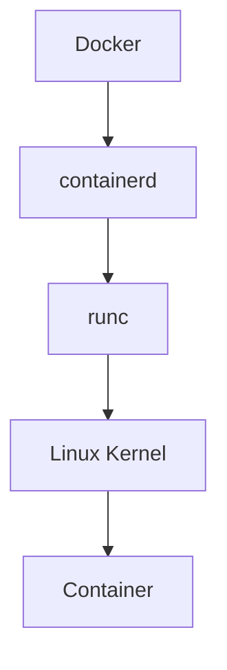

---

# Explain This Diagram

Docker:

```text
Developer Interface
```

containerd:

```text
Lifecycle Manager
```

runc:

```text
Execution Engine
```

Linux:

```text
Kernel Executor
```

---

# What Does runc Actually Do?

Responsibilities:

```text
Create Namespaces

Create Cgroups

Mount Filesystems

Configure Networking

Start Process

Manage Lifecycle
```

That's it.

runc is intentionally small.

---

# The Container Creation Pipeline

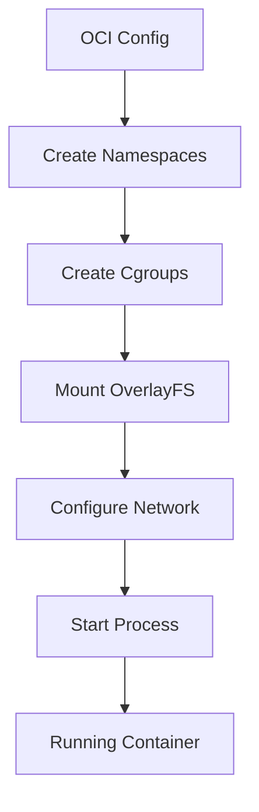

---

# What Happens During docker run?

Suppose:

```bash
docker run nginx
```

Behind the scenes:

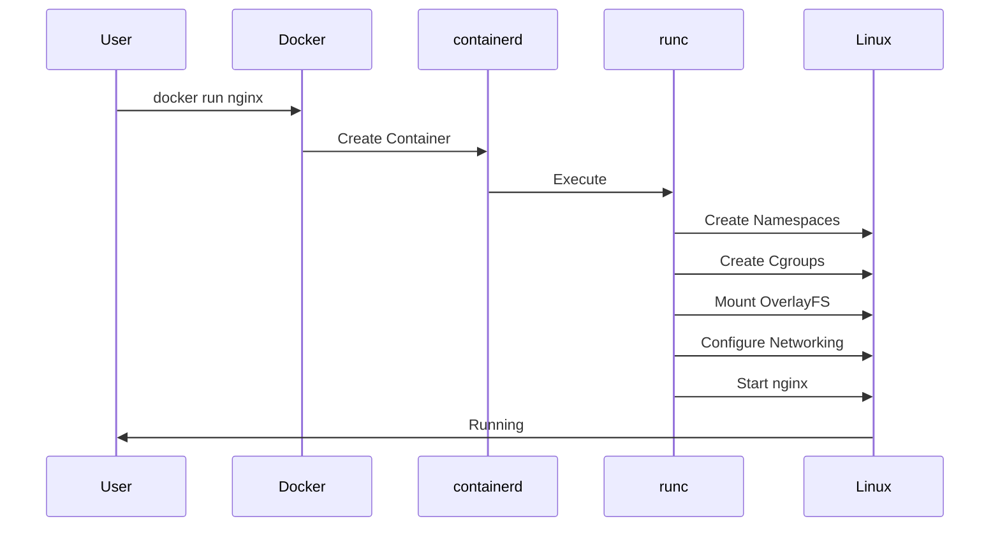

---

# The OCI Relationship

runc follows:

```text
OCI Runtime Specification
```

OCI says:

```text
How a container should be executed
```

runc implements it.

---

# OCI Visualization

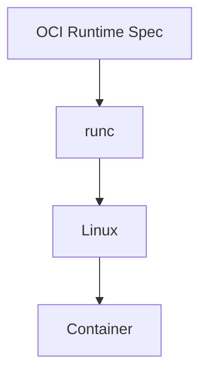

---

# The Bundle Concept

runc operates on bundles.

A bundle contains:

```text
rootfs/

config.json
```

Example:

```text
mycontainer/

├── rootfs/
└── config.json
```

---

# rootfs

Contains:

```text
Ubuntu

Python

Libraries

Application
```

Everything needed.

---

# config.json

Contains instructions.

Examples:

```text
Process

Mounts

Namespaces

Cgroups

Environment Variables
```

---

# Bundle Visualization

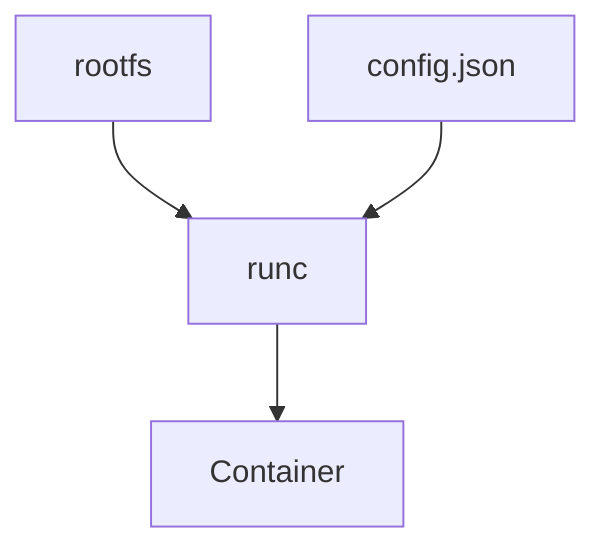

---

# Namespace Creation

runc creates:

```text
PID

NET

IPC

MNT

UTS

USER
```

namespaces.

---

# Namespace Visualization

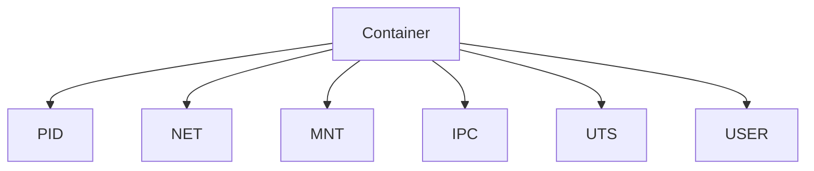

---

# Cgroup Creation

runc creates limits.

Examples:

```text
CPU

Memory

Disk

Processes
```

---

# Cgroup Visualization

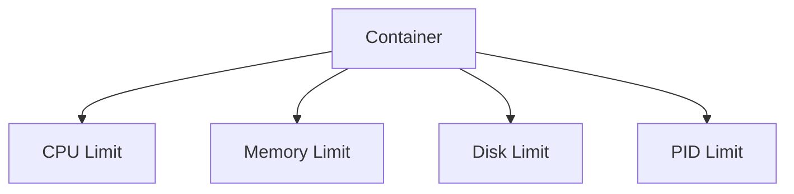

---

# OverlayFS Setup

runc mounts:

```text
Read Only Layers

Writable Layer

Merged Filesystem
```

---

# Storage Visualization

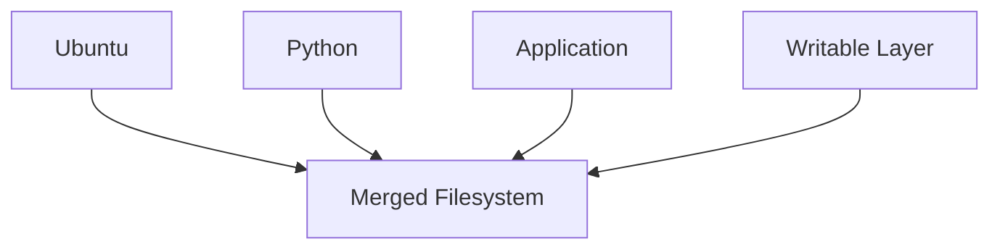

---

# Networking Setup

runc helps configure:

```text
veth

Bridge

Routes

Interfaces
```

though higher layers usually prepare parts of this.

---

# Networking Visualization

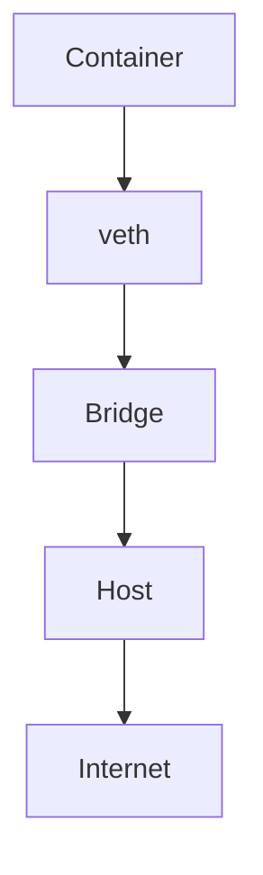

---

# Syscalls: The Real Magic

This is extremely important.

runc eventually calls Linux syscalls.

Examples:

```text
clone()

setns()

mount()

pivot_root()

unshare()

execve()
```

These are the true container superpowers.

---

# The Most Important Syscall Flow

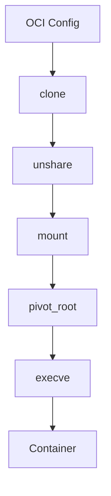

---

# Relationship With Linux

Everything eventually becomes:

```text
Linux Process
```

Container:

```text
Fancy Linux Process
```

Nothing more.

---

# Relationship With Docker

Docker today is mostly:

```text
CLI

Build System

Developer Experience
```

runc does execution.

---

# Relationship With containerd

containerd delegates work.

Responsibilities:

containerd:

```text
Lifecycle Management
```

runc:

```text
Execution
```

---

# Relationship With Kubernetes

Modern Kubernetes architecture:

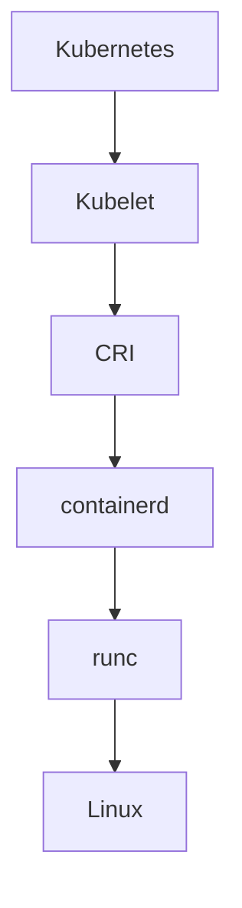

---

# Cloud Provider Relationship

AWS:

```text
EKS
```

↓

```text
containerd
```

↓

```text
runc
```

↓

```text
Linux
```

Same for:

```text
GKE

AKS
```

---

# AI Infrastructure Relationship

AI workloads:

```text
LLM APIs

Inference Servers

Embeddings

Training Workers
```

All eventually become:

```text
Linux Processes
```

via runc.

---

# Useful Commands

Check runtime:

```bash
docker info | grep Runtime
```

Version:

```bash
runc --version
```

Manual execution:

```bash
runc create

runc start

runc run
```

---

# Example Bundle Execution

```bash
mkdir mycontainer

cd mycontainer

mkdir rootfs

runc run mycontainer
```

This is very low level.

---

# Data Flow


---

# Production Architecture

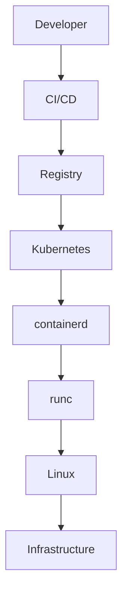

---

# Performance Considerations

Optimize:

```text
Image Size

Storage Speed

Filesystem Layers

Namespace Setup
```

Bottlenecks:

```text
Large Images

Slow Storage

Slow Registry
```

---

# Security Considerations

Protect:

```text
Namespaces

Capabilities

Privileges

Syscalls
```

Avoid:

```bash
--privileged
```

unless necessary.

---

# Scaling Considerations

runc is intentionally:

```text
Small

Fast

Minimal
```

because it may execute millions of containers globally.

---

# Observability Considerations

Monitor:

```text
Container Startup Time

Failures

Memory

CPU

Filesystem

Syscalls
```

Tools:

```text
Prometheus

Grafana

eBPF

OpenTelemetry
```

---

# Common Mistakes

## Mistake 1

Thinking Docker runs containers.

Wrong.

---

## Mistake 2

Thinking containers are VMs.

Wrong.

---

## Mistake 3

Ignoring OCI.

Huge mistake.

---

## Mistake 4

Ignoring Linux knowledge.

Critical gap.

---

## Mistake 5

Thinking runc is complicated.

It is intentionally minimal.

---

# Troubleshooting Guide

Container won't start?

Check:

```text
Image issue?
```

↓

```text
Filesystem issue?
```

↓

```text
Namespace issue?
```

↓

```text
Cgroup issue?
```

↓

```text
Application issue?
```

Useful commands:

```bash
runc --version

docker info

journalctl -u containerd

dmesg
```

---

# Engineering Mindset

Do not think:

```text
Docker → Container
```

Think:

```text
Docker

↓

containerd

↓

runc

↓

Linux Syscalls

↓

Linux Kernel

↓

Container
```

runc is one of the thinnest yet most important software layers in modern infrastructure.

---

# Evolution Of Thinking

```text
Linux Processes

↓

Namespaces

↓

Cgroups

↓

OCI

↓

runc

↓

containerd

↓

Docker

↓

Kubernetes

↓

Cloud Native Systems
```

---

# Interview Questions

## Beginner

1. What is runc?

2. Why does runc exist?

3. Is runc Docker?

4. What problem does runc solve?

5. What is OCI?

---

## Intermediate

6. Explain runc architecture.

7. Explain bundles.

8. Explain rootfs.

9. Explain config.json.

10. Explain syscalls.

---

## Advanced

11. Explain complete container startup flow.

12. Explain OCI implementation.

13. Explain Kubernetes execution flow.

14. Explain runtime security.

15. Explain Linux process isolation.

---

# Cheat Sheet

```text
runc

=

Low Level Runtime


Responsibilities:

Namespaces

Cgroups

OverlayFS

Networking

Process Execution


Architecture:

Docker

↓

containerd

↓

runc

↓

Linux

↓

Container
```

---

# Final Thought

At the deepest level, containers are not magical.

They are simply Linux processes wearing a carefully engineered disguise.

And **runc is the software that puts the disguise on them.**
