# Docker Architecture

> "Docker did not invent containers. Docker built a user-friendly operating system on top of Linux container technologies."

---

# Why This File Exists

Many people think:

```bash
docker run nginx
```

creates a container.

It doesn't.

Docker orchestrates a very long chain of Linux components.

This file exists to answer:

> What actually happens when I execute `docker run nginx`?

By the end of this file, you should understand:

- Docker architecture
- Docker Engine
- Docker Client
- Docker Daemon
- Containerd
- runc
- Linux Kernel relationship
- Data flow
- Image flow
- Container lifecycle
- Production architecture

---

# The Biggest Misconception

Many people visualize:

```text
Docker

↓

Container
```

This is wrong.

Reality:

```text
Docker

↓

Containerd

↓

runc

↓

Linux Kernel

↓

Namespaces

↓

Cgroups

↓

OverlayFS

↓

Container
```

Docker is an orchestrator.

Linux does the heavy lifting.

---

# Mental Model: Restaurant Manager

Imagine a restaurant.

Docker is NOT the chef.

Docker is the manager.

---

# Restaurant Visualization

```text
Customer

↓

Manager

↓

Kitchen Staff

↓

Cook

↓

Food
```

Equivalent:

```text
Developer

↓

Docker CLI

↓

Docker Daemon

↓

Containerd

↓

runc

↓

Linux Kernel

↓

Container
```

---

# Docker Architecture Big Picture

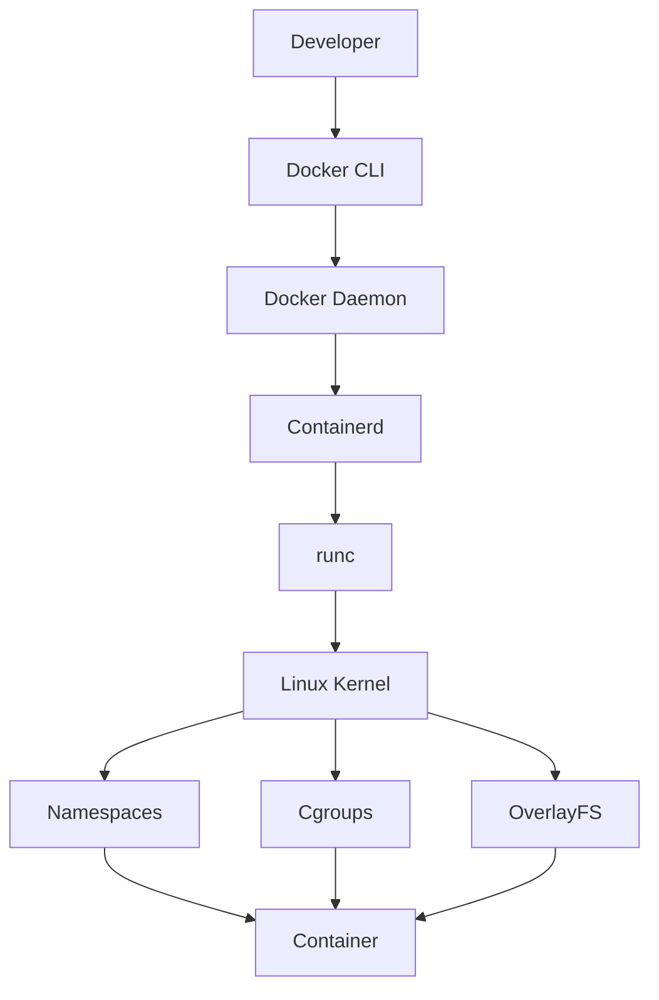

---

# Explain This Diagram

Every layer has responsibilities.

Developer:

```text
Issues commands
```

Docker CLI:

```text
User interface
```

Docker Daemon:

```text
Central manager
```

Containerd:

```text
Container lifecycle manager
```

runc:

```text
Low-level container executor
```

Linux:

```text
Creates the container
```

---

# The Evolution Of Containers

Before Docker:

```text
Linux

↓

Namespaces

↓

Cgroups

↓

OverlayFS
```

Power existed.

But it was difficult to use.

Docker unified everything.

---

# Mental Model: Universal Remote Control

Before Docker:

```text
10 different remote controls
```

After Docker:

```text
1 universal remote
```

Docker is the universal remote.

---

# Docker Components

Docker has several components.

```text
Docker CLI

Docker Engine

Docker Daemon

Docker API

Containerd

runc

Registry
```

---

# Docker Architecture Layers

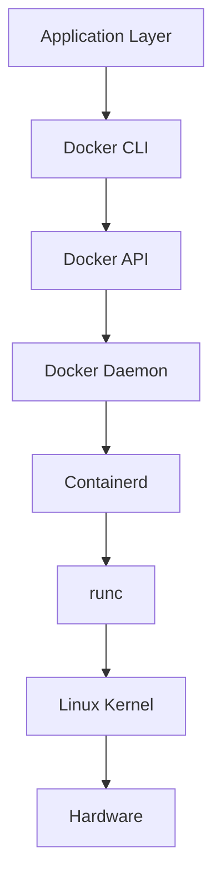

---

# Docker CLI

This is what developers interact with.

Examples:

```bash
docker run nginx

docker build .

docker ps

docker stop
```

CLI does nothing by itself.

It sends requests.

---

# Docker Daemon (dockerd)

This is the brain.

Runs as a background service.

Responsibilities:

```text
Manage images

Manage containers

Manage networks

Manage volumes

Manage builds
```

Check it:

```bash
systemctl status docker
```

or

```bash
ps aux | grep dockerd
```

---

# Docker Daemon Visualization

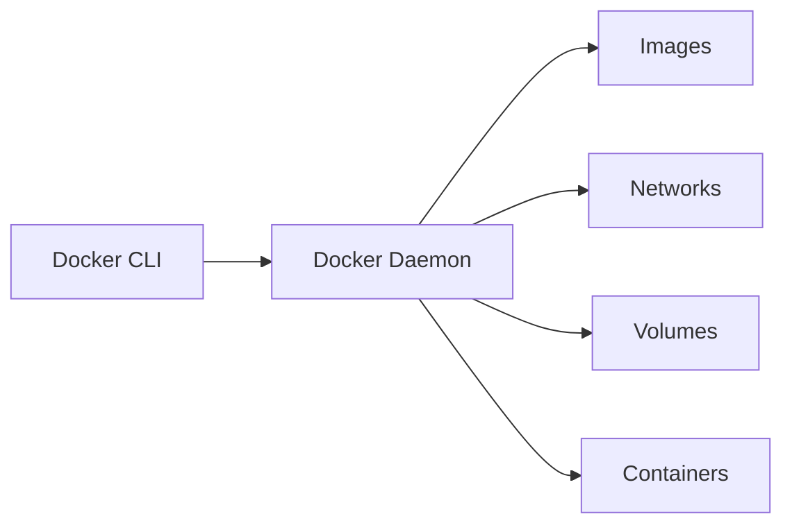

---

# Docker API

Docker components communicate via APIs.

Usually:

```text
Unix Socket
```

Location:

```bash
/var/run/docker.sock
```

---

# Architecture Visualization

```text
Docker CLI

↓

Docker Socket

↓

Docker Daemon
```

---

# Why docker.sock Is Dangerous

This file is extremely powerful.

Anyone controlling it controls Docker.

Which means:

```text
Docker

↓

Linux

↓

Entire Server
```

Protect it.

Never expose it publicly.

---

# Containerd

Docker delegated container management.

Containerd responsibilities:

```text
Image management

Container lifecycle

Snapshots

Storage management
```

Docker no longer directly manages everything.

---

# Containerd Visualization

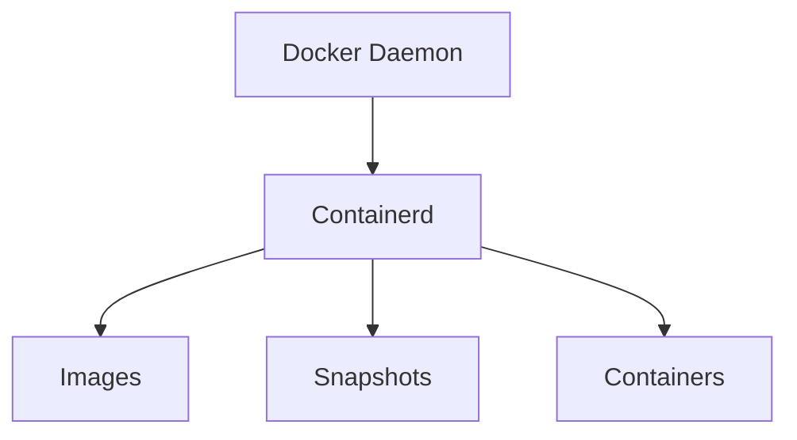

---

# runc

runc is extremely low level.

Its only job:

```text
Create container
```

using Linux primitives.

---

# runc Visualization

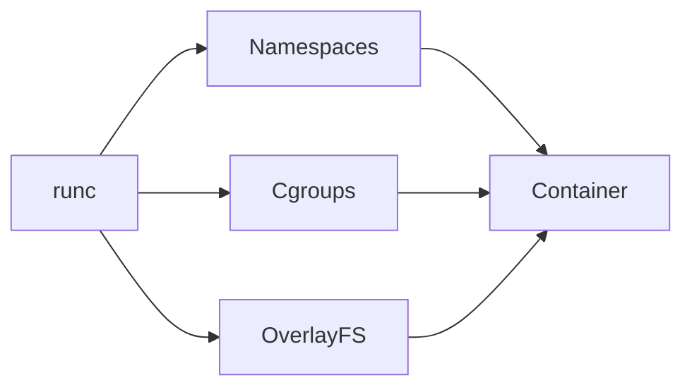

---

# Linux Kernel Responsibilities

Linux creates:

```text
Namespaces

Cgroups

Filesystem Mounts

Processes

Networking
```

Docker itself does not.

Linux does.

---

# Container Creation Lifecycle

This is one of the most important visuals.

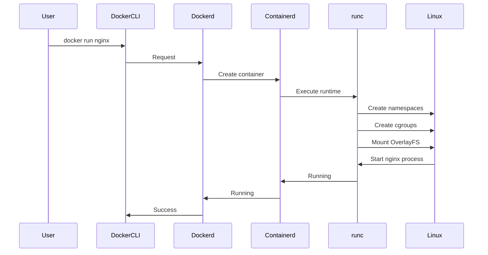

---

# Image Pull Architecture

Suppose:

```bash
docker pull nginx
```

What happens?

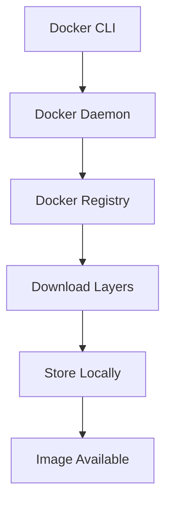

---

# Image Storage Flow

Location:

```bash
/var/lib/docker
```

Contains:

```text
overlay2/

containers/

volumes/

network/

image/
```

---

# Container Startup Flow

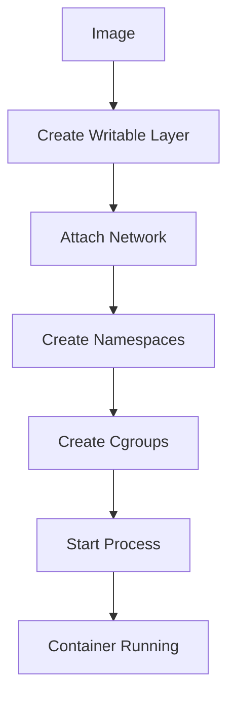

---

# Data Flow Inside A Running Container

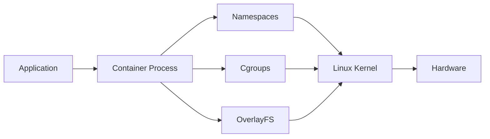

---

# Relationship With Linux Topics

Everything you've learned comes together.

```text
Processes

↓

Namespaces

↓

Storage

↓

Networking

↓

Cgroups

↓

Security

↓

Containers

↓

Docker
```

Docker is Linux engineering packaged nicely.

---

# Docker vs Linux Responsibilities

| Docker | Linux |
|--------|-------|
| User Experience | Process Creation |
| Image Management | Namespaces |
| Volume Management | Cgroups |
| Network Configuration | Scheduling |
| Registry Access | OverlayFS |
| Build System | Security |

---

# Production Architecture

Most production systems do NOT look like this:

```text
Developer

↓

Docker

↓

Container
```

Instead:

```text
Developer

↓

Git

↓

CI/CD

↓

Image Registry

↓

Kubernetes

↓

Containerd

↓

runc

↓

Linux
```

---

# Production Infrastructure Diagram

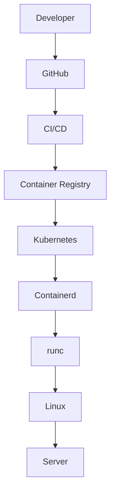

---

# Cloud Architecture

Most clouds work like this:

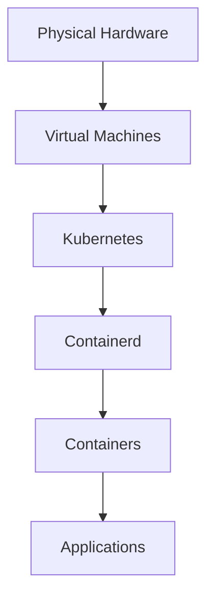

---

# Performance Considerations

Docker itself adds minimal overhead.

Performance depends on:

```text
Linux Scheduler

Filesystem

Networking

Image Size

Container Density
```

Performance bottlenecks:

```text
Huge images

Too many layers

Heavy logging

Poor networking

Resource starvation
```

---

# Security Considerations

Protect:

```text
docker.sock

Images

Registries

Volumes

Secrets
```

Never run:

```bash
docker run --privileged
```

unless necessary.

---

# Scaling Considerations

Docker alone does not scale.

Docker manages:

```text
Single Host
```

Scaling thousands of containers requires:

```text
Kubernetes

Nomad

OpenShift
```

---

# Observability Considerations

Monitor:

```text
Container Restarts

CPU

Memory

Filesystem

Logs

Latency

Image Size
```

Tools:

```text
Prometheus

Grafana

Loki

cAdvisor

OpenTelemetry
```

---

# Common Mistakes

## Mistake 1

Thinking Docker created containers.

Wrong.

Linux did.

---

## Mistake 2

Thinking Docker runs containers.

Partially true.

Linux runs containers.

---

## Mistake 3

Ignoring containerd.

Huge knowledge gap.

---

## Mistake 4

Ignoring docker.sock security.

Dangerous.

---

## Mistake 5

Thinking Docker is Kubernetes.

Wrong.

Kubernetes often uses containerd.

---

# Troubleshooting Flow

Container won't start?

Check:

```text
Image issue?
```

↓

```text
Filesystem issue?
```

↓

```text
Namespace issue?
```

↓

```text
Cgroup issue?
```

↓

```text
Application crash?
```

---

# Engineering Mindset

Do not think:

```text
Docker → Container
```

Think:

```text
Docker

↓

Containerd

↓

runc

↓

Linux Kernel

↓

Namespaces

↓

Cgroups

↓

OverlayFS

↓

Container
```

Docker is simply a beautiful interface built on top of Linux superpowers.

---

# Interview Questions

## Beginner

1. What is Docker architecture?

2. What is Docker CLI?

3. What is Docker Daemon?

4. What is containerd?

5. What is runc?

---

## Intermediate

6. Explain docker run lifecycle.

7. Explain docker pull lifecycle.

8. Explain Docker vs Linux responsibilities.

9. Why is docker.sock dangerous?

10. Explain container startup flow.

---

## Advanced

11. Explain the complete Docker architecture.

12. Explain Docker → containerd → runc flow.

13. Explain Kubernetes relationship with Docker.

14. Explain performance bottlenecks.

15. Explain production architecture.

---

# Cheat Sheet

```text
Developer

↓

Docker CLI

↓

Docker API

↓

Docker Daemon

↓

Containerd

↓

runc

↓

Linux Kernel

↓

Namespaces

Cgroups

OverlayFS

↓

Container
```

---

# Final Thought

Docker did not create a new technology.

Docker connected existing Linux technologies into a coherent platform.

That is why Docker became revolutionary.

It turned Linux from an operating system into an application delivery platform.
