# Docker Compose

> "Docker Compose is not a YAML file. It is a declarative infrastructure orchestrator for a single machine."

---

# Why This File Exists

Most applications are not one container.

Real systems contain:

```text
Frontend

Backend

Database

Cache

Message Queue

Monitoring
```

Without orchestration:

```bash
docker run frontend

docker run backend

docker run postgres

docker run redis
```

This quickly becomes unmanageable.

Docker Compose solved this problem.

---

# The Core Problem

Imagine building an e-commerce application.

Components:

```text
Next.js Frontend

Node Backend

PostgreSQL

Redis

Nginx
```

Without Compose:

```text
5 docker run commands

5 networks

5 volume configurations

5 environment configurations
```

Difficult.

Error-prone.

---

# The Revolutionary Idea

Instead of running infrastructure imperatively:

```bash
docker run ...

docker run ...

docker run ...
```

Describe infrastructure declaratively.

```yaml
docker-compose.yml
```

Infrastructure becomes code.

---

# The Biggest Mental Model

Think:

> Docker Compose is Terraform for a single Docker machine.

---

# Mental Model 1: Orchestra Conductor

Applications:

```text
Musicians
```

Docker Compose:

```text
Conductor
```

Instead of everyone playing independently:

```text
One central coordination system
```

---

# Mental Model 2: Mini Data Center

Imagine building a small data center.

Resources:

```text
Application Servers

Databases

Caches

Networks

Storage
```

Docker Compose describes all of them.

---

# The Big Formula

```text
Application

+

Networks

+

Volumes

+

Environment Variables

+

Dependencies

=

Docker Compose
```

---

# Architecture Overview

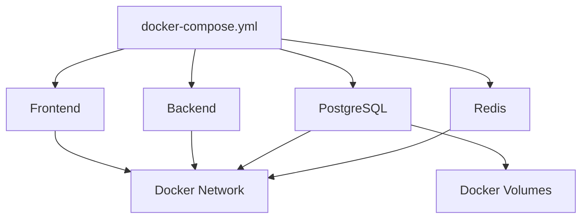

---

# Explain This Diagram

Compose manages:

```text
Containers

Networks

Volumes

Dependencies

Environment Variables
```

with one file.

---

# The Evolution Of Infrastructure

Before:

```text
Manual Commands
```

↓

Then:

```text
Shell Scripts
```

↓

Then:

```text
Docker Compose
```

↓

Then:

```text
Kubernetes
```

---

# Infrastructure Evolution Diagram


---

# The Compose Lifecycle

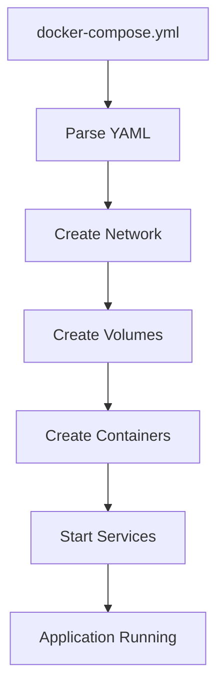

---

# Simple Compose Example

```yaml
services:

  backend:
    image: node:22

  database:
    image: postgres:17

  redis:
    image: redis:8
```

One file.

Three services.

---

# What Is A Service?

Service = Infrastructure Component.

Examples:

```text
API

Database

Cache

Queue

Reverse Proxy

Monitoring System
```

---

# Service Mental Model

Think:

```text
Service

=

Reusable Infrastructure Unit
```

---

# A Real Production Example

Project:

```text
Frontend

Backend

PostgreSQL

Redis

Nginx
```

Architecture:

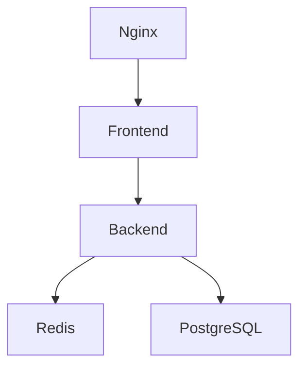

---

# Core Compose Components

Compose manages:

```text
Services

Networks

Volumes

Environment Variables

Secrets

Dependencies
```

---

# Service Dependency Management

Applications often depend on others.

Example:

```text
Backend

↓

Needs

↓

PostgreSQL
```

Compose supports:

```yaml
depends_on:
  - postgres
```

---

# Dependency Visualization

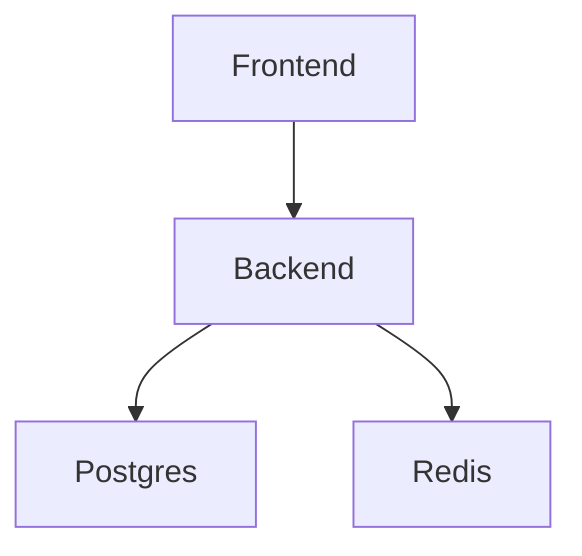

---

# Networking In Compose

Compose automatically creates:

```text
Internal Network
```

Services can discover each other.

Instead of:

```text
172.18.0.4
```

Use:

```text
postgres
```

---

# Network Architecture

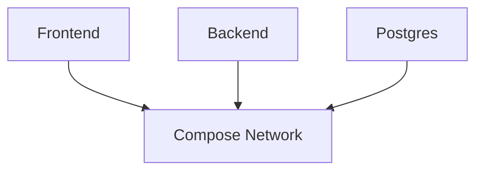

---

# Volumes In Compose

Databases need persistent storage.

Example:

```yaml
volumes:

  postgres_data:
```

Then attach:

```yaml
volumes:
  - postgres_data:/var/lib/postgresql/data
```

---

# Storage Architecture

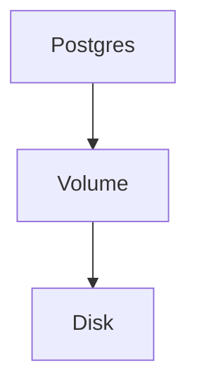

---

# Environment Variables

Applications need configuration.

Examples:

```text
DATABASE_URL

REDIS_URL

JWT_SECRET

PORT
```

Compose manages them.

---

# Environment Architecture

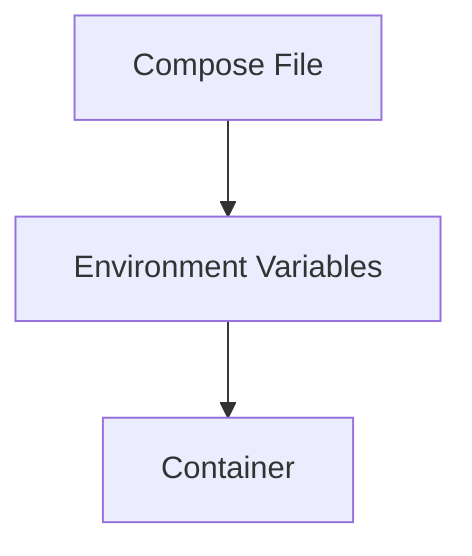

---

# Example Project Structure

```text
project/

docker-compose.yml

frontend/

backend/

nginx/

.env
```

---

# Recommended Production Folder Structure

```text
project/

frontend/

backend/

database/

nginx/

monitoring/

docker-compose.yml

.env

.env.example
```

---

# Data Flow

Suppose user visits website.

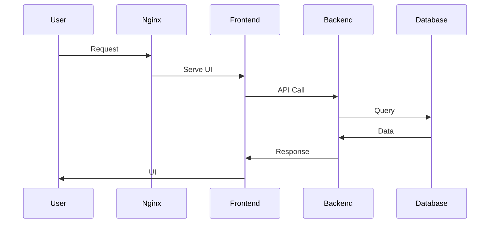

---

# Linux Relationship

Compose eventually becomes:

```text
Containers

↓

Namespaces

↓

Cgroups

↓

OverlayFS

↓

Linux
```

Linux is always underneath.

---

# Docker Relationship

Compose is built on Docker.

Architecture:

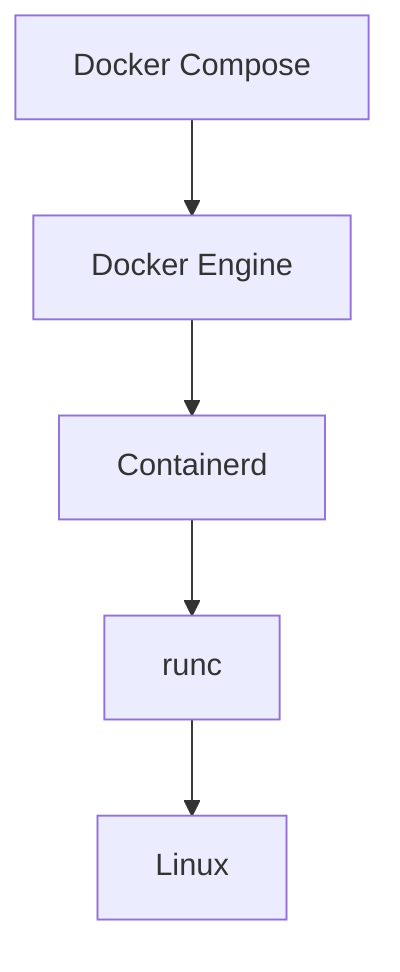

---

# Kubernetes Relationship

Docker Compose teaches Kubernetes thinking.

Compose:

```yaml
services
```

Kubernetes:

```yaml
pods

deployments

services
```

Very similar philosophy.

---

# Comparison

| Docker Compose | Kubernetes |
|---------------|------------|
| Single Machine | Multi Machine |
| Local Development | Production Clusters |
| Simple | Complex |
| Small Scale | Massive Scale |
| Easy | Powerful |

---

# CI/CD Relationship

Pipeline:

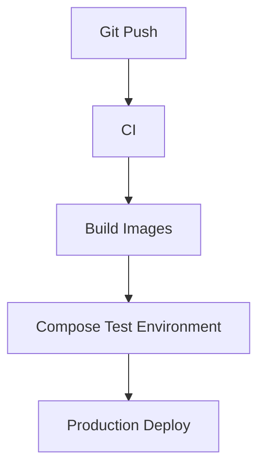

Compose is often used in testing environments.

---

# Production Use Cases

Good for:

```text
Local Development

Testing

Small Projects

POCs

Internal Tools
```

Not ideal for:

```text
Massive Clusters
```

Use Kubernetes there.

---

# Scaling Limitations

Compose scales vertically.

But eventually you'll need:

```text
Multiple Machines

Load Balancers

Service Discovery

Auto Healing
```

This is Kubernetes territory.

---

# Security Considerations

Never put:

```yaml
JWT_SECRET=123
```

inside repositories.

Use:

```text
.env

Secret Managers
```

Protect:

```text
Databases

Networks

Volumes
```

---

# Performance Considerations

Monitor:

```text
Container Startup Time

Image Size

Network Latency

Disk I/O

Memory Usage
```

---

# Observability Considerations

Add monitoring services.

Example:

```text
Prometheus

Grafana

Loki
```

Architecture:

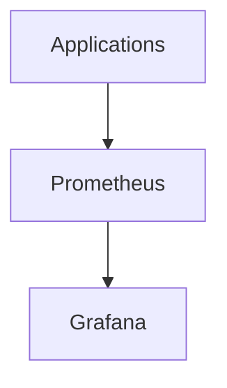

---

# Production Example

Modern SaaS stack:

```text
Next.js

↓

Fastify

↓

PostgreSQL

↓

Redis

↓

Nginx

↓

Prometheus

↓

Grafana
```

Compose can orchestrate all of them.

---

# Common Mistakes

## Mistake 1

Thinking Compose is production Kubernetes.

Wrong.

---

## Mistake 2

Hardcoding secrets.

Dangerous.

---

## Mistake 3

Using one gigantic compose file.

Split environments.

---

## Mistake 4

Ignoring health checks.

Services may start before dependencies.

---

## Mistake 5

Treating Compose as only a developer tool.

It is infrastructure modeling.

---

# Troubleshooting Guide

Container can't communicate?

Check:

```text
Network configuration
```

---

Database unavailable?

Check:

```text
depends_on

health checks
```

---

Data disappeared?

Check:

```text
Volumes
```

---

Environment missing?

Check:

```text
.env
```

---

Useful commands:

```bash
docker compose up

docker compose down

docker compose ps

docker compose logs

docker compose config
```

---

# Engineering Mindset

Do not think:

```text
Docker Compose = YAML
```

Think:

```text
Docker Compose

=

Declarative Infrastructure

=

Local Orchestration

=

Environment Reproducibility

=

Infrastructure As Code
```

---

# Evolution Of Thinking

```text
docker run

↓

Shell Scripts

↓

Docker Compose

↓

Docker Swarm

↓

Kubernetes

↓

Cloud Native Platforms
```

---

# Interview Questions

## Beginner

1. What is Docker Compose?

2. Why does it exist?

3. What problem does it solve?

4. What is a service?

5. What is depends_on?

---

## Intermediate

6. Explain Compose architecture.

7. Explain networking.

8. Explain volumes.

9. Explain environment variables.

10. Explain Compose vs Docker.

---

## Advanced

11. Explain Compose vs Kubernetes.

12. Explain local orchestration.

13. Explain environment reproducibility.

14. Explain infrastructure as code.

15. Explain production limitations.

---

# Cheat Sheet

```text
Docker Compose

=

Services

+

Networks

+

Volumes

+

Environment Variables

+

Dependencies


Use Cases:

✓ Development

✓ Testing

✓ Internal Tools

✓ POCs


Evolution:

docker run

↓

Docker Compose

↓

Kubernetes
```

---

# Final Thought

Docker Compose introduced one of the most important ideas in modern infrastructure:

> Stop thinking about individual containers.

> Start thinking about entire systems.

Because applications are never just applications.

**Applications are ecosystems.**
